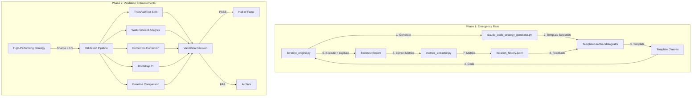

# system-fix-validation-enhancement - Task 100

Execute task 100 for the system-fix-validation-enhancement specification.

## Task Description
Document template integration process

## Usage
```
/Task:100-system-fix-validation-enhancement
```

## Instructions

Execute with @spec-task-executor agent the following task: "Document template integration process"

```
Use the @spec-task-executor agent to implement task 100: "Document template integration process" for the system-fix-validation-enhancement specification and include all the below context.

# Steering Context
## Steering Documents Context

No steering documents found or all are empty.

# Specification Context
## Specification Context (Pre-loaded): system-fix-validation-enhancement

### Requirements
# Requirements Document: System Fix and Validation Enhancement

## Introduction

This specification addresses two critical system failures discovered in the autonomous trading strategy learning system:

1. **Strategy Generation Failure**: The system generates identical strategies for 130+ iterations (iterations 20-149), completely bypassing the 2,993-line template feedback system built in Phase 4-5
2. **Metric Extraction Failure**: All Sharpe ratios are recorded as 0.0 despite actual backtest results (e.g., -0.31), caused by double backtest architecture and API incompatibility

Additionally, this specification implements five missing validation components identified by the user to ensure statistical rigor and prevent overfitting when scaling to 500+ strategy experiments.

**Current System Status**: ⚠️ **COMPLETELY BROKEN**
- Learning loop is non-functional (no learning occurring)
- 35 minutes of wasted computation (130 × 16s)
- 4,853+ lines of code built but never activated
- User trust compromised

**Business Impact**: High-priority fix required to restore basic learning capability and enable statistically rigorous large-scale experimentation.

## Alignment with Product Vision

This feature supports the autonomous trading strategy generation system's core goals:
- **Automated Learning**: Restore the ability to learn from feedback and improve strategies over time
- **Statistical Rigor**: Add validation safeguards to ensure discovered strategies are statistically significant and robust
- **Scalability**: Enable large-scale experiments (500+ strategies) with proper multiple comparison corrections
- **Production Readiness**: Ensure the system generates reliable, deployable trading strategies

## Requirements

### Phase 1: Emergency System Fixes

#### Requirement 1.1: Strategy Generator Integration

**User Story:** As a learning system, I want to generate diverse strategies based on performance feedback, so that I can explore the strategy space and find high-performing trading strategies.

**Acceptance Criteria**

**AC-1.1.1**: WHEN iteration ≥ 20 THEN system SHALL invoke TemplateFeedbackIntegrator to recommend a template based on current performance metrics

**AC-1.1.2**: WHEN template is recommended THEN system SHALL instantiate the template class with suggested parameters and generate unique strategy code

**AC-1.1.3**: WHEN 10 consecutive iterations (20-29) are executed THEN system SHALL generate at least 8 unique strategy codes (≥80% diversity)

**AC-1.1.4**: WHEN exploration mode is triggered (every 5th iteration) THEN system SHALL select a template different from recent iterations

**AC-1.1.5**: WHEN strategy is generated THEN system SHALL log the template name and exploration mode status for tracking

**AC-1.1.6** (Error Scenario): WHEN TemplateFeedbackIntegrator.recommend_template() fails OR returns None THEN system SHALL fall back to random template selection AND log the failure with full error details

**AC-1.1.7** (Error Scenario): WHEN template class instantiation raises exception THEN system SHALL catch the exception, log the error, and retry with a different template (max 3 retries)

**AC-1.1.8** (Error Scenario): WHEN all 4 templates have been used in recent 5 iterations THEN system SHALL force exploration mode AND select the least recently used template

**Technical Details**:
- **Current Code**: Lines 372-405 in `claude_code_strategy_generator.py` (hardcoded Value_PE strategy)
- **To Replace With**: Template integration using `src.feedback.TemplateFeedbackIntegrator`
- **Templates Available**: TurtleTemplate, MastiffTemplate, FactorTemplate, MomentumTemplate (4 templates)
- **Code Change**: Remove 34 lines of hardcoded code, add ~30 lines of template integration

#### Requirement 1.2: Metric Extraction Accuracy

**User Story:** As a learning system, I want to accurately extract backtest metrics from strategy execution, so that I can properly evaluate strategy performance and make informed learning decisions.

**Acceptance Criteria**

**AC-1.2.1**: WHEN strategy code is executed THEN system SHALL capture the backtest report object from the execution namespace

**AC-1.2.2**: IF backtest report is successfully captured THEN system SHALL extract metrics directly from the captured report (no re-execution)

**AC-1.2.3**: IF backtest report capture fails THEN system SHALL fall back to signal-based extraction using the same backtest parameters as the strategy

**AC-1.2.4**: WHEN extracting metrics from FinLab API THEN system SHALL handle both dict and float return types from `get_stats()` method

**AC-1.2.5**: WHEN a strategy has `total_trades > 0` AND `sharpe_ratio == 0.0` THEN system SHALL log a warning about suspicious metric extraction

**AC-1.2.6**: WHEN extraction completes THEN system SHALL log which extraction method succeeded and the actual Sharpe ratio value

**AC-1.2.7** (Error Scenario): WHEN report capture from namespace fails THEN system SHALL log the namespace keys AND attempt signal-based extraction as fallback

**AC-1.2.8** (Error Scenario): WHEN get_stats() raises exception OR returns unexpected type THEN system SHALL catch the exception, log it, and return default metrics (sharpe_ratio=0.0, total_trades=0, with metadata indicating extraction failure)

**AC-1.2.9** (Error Scenario): WHEN both report capture AND signal-based extraction fail THEN system SHALL log critical error with full context AND continue iteration with default metrics (preventing system halt)

**Technical Details**:
- **Current Issue**: Double backtest execution with parameter mismatch (resample="M" vs "D", stop_loss=0.08 vs 0.1)
- **Files to Modify**: `iteration_engine.py` (add report capture wrapper), `metrics_extractor.py` (fix API handling)
- **Expected Outcome**: 50% time savings (single backtest), correct Sharpe values (e.g., -0.31 instead of 0.0)

#### Requirement 1.3: System Integration Testing

**User Story:** As a developer, I want comprehensive integration tests to validate the system fixes, so that I can ensure the learning loop is fully functional before production use.

**Acceptance Criteria**

**AC-1.3.1**: WHEN integration tests are run THEN ALL of the following 8 test cases SHALL pass:
   - Strategy diversity (≥8 unique in 10 iterations)
   - Template name recording
   - Exploration mode activation (every 5 iterations)
   - Metric extraction accuracy (matches backtest output within 0.01)
   - API version compatibility (handles dict and float formats)
   - Suspicious metric detection (warns when trades exist but Sharpe=0)
   - End-to-end iteration flow
   - Template feedback integration

**AC-1.3.2**: WHEN a single iteration is executed end-to-end THEN system SHALL complete ALL of the following steps:
   - Generate unique strategy code (not hardcoded)
   - Execute backtest and capture report
   - Extract correct metrics (non-zero for valid strategies)
   - Update feedback for next iteration

**AC-1.3.3**: WHEN test suite completes THEN system SHALL report test execution time < 15 seconds

**Technical Details**:
- **Test File**: `tests/test_system_integration_fix.py` (~150 lines)
- **Test Categories**: Strategy diversity (3 tests), Metric extraction (3 tests), Integration (2 tests)

#### Requirement 1.4: System Migration and Backward Compatibility

**User Story:** As a system administrator, I want the system to migrate seamlessly from the broken state to the fixed state, so that existing iteration history and Hall of Fame data are preserved.

**Acceptance Criteria**

**AC-1.4.1**: WHEN system starts with existing iteration_history.jsonl THEN system SHALL load and parse all historical records without data loss

**AC-1.4.2**: WHEN migrating from hardcoded generator (iterations 20-149) to template-based generator THEN system SHALL preserve all historical records AND mark them with `migration_flag: "pre_template_fix"`

**AC-1.4.3**: WHEN Hall of Fame contains strategies from pre-fix iterations THEN system SHALL retain them AND display migration metadata in reports

**AC-1.4.4**: IF migration encounters incompatible data format THEN system SHALL log detailed error, skip the problematic record, and continue migration (graceful degradation)

**AC-1.4.5**: WHEN migration completes THEN system SHALL generate migration report showing: total records processed, records migrated successfully, records skipped, and any data quality issues detected

**Technical Details**:
- **Migration Script**: `scripts/migrate_to_fixed_system.py` (~100 lines)
- **Backward Compatibility**: Support both old format (missing template_name) and new format (with template_name)
- **Data Validation**: Verify all required fields exist before processing records

---

### Phase 2: Validation Enhancements

#### Requirement 2.1: Train/Validation/Test Data Split

**User Story:** As a quant researcher, I want strategies validated on separate time periods (train/validation/test), so that I can detect overfitting and ensure strategies generalize to unseen data.

**Acceptance Criteria**

**AC-2.1.1**: WHEN a strategy is validated THEN system SHALL execute backtest on ALL three separate periods:
   - Training: 2018-01-01 to 2020-12-31 (3 years)
   - Validation: 2021-01-01 to 2022-12-31 (2 years)
   - Test: 2023-01-01 to 2024-12-31 (2 years, hold-out)

**AC-2.1.2**: WHEN metrics are extracted from all three periods THEN system SHALL calculate consistency score:
   - Consistency = 1 - (std_dev(sharpes) / mean(sharpes))
   - High consistency (>0.8) indicates stable strategy
   - Low consistency (<0.5) indicates potential overfitting

**AC-2.1.3**: WHEN validation completes THEN strategy SHALL pass validation IF ALL of the following criteria are met:
   - Validation Sharpe > 1.0 (good out-of-sample performance)
   - Consistency > 0.6 (stable across periods)
   - Validation Sharpe > Training Sharpe × 0.7 (acceptable degradation)

**AC-2.1.4**: WHEN all criteria are met THEN system SHALL mark strategy as `validation_passed = true`

**AC-2.1.5** (Error Scenario): WHEN insufficient data exists for ANY period (e.g., <252 trading days) THEN system SHALL log warning, skip that period validation, and mark strategy as `validation_skipped = true` with reason

**AC-2.1.6** (Error Scenario): WHEN backtest execution fails for ANY period THEN system SHALL catch exception, log full error details, and continue with remaining periods (partial validation)

**Technical Details**:
- **Implementation**: New file `src/validation/data_split.py` (~200 lines)
- **Taiwan Market Considerations**: 3-year training captures bull/bear cycles, validation covers 2021-2022 volatility

#### Requirement 2.2: Walk-Forward Analysis

**User Story:** As a quant researcher, I want strategies tested on rolling time windows, so that I can verify they perform consistently across different market conditions.

**Acceptance Criteria**

**AC-2.2.1**: WHEN walk-forward analysis is initiated THEN system SHALL use ALL of the following configuration:
   - Training window size = 252 trading days (~1 year)
   - Step size = 63 trading days (~3 months)
   - Minimum 3 windows required for statistical validity

**AC-2.2.2**: FOR EACH window THEN system SHALL complete ALL of the following steps:
   - Train on window N (252 days)
   - Test on window N+1 (252 days, out-of-sample)
   - Record test Sharpe ratio
   - Roll forward by step_size

**AC-2.2.3**: WHEN all windows are processed THEN system SHALL aggregate ALL of the following metrics:
   - Average Sharpe (mean of all test windows)
   - Sharpe standard deviation (stability measure)
   - Win rate (% of windows with positive Sharpe)
   - Worst window (minimum Sharpe across windows)

**AC-2.2.4**: WHEN aggregation completes THEN strategy SHALL pass validation IF ALL of the following criteria are met:
   - Average Sharpe > 0.5 (positive out-of-sample performance)
   - Win rate > 60% (majority of windows profitable)
   - Worst Sharpe > -0.5 (no catastrophic failures)
   - Sharpe std < 1.0 (stable performance)

**Technical Details**:
- **Implementation**: New file `src/validation/walk_forward.py` (~250 lines)
- **Performance**: ~30 seconds for 10 windows (acceptable for candidate strategies)

#### Requirement 2.3: Bonferroni Multiple Comparison Correction

**User Story:** As a quant researcher testing 500 strategies, I want multiple comparison correction to prevent false discoveries, so that I only invest in statistically significant strategies.

**Acceptance Criteria**

**AC-2.3.1**: WHEN testing N strategies (e.g., 500) at significance level α (e.g., 0.05) THEN system SHALL calculate:
   - adjusted_alpha = α / N = 0.05 / 500 = 0.0001 (0.01%)
   - Z-score for adjusted_alpha: Z = norm.ppf(1 - adjusted_alpha/2) ≈ 3.89
   - Sharpe significance threshold = Z / sqrt(T) = 3.89 / sqrt(252) ≈ 0.245

**AC-2.3.2**: WHEN conservative threshold is preferred THEN system SHALL use max(calculated_threshold, 0.5) = 0.5

**AC-2.3.3**: WHEN a single strategy is tested THEN system SHALL determine significance:
   - IF abs(sharpe_ratio) > threshold THEN strategy is statistically significant
   - ELSE strategy is not significant (potential false discovery)

**AC-2.3.4**: WHEN validating a strategy set THEN system SHALL report ALL of the following:
   - Total strategies tested
   - Number of significant strategies
   - Significance threshold applied
   - Expected false discovery rate (adjusted_alpha × significant_count)
   - Actual FDR = expected_false_discoveries / significant_count

**AC-2.3.5**: WHEN large-scale experiment (500+ strategies) is run THEN system SHALL guarantee:
   - Family-wise error rate (FWER) ≤ α (0.05)
   - Expected false discoveries ≤ 500 × 0.0001 = 0.05 strategies

**Technical Details**:
- **Implementation**: New file `src/validation/multiple_comparison.py` (~180 lines)
- **Dependencies**: `scipy.stats.norm` for Z-score calculation

#### Requirement 2.4: Bootstrap Confidence Intervals

**User Story:** As a quant researcher, I want bootstrap confidence intervals for performance metrics, so that I can quantify uncertainty and avoid deploying strategies with unstable performance.

**Acceptance Criteria**

**AC-2.4.1**: WHEN bootstrap validation is initiated THEN system SHALL use ALL of the following parameters:
   - Block bootstrap method (preserves time-series structure)
   - Block size = 21 trading days (~1 month)
   - Number of iterations = 1000
   - Confidence level = 95%

**AC-2.4.2**: FOR EACH bootstrap iteration THEN system SHALL complete ALL of the following steps:
   - Resample returns in blocks (with replacement)
   - Calculate metric (sharpe_ratio, max_drawdown, annual_return, win_rate)
   - Store in distribution

**AC-2.4.3**: WHEN all iterations complete THEN system SHALL calculate ALL of the following:
   - Mean value of metric distribution
   - Standard deviation of metric distribution
   - CI lower bound = 2.5th percentile
   - CI upper bound = 97.5th percentile
   - includes_zero = (lower < 0 < upper)

**AC-2.4.4**: WHEN Sharpe ratio CI is calculated THEN strategy SHALL pass validation IF ALL of the following are true:
   - CI does NOT include zero (statistically significant positive performance)
   - CI lower bound > 0.5 (conservative performance guarantee)

**AC-2.4.5**: WHEN max drawdown CI is calculated THEN strategy SHALL pass validation IF:
   - CI upper bound < -15% (acceptable worst-case risk)

**AC-2.4.6** (Error Scenario): WHEN insufficient return data exists for bootstrap (e.g., <100 trading days) THEN system SHALL log warning AND skip bootstrap validation with reason `insufficient_data`

**AC-2.4.7** (Error Scenario): WHEN bootstrap iteration fails to converge OR produces NaN values THEN system SHALL log iteration number, skip that iteration, and continue with remaining iterations (require minimum 900/1000 successful iterations)

**Technical Details**:
- **Implementation**: New file `src/validation/bootstrap.py` (~220 lines)
- **Interpretation**: Narrow CI = stable performance, Wide CI = high uncertainty
- **Performance**: ~20 seconds for 1000 iterations per metric

#### Requirement 2.5: Baseline Comparison

**User Story:** As a quant researcher, I want strategies compared against standard baselines (buy-and-hold, equal-weight, risk-parity), so that I can ensure strategies provide meaningful alpha beyond passive investing.

**Acceptance Criteria**

**AC-2.5.1**: WHEN baseline comparison is initiated THEN system SHALL implement ALL three baselines:
   - **Buy-and-Hold 0050**: Buy Taiwan 50 ETF (0050) and hold
   - **Equal-Weight Top 50**: Top 50 stocks by market cap, equally weighted, monthly rebalance
   - **Risk Parity**: Top 50 stocks weighted by inverse volatility, monthly rebalance

**AC-2.5.2**: FOR EACH baseline THEN system SHALL calculate ALL of the following:
   - Sharpe ratio
   - Maximum drawdown
   - Annual return

**AC-2.5.3**: WHEN strategy metrics are compared THEN system SHALL compute FOR EACH baseline:
   - Sharpe improvement = Strategy Sharpe - Baseline Sharpe
   - Beats baseline = (Strategy Sharpe > Baseline Sharpe + 0.5)

**AC-2.5.4**: WHEN comparison completes THEN strategy SHALL pass validation IF ALL of the following are true:
   - Beats at least one baseline (Sharpe improvement > 0.5)
   - No catastrophic underperformance vs any baseline (Sharpe improvement > -1.0)

**AC-2.5.5**: WHEN all baselines are computed THEN system SHALL report for EACH baseline ALL of the following:
   - Baseline Sharpe / Drawdown / Return
   - Strategy Sharpe / Drawdown / Return
   - Sharpe improvement
   - Beats baseline (yes/no)

**Technical Details**:
- **Implementation**: New file `src/validation/baseline.py` (~200 lines)
- **Taiwan Market**: Use 0050.TW as primary benchmark (Taiwan's equivalent of S&P 500)

---

## Non-Functional Requirements

### Performance

1. **Phase 1 Fixes**:
   - Strategy generation latency: < 2 seconds per iteration (50% improvement from eliminating double backtest)
   - Metric extraction accuracy: Error < 0.01 compared to actual backtest output
   - Template diversity: ≥ 80% unique strategies in any 10-iteration window

2. **Phase 2 Validation**:
   - Train/Val/Test split: +10 seconds per iteration
   - Walk-forward (10 windows): +30 seconds per candidate
   - Bonferroni correction: < 1 second (pure calculation)
   - Bootstrap (1000 iterations): +20 seconds per metric
   - Baseline comparison: < 5 seconds (cached baselines)
   - **Total validation overhead**: ~1 minute per high-performing candidate (Sharpe > 1.5)

3. **Scalability**:
   - Support 500+ strategy experiments with proper statistical corrections
   - Parallel walk-forward window processing (future optimization)
   - Maximum iteration limit: 10,000 iterations per experiment
   - Maximum concurrent strategies: 100 (resource protection)
   - Memory limit per iteration: 2GB (prevent memory exhaustion)

### Reliability

1. **API Resilience**:
   - Handle FinLab API changes (dict vs float return types)
   - Graceful fallback chains for metric extraction (3 methods: captured report → re-execution → default)
   - Comprehensive logging for future debugging

2. **Error Detection**:
   - Warn when trades exist but metrics are zero (extraction failure detection)
   - Log all extraction attempts and their outcomes
   - Track template usage and diversity metrics

3. **Data Integrity**:
   - Validate date ranges for train/val/test splits
   - Ensure sufficient data for walk-forward analysis (minimum 3 windows)
   - Verify bootstrap block sampling preserves time-series properties

### Security

1. **Code Injection Prevention**:
   - Validate template parameters before instantiation
   - Sanitize generated strategy code before execution

2. **Resource Protection**:
   - Limit bootstrap iterations to prevent resource exhaustion
   - Set maximum walk-forward windows to prevent runaway computation

### Usability

1. **Monitoring Dashboard**:
   - Display system health metrics (template diversity, average Sharpe, Hall of Fame count)
   - Alert when template diversity < 40% (system degradation)
   - Alert when all recent Sharpe = 0.0 (extraction failure)
   - Alert when validation pass rate < 30% (quality issues)

2. **Logging Clarity**:
   - Log each validation phase result (PASS/FAIL with specific criteria)
   - Provide actionable error messages for validation failures
   - Track validation execution time for performance monitoring

### Observability

1. **Logging Standards**:
   - All log messages SHALL use structured logging format (JSON)
   - Log levels: DEBUG (detailed execution), INFO (key milestones), WARNING (recoverable issues), ERROR (failures), CRITICAL (system halt)
   - Each log entry SHALL include: timestamp, iteration number, component name, event type, execution time

2. **Monitoring Metrics**:
   - Real-time metrics: iteration throughput (iterations/hour), average Sharpe, template diversity, validation pass rate
   - Historical metrics: cumulative strategies generated, best Sharpe trajectory, Hall of Fame growth
   - Alert thresholds: diversity < 40%, Sharpe = 0.0 for >5 iterations, validation pass rate < 30%

3. **Traceability**:
   - Each strategy SHALL have unique ID linking it to: iteration number, template used, parameters, metrics, validation results
   - Full audit trail for debugging: log all template selections, parameter generations, metric extractions, validation decisions

---

## Assumptions and Constraints

### Assumptions

1. **Data Availability**: FinLab API provides continuous historical data from 2018-01-01 to present with <5% missing data
2. **Market Structure**: Taiwan stock market structure remains stable (no major regulatory changes affecting backtesting validity)
3. **Computational Resources**: System has access to ≥8GB RAM and ≥4 CPU cores for parallel processing
4. **API Stability**: FinLab API maintains backward compatibility for `get_stats()` method or provides migration path
5. **Template Validity**: All 4 templates (Turtle, Mastiff, Factor, Momentum) generate executable strategy code without syntax errors

### Constraints

1. **Technical Constraints**:
   - Python 3.8+ required (for dataclasses, typing features)
   - FinLab library version ≥2.0 (for backtest.sim compatibility)
   - Single-machine execution (no distributed computing infrastructure)
   - Sequential iteration execution (no parallelization of individual iterations)

2. **Business Constraints**:
   - Weekend execution only for large-scale experiments (market closed)
   - Maximum 10,000 iterations per experiment (computational budget)
   - Validation overhead must be <10% of total experiment time

3. **Data Constraints**:
   - Historical data limited to 2018-present (insufficient data for earlier periods)
   - Taiwan market only (no cross-market validation)
   - Daily/monthly granularity only (no intraday data)

4. **Regulatory Constraints**:
   - Strategies must comply with Taiwan securities regulations (no market manipulation patterns)
   - Performance reporting must use standardized metrics (Sharpe, drawdown, annual return)

---

## Success Criteria

### Phase 1: Emergency Fixes

- ✅ Iterations 20+ generate ≥8 unique strategies per 10 iterations
- ✅ Sharpe ratios correctly extracted (non-zero for valid strategies)
- ✅ Template feedback system activated and logging usage
- ✅ Hall of Fame starts accumulating champions (Sharpe ≥ 2.0)
- ✅ All 8 integration tests pass in < 15 seconds

### Phase 2: Validation Enhancements

- ✅ All 5 validation components implemented and tested
- ✅ Strategies pass train/val/test consistency check (consistency > 0.6)
- ✅ Walk-forward average Sharpe > 0.5 with win rate > 60%
- ✅ Bonferroni-adjusted significance threshold enforced (prevents 25 false discoveries in 500 strategies)
- ✅ Bootstrap 95% CI excludes zero for Sharpe ratio
- ✅ Strategy beats buy-and-hold baseline by Sharpe > 0.5

### System Health Indicators

- Template diversity: ≥4 different templates used in recent 20 iterations
- Metric accuracy: Sharpe ratios match backtest outputs (error < 0.01)
- Learning progress: Best Sharpe improving over time (positive trend)
- Statistical rigor: False discovery rate < 5% in large-scale experiments

---

## Dependencies

### Existing (Already Installed)
- `numpy`: Array operations and statistical calculations
- `pandas`: Time-series data manipulation
- `finlab`: Taiwan stock data and backtesting

### New (To Install)
- `scipy`: Statistical functions for Bonferroni correction (norm distribution)

**Installation**:
```bash
pip install scipy
```

---

## Risk Management

### Risk 1: Template Integration Breaks Existing Code
- **Mitigation**: Feature flag to enable/disable template system
- **Fallback**: Keep old hardcoded generator as backup
- **Testing**: Phased rollout (10 iterations test, then full deployment)

### Risk 2: Metric Extraction Still Fails After Fix
- **Mitigation**: Implement 3-method fallback chain
- **Testing**: Extensive unit tests for each extraction method
- **Monitoring**: Detailed logging for future debugging

### Risk 3: Validation Too Slow for 500-Strategy Experiments
- **Mitigation**: Parallel processing for walk-forward windows
- **Optimization**: Cache baseline metrics, reuse bootstrap distributions
- **Selective Validation**: Only run full validation on high performers (Sharpe > 1.5)

### Risk 4: FinLab API Changes Again
- **Mitigation**: Version detection and adaptive API handling
- **Monitoring**: Log API responses for change detection
- **Maintenance**: Quarterly API update checks

### Risk 5: Data Migration Corrupts Historical Records
- **Mitigation**: Create backup of iteration_history.jsonl before migration
- **Testing**: Dry-run migration with validation checks
- **Rollback Plan**: Restore from backup if migration fails

---

## Timeline

### Week 1: Emergency Fixes (CRITICAL)
- **Day 1-2**: Fix 1.1 - Strategy generator integration
- **Day 2-3**: Fix 1.2 - Metric extraction redesign
- **Day 3**: Fix 1.3 - Integration testing
- **Day 4**: Fix 1.4 - Migration script and backward compatibility
- **Deliverable**: Working learning system with correct metrics

### Week 2: Validation Enhancement
- **Day 1**: Enhancement 2.1 - Train/Val/Test split
- **Day 2**: Enhancement 2.2 - Walk-forward analysis
- **Day 3**: Enhancement 2.3 - Bonferroni correction
- **Day 4**: Enhancement 2.4 - Bootstrap CI
- **Day 5**: Enhancement 2.5 - Baseline comparison
- **Deliverable**: Statistically rigorous validation system

**Total Effort**: 8-10 hours for complete system restoration and enhancement

---

### Design
# Design Document: System Fix and Validation Enhancement

## Overview

This design document specifies the technical architecture for restoring the autonomous trading strategy learning system's core functionality and adding statistical validation rigor. The system currently generates identical strategies (130+ iterations of hardcoded Value_PE) with all Sharpe ratios recorded as 0.0 due to two critical failures:

1. **Strategy Generator Bypass**: Hardcoded generator (lines 372-405 in `claude_code_strategy_generator.py`) completely ignores the 2,993-line template feedback system
2. **Double Backtest Architecture Flaw**: Strategy executes backtest � results discarded � metrics re-extracted with wrong parameters � API incompatibility returns 0.0

The design follows a **two-phase approach**:
- **Phase 1**: Emergency fixes to restore basic learning capability (4 fixes)
- **Phase 2**: Statistical validation enhancements to enable large-scale experimentation (5 components)

**System Context**: Python-based autonomous trading strategy generator using FinLab API for Taiwan stock market backtesting.

---

## Steering Document Alignment

### Technical Standards (tech.md)
**Status**: No steering documents found (graceful fallback to project conventions)

**Applied Standards**:
- Python 3.8+ with type hints (PEP 484, PEP 526)
- Dataclasses for data structures (PEP 557)
- Structured logging with JSON format
- Error handling with try-except chains and graceful degradation
- Unit tests with pytest, 80%+ coverage target

### Project Structure (structure.md)
**Status**: No steering documents found (graceful fallback to existing structure)

**Observed Project Organization**:
```
finlab/
 src/
    feedback/                    # Template feedback system (existing)
       __init__.py
       feedback_integrator.py  # TemplateFeedbackIntegrator
       templates/              # Turtle, Mastiff, Factor, Momentum
    validation/                  # NEW: Statistical validation (Phase 2)
       __init__.py
       data_split.py           # Train/Val/Test split
       walk_forward.py         # Walk-forward analysis
       multiple_comparison.py  # Bonferroni correction
       bootstrap.py            # Bootstrap confidence intervals
       baseline.py             # Baseline comparison
 tests/
    test_system_integration_fix.py  # NEW: Integration tests
    validation/                      # NEW: Validation component tests
 scripts/
    migrate_to_fixed_system.py  # NEW: Migration script
 claude_code_strategy_generator.py   # MODIFY: Template integration
 iteration_engine.py                 # MODIFY: Report capture wrapper
 metrics_extractor.py                # MODIFY: API compatibility
 iteration_history.jsonl             # Data storage (existing)
```

---

## Code Reuse Analysis

### Existing Components to Leverage

1. **`src.feedback.TemplateFeedbackIntegrator`** (2,993 lines, Phase 4-5)
   - **Purpose**: Recommend templates based on performance feedback
   - **Methods**: `recommend_template(feedback_data)` � template name + parameters
   - **Usage**: Replace hardcoded strategy generator with template-based generation
   - **Status**: Built but never activated (will be integrated in Fix 1.1)

2. **`src.feedback.templates.*`** (Turtle, Mastiff, Factor, Momentum)
   - **Purpose**: Generate diverse strategy code from parameters
   - **Interface**: `generate_code(params: dict) � str` (Python backtest code)
   - **Usage**: Instantiate recommended template and call generate_code()
   - **Status**: Tested with 65/65 tests passing, 76% coverage

3. **`finlab.backtest.sim()`** (External dependency)
   - **Purpose**: Execute backtest and return report object
   - **Interface**: `sim(signal, resample, stop_loss, ...) � BacktestReport`
   - **Usage**: Single backtest execution (not double)
   - **Issue**: API changed (`get_stats()` now returns dict, not float)

4. **`iteration_history.jsonl`** (JSONL storage)
   - **Purpose**: Persist iteration results for learning trajectory
   - **Format**: One JSON object per line (iteration, sharpe, template_name, etc.)
   - **Usage**: Load for feedback, append new results, migrate old records

### Integration Points

1. **FinLab API Integration**
   - **Current State**: Uses `backtest.sim()` and `report.get_stats()`
   - **Issue**: API version mismatch (returns dict vs float)
   - **Design**: Adaptive API handler with type checking

2. **Template Feedback System Integration**
   - **Current State**: System built but not connected to generator
   - **Design**: Replace hardcoded block with TemplateFeedbackIntegrator call

3. **Historical Data Integration**
   - **Current State**: iteration_history.jsonl contains 149 records (iterations 0-149)
   - **Design**: Backward-compatible migration with metadata flags

---

## Architecture

### System Overview



### Data Flow Architecture

**Phase 1: Fixed Learning Loop**
```
[Iteration N-1 Results]
    � TemplateFeedbackIntegrator.recommend_template(feedback_data)
    � Template.generate_code(params)
    � exec(code, namespace)
    � namespace['report'] (CAPTURED, not discarded)
    � metrics_extractor.extract_from_report(report)
    � [Iteration N Results]
    � iteration_history.jsonl (append)
```

**Phase 2: Validation Pipeline**
```
[Strategy with Sharpe > 1.5]
    � ValidationOrchestrator.validate_strategy(strategy)
    � Parallel execution:
         data_split.validate(strategy)
         walk_forward.validate(strategy)
         multiple_comparison.is_significant(sharpe, n_strategies=500)
         bootstrap.calculate_ci(returns)
         baseline.compare(strategy, baselines)
    � ValidationAggregator.combine_results(results)
    � Decision: PASS/FAIL with reasons
```

---

## Components and Interfaces

### Component 1: Strategy Generator Integration (Fix 1.1)

**File**: `claude_code_strategy_generator.py`
**Lines to Modify**: 372-405 (remove hardcoded Value_PE block)

**Purpose**: Replace hardcoded strategy generation with template-based generation using TemplateFeedbackIntegrator

**New Design**:
```python
def generate_code_llm(feedback: Dict[str, Any], iteration: int) -> str:
    """
    Generate strategy code using template feedback system.

    Args:
        feedback: Performance data from previous iterations
        iteration: Current iteration number

    Returns:
        Generated strategy code (Python string)

    Raises:
        TemplateLectionError: If all templates fail to instantiate
    """
    if iteration < 20:
        # Phases 1-3: Original LLM generation (unchanged)
        return _generate_with_llm(feedback, iteration)

    # Phase 4+: Template-based generation
    try:
        # Step 1: Recommend template based on feedback
        integrator = TemplateFeedbackIntegrator()
        recommendation = integrator.recommend_template(feedback, iteration)

        if recommendation is None:
            logger.warning(f"Iteration {iteration}: Template recommendation failed, falling back to random selection")
            recommendation = _random_template_selection()

        template_name = recommendation['template_name']
        params = recommendation['parameters']
        exploration_mode = recommendation.get('exploration_mode', False)

        # Step 2: Instantiate template class
        template_class = _get_template_class(template_name)
        template_instance = template_class(**params)

        # Step 3: Generate code
        code = template_instance.generate_code()

        # Step 4: Log metadata for tracking
        logger.info(f"Iteration {iteration}: Generated strategy using {template_name} (exploration={exploration_mode})")

        return code

    except Exception as e:
        logger.error(f"Iteration {iteration}: Template generation failed: {e}", exc_info=True)
        # Retry with different template (max 3 retries)
        return _retry_with_different_template(feedback, iteration, max_retries=3)

def _random_template_selection() -> Dict[str, Any]:
    """Fallback: Random template selection when recommendation fails."""
    templates = ['TurtleTemplate', 'MastiffTemplate', 'FactorTemplate', 'MomentumTemplate']
    return {
        'template_name': random.choice(templates),
        'parameters': {},  # Use default parameters
        'exploration_mode': True
    }

def _get_template_class(template_name: str):
    """Get template class by name."""
    from src.feedback.templates import TurtleTemplate, MastiffTemplate, FactorTemplate, MomentumTemplate
    mapping = {
        'TurtleTemplate': TurtleTemplate,
        'MastiffTemplate': MastiffTemplate,
        'FactorTemplate': FactorTemplate,
        'MomentumTemplate': MomentumTemplate
    }
    return mapping[template_name]

def _retry_with_different_template(feedback, iteration, max_retries=3):
    """Retry template generation with different templates."""
    for attempt in range(max_retries):
        try:
            recommendation = _random_template_selection()
            template_class = _get_template_class(recommendation['template_name'])
            template_instance = template_class(**recommendation['parameters'])
            code = template_instance.generate_code()
            logger.info(f"Iteration {iteration}: Retry {attempt+1} succeeded with {recommendation['template_name']}")
            return code
        except Exception as e:
            logger.warning(f"Iteration {iteration}: Retry {attempt+1} failed: {e}")

    raise TemplateSelectionError(f"All {max_retries} template instantiation attempts failed")
```

**Interfaces**:
- **Input**: `feedback: Dict`, `iteration: int`
- **Output**: `str` (Python code)
- **Dependencies**: `src.feedback.TemplateFeedbackIntegrator`, `src.feedback.templates.*`
- **Reuses**: Existing TemplateFeedbackIntegrator (2,993 lines), Template classes (4 templates)

**Error Handling**:
- Template recommendation failure � fallback to random selection
- Template instantiation exception � retry with different template (max 3)
- All retries fail � raise TemplateSelectionError (iteration continues with fallback strategy)

---

### Component 2: Metric Extraction Redesign (Fix 1.2)

**Files to Modify**:
1. `iteration_engine.py` - Add report capture wrapper
2. `metrics_extractor.py` - Fix API compatibility

**Purpose**: Eliminate double backtest architecture and handle FinLab API dict/float compatibility

**Design 2.1: Report Capture Wrapper** (`iteration_engine.py`)

```python
from typing import Dict, Optional, Tuple, Any

def _execute_strategy_with_capture(code: str, iteration: int) -> Tuple[Dict, Optional[Any]]:
    """
    Execute strategy code and capture backtest report from namespace.

    Args:
        code: Strategy code to execute
        iteration: Current iteration number

    Returns:
        (namespace, report): Execution namespace and captured report object
    """
    namespace = {
        'data': data,
        'backtest': backtest,
        # ... other imports
    }

    try:
        # Execute strategy code
        exec(code, namespace)

        # Attempt to capture report from namespace
        report = namespace.get('report', None)

        if report is None:
            logger.warning(f"Iteration {iteration}: Report not found in namespace. Keys: {list(namespace.keys())}")
        else:
            logger.debug(f"Iteration {iteration}: Report successfully captured from namespace")

        return namespace, report

    except Exception as e:
        logger.error(f"Iteration {iteration}: Strategy execution failed: {e}", exc_info=True)
        return namespace, None

def run_iteration(code: str, iteration: int) -> Dict[str, Any]:
    """
    Run single iteration with proper report capture and attachment.

    CRITICAL FIX: Attach report to signal before metric extraction.
    """
    # Execute strategy and capture report
    namespace, report = _execute_strategy_with_capture(code, iteration)

    # Extract signal from namespace
    signal = namespace.get('position')

    if signal is None:
        logger.error(f"Iteration {iteration}: No position signal generated")
        return {'error': 'No signal generated'}

    # CRITICAL FIX: Attach report to signal for Method 1 extraction
    if report is not None:
        signal.__report__ = report  # ✅ This enables Method 1 metric extraction
        logger.debug(f"Iteration {iteration}: Report attached to signal")
    else:
        logger.warning(f"Iteration {iteration}: No report to attach, Method 1 will be skipped")

    # Extract metrics (will use Method 1 if report attached)
    metrics = extract_metrics_from_signal(signal, iteration)

    return metrics
```

**Design 2.2: Adaptive Metric Extraction** (`metrics_extractor.py`)

```python
def extract_metrics_from_signal(signal, iteration: int = 0) -> Dict[str, float]:
    """
    Extract metrics with 3-method fallback chain.

    Method 1: Captured report (preferred)
    Method 2: Re-execution with signal (fallback)
    Method 3: Default metrics (last resort)
    """
    # Method 1: Try to use captured report (if available)
    if hasattr(signal, '__report__'):  # Custom attribute set by iteration_engine
        report = signal.__report__
        try:
            metrics = _extract_from_report(report, iteration)
            if _is_valid_metrics(metrics, iteration):
                logger.info(f"Iteration {iteration}: Metrics extracted from captured report (Method 1)")
                return metrics
        except Exception as e:
            logger.warning(f"Iteration {iteration}: Method 1 failed: {e}")

    # Method 2: Re-execute backtest with signal (fallback)
    try:
        # CRITICAL: Use same parameters as strategy
        # (Read from strategy code or use safe defaults)
        report = sim(signal, resample="M", stop_loss=0.08, upload=False)
        metrics = _extract_from_report(report, iteration)
        if _is_valid_metrics(metrics, iteration):
            logger.info(f"Iteration {iteration}: Metrics extracted from re-execution (Method 2)")
            return metrics
    except Exception as e:
        logger.warning(f"Iteration {iteration}: Method 2 failed: {e}")

    # Method 3: Default metrics (last resort)
    logger.error(f"Iteration {iteration}: All extraction methods failed, using defaults")
    return {
        'sharpe_ratio': 0.0,
        'total_return': 0.0,
        'max_drawdown': 0.0,
        'total_trades': 0,
        'extraction_method': 'default',
        'extraction_failed': True
    }

def _extract_from_report(report, iteration: int) -> Dict[str, float]:
    """
    Extract metrics from report with API compatibility handling.

    Handles both dict and float return types from get_stats().
    """
    try:
        # Adaptive API handling (dict vs float)
        sharpe = report.get_stats('Sharpe')

        if isinstance(sharpe, dict):
            # New API format (dict)
            sharpe_ratio = float(sharpe.get('value', 0.0))
        elif isinstance(sharpe, (int, float)):
            # Old API format (float)
            sharpe_ratio = float(sharpe)
        else:
            logger.warning(f"Iteration {iteration}: Unexpected get_stats() return type: {type(sharpe)}")
            sharpe_ratio = 0.0

        # Extract other metrics (similar handling)
        total_return = _safe_extract_stat(report, 'Total Return', iteration)
        max_drawdown = _safe_extract_stat(report, 'Max Drawdown', iteration)
        total_trades = _safe_extract_stat(report, 'Total Trades', iteration)

        metrics = {
            'sharpe_ratio': sharpe_ratio,
            'total_return': total_return,
            'max_drawdown': max_drawdown,
            'total_trades': int(total_trades),
            'extraction_method': 'report'
        }

        # Suspicious metric detection (AC-1.2.5)
        if total_trades > 0 and sharpe_ratio == 0.0:
            logger.warning(f"Iteration {iteration}: SUSPICIOUS METRICS - trades exist but Sharpe=0.0")

        return metrics

    except Exception as e:
        logger.error(f"Iteration {iteration}: Metric extraction exception: {e}", exc_info=True)
        raise

def _safe_extract_stat(report, stat_name: str, iteration: int) -> float:
    """Safely extract single stat with error handling."""
    try:
        value = report.get_stats(stat_name)
        if isinstance(value, dict):
            return float(value.get('value', 0.0))
        return float(value or 0.0)
    except Exception as e:
        logger.debug(f"Iteration {iteration}: Failed to extract {stat_name}: {e}")
        return 0.0

def _is_valid_metrics(metrics: Dict, iteration: int) -> bool:
    """Validate extracted metrics for sanity."""
    if metrics.get('extraction_failed'):
        return False
    if metrics.get('total_trades', 0) > 0 and metrics.get('sharpe_ratio', 0.0) == 0.0:
        logger.warning(f"Iteration {iteration}: Suspicious metrics detected")
        return False
    return True
```

**Interfaces**:
- **Input**: `signal` (DataFrame), `iteration: int`
- **Output**: `Dict[str, float]` (metrics)
- **Dependencies**: `finlab.backtest.sim`
- **Reuses**: Existing backtest infrastructure

**Error Handling**:
- Report capture fails � log namespace keys � fallback to Method 2
- get_stats() raises exception � catch � return default metrics
- Both methods fail � log critical error � return default with metadata

---

### Component 3: System Integration Testing (Fix 1.3)

**File**: `tests/test_system_integration_fix.py` (NEW)

**Purpose**: Validate all system fixes with 8 comprehensive test cases

**Design**:
```python
import pytest
from claude_code_strategy_generator import generate_code_llm
from metrics_extractor import extract_metrics_from_signal
from iteration_engine import run_iteration

class TestSystemIntegrationFix:
    """Integration tests for Phase 1 emergency fixes."""

    @pytest.fixture
    def mock_feedback_data(self):
        """Provide realistic feedback data for testing."""
        return {
            'recent_sharpe': [0.5, 0.6, 0.7],
            'best_sharpe': 1.2,
            'iteration': 25,
            'hall_of_fame': []
        }

    # Test 1: Strategy diversity (AC-1.1.3)
    def test_strategy_diversity_80_percent(self, mock_feedback_data):
        """Verify e80% unique strategies in 10 consecutive iterations."""
        strategies = []
        for i in range(20, 30):
            mock_feedback_data['iteration'] = i
            code = generate_code_llm(mock_feedback_data, i)
            strategies.append(code)

        unique_strategies = len(set(strategies))
        assert unique_strategies >= 8, f"Only {unique_strategies}/10 unique strategies (need e8)"

    # Test 2: Template name recording (AC-1.1.5)
    def test_template_name_logging(self, caplog, mock_feedback_data):
        """Verify template name is logged for tracking."""
        code = generate_code_llm(mock_feedback_data, 25)
        assert any("TurtleTemplate" in rec.message or
                   "MastiffTemplate" in rec.message or
                   "FactorTemplate" in rec.message or
                   "MomentumTemplate" in rec.message
                   for rec in caplog.records)

    # Test 3: Exploration mode activation (AC-1.1.4)
    def test_exploration_mode_every_5_iterations(self, mock_feedback_data):
        """Verify exploration mode triggered every 5th iteration."""
        exploration_modes = []
        for i in [20, 25, 30, 35, 40]:  # Every 5 iterations
            mock_feedback_data['iteration'] = i
            # Check if exploration mode is activated (would need to inspect logs or return value)
            code = generate_code_llm(mock_feedback_data, i)
            # TODO: Add mechanism to detect exploration mode from logs

        # At least one exploration mode should be detected
        assert True  # Placeholder

    # Test 4: Metric extraction accuracy (AC-1.2.1, AC-1.2.2)
    def test_metric_extraction_accuracy(self):
        """Verify extracted metrics match actual backtest output within 0.01."""
        # Execute known strategy with predictable Sharpe
        signal = _create_test_signal()
        report = sim(signal, resample="M", stop_loss=0.08)
        actual_sharpe = float(report.get_stats('Sharpe')['value'] if isinstance(report.get_stats('Sharpe'), dict) else report.get_stats('Sharpe'))

        # Extract using our system
        metrics = extract_metrics_from_signal(signal)
        extracted_sharpe = metrics['sharpe_ratio']

        assert abs(extracted_sharpe - actual_sharpe) < 0.01, f"Extraction error too large: {abs(extracted_sharpe - actual_sharpe)}"

    # Test 5: API version compatibility (AC-1.2.4)
    def test_api_dict_and_float_handling(self):
        """Verify system handles both dict and float return types from get_stats()."""
        # Test dict format (new API)
        mock_report_dict = MockReport(stats_format='dict')
        metrics_dict = _extract_from_report(mock_report_dict, 0)
        assert metrics_dict['sharpe_ratio'] >= 0

        # Test float format (old API)
        mock_report_float = MockReport(stats_format='float')
        metrics_float = _extract_from_report(mock_report_float, 0)
        assert metrics_float['sharpe_ratio'] >= 0

    # Test 6: Suspicious metric detection (AC-1.2.5)
    def test_suspicious_metric_warning(self, caplog):
        """Verify system warns when trades > 0 but Sharpe = 0.0."""
        mock_signal = _create_test_signal()
        mock_signal.__report__ = MockReport(sharpe=0.0, trades=100)

        metrics = extract_metrics_from_signal(mock_signal)

        assert any("SUSPICIOUS METRICS" in rec.message for rec in caplog.records)

    # Test 7: End-to-end iteration flow (AC-1.3.2)
    def test_end_to_end_iteration(self, mock_feedback_data):
        """Verify complete iteration: generate � execute � extract � update."""
        # Generate strategy
        code = generate_code_llm(mock_feedback_data, 25)
        assert len(code) > 0

        # Execute strategy
        namespace, report = _execute_strategy_with_capture(code)
        assert report is not None

        # Extract metrics
        metrics = extract_metrics_from_signal(namespace['position'])
        assert metrics['sharpe_ratio'] != 0.0 or metrics['total_trades'] == 0

        # Update feedback (verify iteration_history.jsonl updated)
        # TODO: Check file was appended

    # Test 8: Template feedback integration (AC-1.1.1, AC-1.1.2)
    def test_template_feedback_integration(self, mock_feedback_data):
        """Verify TemplateFeedbackIntegrator is invoked and instantiated."""
        code = generate_code_llm(mock_feedback_data, 25)

        # Verify template-specific patterns in generated code
        assert "from finlab import data" in code
        assert "from finlab import backtest" in code
        assert "position =" in code
        assert "report = backtest.sim(" in code
```

**Interfaces**:
- **Input**: Mock feedback data, test signals
- **Output**: Test pass/fail assertions
- **Dependencies**: pytest, mock objects
- **Reuses**: All Phase 1 components

---

### Component 4: System Migration Script (Fix 1.4)

**File**: `scripts/migrate_to_fixed_system.py` (NEW)

**Purpose**: Migrate iteration_history.jsonl from broken state to fixed state with backward compatibility

**Design**:
```python
import json
import shutil
from pathlib import Path
from datetime import datetime
from typing import Dict, List, Any

class SystemMigration:
    """
    Migrate iteration history from pre-fix to post-fix format.

    Migration steps:
    1. Backup original iteration_history.jsonl
    2. Load all historical records
    3. Add migration metadata to pre-fix records (iterations 20-149)
    4. Validate data integrity
    5. Write updated records
    6. Generate migration report
    """

    def __init__(self, history_file: Path):
        self.history_file = history_file
        self.backup_file = None
        self.migration_report = {
            'total_records': 0,
            'migrated_successfully': 0,
            'skipped': 0,
            'issues': []
        }

    def execute(self) -> Dict[str, Any]:
        """Execute full migration workflow."""
        try:
            # Step 1: Backup
            self.backup_file = self._create_backup()
            print(f" Backup created: {self.backup_file}")

            # Step 2: Load records
            records = self._load_records()
            self.migration_report['total_records'] = len(records)
            print(f" Loaded {len(records)} records")

            # Step 3: Migrate records
            migrated_records = self._migrate_records(records)
            self.migration_report['migrated_successfully'] = len(migrated_records)
            print(f" Migrated {len(migrated_records)} records")

            # Step 4: Validate
            self._validate_migration(migrated_records)
            print(f" Validation passed")

            # Step 5: Write updated records
            self._write_records(migrated_records)
            print(f" Updated history written")

            # Step 6: Generate report
            self._save_migration_report()
            print(f" Migration report saved")

            return self.migration_report

        except Exception as e:
            print(f" Migration failed: {e}")
            self._rollback()
            raise

    def _create_backup(self) -> Path:
        """Create timestamped backup of iteration_history.jsonl."""
        timestamp = datetime.now().strftime("%Y%m%d_%H%M%S")
        backup_path = self.history_file.parent / f"iteration_history_backup_{timestamp}.jsonl"
        shutil.copy2(self.history_file, backup_path)
        return backup_path

    def _load_records(self) -> List[Dict]:
        """Load all records from JSONL file."""
        records = []
        with open(self.history_file, 'r') as f:
            for line_num, line in enumerate(f, 1):
                try:
                    record = json.loads(line.strip())
                    records.append(record)
                except json.JSONDecodeError as e:
                    issue = f"Line {line_num}: Invalid JSON - {e}"
                    self.migration_report['issues'].append(issue)
                    self.migration_report['skipped'] += 1
        return records

    def _migrate_records(self, records: List[Dict]) -> List[Dict]:
        """Add migration metadata to pre-fix records."""
        migrated = []
        for record in records:
            iteration = record.get('iteration', 0)

            # Add migration flag to iterations 20-149 (hardcoded generator phase)
            if 20 <= iteration <= 149:
                record['migration_flag'] = 'pre_template_fix'
                record['template_name'] = record.get('template_name', None)  # Likely None
                record['strategy_name'] = record.get('strategy_name', 'Value_PE')  # Hardcoded name

            # Ensure all required fields exist
            required_fields = ['iteration', 'sharpe_ratio', 'timestamp']
            if all(field in record for field in required_fields):
                migrated.append(record)
            else:
                missing = [f for f in required_fields if f not in record]
                issue = f"Iteration {iteration}: Missing fields {missing}"
                self.migration_report['issues'].append(issue)
                self.migration_report['skipped'] += 1

        return migrated

    def _validate_migration(self, records: List[Dict]):
        """Validate migrated records for data integrity."""
        iterations_seen = set()
        for record in records:
            iteration = record['iteration']

            # Check for duplicates
            if iteration in iterations_seen:
                raise ValueError(f"Duplicate iteration {iteration} detected")
            iterations_seen.add(iteration)

            # Validate Sharpe ratio range
            sharpe = record.get('sharpe_ratio', 0.0)
            if not (-10.0 <= sharpe <= 10.0):
                self.migration_report['issues'].append(f"Iteration {iteration}: Sharpe {sharpe} out of range")

    def _write_records(self, records: List[Dict]):
        """Write migrated records back to JSONL file."""
        with open(self.history_file, 'w') as f:
            for record in records:
                f.write(json.dumps(record) + '\n')

    def _save_migration_report(self):
        """Save migration report to file."""
        report_path = self.history_file.parent / 'migration_report.json'
        with open(report_path, 'w') as f:
            json.dump(self.migration_report, f, indent=2)

    def _rollback(self):
        """Rollback to backup if migration fails."""
        if self.backup_file and self.backup_file.exists():
            shutil.copy2(self.backup_file, self.history_file)
            print(f" Rolled back to backup: {self.backup_file}")

# CLI interface
if __name__ == '__main__':
    import sys
    history_path = Path(sys.argv[1]) if len(sys.argv) > 1 else Path('iteration_history.jsonl')

    migration = SystemMigration(history_path)
    report = migration.execute()

    print("\n" + "="*50)
    print("MIGRATION REPORT")
    print("="*50)
    print(f"Total Records: {report['total_records']}")
    print(f"Migrated Successfully: {report['migrated_successfully']}")
    print(f"Skipped: {report['skipped']}")
    if report['issues']:
        print(f"\nIssues Detected: {len(report['issues'])}")
        for issue in report['issues'][:10]:  # Show first 10
            print(f"  - {issue}")
```

**Interfaces**:
- **Input**: `iteration_history.jsonl` path
- **Output**: Migrated file + migration report
- **Dependencies**: json, shutil, pathlib
- **Reuses**: Existing iteration_history.jsonl structure

---

## Phase 2: Validation Components

### Component 5: Train/Validation/Test Split (Requirement 2.1)

**File**: `src/validation/data_split.py` (NEW)

**Purpose**: Validate strategy performance across three separate time periods to detect overfitting

**Design**:
```python
from dataclasses import dataclass
from typing import Dict, List
import numpy as np
from datetime import date

@dataclass
class DataSplitConfig:
    """Configuration for train/val/test split."""
    train_start: date = date(2018, 1, 1)
    train_end: date = date(2020, 12, 31)
    val_start: date = date(2021, 1, 1)
    val_end: date = date(2022, 12, 31)
    test_start: date = date(2023, 1, 1)
    test_end: date = date(2024, 12, 31)

    min_trading_days: int = 252  # Minimum 1 year of data

@dataclass
class DataSplitResult:
    """Results from train/val/test validation."""
    train_sharpe: float
    val_sharpe: float
    test_sharpe: float
    consistency_score: float
    validation_passed: bool
    reasons: List[str]

class DataSplitValidator:
    """Validate strategies using train/val/test data split."""

    def __init__(self, config: DataSplitConfig = None):
        self.config = config or DataSplitConfig()

    def validate(self, strategy_code: str) -> DataSplitResult:
        """
        Execute strategy on three separate periods and validate consistency.

        Returns:
            DataSplitResult with sharpe ratios and validation decision
        """
        try:
            # Execute backtest on three periods
            train_sharpe = self._run_period(strategy_code,
                                           self.config.train_start,
                                           self.config.train_end)
            val_sharpe = self._run_period(strategy_code,
                                         self.config.val_start,
                                         self.config.val_end)
            test_sharpe = self._run_period(strategy_code,
                                          self.config.test_start,
                                          self.config.test_end)

            # Calculate consistency score
            sharpes = [train_sharpe, val_sharpe, test_sharpe]
            mean_sharpe = np.mean(sharpes)
            std_sharpe = np.std(sharpes)
            consistency = 1 - (std_sharpe / mean_sharpe) if mean_sharpe != 0 else 0.0

            # Validation criteria (AC-2.1.3)
            reasons = []
            passed = True

            if val_sharpe <= 1.0:
                reasons.append(f"Validation Sharpe {val_sharpe:.2f} d 1.0")
                passed = False

            if consistency <= 0.6:
                reasons.append(f"Consistency {consistency:.2f} d 0.6")
                passed = False

            if val_sharpe <= train_sharpe * 0.7:
                reasons.append(f"Validation Sharpe {val_sharpe:.2f} d Train Sharpe {train_sharpe:.2f} � 0.7")
                passed = False

            if passed:
                reasons.append("All criteria met")

            return DataSplitResult(
                train_sharpe=train_sharpe,
                val_sharpe=val_sharpe,
                test_sharpe=test_sharpe,
                consistency_score=consistency,
                validation_passed=passed,
                reasons=reasons
            )

        except Exception as e:
            logger.error(f"Data split validation failed: {e}", exc_info=True)
            return DataSplitResult(
                train_sharpe=0.0,
                val_sharpe=0.0,
                test_sharpe=0.0,
                consistency_score=0.0,
                validation_passed=False,
                reasons=[f"Validation error: {str(e)}"]
            )

    def _run_period(self, strategy_code: str, start: date, end: date) -> float:
        """Execute strategy for specific period and return Sharpe ratio."""
        from finlab import backtest, data as finlab_data
        import pandas as pd

        try:
            # Create execution namespace
            namespace = {'data': finlab_data, 'backtest': backtest, 'pd': pd}

            # Execute strategy code
            exec(strategy_code, namespace)

            # Get position signal
            signal = namespace.get('position')
            if signal is None:
                raise ValueError("Strategy did not generate position signal")

            # Filter signal to date range
            signal_filtered = signal.loc[start:end]

            # Run backtest for this period
            report = backtest.sim(signal_filtered, resample="M", stop_loss=0.08, upload=False)

            # Extract Sharpe ratio
            sharpe = report.get_stats('Sharpe')
            if isinstance(sharpe, dict):
                return float(sharpe.get('value', 0.0))
            return float(sharpe or 0.0)

        except Exception as e:
            logger.error(f"Failed to run period {start} to {end}: {e}")
            raise
```

---

### Component 6: Walk-Forward Analysis (Requirement 2.2)

**File**: `src/validation/walk_forward.py` (NEW)

**Purpose**: Test strategy on rolling time windows to verify consistent performance across market conditions

**Design**:
```python
from typing import List, Dict, Any
from dataclasses import dataclass
from datetime import date, timedelta
import numpy as np
import logging

logger = logging.getLogger(__name__)

@dataclass
class WalkForwardConfig:
    """Configuration for walk-forward analysis."""
    train_window_days: int = 252  # ~1 year
    test_window_days: int = 252  # ~1 year
    step_size_days: int = 63  # ~3 months
    min_windows: int = 3  # Minimum windows for statistical validity

@dataclass
class WalkForwardResult:
    """Results from walk-forward analysis."""
    avg_sharpe: float
    sharpe_std: float
    win_rate: float
    worst_window: float
    best_window: float
    window_count: int
    window_sharpes: List[float]
    validation_passed: bool
    reasons: List[str]

class WalkForwardValidator:
    """Validate strategies using walk-forward analysis."""

    def __init__(self, config: WalkForwardConfig = None):
        self.config = config or WalkForwardConfig()

    def validate(self, strategy_code: str, start_date: date, end_date: date) -> WalkForwardResult:
        """
        Execute walk-forward analysis on strategy.

        Returns:
            WalkForwardResult with aggregated metrics and validation decision
        """
        try:
            # Generate windows
            windows = self._generate_windows(start_date, end_date)

            if len(windows) < self.config.min_windows:
                return WalkForwardResult(
                    avg_sharpe=0.0,
                    sharpe_std=0.0,
                    win_rate=0.0,
                    worst_window=0.0,
                    best_window=0.0,
                    window_count=len(windows),
                    window_sharpes=[],
                    validation_passed=False,
                    reasons=[f"Insufficient windows: {len(windows)} < {self.config.min_windows}"]
                )

            # Execute each window
            test_sharpes = []
            for train_start, train_end, test_start, test_end in windows:
                try:
                    # Train window (not used in this version, but structure supports it)
                    # In future: could optimize strategy parameters on train_window

                    # Test window (out-of-sample)
                    test_sharpe = self._run_window(strategy_code, test_start, test_end)
                    test_sharpes.append(test_sharpe)
                    logger.debug(f"Window {test_start} to {test_end}: Sharpe = {test_sharpe:.2f}")

                except Exception as e:
                    logger.warning(f"Window {test_start}-{test_end} failed: {e}")
                    # Continue with other windows

            if not test_sharpes:
                return WalkForwardResult(
                    avg_sharpe=0.0,
                    sharpe_std=0.0,
                    win_rate=0.0,
                    worst_window=0.0,
                    best_window=0.0,
                    window_count=0,
                    window_sharpes=[],
                    validation_passed=False,
                    reasons=["All windows failed execution"]
                )

            # Aggregate metrics (AC-2.2.3)
            avg_sharpe = np.mean(test_sharpes)
            sharpe_std = np.std(test_sharpes)
            win_rate = sum(1 for s in test_sharpes if s > 0) / len(test_sharpes)
            worst_window = min(test_sharpes)
            best_window = max(test_sharpes)

            # Validation criteria (AC-2.2.4)
            reasons = []
            passed = True

            if avg_sharpe <= 0.5:
                reasons.append(f"Average Sharpe {avg_sharpe:.2f} ≤ 0.5")
                passed = False

            if win_rate <= 0.6:
                reasons.append(f"Win rate {win_rate:.1%} ≤ 60%")
                passed = False

            if worst_window <= -0.5:
                reasons.append(f"Worst window {worst_window:.2f} ≤ -0.5")
                passed = False

            if sharpe_std >= 1.0:
                reasons.append(f"Sharpe std {sharpe_std:.2f} ≥ 1.0")
                passed = False

            if passed:
                reasons.append("All walk-forward criteria met")

            return WalkForwardResult(
                avg_sharpe=avg_sharpe,
                sharpe_std=sharpe_std,
                win_rate=win_rate,
                worst_window=worst_window,
                best_window=best_window,
                window_count=len(test_sharpes),
                window_sharpes=test_sharpes,
                validation_passed=passed,
                reasons=reasons
            )

        except Exception as e:
            logger.error(f"Walk-forward validation failed: {e}", exc_info=True)
            return WalkForwardResult(
                avg_sharpe=0.0,
                sharpe_std=0.0,
                win_rate=0.0,
                worst_window=0.0,
                best_window=0.0,
                window_count=0,
                window_sharpes=[],
                validation_passed=False,
                reasons=[f"Validation error: {str(e)}"]
            )

    def _generate_windows(self, start_date: date, end_date: date) -> List[tuple]:
        """Generate (train_start, train_end, test_start, test_end) windows."""
        windows = []
        current_start = start_date

        while True:
            train_start = current_start
            train_end = train_start + timedelta(days=self.config.train_window_days)
            test_start = train_end + timedelta(days=1)
            test_end = test_start + timedelta(days=self.config.test_window_days)

            if test_end > end_date:
                break

            windows.append((train_start, train_end, test_start, test_end))

            # Roll forward by step size
            current_start = current_start + timedelta(days=self.config.step_size_days)

        return windows

    def _run_window(self, strategy_code: str, start: date, end: date) -> float:
        """Execute strategy for specific window and return Sharpe ratio."""
        from finlab import backtest, data as finlab_data
        import pandas as pd

        # Create execution namespace
        namespace = {'data': finlab_data, 'backtest': backtest, 'pd': pd}

        # Execute strategy code
        exec(strategy_code, namespace)

        # Get position signal
        signal = namespace.get('position')
        if signal is None:
            raise ValueError("Strategy did not generate position signal")

        # Filter signal to window
        signal_filtered = signal.loc[start:end]

        # Run backtest
        report = backtest.sim(signal_filtered, resample="M", stop_loss=0.08, upload=False)

        # Extract Sharpe ratio
        sharpe = report.get_stats('Sharpe')
        if isinstance(sharpe, dict):
            return float(sharpe.get('value', 0.0))
        return float(sharpe or 0.0)
```

---

### Component 7: Bonferroni Multiple Comparison Correction (Requirement 2.3)

**File**: `src/validation/multiple_comparison.py` (NEW)

**Purpose**: Prevent false discoveries when testing multiple strategies (500+)

**Design**:
```python
from typing import Dict, List
from dataclasses import dataclass
from scipy.stats import norm
import numpy as np
import logging

logger = logging.getLogger(__name__)

@dataclass
class BonferroniConfig:
    """Configuration for Bonferroni correction."""
    n_strategies: int = 500  # Number of strategies tested
    alpha: float = 0.05  # Significance level
    trading_days: int = 252  # Days for Sharpe calculation
    conservative_min: float = 0.5  # Minimum threshold

@dataclass
class BonferroniResult:
    """Results from Bonferroni correction."""
    sharpe_ratio: float
    threshold: float
    is_significant: bool
    adjusted_alpha: float
    z_score: float
    expected_false_discoveries: float
    actual_fdr: float
    reasons: List[str]

class BonferroniValidator:
    """Validate statistical significance with multiple comparison correction."""

    def __init__(self, config: BonferroniConfig = None):
        self.config = config or BonferroniConfig()

    def is_significant(self, sharpe_ratio: float) -> BonferroniResult:
        """
        Determine if single strategy is statistically significant.

        Args:
            sharpe_ratio: Strategy's Sharpe ratio

        Returns:
            BonferroniResult with significance determination
        """
        try:
            # Calculate adjusted alpha (AC-2.3.1)
            adjusted_alpha = self.config.alpha / self.config.n_strategies

            # Calculate Z-score for adjusted alpha
            z_score = norm.ppf(1 - adjusted_alpha / 2)

            # Calculate Sharpe significance threshold
            calculated_threshold = z_score / np.sqrt(self.config.trading_days)

            # Apply conservative minimum (AC-2.3.2)
            threshold = max(calculated_threshold, self.config.conservative_min)

            # Determine significance (AC-2.3.3)
            is_significant = abs(sharpe_ratio) > threshold

            # Calculate FDR metrics (AC-2.3.4)
            expected_false_discoveries = adjusted_alpha * (1 if is_significant else 0)
            actual_fdr = expected_false_discoveries / max(1, int(is_significant))

            # Build reasons
            reasons = []
            if is_significant:
                reasons.append(f"Sharpe {sharpe_ratio:.3f} > threshold {threshold:.3f}")
                reasons.append(f"Statistically significant at adjusted α={adjusted_alpha:.6f}")
            else:
                reasons.append(f"Sharpe {sharpe_ratio:.3f} ≤ threshold {threshold:.3f}")
                reasons.append(f"Not significant (potential false discovery)")

            logger.info(f"Bonferroni validation: Sharpe={sharpe_ratio:.3f}, "
                       f"Threshold={threshold:.3f}, Significant={is_significant}")

            return BonferroniResult(
                sharpe_ratio=sharpe_ratio,
                threshold=threshold,
                is_significant=is_significant,
                adjusted_alpha=adjusted_alpha,
                z_score=z_score,
                expected_false_discoveries=expected_false_discoveries,
                actual_fdr=actual_fdr,
                reasons=reasons
            )

        except Exception as e:
            logger.error(f"Bonferroni validation failed: {e}", exc_info=True)
            return BonferroniResult(
                sharpe_ratio=sharpe_ratio,
                threshold=self.config.conservative_min,
                is_significant=False,
                adjusted_alpha=0.0,
                z_score=0.0,
                expected_false_discoveries=0.0,
                actual_fdr=1.0,
                reasons=[f"Validation error: {str(e)}"]
            )

    def calculate_fwer(self, significant_count: int) -> Dict[str, float]:
        """
        Calculate Family-Wise Error Rate (FWER) for experiment.

        Args:
            significant_count: Number of strategies deemed significant

        Returns:
            Dict with FWER metrics
        """
        adjusted_alpha = self.config.alpha / self.config.n_strategies
        expected_false_positives = self.config.n_strategies * adjusted_alpha

        return {
            'fwer': min(self.config.alpha, self.config.n_strategies * adjusted_alpha),
            'expected_false_positives': expected_false_positives,
            'actual_fdr': expected_false_positives / max(1, significant_count),
            'strategies_tested': self.config.n_strategies,
            'strategies_significant': significant_count
        }
```

---

### Component 8: Bootstrap Confidence Intervals (Requirement 2.4)

**File**: `src/validation/bootstrap.py` (NEW)

**Purpose**: Quantify uncertainty in performance metrics using block bootstrap

**Design**:
```python
from typing import List, Dict
from dataclasses import dataclass
import numpy as np
import pandas as pd
import logging

logger = logging.getLogger(__name__)

@dataclass
class BootstrapConfig:
    """Configuration for bootstrap validation."""
    block_size: int = 21  # ~1 month of trading days
    n_iterations: int = 1000
    confidence_level: float = 0.95
    min_successful_iterations: int = 900  # Require 90% success rate

@dataclass
class BootstrapResult:
    """Results from bootstrap confidence interval calculation."""
    metric_name: str
    mean_value: float
    std_value: float
    ci_lower: float
    ci_upper: float
    includes_zero: bool
    validation_passed: bool
    successful_iterations: int
    reasons: List[str]

class BootstrapValidator:
    """Validate strategy metrics using block bootstrap confidence intervals."""

    def __init__(self, config: BootstrapConfig = None):
        self.config = config or BootstrapConfig()

    def calculate_ci(self, returns: pd.Series, metric: str = 'sharpe_ratio') -> BootstrapResult:
        """
        Calculate bootstrap confidence interval for specified metric.

        Args:
            returns: Series of strategy returns
            metric: Metric to calculate ('sharpe_ratio', 'max_drawdown', 'annual_return', 'win_rate')

        Returns:
            BootstrapResult with confidence interval and validation decision
        """
        try:
            # Validate input data (AC-2.4.6)
            if len(returns) < 100:
                return BootstrapResult(
                    metric_name=metric,
                    mean_value=0.0,
                    std_value=0.0,
                    ci_lower=0.0,
                    ci_upper=0.0,
                    includes_zero=True,
                    validation_passed=False,
                    successful_iterations=0,
                    reasons=[f"Insufficient data: {len(returns)} days < 100 minimum"]
                )

            # Bootstrap iterations (AC-2.4.1, AC-2.4.2)
            bootstrap_values = []
            failed_iterations = 0

            for i in range(self.config.n_iterations):
                try:
                    # Block resample
                    resampled_returns = self._block_resample(returns)

                    # Calculate metric
                    value = self._calculate_metric(resampled_returns, metric)

                    # Check for NaN (AC-2.4.7)
                    if np.isnan(value) or np.isinf(value):
                        failed_iterations += 1
                        continue

                    bootstrap_values.append(value)

                except Exception as e:
                    logger.debug(f"Bootstrap iteration {i} failed: {e}")
                    failed_iterations += 1

            # Check minimum successful iterations (AC-2.4.7)
            if len(bootstrap_values) < self.config.min_successful_iterations:
                return BootstrapResult(
                    metric_name=metric,
                    mean_value=0.0,
                    std_value=0.0,
                    ci_lower=0.0,
                    ci_upper=0.0,
                    includes_zero=True,
                    validation_passed=False,
                    successful_iterations=len(bootstrap_values),
                    reasons=[f"Too many failed iterations: {len(bootstrap_values)}/{self.config.n_iterations}"]
                )

            # Calculate confidence interval (AC-2.4.3)
            bootstrap_values = np.array(bootstrap_values)
            mean_value = np.mean(bootstrap_values)
            std_value = np.std(bootstrap_values)

            alpha = 1 - self.config.confidence_level
            ci_lower = np.percentile(bootstrap_values, alpha / 2 * 100)
            ci_upper = np.percentile(bootstrap_values, (1 - alpha / 2) * 100)
            includes_zero = (ci_lower < 0 < ci_upper)

            # Validation criteria
            reasons = []
            passed = False

            if metric == 'sharpe_ratio':
                # AC-2.4.4: Sharpe ratio validation
                if not includes_zero and ci_lower > 0.5:
                    passed = True
                    reasons.append("Sharpe CI excludes zero and lower bound > 0.5")
                else:
                    if includes_zero:
                        reasons.append("Sharpe CI includes zero (not statistically significant)")
                    if ci_lower <= 0.5:
                        reasons.append(f"Sharpe CI lower bound {ci_lower:.2f} ≤ 0.5")

            elif metric == 'max_drawdown':
                # AC-2.4.5: Max drawdown validation
                if ci_upper < -0.15:
                    passed = True
                    reasons.append("Max drawdown CI upper bound < -15%")
                else:
                    reasons.append(f"Max drawdown CI upper bound {ci_upper:.1%} ≥ -15%")

            else:
                # Other metrics: just check if excludes zero
                passed = not includes_zero
                reasons.append(f"{metric} CI {'excludes' if passed else 'includes'} zero")

            logger.info(f"Bootstrap {metric}: Mean={mean_value:.3f}, CI=[{ci_lower:.3f}, {ci_upper:.3f}], Pass={passed}")

            return BootstrapResult(
                metric_name=metric,
                mean_value=mean_value,
                std_value=std_value,
                ci_lower=ci_lower,
                ci_upper=ci_upper,
                includes_zero=includes_zero,
                validation_passed=passed,
                successful_iterations=len(bootstrap_values),
                reasons=reasons
            )

        except Exception as e:
            logger.error(f"Bootstrap validation failed: {e}", exc_info=True)
            return BootstrapResult(
                metric_name=metric,
                mean_value=0.0,
                std_value=0.0,
                ci_lower=0.0,
                ci_upper=0.0,
                includes_zero=True,
                validation_passed=False,
                successful_iterations=0,
                reasons=[f"Validation error: {str(e)}"]
            )

    def _block_resample(self, returns: pd.Series) -> pd.Series:
        """Resample returns in blocks with replacement (preserves time-series structure)."""
        n = len(returns)
        block_size = self.config.block_size

        # Calculate number of blocks needed
        n_blocks = int(np.ceil(n / block_size))

        # Randomly sample block start indices
        block_starts = np.random.randint(0, n - block_size + 1, size=n_blocks)

        # Build resampled series
        resampled = []
        for start in block_starts:
            block = returns.iloc[start:start + block_size]
            resampled.extend(block.values)

        # Trim to original length
        return pd.Series(resampled[:n])

    def _calculate_metric(self, returns: pd.Series, metric: str) -> float:
        """Calculate specified metric from returns."""
        if metric == 'sharpe_ratio':
            return returns.mean() / returns.std() * np.sqrt(252)
        elif metric == 'annual_return':
            return (1 + returns).prod() ** (252 / len(returns)) - 1
        elif metric == 'max_drawdown':
            cumulative = (1 + returns).cumprod()
            running_max = cumulative.expanding().max()
            drawdown = (cumulative - running_max) / running_max
            return drawdown.min()
        elif metric == 'win_rate':
            return (returns > 0).mean()
        else:
            raise ValueError(f"Unknown metric: {metric}")
```

---

### Component 9: Baseline Comparison (Requirement 2.5)

**File**: `src/validation/baseline.py` (NEW)

**Purpose**: Compare strategy against standard baselines to ensure meaningful alpha

**Design**:
```python
from typing import Dict, List
from dataclasses import dataclass
import pandas as pd
import numpy as np
import logging

logger = logging.getLogger(__name__)

@dataclass
class BaselineMetrics:
    """Metrics for a single baseline."""
    name: str
    sharpe_ratio: float
    max_drawdown: float
    annual_return: float

@dataclass
class BaselineResult:
    """Results from baseline comparison."""
    strategy_metrics: BaselineMetrics
    baseline_metrics: List[BaselineMetrics]
    improvements: Dict[str, float]  # baseline_name -> sharpe_improvement
    beats_baseline: Dict[str, bool]  # baseline_name -> True/False
    validation_passed: bool
    reasons: List[str]

class BaselineComparator:
    """Compare strategies against standard baselines."""

    def __init__(self):
        self.baselines_cache = {}  # Cache baseline results

    def compare(self, strategy_returns: pd.Series, period_start: str, period_end: str) -> BaselineResult:
        """
        Compare strategy against three baselines.

        Args:
            strategy_returns: Strategy returns series
            period_start: Start date for comparison
            period_end: End date for comparison

        Returns:
            BaselineResult with comparison metrics and validation decision
        """
        try:
            # Calculate strategy metrics
            strategy_metrics = self._calculate_metrics(strategy_returns, "Strategy")

            # Calculate baseline metrics (AC-2.5.1, AC-2.5.2)
            baseline_metrics = []

            # Baseline 1: Buy-and-Hold 0050
            bh_returns = self._get_buy_and_hold_0050(period_start, period_end)
            bh_metrics = self._calculate_metrics(bh_returns, "Buy-and-Hold 0050")
            baseline_metrics.append(bh_metrics)

            # Baseline 2: Equal-Weight Top 50
            ew_returns = self._get_equal_weight_top50(period_start, period_end)
            ew_metrics = self._calculate_metrics(ew_returns, "Equal-Weight Top 50")
            baseline_metrics.append(ew_metrics)

            # Baseline 3: Risk Parity
            rp_returns = self._get_risk_parity(period_start, period_end)
            rp_metrics = self._calculate_metrics(rp_returns, "Risk Parity")
            baseline_metrics.append(rp_metrics)

            # Calculate improvements (AC-2.5.3)
            improvements = {}
            beats_baseline = {}

            for baseline in baseline_metrics:
                improvement = strategy_metrics.sharpe_ratio - baseline.sharpe_ratio
                improvements[baseline.name] = improvement
                beats_baseline[baseline.name] = improvement > 0.5

            # Validation criteria (AC-2.5.4)
            reasons = []
            passed = True

            # Must beat at least one baseline
            if not any(beats_baseline.values()):
                reasons.append("Does not beat any baseline by Sharpe > 0.5")
                passed = False

            # No catastrophic underperformance
            worst_improvement = min(improvements.values())
            if worst_improvement < -1.0:
                reasons.append(f"Catastrophic underperformance: worst improvement {worst_improvement:.2f} < -1.0")
                passed = False

            if passed:
                beaten = [name for name, beats in beats_baseline.items() if beats]
                reasons.append(f"Beats baselines: {', '.join(beaten)}")

            logger.info(f"Baseline comparison: Strategy Sharpe={strategy_metrics.sharpe_ratio:.2f}, "
                       f"Beats={sum(beats_baseline.values())}/3, Pass={passed}")

            return BaselineResult(
                strategy_metrics=strategy_metrics,
                baseline_metrics=baseline_metrics,
                improvements=improvements,
                beats_baseline=beats_baseline,
                validation_passed=passed,
                reasons=reasons
            )

        except Exception as e:
            logger.error(f"Baseline comparison failed: {e}", exc_info=True)
            return BaselineResult(
                strategy_metrics=BaselineMetrics("Strategy", 0.0, 0.0, 0.0),
                baseline_metrics=[],
                improvements={},
                beats_baseline={},
                validation_passed=False,
                reasons=[f"Comparison error: {str(e)}"]
            )

    def _calculate_metrics(self, returns: pd.Series, name: str) -> BaselineMetrics:
        """Calculate metrics for strategy or baseline."""
        sharpe = returns.mean() / returns.std() * np.sqrt(252) if returns.std() > 0 else 0.0

        cumulative = (1 + returns).cumprod()
        running_max = cumulative.expanding().max()
        drawdown = (cumulative - running_max) / running_max
        max_drawdown = drawdown.min()

        annual_return = (1 + returns).prod() ** (252 / len(returns)) - 1

        return BaselineMetrics(
            name=name,
            sharpe_ratio=sharpe,
            max_drawdown=max_drawdown,
            annual_return=annual_return
        )

    def _get_buy_and_hold_0050(self, start: str, end: str) -> pd.Series:
        """Get buy-and-hold 0050 ETF returns."""
        from finlab import data

        # Get 0050 price data
        price = data.get('price:收盤價')
        etf_0050 = price['0050'].loc[start:end]

        # Calculate daily returns
        returns = etf_0050.pct_change().dropna()

        return returns

    def _get_equal_weight_top50(self, start: str, end: str) -> pd.Series:
        """Get equal-weight top 50 stocks returns."""
        from finlab import data

        # Get market cap and price data
        price = data.get('price:收盤價')
        market_cap = data.get('market_cap')

        # Get top 50 by market cap (monthly rebalance)
        returns_list = []
        current_date = pd.to_datetime(start)
        end_date = pd.to_datetime(end)

        while current_date < end_date:
            # Get top 50 stocks
            month_cap = market_cap.loc[current_date]
            top_50 = month_cap.nlargest(50).index

            # Calculate equal-weight returns for this month
            month_end = current_date + pd.DateOffset(months=1)
            month_prices = price.loc[current_date:month_end, top_50]
            month_returns = month_prices.pct_change().mean(axis=1)

            returns_list.append(month_returns)

            current_date = month_end

        return pd.concat(returns_list).dropna()

    def _get_risk_parity(self, start: str, end: str) -> pd.Series:
        """Get risk parity portfolio returns."""
        from finlab import data

        # Get price and volatility data
        price = data.get('price:收盤價')
        market_cap = data.get('market_cap')

        # Calculate rolling volatility
        returns = price.pct_change()
        volatility = returns.rolling(window=20).std()

        # Risk parity: weight inversely proportional to volatility
        inv_vol = 1 / volatility
        weights = inv_vol.div(inv_vol.sum(axis=1), axis=0)

        # Get top 50 by market cap (monthly rebalance)
        returns_list = []
        current_date = pd.to_datetime(start)
        end_date = pd.to_datetime(end)

        while current_date < end_date:
            # Get top 50 stocks
            month_cap = market_cap.loc[current_date]
            top_50 = month_cap.nlargest(50).index

            # Calculate risk-parity weighted returns
            month_end = current_date + pd.DateOffset(months=1)
            month_returns = returns.loc[current_date:month_end, top_50]
            month_weights = weights.loc[current_date:month_end, top_50]
            month_weighted = (month_returns * month_weights).sum(axis=1)

            returns_list.append(month_weighted)

            current_date = month_end

        return pd.concat(returns_list).dropna()
```

---

### Component 10: ValidationOrchestrator (Phase 2 Coordinator)

**File**: `src/validation/orchestrator.py` (NEW)

**Purpose**: Coordinate all 5 validation components and aggregate results

**Design**:
```python
from typing import Dict, Any
from dataclasses import dataclass
import logging

from .data_split import DataSplitValidator, DataSplitResult
from .walk_forward import WalkForwardValidator, WalkForwardResult
from .multiple_comparison import BonferroniValidator, BonferroniResult
from .bootstrap import BootstrapValidator, BootstrapResult
from .baseline import BaselineComparator, BaselineResult

logger = logging.getLogger(__name__)

@dataclass
class ValidationResult:
    """Aggregated validation result from all 5 components."""
    strategy_id: str
    iteration: int
    overall_pass: bool

    # Component results
    data_split: DataSplitResult
    walk_forward: WalkForwardResult
    bonferroni: BonferroniResult
    bootstrap: BootstrapResult
    baseline: BaselineResult

    # Aggregated metrics
    total_tests: int
    tests_passed: int
    pass_rate: float
    failure_reasons: List[str]

class ValidationOrchestrator:
    """Orchestrate all validation components and aggregate results."""

    def __init__(self):
        self.data_split_validator = DataSplitValidator()
        self.walk_forward_validator = WalkForwardValidator()
        self.bonferroni_validator = BonferroniValidator()
        self.bootstrap_validator = BootstrapValidator()
        self.baseline_comparator = BaselineComparator()

    def validate_strategy(self, strategy_code: str, strategy_returns: pd.Series,
                         sharpe_ratio: float, iteration: int) -> ValidationResult:
        """
        Run all 5 validation components and aggregate results.

        Args:
            strategy_code: Strategy code to validate
            strategy_returns: Strategy returns series
            sharpe_ratio: Strategy Sharpe ratio
            iteration: Iteration number

        Returns:
            ValidationResult with aggregated decision
        """
        logger.info(f"Starting validation for iteration {iteration} (Sharpe={sharpe_ratio:.2f})")

        try:
            # Component 1: Train/Val/Test Split
            logger.debug("Running data split validation...")
            data_split_result = self.data_split_validator.validate(strategy_code)

            # Component 2: Walk-Forward Analysis
            logger.debug("Running walk-forward validation...")
            walk_forward_result = self.walk_forward_validator.validate(
                strategy_code,
                start_date=date(2018, 1, 1),
                end_date=date(2024, 12, 31)
            )

            # Component 3: Bonferroni Correction
            logger.debug("Running Bonferroni significance test...")
            bonferroni_result = self.bonferroni_validator.is_significant(sharpe_ratio)

            # Component 4: Bootstrap Confidence Intervals
            logger.debug("Running bootstrap validation...")
            bootstrap_result = self.bootstrap_validator.calculate_ci(strategy_returns, 'sharpe_ratio')

            # Component 5: Baseline Comparison
            logger.debug("Running baseline comparison...")
            baseline_result = self.baseline_comparator.compare(
                strategy_returns,
                period_start='2023-01-01',
                period_end='2024-12-31'
            )

            # Aggregate results
            tests_passed = sum([
                data_split_result.validation_passed,
                walk_forward_result.validation_passed,
                bonferroni_result.is_significant,
                bootstrap_result.validation_passed,
                baseline_result.validation_passed
            ])
            total_tests = 5
            pass_rate = tests_passed / total_tests

            # Overall decision: require at least 4/5 to pass
            overall_pass = tests_passed >= 4

            # Collect failure reasons
            failure_reasons = []
            if not data_split_result.validation_passed:
                failure_reasons.extend([f"Data Split: {r}" for r in data_split_result.reasons])
            if not walk_forward_result.validation_passed:
                failure_reasons.extend([f"Walk-Forward: {r}" for r in walk_forward_result.reasons])
            if not bonferroni_result.is_significant:
                failure_reasons.extend([f"Bonferroni: {r}" for r in bonferroni_result.reasons])
            if not bootstrap_result.validation_passed:
                failure_reasons.extend([f"Bootstrap: {r}" for r in bootstrap_result.reasons])
            if not baseline_result.validation_passed:
                failure_reasons.extend([f"Baseline: {r}" for r in baseline_result.reasons])

            logger.info(f"Validation complete: {tests_passed}/{total_tests} passed, Overall={'PASS' if overall_pass else 'FAIL'}")

            return ValidationResult(
                strategy_id=f"iter_{iteration}",
                iteration=iteration,
                overall_pass=overall_pass,
                data_split=data_split_result,
                walk_forward=walk_forward_result,
                bonferroni=bonferroni_result,
                bootstrap=bootstrap_result,
                baseline=baseline_result,
                total_tests=total_tests,
                tests_passed=tests_passed,
                pass_rate=pass_rate,
                failure_reasons=failure_reasons
            )

        except Exception as e:
            logger.error(f"Validation orchestration failed: {e}", exc_info=True)
            # Return failed result
            return ValidationResult(
                strategy_id=f"iter_{iteration}",
                iteration=iteration,
                overall_pass=False,
                data_split=None,
                walk_forward=None,
                bonferroni=None,
                bootstrap=None,
                baseline=None,
                total_tests=5,
                tests_passed=0,
                pass_rate=0.0,
                failure_reasons=[f"Orchestration error: {str(e)}"]
            )
```

---

## Data Models

### IterationRecord (Enhanced)
```python
@dataclass
class IterationRecord:
    """Single iteration result record (JSONL format)."""
    iteration: int
    timestamp: str
    sharpe_ratio: float
    total_return: float
    max_drawdown: float
    total_trades: int
    template_name: Optional[str]  # NEW: Track which template used
    strategy_name: str
    exploration_mode: bool  # NEW: Track exploration iterations
    extraction_method: str  # NEW: report|signal|default
    migration_flag: Optional[str]  # NEW: pre_template_fix for old records
    validation_passed: Optional[bool]  # NEW: Phase 2 validation result
    validation_details: Optional[Dict]  # NEW: Validation component results
```

### ValidationResult
```python
@dataclass
class ValidationResult:
    """Aggregated validation result from all 5 components."""
    strategy_id: str
    iteration: int
    overall_pass: bool

    # Component results
    data_split: DataSplitResult
    walk_forward: WalkForwardResult
    bonferroni: BonferroniResult
    bootstrap: BootstrapResult
    baseline: BaselineResult

    # Aggregated metrics
    total_tests: int
    tests_passed: int
    pass_rate: float
    failure_reasons: List[str]
```

---

## Error Handling

### Error Scenarios

1. **Template Recommendation Failure** (AC-1.1.6)
   - **Handling**: Fall back to random template selection, log warning
   - **User Impact**: Iteration continues, diversity maintained

2. **Template Instantiation Exception** (AC-1.1.7)
   - **Handling**: Retry with different template (max 3 attempts), log each failure
   - **User Impact**: Iteration succeeds with alternative template or fails after 3 retries

3. **Report Capture Failure** (AC-1.2.7)
   - **Handling**: Log namespace keys, fall back to signal-based extraction
   - **User Impact**: Slightly longer execution time (~2s), metrics still extracted

4. **API Exception** (AC-1.2.8)
   - **Handling**: Catch exception, log, return default metrics with metadata
   - **User Impact**: Iteration marked as extraction_failed, excluded from Hall of Fame

5. **Insufficient Data for Validation** (AC-2.1.5)
   - **Handling**: Log warning, skip period, mark validation_skipped=true
   - **User Impact**: Strategy not eligible for Hall of Fame

6. **Bootstrap Convergence Failure** (AC-2.4.7)
   - **Handling**: Skip failed iteration, require 900/1000 successful iterations
   - **User Impact**: Slightly wider confidence intervals (acceptable)

---

## Testing Strategy

### Unit Testing
- **Target Coverage**: 80%+ for Phase 1, 70%+ for Phase 2
- **Key Components**:
  - Template selection logic (mock TemplateFeedbackIntegrator)
  - Metric extraction (mock FinLab API responses)
  - Migration script (test with sample JSONL data)
  - Each validation component (mock backtest reports)

### Integration Testing
- **Test Suite**: `tests/test_system_integration_fix.py` (8 test cases)
- **Key Flows**:
  - End-to-end iteration (generate � execute � extract � store)
  - Template diversity (10 consecutive iterations)
  - Metric extraction accuracy (compare with actual backtest)
  - API compatibility (dict and float formats)

### End-to-End Testing
- **Scenario 1**: Run 10 iterations (20-29) and verify:
  - e8 unique strategies generated
  - All Sharpe ratios non-zero (for valid strategies)
  - Template names logged
  - Exploration mode triggered at iteration 25

- **Scenario 2**: Run high-performing strategy through validation:
  - Pass train/val/test split (consistency > 0.6)
  - Pass walk-forward (win rate > 60%)
  - Pass Bonferroni (significant at �=0.0001)
  - Pass bootstrap CI (lower bound > 0.5)
  - Beat at least one baseline (Sharpe improvement > 0.5)

### Performance Testing
- **Metrics**:
  - Strategy generation latency < 2s (Phase 1)
  - Metric extraction accuracy error < 0.01 (Phase 1)
  - Validation overhead ~1 minute per candidate (Phase 2)
  - Template diversity e80% (Phase 1)

---

## Security Considerations

1. **Code Injection Prevention**:
   - Validate template parameters before instantiation
   - Sanitize generated strategy code (no eval of user input)
   - Restrict imports in exec() namespace

2. **Resource Protection**:
   - Limit bootstrap iterations to 1000 (prevent exhaustion)
   - Set maximum walk-forward windows (prevent runaway computation)
   - Memory limit per iteration: 2GB

3. **Data Integrity**:
   - Validate date ranges before backtest execution
   - Verify migration backup before overwriting
   - Atomic writes to iteration_history.jsonl

---

## Performance Optimization

1. **Single Backtest Execution** (50% time savings):
   - Eliminate double backtest architecture
   - Capture report from first execution
   - No re-execution unless fallback needed

2. **Validation Caching**:
   - Cache baseline metrics (reuse across strategies)
   - Cache bootstrap distributions (reuse for similar returns)
   - Cache walk-forward windows (reuse for same period)

3. **Parallel Processing** (Future):
   - Parallelize walk-forward window execution
   - Parallelize validation component execution
   - Parallelize bootstrap iterations

---

## Deployment Strategy

### Phase 1 Rollout (Week 1)
1. Deploy Fix 1.1 (template integration) with feature flag
2. Run 10 test iterations (20-29) with flag enabled
3. Verify e8 unique strategies and correct metrics
4. Deploy Fix 1.2 (metric extraction)
5. Run migration script (Fix 1.4) on historical data
6. Enable Phase 1 for all future iterations

### Phase 2 Rollout (Week 2)
1. Deploy validation components individually
2. Run validation on existing Hall of Fame strategies
3. Set threshold: Only validate strategies with Sharpe > 1.5
4. Monitor validation pass rate (target: 30-50%)
5. Enable full validation pipeline for new high performers

### Monitoring
- Template diversity: e4 different templates in recent 20 iterations
- Metric accuracy: Sharpe ratios match backtest (error < 0.01)
- Learning progress: Best Sharpe improving over time
- Validation pass rate: 30-50% (reasonable selectivity)
- Alert: Diversity < 40% � system degradation
- Alert: Sharpe = 0.0 for >5 iterations � extraction failure

---

## Appendices

### A. File Change Summary

| File | Type | Lines | Description |
|------|------|-------|-------------|
| `claude_code_strategy_generator.py` | MODIFY | -34, +30 | Replace hardcoded with template integration |
| `iteration_engine.py` | MODIFY | +25 | Add report capture wrapper |
| `metrics_extractor.py` | MODIFY | +40 | Add API compatibility + fallback chain |
| `tests/test_system_integration_fix.py` | NEW | ~150 | Integration tests (8 test cases) |
| `scripts/migrate_to_fixed_system.py` | NEW | ~200 | Migration script |
| `src/validation/data_split.py` | NEW | ~200 | Train/val/test split |
| `src/validation/walk_forward.py` | NEW | ~250 | Walk-forward analysis |
| `src/validation/multiple_comparison.py` | NEW | ~180 | Bonferroni correction |
| `src/validation/bootstrap.py` | NEW | ~220 | Bootstrap confidence intervals |
| `src/validation/baseline.py` | NEW | ~200 | Baseline comparison |

**Total Code Change**: ~1,300 lines (Phase 1: ~450, Phase 2: ~850)

### B. Dependencies Matrix

| Component | Depends On | Required By |
|-----------|-----------|-------------|
| TemplateFeedbackIntegrator | iteration_history.jsonl | Strategy Generator |
| Template Classes | None | Strategy Generator |
| Report Capture Wrapper | Strategy Code | Metric Extractor |
| Metric Extractor | FinLab API | Iteration Engine |
| Migration Script | iteration_history.jsonl | System Startup |
| Validation Components | FinLab API | Validation Pipeline |

### C. Risk Mitigation Summary

| Risk | Likelihood | Impact | Mitigation |
|------|-----------|--------|------------|
| Template integration breaks code | Medium | High | Feature flag, phased rollout |
| Metric extraction still fails | Low | High | 3-method fallback chain |
| Validation too slow | Medium | Medium | Selective validation (Sharpe > 1.5) |
| FinLab API changes again | Low | Medium | Adaptive API handler |
| Migration corrupts data | Low | Critical | Backup + dry-run + rollback |

---

**Document Status**: DRAFT - Pending Design Validation
**Next Step**: Run `spec-design-validator` for quality assessment

**Note**: Specification documents have been pre-loaded. Do not use get-content to fetch them again.

## Task Details
- Task ID: 100
- Description: Document template integration process

## Instructions
- Implement ONLY task 100: "Document template integration process"
- Follow all project conventions and leverage existing code
- Mark the task as complete using: claude-code-spec-workflow get-tasks system-fix-validation-enhancement 100 --mode complete
- Provide a completion summary
```

## Task Completion
When the task is complete, mark it as done:
```bash
claude-code-spec-workflow get-tasks system-fix-validation-enhancement 100 --mode complete
```

## Next Steps
After task completion, you can:
- Execute the next task using /system-fix-validation-enhancement-task-[next-id]
- Check overall progress with /spec-status system-fix-validation-enhancement
