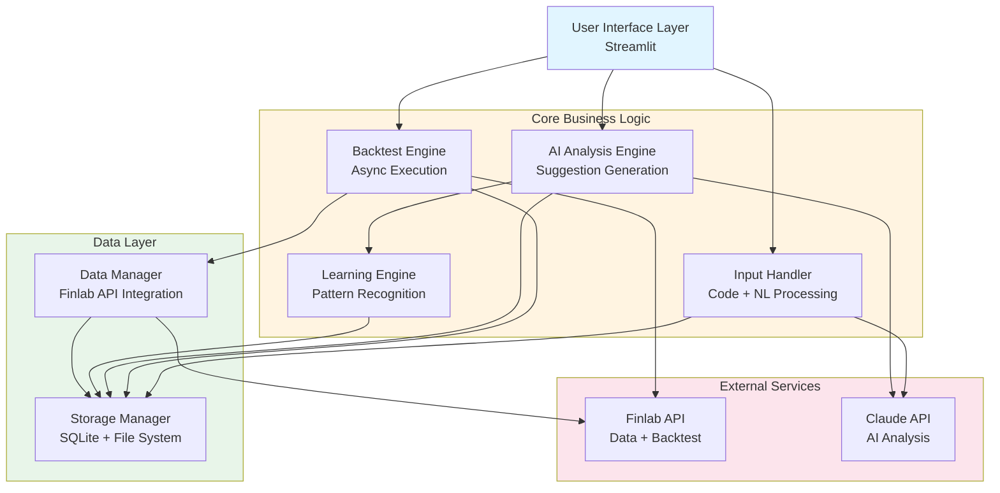
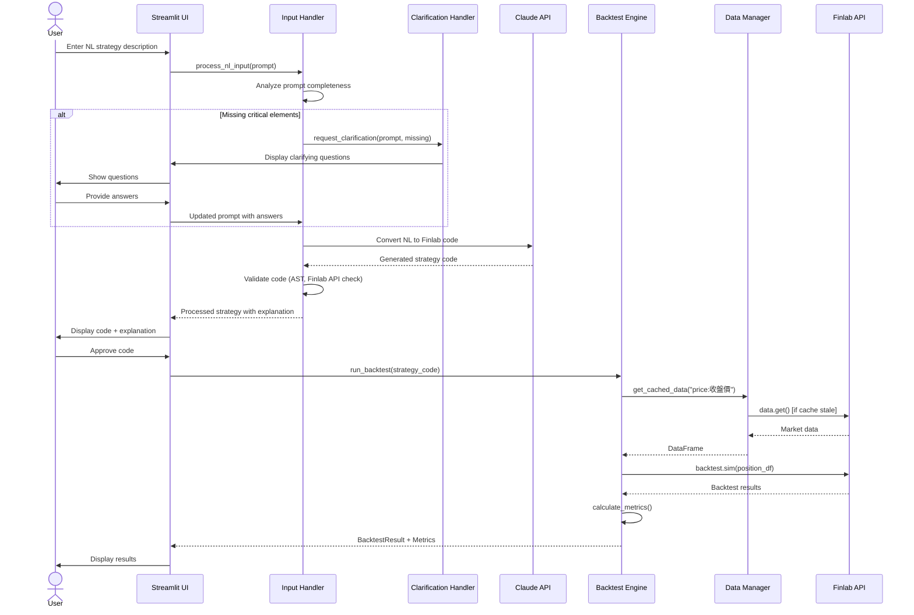
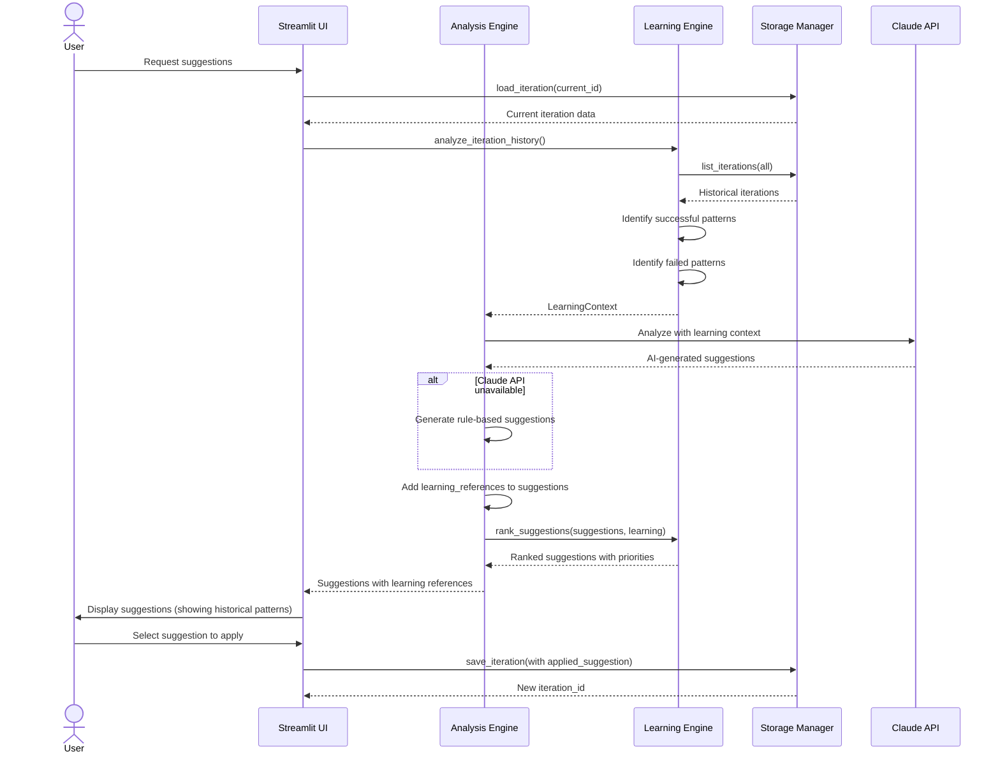

# finlab-backtesting-optimization-system - Task 58

Execute task 58 for the finlab-backtesting-optimization-system specification.

## Task Description
Create i18n utility

## Code Reuse
**Leverage existing code**: json module, caching

## Requirements Reference
**Requirements**: AC-7.8, Design Component 9

## Usage
```
/Task:58-finlab-backtesting-optimization-system
```

## Instructions

Execute with @spec-task-executor agent the following task: "Create i18n utility"

```
Use the @spec-task-executor agent to implement task 58: "Create i18n utility" for the finlab-backtesting-optimization-system specification and include all the below context.

# Steering Context
## Steering Documents Context

No steering documents found or all are empty.

# Specification Context
## Specification Context (Pre-loaded): finlab-backtesting-optimization-system

### Requirements
# Requirements Document

## Introduction

The Finlab Backtesting Optimization System is an intelligent trading strategy development and optimization platform designed for weekly/monthly trading cycles. The system enables users to iteratively improve trading strategies through automated backtesting, performance analysis, and AI-driven recommendations. By leveraging the Finlab API and machine learning capabilities, the system provides actionable, specific improvement suggestions that compound over multiple iterations.

**Target Users**: Individual traders focused on medium-term (weekly/monthly) trading strategies
**Core Value**: Systematic strategy improvement through iterative learning and evidence-based recommendations

---

## Alignment with Product Vision

This system supports individual traders in developing robust trading strategies by:
- Providing automated backtesting with industry-standard metrics (annualized return, Sharpe ratio, maximum drawdown)
- Enabling iterative strategy refinement through AI-driven suggestions
- Simplifying data acquisition and management through Finlab API integration
- Offering an intuitive UI for strategy development and analysis

**Note**: This is a personal trading system without existing product.md or steering documents.

---

## Assumptions and Constraints

### Assumptions
- User has active Finlab API subscription with valid credentials
- User has Python 3.8+ installed locally
- User has basic understanding of trading concepts (returns, Sharpe ratio, drawdown)
- User has basic Python knowledge including syntax and control flow
- Market data from Finlab API is accurate and reliable

### Constraints
- System designed for single-user operation (no multi-tenancy required)
- Focus on weekly/monthly trading cycles (not high-frequency trading)
- Maximum backtest period: 5 years of historical data
- Target approximately 500 daily data points per symbol for performance benchmarks
- Designed for personal use, avoiding unnecessary complexity

---

## Requirements

### REQ-1: Finlab API Integration and Data Management

**User Story:** As a trader, I want to download and manage financial data from Finlab API, so that I have reliable, up-to-date market data for backtesting my strategies.

#### Acceptance Criteria

1. **AC-1.1**: WHEN user initiates data download THEN system SHALL retrieve data using Finlab data retrieval API
2. **AC-1.2**: WHEN data is downloaded THEN system SHALL save it locally for offline access
3. **AC-1.3**: WHEN user enables data caching THEN system SHALL reuse cached data to minimize API calls
4. **AC-1.4**: WHEN user requests data update THEN system SHALL fetch latest data from Finlab API
5. **AC-1.5**: WHEN data retrieval fails THEN system SHALL provide error message indicating failure reason and retry options
6. **AC-1.6**: WHEN data is saved locally THEN system SHALL organize it by dataset type and ISO 8601 timestamp
7. **AC-1.7**: WHEN Finlab API rate limit is exceeded THEN system SHALL queue pending requests and retry with exponential backoff starting at 5 seconds
8. **AC-1.8**: WHEN cached data is older than 7 days THEN system SHALL prompt user to refresh data before backtesting

---

### REQ-2: Core Backtesting Engine

**User Story:** As a trader, I want to backtest my trading strategies with standard performance metrics, so that I can evaluate strategy effectiveness objectively.

#### Acceptance Criteria

1. **AC-2.1**: WHEN user submits trading strategy code THEN system SHALL execute backtest using Finlab backtesting framework
2. **AC-2.2**: WHEN backtest completes THEN system SHALL calculate annualized return percentage
3. **AC-2.3**: WHEN backtest completes THEN system SHALL calculate Sharpe ratio
4. **AC-2.4**: WHEN backtest completes THEN system SHALL calculate maximum drawdown percentage
5. **AC-2.5**: WHEN backtest runs THEN system SHALL track all portfolio positions and trade records with timestamps
6. **AC-2.6**: IF backtest encounters syntax or runtime error THEN system SHALL provide error information including error type, message, and line number
7. **AC-2.7**: WHEN backtest completes THEN system SHALL generate time-series visualization of cumulative returns and drawdown
8. **AC-2.8**: WHEN backtest produces zero trades THEN system SHALL alert user and suggest reviewing entry/exit conditions or parameter ranges

---

### REQ-3: AI-Driven Strategy Analysis and Improvement Suggestions

**User Story:** As a trader, I want to receive specific, actionable improvement suggestions based on backtest results, so that I can systematically enhance my trading strategy.

#### Acceptance Criteria

1. **AC-3.1**: WHEN backtest completes THEN system SHALL analyze performance metrics to identify weaknesses
2. **AC-3.2**: WHEN analysis completes THEN system SHALL generate between 3 and 5 improvement suggestions based on analysis complexity
3. **AC-3.3**: IF Sharpe ratio is less than 1.0 THEN system SHALL suggest specific risk management improvements
4. **AC-3.4**: IF maximum drawdown exceeds 20% THEN system SHALL suggest position sizing adjustments or stop-loss parameters
5. **AC-3.5**: IF win rate is less than 50% THEN system SHALL suggest modifications to entry or exit conditions
6. **AC-3.6**: WHEN suggestions are generated THEN each suggestion SHALL include specific code changes, parameter adjustments, or condition modifications
7. **AC-3.7**: WHEN suggestions are generated THEN each suggestion SHALL include estimated percentage improvement range for affected metrics
8. **AC-3.8**: WHEN system provides suggestions THEN suggestions SHALL be ranked by expected improvement potential (high, medium, low)
9. **AC-3.9**: IF AI suggestion generation fails THEN system SHALL fallback to rule-based suggestions and notify user of degraded analysis

---

### REQ-4: Iterative Learning and Optimization Workflow

**User Story:** As a trader, I want the system to learn from each iteration and provide progressively better suggestions, so that my strategy improves systematically over time.

#### Acceptance Criteria

1. **AC-4.1**: WHEN user completes backtest iteration THEN system SHALL store iteration results including strategy code, performance metrics, and suggestions applied
2. **AC-4.2**: WHEN new iteration starts THEN system SHALL analyze previous iteration data to identify successful modification patterns
3. **AC-4.3**: IF previous suggestion improved Sharpe ratio by more than 10% THEN system SHALL prioritize similar suggestion types in current iteration
4. **AC-4.4**: IF previous suggestion degraded any performance metric by more than 5% THEN system SHALL avoid similar suggestion types
5. **AC-4.5**: WHEN system generates suggestions THEN it SHALL reference specific learnings from previous iterations in suggestion descriptions
6. **AC-4.6**: WHEN iteration history reaches 5 or more iterations THEN system SHALL identify convergence patterns or diminishing returns
7. **AC-4.7**: WHEN user requests iteration summary THEN system SHALL visualize metric progression (annualized return, Sharpe ratio, MDD) across all iterations

---

### REQ-5: User Input Handling (Code or Natural Language)

**User Story:** As a trader, I want to provide trading strategies either as Python code or natural language descriptions, so that I can work in the format most convenient for me.

#### Acceptance Criteria

1. **AC-5.1**: WHEN user provides Python code THEN system SHALL validate syntax and check Finlab API function compatibility
2. **AC-5.2**: WHEN user provides natural language prompt THEN system SHALL convert it to executable Finlab-compatible strategy code
3. **AC-5.3**: IF natural language prompt lacks entry condition, exit condition, or timeframe specification THEN system SHALL ask clarifying questions before generating code
4. **AC-5.4**: WHEN code is generated from natural language THEN system SHALL explain the strategy logic in plain language to user
5. **AC-5.5**: WHEN user provides code THEN system SHALL detect common Finlab API usage errors (incorrect function names, missing parameters, wrong data types)
6. **AC-5.6**: WHEN strategy code is ready THEN system SHALL display it with syntax highlighting for user review before backtesting

---

### REQ-6: Asynchronous Backtesting Execution

**User Story:** As a trader, I want backtesting to run asynchronously, so that I can continue working on other tasks while my strategy backtests run in the background.

#### Acceptance Criteria

1. **AC-6.1**: WHEN backtest is initiated THEN system SHALL execute it asynchronously without blocking user interface
2. **AC-6.2**: WHEN backtest is running THEN system SHALL display real-time progress indicator with percentage completion
3. **AC-6.3**: WHEN backtest completes THEN system SHALL notify user with visual and optional audio notification
4. **AC-6.4**: IF backtest execution exceeds 120 seconds THEN system SHALL provide option to cancel or extend timeout
5. **AC-6.5**: WHEN multiple backtests are queued THEN system SHALL execute them sequentially in submission order
6. **AC-6.6**: WHEN asynchronous task fails THEN system SHALL provide detailed error log and option to retry with same parameters

---

### REQ-7: Simple and Intuitive User Interface

**User Story:** As a trader, I want a clean, easy-to-use interface, so that I can focus on strategy development without UI complexity.

#### Acceptance Criteria

1. **AC-7.1**: WHEN user opens application THEN system SHALL display clear workflow stages: Input → Backtest → Analysis → Suggestions
2. **AC-7.2**: WHEN user is at any workflow stage THEN system SHALL highlight current stage and show progress to completion
3. **AC-7.3**: WHEN displaying results THEN system SHALL use clear visualizations including line charts for metrics and tables for trade records
4. **AC-7.4**: WHEN user hovers over UI elements THEN system SHALL provide inline tooltips explaining functionality
5. **AC-7.5**: IF user is idle for more than 30 minutes THEN system SHALL preserve session state including unsaved code and backtest results
6. **AC-7.6**: WHEN user completes iteration THEN system SHALL provide clearly labeled "Continue with Suggestions" or "Finish Session" buttons
7. **AC-7.7**: WHEN displaying suggestions THEN system SHALL use plain language avoiding excessive technical jargon while maintaining precision
8. **AC-7.8**: WHEN user interface loads THEN system SHALL support both Traditional Chinese and English language options

---

### REQ-8: Strategy Version Management and Export

**User Story:** As a trader, I want to save, version, and export my strategies and results, so that I can track my development progress and share successful strategies.

#### Acceptance Criteria

1. **AC-8.1**: WHEN user saves strategy THEN system SHALL assign unique version identifier with timestamp
2. **AC-8.2**: WHEN user requests strategy history THEN system SHALL display all saved versions with performance summary
3. **AC-8.3**: WHEN user selects strategy version THEN system SHALL load exact code and configuration from that version
4. **AC-8.4**: WHEN user exports results THEN system SHALL generate report in JSON format including strategy code, all metrics, and trade records
5. **AC-8.5**: WHEN user exports results THEN system SHALL provide option to export as PDF with charts and formatted tables
6. **AC-8.6**: WHEN user imports strategy THEN system SHALL validate format compatibility and load strategy for backtesting

---

### REQ-9: Multi-Strategy Comparison

**User Story:** As a trader, I want to compare multiple strategies or iterations side-by-side, so that I can identify which modifications produced the best results.

#### Acceptance Criteria

1. **AC-9.1**: WHEN user selects multiple strategies THEN system SHALL display comparison table with all performance metrics
2. **AC-9.2**: WHEN comparison is displayed THEN system SHALL highlight best performing metric in each category
3. **AC-9.3**: WHEN comparison includes more than 2 strategies THEN system SHALL generate overlay chart showing cumulative returns over time
4. **AC-9.4**: WHEN user requests difference analysis THEN system SHALL show code diff between selected strategy versions

---

## Non-Functional Requirements

### Performance
- Backtesting execution time SHALL be under 30 seconds for strategies with 2 years of daily data (approximately 500 data points per symbol)
- UI response time SHALL be under 200ms for all user interactions
- Data download from Finlab API SHALL complete within 60 seconds for standard datasets (price, volume, basic financials)
- Iteration analysis and suggestion generation SHALL complete within 10 seconds
- System SHALL handle datasets up to 100MB without performance degradation

### Security
- User API tokens for Finlab SHALL be stored encrypted using AES-256 encryption
- Local data storage SHALL use file permissions 600 for data files and 700 for directories
- System SHALL not log sensitive information including API tokens, credentials, or personal identifiable information
- Strategy code execution SHALL run in sandboxed environment preventing file system access outside designated directories

### Reliability
- System SHALL handle network failures gracefully with automatic retry using exponential backoff (5s, 10s, 20s, 40s)
- System SHALL validate all user inputs to prevent code injection or execution of malicious code
- System SHALL maintain data integrity with atomic file operations for local storage
- System SHALL provide automatic backup of iteration history every 24 hours
- System SHALL recover gracefully from crashes, preserving session state from last 5 minutes of activity

### Usability
- System SHALL be usable by traders with basic Python knowledge (understanding of syntax, variables, functions, and control flow)
- UI SHALL follow consistent design patterns throughout the application (typography, colors, spacing, button styles)
- Error messages SHALL be actionable and provide clear next steps or links to documentation
- System SHALL support both Traditional Chinese (zh-TW) and English (en-US) interfaces
- System SHALL provide onboarding tutorial for first-time users covering complete workflow

### Maintainability
- Code SHALL be modular with clear separation of concerns (data module, backtesting engine, analysis module, UI layer)
- System SHALL use Finlab API as primary data source without reimplementing existing Finlab functionality
- All major components SHALL have comprehensive documentation including purpose, inputs, outputs, and usage examples
- System design SHALL prioritize simplicity appropriate for personal weekly/monthly trading use case
- Code SHALL follow PEP 8 style guidelines for Python with consistent naming conventions

---

## Glossary

- **Iteration**: A complete cycle of strategy modification, backtesting, and analysis
- **Backtest Run**: Single execution of backtesting engine on specific strategy code
- **Strategy**: Python code implementing trading logic using Finlab API
- **Finlab API**: Finlab's data retrieval and analysis functions (finlab.data module)
- **Finlab Backtesting Framework**: Finlab's backtesting execution engine for strategy evaluation
- **Performance Metrics**: Quantitative measurements including annualized return, Sharpe ratio, and maximum drawdown
- **Suggestion**: AI-generated or rule-based recommendation for strategy improvement with specific implementation guidance

---

### Design
# Design Document

## Overview

The Finlab Backtesting Optimization System is a desktop application that enables iterative improvement of trading strategies through AI-assisted analysis and automated backtesting. The system follows a modular architecture with four primary layers: Data Management, Backtesting Engine, AI Analysis, and User Interface.

**Technology Stack:**
- **Backend**: Python 3.8+ with Finlab API, asyncio for async execution
- **Frontend**: Streamlit for simple, interactive UI
- **Storage**: SQLite for iteration history, local file system for data cache
- **AI Integration**: Claude API for strategy analysis and improvement suggestions

**Architecture Pattern**: Layered architecture with clean separation between data, business logic, and presentation layers

---

## Steering Document Alignment

### Technical Standards
This is a new project without existing tech.md. The design establishes the following technical standards:

- **Language**: Python 3.8+ for compatibility with Finlab API
- **Framework**: Streamlit for rapid UI development suitable for personal use
- **Data Storage**: SQLite for structured data, JSON for exports, local files for data cache
- **API Integration**: Finlab API as primary data and backtesting source
- **Code Style**: PEP 8 compliance with type hints for clarity

### Project Structure
This is a new project without existing structure.md. The design proposes:

```
finlab-backtesting-optimization-system/
 src/
    data/           # Data management layer
    backtest/       # Backtesting engine layer
    analysis/       # AI analysis layer
    ui/             # User interface layer
    utils/          # Shared utilities
 data/               # Local data cache
 storage/            # SQLite database and iteration history
 config/             # Configuration files
 tests/              # Unit and integration tests
```

---

## Code Reuse Analysis

As this is a greenfield project, we will leverage:

### Existing External Libraries
- **Finlab API** (`finlab.data`, `finlab.backtest`): Primary data source and backtesting framework
- **Streamlit**: UI framework with built-in components for forms, charts, and session state
- **Pandas**: Data manipulation (already used by Finlab)
- **Matplotlib/Plotly**: Visualization libraries for charts
- **SQLite3**: Built-in Python database for iteration storage
- **asyncio**: Built-in async execution for non-blocking backtests

### Integration Points
- **Finlab Data API** (`finlab.data.get()`): Downloads and caches market data
- **Finlab Backtest API** (`finlab.backtest.sim()`): Executes backtests with position dataframes
- **Claude API**: Generates strategy code from natural language and provides improvement suggestions
- **Local File System**: Stores cached data organized by dataset type and timestamp

---

## Architecture

The system follows a layered architecture pattern with asynchronous execution support:



### Data Flow

**Strategy Development Flow:**
1. User inputs strategy (code or natural language) via UI
2. Input Handler validates code or converts NL to code using Claude API
3. User reviews and approves generated code
4. Backtest Engine executes asynchronously using Finlab API
5. AI Analysis Engine analyzes results and generates suggestions
6. Learning Engine updates knowledge base with iteration results
7. UI displays results, suggestions, and iteration history

**Iterative Improvement Flow:**
1. User selects suggestion to apply
2. Input Handler modifies strategy code based on suggestion
3. New backtest executes with modified strategy
4. Learning Engine compares results with previous iterations
5. Analysis Engine adjusts future suggestions based on learning
6. Cycle repeats until user is satisfied

### Detailed Workflow Sequence Diagrams

**Natural Language Input to Backtest Flow** (REQ-5):



**Iterative Learning and Suggestion Flow** (REQ-4):



---

## Components and Interfaces

### Component 1: Data Manager

**Purpose:** Manages data acquisition, caching, and retrieval from Finlab API

**Interfaces:**
```python
class DataManager:
    def download_data(dataset: str, force_refresh: bool = False) -> pd.DataFrame
    def get_cached_data(dataset: str) -> Optional[pd.DataFrame]
    def check_data_freshness(dataset: str) -> tuple[bool, datetime]
    def list_available_datasets() -> List[str]
    def cleanup_old_cache(days_threshold: int = 30) -> int
```

**Dependencies:**
- `finlab.data.get()` for data retrieval
- `finlab.data.set_storage()` for storage configuration
- Local file system for cache storage

**Reuses:**
- Finlab's `FileStorage` class for local data persistence
- Finlab's dataset catalog for available data sources

**Implementation Notes:**
- Uses ISO 8601 timestamps for cache file naming
- Implements exponential backoff for rate limit handling
- Organizes cache by dataset type: `data/price/`, `data/volume/`, etc.

---

### Component 2: Backtest Engine

**Purpose:** Executes trading strategies asynchronously and calculates performance metrics

**Interfaces:**
```python
class BacktestEngine:
    async def run_backtest(strategy_code: str,
                          data_config: dict,
                          backtest_params: dict) -> BacktestResult

    def validate_strategy_code(code: str) -> tuple[bool, Optional[str]]

    def calculate_metrics(backtest_result: Any) -> PerformanceMetrics

    def generate_visualizations(backtest_result: Any) -> dict[str, Figure]

class BacktestResult:
    portfolio_positions: pd.DataFrame
    trade_records: pd.DataFrame
    equity_curve: pd.Series

class PerformanceMetrics:
    annualized_return: float
    sharpe_ratio: float
    max_drawdown: float
    total_trades: int
    win_rate: float
    profit_factor: float
```

**Dependencies:**
- `finlab.backtest.sim()` for backtest execution
- `asyncio` for asynchronous execution
- Data Manager for market data retrieval

**Reuses:**
- Finlab's `sim()` function with position DataFrame input
- Finlab's built-in fee/tax calculation
- Finlab's transaction simulation engine

**Implementation Notes:**
- Wraps Finlab `sim()` in async executor for non-blocking execution
- Validates strategy code using AST parsing before execution
- Sandboxes code execution to prevent file system access
- Captures stdout/stderr for error reporting

---

### Component 3: Input Handler

**Purpose:** Processes user input (code or natural language) and validates strategy compatibility

**Interfaces:**
```python
class InputHandler:
    async def process_code_input(code: str) -> ProcessedStrategy

    async def process_nl_input(prompt: str) -> ProcessedStrategy

    def validate_finlab_compatibility(code: str) -> ValidationResult

    def extract_strategy_parameters(code: str) -> dict

class ProcessedStrategy:
    code: str
    explanation: str
    parameters: dict
    validation_status: ValidationResult

class ValidationResult:
    is_valid: bool
    errors: List[str]
    warnings: List[str]
```

**Dependencies:**
- Claude API for NL to code conversion
- AST parser for code validation
- Finlab API reference for compatibility checking

**Reuses:**
- Python's `ast` module for syntax validation
- `inspect` module for code introspection

**Implementation Notes:**
- Uses Claude API with Finlab documentation context for accurate code generation
- Detects common Finlab API patterns (position DataFrames, data.get() calls)
- Provides syntax highlighting using Pygments for code display

---

### Component 4: AI Analysis Engine

**Purpose:** Analyzes backtest results and generates specific improvement suggestions

**Interfaces:**
```python
class AnalysisEngine:
    async def analyze_results(backtest_result: BacktestResult,
                             metrics: PerformanceMetrics,
                             iteration_history: List[Iteration]) -> AnalysisReport

    def generate_suggestions(analysis: AnalysisReport,
                           learning_context: LearningContext) -> List[Suggestion]

    def rank_suggestions(suggestions: List[Suggestion]) -> List[Suggestion]

class AnalysisReport:
    weaknesses: List[str]
    strengths: List[str]
    risk_factors: List[str]
    opportunity_areas: List[str]

class Suggestion:
    title: str
    description: str
    specific_changes: str  # Code modification or parameter adjustment
    expected_impact: dict[str, tuple[float, float]]  # metric -> (min%, max%)
    priority: str  # "high", "medium", "low"
    rationale: str
    learning_references: List[str]  # References to historical patterns that influenced this suggestion
```

**Dependencies:**
- Claude API for AI-powered analysis
- Learning Engine for historical context
- Storage Manager for iteration data

**Reuses:**
- Claude API with structured prompts for consistent suggestion format
- Rule-based fallbacks for common scenarios (low Sharpe ratio, high MDD)

**Implementation Notes:**
- Each suggestion includes `learning_references` field showing which historical patterns influenced it (e.g., "Similar position_sizing adjustment improved Sharpe by 15% in iteration #3")
- Implements comprehensive rule-based analysis as fallback when Claude API unavailable (see below)
- Uses structured prompt templates for consistent suggestion quality
- Limits suggestions to 3-5 based on analysis complexity
- Includes confidence scores for each suggestion

**Rule-Based Suggestion Templates** (Fallback when Claude API unavailable):

```python
RULE_BASED_TEMPLATES = {
    "low_sharpe": {
        "condition": lambda metrics: metrics.sharpe_ratio < 1.0,
        "suggestion": {
            "title": "Improve Risk-Adjusted Returns",
            "description": "Sharpe ratio below 1.0 indicates suboptimal risk-adjusted returns",
            "specific_changes": "Add stop-loss parameter: `stop_loss=0.10` (10% max loss per position)",
            "expected_impact": {"sharpe_ratio": (0.2, 0.5)},  # 20-50% improvement
            "priority": "high",
            "rationale": "Stop-loss limits downside risk, improving risk-adjusted returns"
        }
    },
    "high_drawdown": {
        "condition": lambda metrics: metrics.max_drawdown > 0.20,
        "suggestion": {
            "title": "Reduce Maximum Drawdown",
            "description": "Maximum drawdown exceeds 20%, exposing capital to excessive risk",
            "specific_changes": "Reduce position sizing: multiply position weights by 0.5",
            "expected_impact": {"max_drawdown": (-0.30, -0.15)},  # 15-30% reduction
            "priority": "high",
            "rationale": "Smaller positions reduce portfolio volatility and drawdown"
        }
    },
    "low_win_rate": {
        "condition": lambda metrics: metrics.win_rate < 0.50,
        "suggestion": {
            "title": "Improve Entry Signal Quality",
            "description": "Win rate below 50% suggests entry signals may be premature",
            "specific_changes": "Add signal confirmation: require 2 consecutive signal days before entry",
            "expected_impact": {"win_rate": (0.05, 0.15)},  # 5-15% improvement
            "priority": "medium",
            "rationale": "Signal confirmation reduces false positives"
        }
    },
    "few_trades": {
        "condition": lambda metrics: metrics.total_trades < 10,
        "suggestion": {
            "title": "Increase Trading Frequency",
            "description": "Too few trades (<10) reduces statistical significance",
            "specific_changes": "Relax entry conditions or reduce holding period threshold",
            "expected_impact": {"total_trades": (1.5, 3.0)},  # 150-300% increase
            "priority": "medium",
            "rationale": "More trades provide better statistical validation"
        }
    }
}
```

---

### Component 5: Learning Engine

**Purpose:** Tracks iteration history, identifies successful patterns, and informs future suggestions

**Interfaces:**
```python
class LearningEngine:
    def record_iteration(iteration: Iteration) -> None

    def analyze_iteration_history(min_iterations: int = 5) -> LearningContext

    def identify_successful_patterns() -> List[Pattern]

    def identify_failed_patterns() -> List[Pattern]

    def detect_convergence() -> Optional[ConvergenceReport]

class Iteration:
    id: str
    timestamp: datetime
    strategy_code: str
    metrics: PerformanceMetrics
    suggestions_applied: List[str]

class LearningContext:
    successful_patterns: List[Pattern]
    failed_patterns: List[Pattern]
    metric_trends: dict[str, List[float]]
    convergence_status: Optional[ConvergenceReport]

class Pattern:
    pattern_type: str  # "risk_management", "entry_condition", "position_sizing"
    description: str
    metric_impact: dict[str, float]
    confidence: float
```

**Dependencies:**
- Storage Manager for iteration persistence
- Statistical analysis libraries (scipy, numpy)

**Reuses:**
- SQLite for structured iteration storage
- Pandas for metric trend analysis

**Implementation Notes:**
- Stores complete iteration history in SQLite with JSON strategy code
- Calculates metric deltas between iterations
- Uses simple heuristics: >10% Sharpe improvement = successful pattern
- Detects convergence when last 3 iterations show <2% metric improvement

---

### Component 6: Storage Manager

**Purpose:** Manages persistence of iterations, strategies, and configuration

**Interfaces:**
```python
class StorageManager:
    def save_iteration(iteration: Iteration) -> str

    def load_iteration(iteration_id: str) -> Iteration

    def list_iterations(limit: int = 50) -> List[Iteration]

    def save_strategy_version(strategy: Strategy) -> str

    def load_strategy_version(version_id: str) -> Strategy

    def export_results(iteration_ids: List[str], format: str) -> str

    def import_strategy(file_path: str) -> Strategy

    def backup_database() -> str
```

**Dependencies:**
- SQLite for structured data storage
- JSON for data serialization
- File system for backups

**Reuses:**
- Python's `sqlite3` module
- `json` module for serialization
- `pathlib` for file operations

**Implementation Notes:**
- Database schema with tables: iterations, strategies, metrics, suggestions, trades
- Atomic file operations using temporary files and rename for safety
- Scheduled daily automatic backups to `storage/backups/` using `BackupScheduler`
- Export formats: JSON (raw data with all fields), PDF (formatted report with embedded charts using ReportLab)
- Uses parameterized queries throughout to prevent SQL injection:
  ```python
  cursor.execute("SELECT * FROM iterations WHERE id = ?", (iteration_id,))
  ```
- Implements connection pooling for concurrent async access:
  ```python
  # Thread-safe connection pool
  db_pool = queue.Queue(maxsize=5)
  for _ in range(5):
      db_pool.put(sqlite3.connect('storage/iterations.db', check_same_thread=False))
  ```
- Write operations queued to prevent SQLite lock contention

---

### Component 7: Comparison Engine

**Purpose:** Enables side-by-side comparison of multiple strategies and iterations (REQ-9)

**Interfaces:**
```python
class ComparisonEngine:
    def compare_strategies(strategy_ids: List[str]) -> ComparisonResult

    def highlight_best_metrics(comparison: ComparisonResult) -> HighlightedComparison

    def generate_overlay_chart(strategy_ids: List[str]) -> Figure

    def generate_code_diff(strategy_id_1: str, strategy_id_2: str) -> CodeDiff

class ComparisonResult:
    strategies: List[Strategy]
    metrics_table: pd.DataFrame  # Rows: strategies, Cols: metrics
    best_per_metric: dict[str, str]  # metric_name -> strategy_id

class HighlightedComparison:
    html_table: str  # HTML with highlighted cells
    best_overall: Optional[str]  # strategy_id with best balanced performance

class CodeDiff:
    diff_html: str  # Syntax-highlighted diff
    changes_summary: dict[str, int]  # additions, deletions, modifications
```

**Dependencies:**
- Storage Manager for loading strategy versions
- Plotly for overlay charts
- `difflib` for code diff generation
- `pygments` for syntax highlighting

**Reuses:**
- Python's `difflib.unified_diff()` for code comparison
- Pandas DataFrame for metrics table manipulation
- Plotly's multi-line charts for equity curve overlays

**Implementation Notes:**
- Normalizes metrics to 0-100 scale for fair comparison when metrics have different ranges
- Best overall strategy calculated using weighted score: `0.4*sharpe + 0.3*return + 0.3*(1-drawdown)`
- Overlay chart shows up to 5 strategies simultaneously with distinct colors
- Code diff highlights additions (green), deletions (red), modifications (yellow)
- Supports comparing strategies across different time periods (normalizes to percentage returns)

---

### Component 8: Notification and UI Support Components

**Purpose:** Provides notification system, clarifying questions, and tutorial support (REQ-6, REQ-5, Usability NFR)

**Interfaces:**
```python
class NotificationHandler:
    def notify_backtest_complete(iteration_id: str, metrics: PerformanceMetrics) -> None
    def notify_error(error_type: str, message: str) -> None
    def play_sound(sound_type: str) -> None  # "success", "error", "warning"

class ClarificationHandler:
    async def request_clarification(prompt: str, missing_elements: List[str]) -> str
    def generate_clarifying_questions(missing: List[str]) -> List[str]

class TutorialManager:
    def show_onboarding_tour() -> None
    def get_tooltip(element_id: str, language: str) -> str
    def mark_tutorial_complete() -> None
```

**Dependencies:**
- Streamlit's notification system for visual alerts
- `playsound` library for audio notifications
- Streamlit session state for tutorial progress

**Reuses:**
- Streamlit's `st.toast()` for notifications
- Streamlit's `st.info()`, `st.success()`, `st.error()` for messages
- Simple audio files (MP3) for notification sounds

**Implementation Notes:**
- Notifications use Streamlit's native toast system (non-blocking)
- Audio notifications optional, controlled by user preference
- Clarifying questions use multi-turn conversation pattern in UI
- Tutorial uses Streamlit's step-by-step component walkthrough
- Tooltips stored in JSON i18n files for easy translation

---

### Component 9: User Interface (Streamlit)

**Purpose:** Provides clean, intuitive interface for complete workflow

**Interface Screens:**

**1. Main Dashboard**
- Workflow progress indicator (Input � Backtest � Analysis � Suggestions)
- Quick stats: Total iterations, best Sharpe ratio, current strategy
- Recent iterations table with key metrics

**2. Strategy Input Screen**
- Code editor with syntax highlighting (using `streamlit-ace`)
- Natural language input text area
- Validation status display
- "Validate & Preview" button

**3. Backtest Configuration Screen**
- Dataset selection dropdown
- Date range picker
- Parameter inputs (fees, taxes, resampling period)
- "Run Backtest" button
- Progress indicator for async execution

**4. Results Display Screen**
- Performance metrics cards (annual return, Sharpe, MDD)
- Interactive charts (equity curve, drawdown, trade distribution)
- Trade records table with sorting/filtering
- "View Suggestions" button

**5. Suggestions Screen**
- Suggestion cards with priority badges
- Expandable details (specific changes, expected impact, rationale)
- "Apply Suggestion" button for each suggestion
- "Apply Multiple" checkbox selection

**6. Iteration History Screen**
- Timeline visualization of metric progression
- Iteration list with sortable columns
- Export functionality (JSON/PDF)
- "Compare Selected" button

**7. Strategy Comparison Screen** (NEW - REQ-9)
- Multi-select strategy picker
- Side-by-side metrics comparison table with highlighted best values
- Overlay chart showing cumulative returns for all selected strategies
- Code diff viewer for comparing two strategies
- "Export Comparison" button

**Dependencies:**
- Streamlit for UI framework
- Plotly for interactive charts
- streamlit-ace for code editor

**Reuses:**
- Streamlit's built-in session state for workflow persistence
- Streamlit's caching for performance optimization
- Plotly's responsive charts for visualization

**Implementation Notes:**
- Uses Streamlit session state to preserve data across reruns
- Implements i18n using simple dictionary-based translation
- Uses Streamlit's `@st.cache_data` for expensive operations
- Responsive design using Streamlit's column layout

---

## Data Models

### Strategy Model
```python
@dataclass
class Strategy:
    id: str  # UUID
    version: str  # Semantic version or timestamp
    code: str
    description: str
    parameters: dict
    created_at: datetime
    created_by: str  # "user" or "ai"
    parent_version: Optional[str]  # For tracking suggestion lineage
```

### Iteration Model
```python
@dataclass
class Iteration:
    id: str  # UUID
    strategy_id: str
    timestamp: datetime
    backtest_params: dict
    metrics: PerformanceMetrics
    trade_records: List[dict]
    suggestions_received: List[Suggestion]
    suggestions_applied: List[str]  # Suggestion IDs
```

### PerformanceMetrics Model
```python
@dataclass
class PerformanceMetrics:
    annualized_return: float
    sharpe_ratio: float
    max_drawdown: float
    total_trades: int
    win_rate: float
    profit_factor: float
    avg_holding_period: float  # days
    best_trade: float
    worst_trade: float
```

### Suggestion Model
```python
@dataclass
class Suggestion:
    id: str  # UUID
    iteration_id: str
    title: str
    description: str
    category: str  # "risk_management", "entry_exit", "position_sizing"
    specific_changes: str  # Code snippet or parameter change
    expected_impact: dict[str, tuple[float, float]]
    priority: str  # "high", "medium", "low"
    rationale: str
    learning_references: List[str]  # Historical patterns that influenced this suggestion (REQ-4 AC-4.5)
    created_at: datetime
    applied: bool
```

---

## Database Schema

**SQLite Database: `storage/iterations.db`**

```sql
-- Strategies table
CREATE TABLE strategies (
    id TEXT PRIMARY KEY,
    version TEXT NOT NULL,
    code TEXT NOT NULL,
    description TEXT,
    parameters JSON,
    created_at TIMESTAMP DEFAULT CURRENT_TIMESTAMP,
    created_by TEXT,
    parent_version TEXT,
    FOREIGN KEY (parent_version) REFERENCES strategies(id)
);

-- Iterations table
CREATE TABLE iterations (
    id TEXT PRIMARY KEY,
    strategy_id TEXT NOT NULL,
    timestamp TIMESTAMP DEFAULT CURRENT_TIMESTAMP,
    backtest_params JSON,
    FOREIGN KEY (strategy_id) REFERENCES strategies(id)
);

-- Metrics table
CREATE TABLE metrics (
    iteration_id TEXT PRIMARY KEY,
    annualized_return REAL,
    sharpe_ratio REAL,
    max_drawdown REAL,
    total_trades INTEGER,
    win_rate REAL,
    profit_factor REAL,
    avg_holding_period REAL,
    best_trade REAL,
    worst_trade REAL,
    FOREIGN KEY (iteration_id) REFERENCES iterations(id)
);

-- Suggestions table
CREATE TABLE suggestions (
    id TEXT PRIMARY KEY,
    iteration_id TEXT NOT NULL,
    title TEXT,
    description TEXT,
    category TEXT,
    specific_changes TEXT,
    expected_impact JSON,
    priority TEXT,
    rationale TEXT,
    learning_references JSON,  -- Array of historical pattern references (REQ-4 AC-4.5)
    created_at TIMESTAMP DEFAULT CURRENT_TIMESTAMP,
    applied BOOLEAN DEFAULT 0,
    FOREIGN KEY (iteration_id) REFERENCES iterations(id)
);

-- Trade records table
CREATE TABLE trades (
    id INTEGER PRIMARY KEY AUTOINCREMENT,
    iteration_id TEXT NOT NULL,
    symbol TEXT,
    entry_date DATE,
    exit_date DATE,
    entry_price REAL,
    exit_price REAL,
    quantity INTEGER,
    profit_loss REAL,
    return_pct REAL,
    FOREIGN KEY (iteration_id) REFERENCES iterations(id)
);

-- Performance indexes
CREATE INDEX idx_iterations_timestamp ON iterations(timestamp);
CREATE INDEX idx_strategies_created_at ON strategies(created_at);
CREATE INDEX idx_strategies_parent ON strategies(parent_version);  -- For strategy lineage queries
CREATE INDEX idx_suggestions_iteration ON suggestions(iteration_id);
CREATE INDEX idx_suggestions_applied ON suggestions(applied);  -- For filtering applied suggestions
CREATE INDEX idx_trades_iteration ON trades(iteration_id);
CREATE INDEX idx_trades_symbol ON trades(symbol);  -- For per-symbol analysis
CREATE INDEX idx_metrics_sharpe ON metrics(sharpe_ratio);  -- For finding best strategies
```

---

## Error Handling

### Error Scenarios

**1. Finlab API Rate Limit Exceeded**
- **Handling:** Queue requests with exponential backoff (5s, 10s, 20s, 40s)
- **User Impact:** Progress indicator shows "Rate limited, retrying in X seconds"
- **Recovery:** Automatic retry, user can cancel operation

**2. Invalid Strategy Code**
- **Handling:** AST parsing detects syntax errors before execution
- **User Impact:** Error message with line number and syntax highlighting
- **Recovery:** User corrects code, re-validates

**3. Backtest Produces Zero Trades**
- **Handling:** Detect after simulation, analyze entry/exit conditions
- **User Impact:** Alert with suggestion to review conditions or widen parameters
- **Recovery:** User modifies strategy based on suggestion

**4. Claude API Unavailable**
- **Handling:** Fallback to rule-based analysis and suggestions
- **User Impact:** Banner notification: "Using simplified analysis mode"
- **Recovery:** AI analysis resumes when API available

**5. Network Failure During Data Download**
- **Handling:** Retry with exponential backoff, use cached data if available
- **User Impact:** Warning: "Using cached data from [date]"
- **Recovery:** User can force refresh when network restored

**6. Backtest Timeout (>120s)**
- **Handling:** Provide cancel option or extend timeout
- **User Impact:** Dialog: "Backtest taking longer than expected. Cancel or Continue?"
- **Recovery:** User decides to cancel or wait

**7. Database Corruption**
- **Handling:** Daily backups enable restoration
- **User Impact:** Error message with restore option
- **Recovery:** Restore from most recent backup, potential data loss < 24h

**8. Insufficient Disk Space**
- **Handling:** Check available space before download/save operations
- **User Impact:** Warning before operation with space requirement
- **Recovery:** User frees space or changes cache location

**9. Concurrent Strategy Modification** (NEW)
- **Handling:** Use optimistic locking with version tracking
- **User Impact:** Alert "Strategy was modified during backtest, please review changes"
- **Recovery:** User decides to keep original, use new version, or manually merge

**10. Disk Full During Backtest** (NEW)
- **Handling:** Catch IOError during result saving, attempt cleanup of temp files
- **User Impact:** Error message "Insufficient space to save results. Free up space and retry."
- **Recovery:** Results preserved in memory, user can export to different location

**11. Claude API Quota Exceeded** (NEW)
- **Handling:** Detect quota error (429 status), switch to rule-based suggestions
- **User Impact:** Warning "AI analysis quota exceeded, using rule-based suggestions"
- **Recovery:** Automatic switch to rules, resume AI when quota resets

**12. Invalid Suggestion Application** (NEW)
- **Handling:** Validate code after applying suggestion, rollback if invalid
- **User Impact:** Error "Suggestion created invalid code, reverting to previous version"
- **Recovery:** Automatic rollback, user notified to try different suggestion

---

## Testing Strategy

### Unit Testing

**Components to Test:**
- **DataManager**: Mock Finlab API responses, test caching logic, freshness checks
- **BacktestEngine**: Mock Finlab sim() function, test metric calculations
- **InputHandler**: Test code validation, AST parsing, error detection
- **AnalysisEngine**: Test suggestion generation with mock metrics
- **LearningEngine**: Test pattern recognition with synthetic iteration data
- **StorageManager**: Test SQLite operations, export/import functionality

**Testing Tools:**
- `pytest` for test framework
- `pytest-asyncio` for async test support
- `unittest.mock` for mocking external APIs
- `pytest-cov` for coverage reporting (target: >80%)

**Key Test Cases:**
- Valid strategy code passes validation
- Invalid syntax detected with correct line number
- Cache freshness correctly calculated
- Exponential backoff timing correct
- Suggestion ranking by priority works
- Convergence detection after 5 iterations

---

### Integration Testing

**Integration Points to Test:**
- **Finlab API Integration**: Test actual data download and backtest execution (requires API key)
- **Claude API Integration**: Test strategy generation and analysis (requires API key)
- **Database Operations**: Test complete iteration save/load cycle
- **UI Workflow**: Test complete user journey from input to suggestions

**Testing Tools:**
- `pytest-integration` marks for integration tests
- Real API calls with rate limiting for Finlab/Claude
- In-memory SQLite for database tests

**Key Test Cases:**
- Complete workflow: NL input � code generation � backtest � suggestions
- Strategy version lineage correctly tracked
- Export/import round-trip preserves data
- Async backtest completes and updates UI
- Session state persists across Streamlit reruns

---

### End-to-End Testing

**User Scenarios to Test:**

**Scenario 1: First-Time User**
1. Open application
2. Enter natural language strategy description
3. Review generated code
4. Run backtest
5. Review results and suggestions
6. Apply suggestion and re-run backtest

**Scenario 2: Code-Savvy User**
1. Input custom strategy code
2. Validation catches Finlab API error
3. Fix code based on error message
4. Run backtest
5. Export results as PDF

**Scenario 3: Iterative Optimization**
1. Complete 5 backtest iterations
2. View iteration history
3. Compare multiple strategies
4. Identify convergence
5. Export best strategy

**Testing Tools:**
- Streamlit testing framework (selenium-based)
- Screen recording for debugging
- Performance profiling during E2E tests

**Success Criteria:**
- All workflows complete without crashes
- UI response times <200ms (measured)
- No data loss during session
- Export files valid and complete

---

## Configuration Management

**Configuration Files:**

**1. `config/app_config.yaml`**
```yaml
finlab:
  storage_path: "./data/finlab_cache"
  cache_retention_days: 30
  default_datasets:
    - "price:6��"
    - "price:���"
    - "price:��"
    - "price:N�"

backtest:
  default_fee_ratio: 0.001425  # Taiwan stock transaction fee
  default_tax_ratio: 0.003     # Taiwan stock transaction tax
  default_resample: "D"        # Daily
  timeout_seconds: 120

analysis:
  claude_api_model: "claude-sonnet-4.5"
  max_suggestions: 5
  min_suggestions: 3
  suggestion_categories:
    - "risk_management"
    - "entry_exit_conditions"
    - "position_sizing"
    - "timing_optimization"

storage:
  database_path: "./storage/iterations.db"
  backup_path: "./storage/backups"
  backup_retention_days: 30

ui:
  default_language: "zh-TW"
  theme: "light"
  chart_colors:
    profit: "#4CAF50"
    loss: "#F44336"
    neutral: "#2196F3"
```

**2. `.env` (User-specific, not in version control)**
```
FINLAB_API_TOKEN=your_token_here
CLAUDE_API_KEY=your_key_here
```

---

## Performance Considerations

**Optimization Strategies:**

**1. Data Caching**
- Use Finlab's FileStorage for automatic local caching
- Cache API responses for 7 days by default
- Implement LRU cache for frequently accessed data

**2. Async Execution**
- Wrap Finlab sim() in ThreadPoolExecutor for non-blocking execution
- Use asyncio.gather() for parallel data downloads
- Background task queue for multiple backtest requests

**3. Database Indexing**
```sql
CREATE INDEX idx_iterations_timestamp ON iterations(timestamp);
CREATE INDEX idx_strategies_created_at ON strategies(created_at);
CREATE INDEX idx_suggestions_iteration ON suggestions(iteration_id);
CREATE INDEX idx_trades_iteration ON trades(iteration_id);
```

**4. Streamlit Optimization**
```python
@st.cache_data(ttl=3600)
def load_iteration_history():
    # Expensive database query
    pass

@st.cache_resource
def load_finlab_data(dataset):
    # Expensive API call
    pass
```

**5. Chart Rendering**
- Use Plotly's webgl renderer for large datasets
- Limit displayed trades to most recent 1000
- Lazy load iteration history (paginate)

**Performance Targets:**
- Backtest execution: <30s for 2 years daily data
- UI load time: <2s initial, <200ms interactions
- Data download: <60s for standard datasets
- Suggestion generation: <10s

---

## Security Considerations

**1. Credential Management**
- Store API tokens in `.env` file with permissions 600
- Use `cryptography` library for AES-256 encryption of stored tokens
- Never log or display full API tokens

**2. Code Execution Sandboxing**
```python
# Comprehensive code sandbox with execution limits
allowed_imports = ['pandas', 'numpy', 'finlab', 'datetime']
restricted_builtins = {
    'open', 'exec', 'eval', '__import__', 'compile',
    'input', 'file', '__builtins__'
}

def validate_code_safety(code: str) -> tuple[bool, Optional[str]]:
    try:
        tree = ast.parse(code)
    except SyntaxError as e:
        return False, f"Syntax error: {e}"

    # Check for restricted imports
    for node in ast.walk(tree):
        if isinstance(node, ast.Import):
            for alias in node.names:
                if alias.name not in allowed_imports:
                    return False, f"Forbidden import: {alias.name}"

        # Check for restricted builtins
        if isinstance(node, ast.Name) and node.id in restricted_builtins:
            return False, f"Forbidden builtin: {node.id}"

        # Block file I/O
        if isinstance(node, ast.Call):
            if isinstance(node.func, ast.Name) and node.func.id in ['open', 'write']:
                return False, "File I/O operations not allowed"

    return True, None

# Execution with resource limits
import resource
import signal

def execute_with_limits(code: str, timeout: int = 120):
    # Set memory limit: 500MB
    resource.setrlimit(resource.RLIMIT_AS, (500 * 1024 * 1024, 500 * 1024 * 1024))

    # Set CPU time limit
    resource.setrlimit(resource.RLIMIT_CPU, (timeout, timeout))

    # Set timeout alarm
    signal.alarm(timeout)

    try:
        exec(code, {"__builtins__": safe_builtins})
    finally:
        signal.alarm(0)  # Cancel alarm
```

**3. Input Validation**
- Validate all user inputs (dates, numbers, strings) with type checking and range validation
- Sanitize strategy code before execution using AST validation
- Use parameterized queries throughout (example in Storage Manager component)
- Escape user input for UI display to prevent XSS (use Streamlit's built-in escaping)

**4. File Permissions**
- Data files: 600 (owner read/write only)
- Directories: 700 (owner full access only)
- Database: 600
- Backups: 600

**5. Network Security**
- Use HTTPS for all API calls
- Implement request timeout to prevent hanging
- Rate limit API calls to prevent accidental DoS

---

## Deployment Architecture

**Target Environment:** Local desktop (Windows/macOS/Linux)

**Installation Process:**
1. User installs Python 3.8+
2. User runs: `pip install -r requirements.txt`
3. User configures `.env` with API credentials
4. User runs: `streamlit run src/ui/main.py`
5. Application opens in default browser at `localhost:8501`

**Dependencies (`requirements.txt`):**
```
streamlit>=1.28.0
finlab>=0.4.0
pandas>=1.5.0
numpy>=1.23.0
plotly>=5.14.0
matplotlib>=3.7.0
anthropic>=0.7.0  # Claude API
python-dotenv>=1.0.0
cryptography>=41.0.0
streamlit-ace>=0.1.1
pytest>=7.4.0
pytest-asyncio>=0.21.0
```

**Startup Script (`run.sh`):**
```bash
#!/bin/bash
# Initialize database if not exists
python src/utils/init_db.py

# Start Streamlit application
streamlit run src/ui/main.py --server.port 8501
```

---

## Future Extensibility

**Planned Enhancements:**

**1. Multi-Asset Support**
- Extend beyond Taiwan stocks to US stocks, crypto, forex
- Asset-specific backtesting parameters and fee structures

**2. Advanced Analytics**
- Monte Carlo simulation for risk analysis
- Walk-forward optimization
- Portfolio-level backtesting (multiple strategies)

**3. Cloud Deployment**
- Optional cloud hosting for remote access
- Multi-user support with authentication
- Shared strategy repository

**4. Enhanced Learning**
- Machine learning models for suggestion generation
- Reinforcement learning for strategy optimization
- Community learning from aggregated patterns (privacy-preserving)

**Design Decisions Supporting Extensibility:**
- Modular component architecture allows swapping implementations
- Abstract interfaces enable multiple storage backends
- Configurable AI provider (Claude, GPT, local models)
- Pluggable analysis engines (rule-based, ML-based, hybrid)

**Note**: Specification documents have been pre-loaded. Do not use get-content to fetch them again.

## Task Details
- Task ID: 58
- Description: Create i18n utility
- Leverage: json module, caching
- Requirements: AC-7.8, Design Component 9

## Instructions
- Implement ONLY task 58: "Create i18n utility"
- Follow all project conventions and leverage existing code
- Mark the task as complete using: claude-code-spec-workflow get-tasks finlab-backtesting-optimization-system 58 --mode complete
- Provide a completion summary
```

## Task Completion
When the task is complete, mark it as done:
```bash
claude-code-spec-workflow get-tasks finlab-backtesting-optimization-system 58 --mode complete
```

## Next Steps
After task completion, you can:
- Execute the next task using /finlab-backtesting-optimization-system-task-[next-id]
- Check overall progress with /spec-status finlab-backtesting-optimization-system
