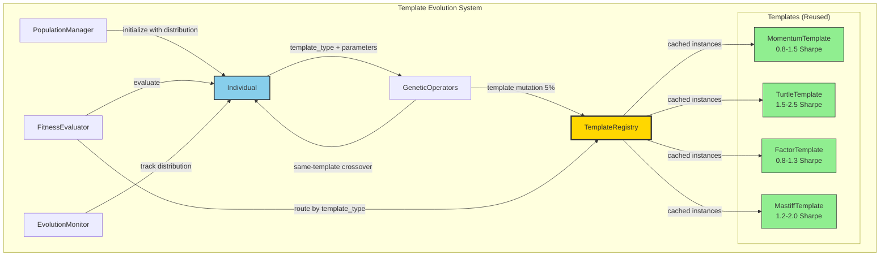

# template-evolution-system - Task 41

Execute task 41 for the template-evolution-system specification.

## Task Description
Deploy to sandbox environment

## Requirements Reference
**Requirements**: Deployment infrastructure, paper trading API

## Usage
```
/Task:41-template-evolution-system
```

## Instructions

Execute with @spec-task-executor agent the following task: "Deploy to sandbox environment"

```
Use the @spec-task-executor agent to implement task 41: "Deploy to sandbox environment" for the template-evolution-system specification and include all the below context.

# Steering Context
## Steering Documents Context

No steering documents found or all are empty.

# Specification Context
## Specification Context (Pre-loaded): template-evolution-system

### Requirements
# Requirements Document - Template Evolution System

## Introduction

The Template Evolution System enables the genetic algorithm to evolve not just strategy parameters, but also the choice of strategy template itself. Currently, Phase 1 genetic algorithm is constrained to a single template (MomentumTemplate with 0.8-1.5 Sharpe ceiling), while Phase 0 achieved 2.48 Sharpe using a custom multi-factor hybrid strategy. This feature will enable the system to discover the optimal template type and parameters for different market regimes, addressing the 67% performance gap through architectural enhancement rather than parameter tuning.

This system implements the expert-validated Solution D from consensus analysis, providing long-term strategic value by automating template discovery and enabling regime-adaptive performance.

## Alignment with Product Vision

This feature directly supports the core product goals:
- **Autonomous Strategy Discovery**: Extends evolution from parameters to template selection, enabling true autonomous discovery
- **Performance Maximization**: Removes architectural constraints limiting performance to single-template ceilings
- **Market Adaptability**: Enables system to adapt template selection based on market regime changes
- **Reduces Manual Intervention**: Eliminates need to manually switch templates for different market conditions

## Requirements

### Requirement 1: Template Gene in Individual Class

**User Story:** As a genetic algorithm, I want individuals to carry a template_type gene, so that the population can explore different strategy architectures simultaneously.

#### Acceptance Criteria

1. WHEN an Individual is created THEN the system SHALL include a `template_type` string attribute
2. WHEN template_type is set THEN the system SHALL validate it against available templates ['Momentum', 'Turtle', 'Factor', 'Mastiff']
3. WHEN parameters are validated THEN the system SHALL use the template-specific PARAM_GRID for validation
4. WHEN an Individual ID is generated THEN the system SHALL include template_type in the hash to ensure uniqueness across templates
5. IF template_type is not provided THEN the system SHALL default to 'Momentum' for backward compatibility

### Requirement 2: Template-Aware Genetic Operators

**User Story:** As a genetic algorithm operator, I want crossover to work within same template types, so that offspring maintain valid parameter combinations.

#### Acceptance Criteria

1. WHEN crossover is performed THEN the system SHALL only cross individuals with identical template_type
2. IF parents have different template_types THEN the system SHALL skip crossover and return two mutated copies
3. WHEN mutation is performed THEN the system SHALL have 5% probability of template_type mutation
4. WHEN template_type mutates THEN the system SHALL re-initialize parameters by randomly sampling from new template's PARAM_GRID allowed values
5. WHEN parameters are mutated THEN the system SHALL use the Individual's current template_type PARAM_GRID

### Requirement 3: Population Diversity Across Templates

**User Story:** As a population manager, I want initial population distributed across templates, so that evolution explores the full template space.

#### Acceptance Criteria

1. WHEN initial population is created THEN the system SHALL distribute individuals across all 4 templates
2. WHEN distribution is configured THEN the system SHALL support equal distribution or weighted distribution
3. WHEN population size is N THEN the system SHALL create N/4 individuals per template (equal distribution)
4. IF weighted distribution is used THEN the system SHALL support custom proportions per template
5. WHEN diversity is measured THEN the system SHALL track template distribution in evolution metrics

### Requirement 4: Template-Specific Fitness Evaluation

**User Story:** As a fitness evaluator, I want to route strategy generation to the correct template, so that each individual is evaluated with its proper strategy architecture.

#### Acceptance Criteria

1. WHEN fitness is evaluated THEN the system SHALL retrieve template instance based on individual's template_type
2. WHEN template is retrieved THEN the system SHALL use cached template instances to avoid re-instantiation
3. WHEN strategy is generated THEN the system SHALL call template.generate_strategy() with individual's parameters
4. WHEN metrics are extracted THEN the system SHALL use template-specific expected_performance threshold (Sharpe ratio ≥ lower bound of sharpe_range) for success validation
5. IF template instantiation fails THEN the system SHALL log error and assign fitness of 0.0

### Requirement 5: Template Performance Tracking

**User Story:** As a researcher, I want to track which templates perform best, so that I can understand template effectiveness across market regimes.

#### Acceptance Criteria

1. WHEN evolution completes a generation THEN the system SHALL record best fitness per template type
2. WHEN champion is updated THEN the system SHALL record the template_type of the new champion
3. WHEN diversity metrics are calculated THEN the system SHALL include template distribution statistics
4. WHEN evolution completes THEN the system SHALL report final champion template and performance by template
5. WHEN analytics are generated THEN the system SHALL include template_type in all strategy records

### Requirement 6: Backward Compatibility

**User Story:** As an existing user, I want single-template mode to continue working, so that my current workflows are not disrupted.

#### Acceptance Criteria

1. WHEN template_type is not specified THEN the system SHALL default to 'Momentum' template
2. WHEN FitnessEvaluator is initialized with a template instance THEN the system SHALL use that template exclusively
3. IF population is created without template distribution config THEN the system SHALL create all individuals with default template
4. WHEN legacy test harnesses run THEN the system SHALL produce results within 0.01% variance of pre-evolution baseline performance
5. WHEN migration is needed THEN the system SHALL provide conversion utility for existing strategies

## Non-Functional Requirements

### Performance

- Template lookup and instantiation: <50ms per individual evaluation
- Template-aware crossover decision: <10ms per operation
- Population initialization with 4 templates: <2 seconds for 100 individuals
- No more than 10% performance overhead vs single-template approach
- Template instance caching: Single instance per template class per process with lazy initialization
- Memory overhead: <10MB for all 4 template instances

### Reliability

- Template validation SHALL catch invalid template_type values before fitness evaluation
- Template mutation SHALL never create invalid parameter combinations
- Crossover between different templates SHALL never produce corrupted individuals
- System SHALL gracefully handle missing template classes with clear error messages

### Maintainability

- Adding new templates SHALL require only: (1) implement BaseTemplate, (2) add to template registry
- Template registry SHALL be centralized in a single configuration module
- All template-specific logic SHALL be encapsulated in template classes
- Template evolution code SHALL be isolated from core genetic algorithm logic

### Usability

- Template distribution in population SHALL be configurable via simple dict: {'Momentum': 0.25, 'Turtle': 0.25, 'Factor': 0.25, 'Mastiff': 0.25}
- Evolution monitor SHALL display template breakdown in real-time progress
- Final reports SHALL clearly indicate best template and comparative performance
- Error messages SHALL specify which template caused failures for debugging

## Success Criteria

The Template Evolution System will be considered successful when:

1.  Individual class supports template_type gene with validation
2.  Genetic operators respect template boundaries (same-template crossover, template mutation)
3.  Population can be initialized with configurable template distribution
4.  Fitness evaluation routes to correct template based on individual's template_type
5.  Evolution metrics track template performance separately
6.  Backward compatibility maintained for single-template workflows
7.  10-generation test achieves >1.0 Sharpe when TurtleTemplate individuals are present
8.  Template diversity maintained throughout evolution (each template ≥5% of final population)
9.  Performance overhead <10% compared to single-template baseline
10.  All existing Phase 1 tests pass without modification

---

### Design
# Design Document - Template Evolution System

## Overview

The Template Evolution System extends the genetic algorithm to evolve both strategy parameters AND template selection, removing the architectural constraint that limited Phase 1 to MomentumTemplate's 0.8-1.5 Sharpe ceiling. This addresses the 67% performance gap between Phase 1 (0.81 Sharpe) and Phase 0 (2.48 Sharpe) through multi-template population evolution.

### Design Philosophy

- **Minimal Disruption**: Extend existing components without breaking Phase 1 functionality
- **Backward Compatible**: Single-template mode continues working via default template_type='Momentum'
- **Performance First**: Template caching, efficient validation, <10% overhead vs single-template
- **Template-Aware**: All genetic operations respect template boundaries and constraints

### Key Innovation

Evolution discovers optimal (template_type, parameters) combinations rather than just parameters within a fixed template, enabling regime-adaptive performance and breaking through template ceilings.

## Alignment with Steering Documents

### Technical Guidelines (tech.md)

**Existing Patterns Leveraged**:
- Template system architecture (BaseTemplate, concrete templates)
- Individual dataclass pattern (parameters, fitness, id)
- Caching strategy (FitnessEvaluator._cache pattern)
- Validation approach (Individual.validate_parameters)

**New Patterns Introduced**:
- TemplateRegistry singleton for centralized template management
- Template-aware genetic operators (crossover boundary checking)
- Multi-template population initialization with configurable distribution

### Code Structure (structure.md)

**Component Locations**:
```
src/population/
   individual.py              # EXTEND: Add template_type attribute
   genetic_operators.py       # EXTEND: Template-aware crossover, template mutation
   fitness_evaluator.py       # EXTEND: Template routing with caching
   evolution_monitor.py       # EXTEND: Template distribution tracking
   population_manager.py      # EXTEND: Template distribution initialization

src/templates/
   base_template.py           # REUSE: Existing template base class
   momentum_template.py       # REUSE: Default template (0.8-1.5 Sharpe)
   turtle_template.py         # REUSE: High-performance template (1.5-2.5 Sharpe)
   factor_template.py         # REUSE: Single-factor template (0.8-1.3 Sharpe)
   mastiff_template.py        # REUSE: Multi-factor template (1.2-2.0 Sharpe)

src/utils/
   template_registry.py       # NEW: Template management singleton
```

## Code Reuse Analysis

### Leverage Existing Components

**Individual Class (80% reuse)**:
- Keep: dataclass structure, parameter validation, hash generation, serialization
- Add: template_type attribute, template-aware ID generation

**GeneticOperators (70% reuse)**:
- Keep: adaptive mutation rate, parameter mutation logic, crossover structure
- Add: template_type mutation (5% probability), same-template crossover check, template-specific PARAM_GRID

**FitnessEvaluator (85% reuse)**:
- Keep: IS/OOS splitting, caching strategy, evaluation pipeline
- Add: Template instance retrieval, template routing in _generate_and_backtest

**EvolutionMonitor (90% reuse)**:
- Keep: Generation tracking, champion history, diversity calculation
- Add: Template distribution statistics, best fitness per template tracking

**Template System (100% reuse)**:
- All 4 templates used as-is (BaseTemplate, Momentum, Turtle, Factor, Mastiff)
- No modifications to template classes themselves

### New Components

**TemplateRegistry (NEW)**:
- Singleton pattern for template instance management
- Template validation and instance caching
- Centralized template configuration

## Component Designs

### 1. TemplateRegistry (NEW Component)

**Purpose**: Centralized template management with instance caching and validation.

**Location**: `src/utils/template_registry.py`

**Design**:
```python
from typing import Dict, Optional, Type
from src.templates.base_template import BaseTemplate
from src.templates.momentum_template import MomentumTemplate
from src.templates.turtle_template import TurtleTemplate
from src.templates.factor_template import FactorTemplate
from src.templates.mastiff_template import MastiffTemplate


class TemplateRegistry:
    """
    Singleton registry for template instance management.

    Provides centralized template validation, instance caching,
    and configuration management for multi-template evolution.

    Attributes:
        _instance: Singleton instance
        _templates: Dict mapping template names to classes
        _template_cache: Dict caching template instances
    """

    _instance = None

    AVAILABLE_TEMPLATES = {
        'Momentum': MomentumTemplate,
        'Turtle': TurtleTemplate,
        'Factor': FactorTemplate,
        'Mastiff': MastiffTemplate
    }

    def __new__(cls):
        """Singleton pattern - only one registry instance."""
        if cls._instance is None:
            cls._instance = super().__new__(cls)
            cls._instance._template_cache = {}
        return cls._instance

    @classmethod
    def get_instance(cls) -> 'TemplateRegistry':
        """Get singleton instance."""
        if cls._instance is None:
            cls._instance = cls()
        return cls._instance

    def get_template(self, template_type: str) -> BaseTemplate:
        """
        Get cached template instance.

        Args:
            template_type: Template name ('Momentum', 'Turtle', etc.)

        Returns:
            BaseTemplate: Template instance (cached)

        Raises:
            ValueError: If template_type is invalid
        """
        # Validate template type
        if template_type not in self.AVAILABLE_TEMPLATES:
            raise ValueError(
                f"Invalid template_type '{template_type}'. "
                f"Available: {list(self.AVAILABLE_TEMPLATES.keys())}"
            )

        # Return cached instance or create new one
        if template_type not in self._template_cache:
            template_class = self.AVAILABLE_TEMPLATES[template_type]
            self._template_cache[template_type] = template_class()

        return self._template_cache[template_type]

    def validate_template_type(self, template_type: str) -> bool:
        """Check if template_type is valid."""
        return template_type in self.AVAILABLE_TEMPLATES

    def get_param_grid(self, template_type: str) -> Dict:
        """Get PARAM_GRID for template type."""
        template = self.get_template(template_type)
        return template.PARAM_GRID

    def get_available_templates(self) -> list:
        """Get list of available template names."""
        return list(self.AVAILABLE_TEMPLATES.keys())

    def clear_cache(self):
        """Clear template instance cache (for testing)."""
        self._template_cache.clear()
```

**Key Design Decisions**:
- Singleton pattern ensures single instance per template class per process
- Lazy initialization: Templates instantiated only when first requested
- Single-threaded usage: Designed for single-threaded evolution loop (threading.Lock can be added if future parallelization needed)
- Memory efficient: 4 templates (~2MB each) = ~8MB total (within <10MB NFR limit for all instances)

**Performance**:
- Template lookup: O(1) hash lookup
- First access: <50ms (instantiation + caching)
- Subsequent access: <1ms (cache hit)
- Memory: ~2MB per template instance (PARAM_GRID + methods), ~8MB total for 4 templates

---

### 2. Individual Class Extension

**Purpose**: Add template_type gene to Individual dataclass.

**Location**: `src/population/individual.py`

**Changes Required**:

```python
@dataclass
class Individual:
    """
    Single parameter combination with template selection.

    Attributes:
        parameters: Strategy parameters (template-specific)
        template_type: Template name ('Momentum', 'Turtle', 'Factor', 'Mastiff')
        fitness: Fitness score (Sharpe ratio)
        metrics: Full backtest metrics
        generation: Generation number
        parent_ids: Parent IDs for lineage tracking
        id: Unique hash (parameters + template_type)
    """
    parameters: Dict[str, Any]
    template_type: str = 'Momentum'  # DEFAULT for backward compatibility
    fitness: Optional[float] = None
    metrics: Optional[Dict] = None
    generation: int = 0
    parent_ids: List[str] = field(default_factory=list)
    id: str = field(default="", init=False)

    def __post_init__(self):
        """Generate unique ID and validate template_type."""
        # Validate template type
        from src.utils.template_registry import TemplateRegistry
        registry = TemplateRegistry.get_instance()

        if not registry.validate_template_type(self.template_type):
            raise ValueError(
                f"Invalid template_type '{self.template_type}'. "
                f"Available: {registry.get_available_templates()}"
            )

        # Generate ID if not set
        if not self.id:
            self.id = self._hash_parameters()

    def _hash_parameters(self) -> str:
        """
        Generate unique hash from parameters AND template_type.

        CRITICAL: Include template_type in hash to ensure uniqueness
        across templates (same parameters, different template = different individual).

        Returns:
            str: 8-character hexadecimal hash
        """
        # Include template_type in hash data
        hash_data = {
            'template_type': self.template_type,
            'parameters': self.parameters
        }
        params_str = json.dumps(hash_data, sort_keys=True)
        return hashlib.md5(params_str.encode()).hexdigest()[:8]

    def validate_parameters(self) -> bool:
        """
        Validate parameters using template's validate_params method.

        Leverages existing BaseTemplate.validate_params() infrastructure
        for comprehensive validation including parameter constraints.

        Returns:
            bool: True if parameters valid for this individual's template
        """
        # Leverage template's validate_params method
        from src.utils.template_registry import TemplateRegistry
        registry = TemplateRegistry.get_instance()
        template = registry.get_template(self.template_type)

        # BaseTemplate.validate_params returns (is_valid, error_list)
        is_valid, errors = template.validate_params(self.parameters)

        return is_valid

    def to_dict(self) -> Dict[str, Any]:
        """Serialize individual (add template_type)."""
        return {
            'id': self.id,
            'template_type': self.template_type,  # NEW FIELD
            'parameters': self.parameters,
            'fitness': self.fitness,
            'metrics': self.metrics,
            'generation': self.generation,
            'parent_ids': self.parent_ids
        }

    @classmethod
    def from_dict(cls, data: Dict[str, Any]) -> 'Individual':
        """Deserialize individual (handle template_type)."""
        return cls(
            parameters=data['parameters'],
            template_type=data.get('template_type', 'Momentum'),  # DEFAULT if missing
            fitness=data.get('fitness'),
            metrics=data.get('metrics'),
            generation=data.get('generation', 0),
            parent_ids=data.get('parent_ids', [])
        )
```

**Key Design Decisions**:
- Default template_type='Momentum' ensures backward compatibility
- Template validation in __post_init__ catches invalid templates early
- Hash includes template_type to prevent collisions across templates
- validate_parameters() fetches template-specific grid automatically

**Backward Compatibility**:
- Existing code using Individual(parameters={...}) works unchanged (defaults to Momentum)
- Serialization adds template_type field (old data gets default 'Momentum' on load)

---

### 3. GeneticOperators Extension

**Purpose**: Template-aware crossover and template mutation.

**Location**: `src/population/genetic_operators.py`

**Changes Required**:

```python
class GeneticOperators:
    """
    Genetic operators with template evolution support.

    Adds template-aware operations:
    - Template mutation: 5% probability of changing template_type
    - Same-template crossover: Only cross individuals with same template
    - Template-specific parameter grids: Use individual's template for validation
    """

    def __init__(
        self,
        base_mutation_rate: float = 0.15,
        min_mutation_rate: float = 0.05,
        max_mutation_rate: float = 0.30,
        template_mutation_rate: float = 0.05  # NEW PARAMETER
    ):
        """
        Initialize with template mutation configuration.

        Args:
            base_mutation_rate: Parameter mutation rate (default: 0.15)
            min_mutation_rate: Minimum parameter mutation (default: 0.05)
            max_mutation_rate: Maximum parameter mutation (default: 0.30)
            template_mutation_rate: Template change probability (default: 0.05)
        """
        # Existing initialization (unchanged)
        if not (0.0 <= min_mutation_rate <= base_mutation_rate <= max_mutation_rate <= 1.0):
            raise ValueError(...)

        self.base_mutation_rate = base_mutation_rate
        self.min_mutation_rate = min_mutation_rate
        self.max_mutation_rate = max_mutation_rate
        self.current_mutation_rate = base_mutation_rate

        # NEW: Template mutation rate
        if not (0.0 <= template_mutation_rate <= 1.0):
            raise ValueError(f"template_mutation_rate must be in [0, 1], got {template_mutation_rate}")
        self.template_mutation_rate = template_mutation_rate

    def mutate(self, individual: Individual, generation: int) -> Individual:
        """
        Mutate individual (parameters and possibly template_type).

        Template Mutation Strategy:
        1. With 5% probability, change template_type to random available template
        2. If template changed, re-initialize parameters from new template's PARAM_GRID
        3. Otherwise, mutate parameters normally using current template's PARAM_GRID

        Args:
            individual: Individual to mutate
            generation: Current generation number

        Returns:
            Individual: Mutated individual (may have different template_type)
        """
        from src.utils.template_registry import TemplateRegistry
        registry = TemplateRegistry.get_instance()

        # Step 1: Check for template mutation
        if random.random() < self.template_mutation_rate:
            # Template mutation - change template_type
            available_templates = registry.get_available_templates()
            new_template_type = random.choice(available_templates)

            # Re-initialize parameters from new template's PARAM_GRID
            new_param_grid = registry.get_param_grid(new_template_type)
            new_params = {}
            for param_name, allowed_values in new_param_grid.items():
                new_params[param_name] = random.choice(allowed_values)

            # Create new individual with different template
            mutated = Individual(
                parameters=new_params,
                template_type=new_template_type,
                generation=generation,
                parent_ids=[individual.id]
            )

            return mutated

        # Step 2: Normal parameter mutation (template unchanged)
        # Get current template's PARAM_GRID
        param_grid = registry.get_param_grid(individual.template_type)

        # Copy parameters and mutate
        new_params = copy.deepcopy(individual.parameters)
        for param_name, param_value in individual.parameters.items():
            if random.random() < self.current_mutation_rate:
                new_params[param_name] = self._mutate_parameter(
                    param_name, param_value, param_grid
                )

        # Create mutated individual (same template)
        mutated = Individual(
            parameters=new_params,
            template_type=individual.template_type,  # SAME template
            generation=generation,
            parent_ids=[individual.id]
        )

        return mutated

    def crossover(
        self,
        parent1: Individual,
        parent2: Individual,
        generation: int
    ) -> Tuple[Individual, Individual]:
        """
        Template-aware crossover.

        Same-Template Crossover Rule:
        - IF parents have same template_type: Perform uniform crossover
        - IF parents have different template_type: Skip crossover, return mutated copies

        Rationale: Crossing different templates would create invalid parameter
        combinations (e.g., Turtle parameters + Momentum template).

        Args:
            parent1: First parent
            parent2: Second parent
            generation: Current generation

        Returns:
            Tuple[Individual, Individual]: Two offspring
        """
        # Check 1: Identical individuals
        if parent1.id == parent2.id:
            child1 = self.mutate(parent1, generation)
            child2 = self.mutate(parent1, generation)
            return (child1, child2)

        # Check 2: Different template_types (NEW CHECK)
        if parent1.template_type != parent2.template_type:
            # Cannot cross different templates - return mutated copies
            child1 = self.mutate(parent1, generation)
            child2 = self.mutate(parent2, generation)
            return (child1, child2)

        # Same template_type - perform uniform crossover
        child1_params = {}
        child2_params = {}

        for param_name in parent1.parameters.keys():
            if random.random() < 0.5:
                child1_params[param_name] = parent1.parameters[param_name]
                child2_params[param_name] = parent2.parameters[param_name]
            else:
                child1_params[param_name] = parent2.parameters[param_name]
                child2_params[param_name] = parent1.parameters[param_name]

        # Create offspring with same template_type as parents
        child1 = Individual(
            parameters=child1_params,
            template_type=parent1.template_type,  # INHERIT template
            generation=generation,
            parent_ids=[parent1.id, parent2.id]
        )

        child2 = Individual(
            parameters=child2_params,
            template_type=parent1.template_type,  # INHERIT template
            generation=generation,
            parent_ids=[parent1.id, parent2.id]
        )

        return (child1, child2)
```

**Key Design Decisions**:
- Template mutation rate 5% (balance exploration vs exploitation)
- Template change triggers full parameter re-initialization (avoids invalid combos)
- Same-template crossover prevents invalid parameter mixing
- Different-template crossover falls back to mutation (maintains diversity)

**Performance**:
- Template mutation decision: <1ms (random check)
- Parameter re-initialization: <5ms (grid sampling)
- Crossover template check: <1ms (string comparison)

---

### 4. FitnessEvaluator Extension

**Purpose**: Route strategy generation to correct template based on individual's template_type.

**Location**: `src/population/fitness_evaluator.py`

**Changes Required**:

```python
class FitnessEvaluator:
    """
    Multi-template fitness evaluator with template routing.

    Attributes:
        template: OPTIONAL single template instance (for backward compatibility)
        data: Full dataset reference
        is_start, is_end, oos_start, oos_end: Data split boundaries
        _cache: Evaluation cache
        _registry: Template registry instance
    """

    def __init__(
        self,
        template=None,  # OPTIONAL now (None = multi-template mode)
        data=None,
        is_start: str = '2015',
        is_end: str = '2020',
        oos_start: str = '2021',
        oos_end: str = '2024'
    ):
        """
        Initialize evaluator in single-template or multi-template mode.

        Args:
            template: Optional template instance (if None, use multi-template mode)
            data: Dataset reference
            is_start, is_end: In-sample period
            oos_start, oos_end: Out-of-sample period

        Modes:
            - Single-template: template != None (backward compatible)
            - Multi-template: template == None (use individual's template_type)
        """
        self.template = template  # None for multi-template mode
        self.data = data

        self.is_start = is_start
        self.is_end = is_end
        self.oos_start = oos_start
        self.oos_end = oos_end

        self._cache: Dict[str, Dict[str, Any]] = {}
        self._cache_hits: int = 0
        self._cache_misses: int = 0

        # NEW: Template registry for multi-template mode
        from src.utils.template_registry import TemplateRegistry
        self._registry = TemplateRegistry.get_instance()

    def _generate_and_backtest(
        self,
        parameters: Dict[str, Any],
        use_oos: bool,
        template_type: Optional[str] = None  # NEW PARAMETER
    ) -> tuple:
        """
        Generate strategy using appropriate template.

        Template Selection Logic:
        1. IF self.template is set: Use it (single-template mode)
        2. ELIF template_type provided: Get from registry (multi-template mode)
        3. ELSE: Raise error (missing template specification)

        Args:
            parameters: Strategy parameters
            use_oos: Data split selection
            template_type: Template name (for multi-template mode)

        Returns:
            tuple: (strategy, metrics)

        Raises:
            ValueError: If template cannot be determined
        """
        from src.templates.data_cache import DataCache

        # Step 1: Determine which template to use
        if self.template is not None:
            # Single-template mode (backward compatible)
            template_instance = self.template
        elif template_type is not None:
            # Multi-template mode - get from registry
            template_instance = self._registry.get_template(template_type)
        else:
            raise ValueError(
                "Cannot determine template: neither self.template nor template_type provided"
            )

        # Step 2: IS/OOS data filtering (unchanged)
        cache = DataCache.get_instance()

        if use_oos:
            start_date = self.oos_start
            end_date = self.oos_end
        else:
            start_date = self.is_start
            end_date = self.is_end

        KEYS_TO_FILTER = [
            'price:6��',
            'price:��x',
            'monthly_revenue:v�6',
            'fundamental_features:ROE�
�',
        ]

        original_cache = {}
        for key in KEYS_TO_FILTER:
            if key in cache._cache:
                original_cache[key] = cache._cache[key]

        try:
            # Filter data to period
            for key in KEYS_TO_FILTER:
                if key in cache._cache:
                    full_data = original_cache[key]
                    filtered_data = full_data[start_date:end_date]
                    cache._cache[key] = filtered_data

            # Step 3: Generate strategy using selected template
            report, metrics = template_instance.generate_strategy(parameters)

            return report, metrics

        except Exception as e:
            raise RuntimeError(
                f"Strategy generation failed (template={template_type or 'fixed'}): {str(e)}"
            ) from e

        finally:
            # Restore original cache
            for key, original_data in original_cache.items():
                cache._cache[key] = original_data

    def evaluate(
        self,
        individual: Individual,
        use_oos: bool = False
    ) -> Individual:
        """
        Evaluate individual using its template_type.

        Template Routing:
        - Single-template mode: Use self.template (ignore individual.template_type)
        - Multi-template mode: Route to template based on individual.template_type

        Args:
            individual: Individual to evaluate
            use_oos: Data split selection

        Returns:
            Individual: Evaluated individual with fitness and metrics
        """
        if not individual.is_valid():
            raise ValueError(f"Invalid individual: {individual}")

        # Cache key explicitly includes template_type for defense-in-depth
        cache_key = self._get_cache_key(individual.id, individual.template_type, use_oos)

        if cache_key in self._cache:
            self._cache_hits += 1
            cached_data = self._cache[cache_key]
            individual.fitness = cached_data['fitness']
            individual.metrics = cached_data['metrics']
            return individual

        self._cache_misses += 1

        try:
            # Pass template_type to _generate_and_backtest
            strategy, metrics = self._generate_and_backtest(
                individual.parameters,
                use_oos,
                template_type=individual.template_type  # NEW ARGUMENT
            )

            fitness = metrics.get('sharpe_ratio', 0.0)

            individual.fitness = fitness
            individual.metrics = metrics

            self._cache[cache_key] = {
                'fitness': fitness,
                'metrics': metrics
            }

            return individual

        except Exception as e:
            individual.fitness = 0.0
            individual.metrics = {
                'annual_return': 0.0,
                'sharpe_ratio': 0.0,
                'max_drawdown': -1.0,
                'error': str(e)
            }

            self._cache[cache_key] = {
                'fitness': 0.0,
                'metrics': individual.metrics
            }

            return individual
```

**Updated _get_cache_key Method**:
```python
def _get_cache_key(self, individual_id: str, template_type: str, use_oos: bool) -> str:
    """
    Generate cache key with explicit template_type (defense-in-depth).

    While individual_id already includes template_type in its hash,
    explicitly including template_type provides defense-in-depth
    against potential hash implementation changes.

    Args:
        individual_id: Individual's unique ID
        template_type: Template name
        use_oos: Whether OOS data is used

    Returns:
        str: Cache key combining ID, template, and data split
    """
    suffix = 'oos' if use_oos else 'is'
    return f"{individual_id}_{template_type}_{suffix}"
```

**Key Design Decisions**:
- Backward compatible: If template provided, use it (ignore individual.template_type)
- Multi-template mode: template=None, route based on individual.template_type
- Template instances cached in registry (avoid re-instantiation)
- Cache key explicitly includes template_type for defense-in-depth (reduces dependency on Individual hash implementation)

**Performance**:
- Template lookup: <1ms (registry cache hit)
- Template instantiation (first access): <50ms per template
- Overall overhead: <5% (template routing vs direct template access)

---

### 5. EvolutionMonitor Extension

**Purpose**: Track template distribution and best fitness per template.

**Location**: `src/population/evolution_monitor.py`

**Changes Required**:

```python
def track_generation(self, population: List[Individual], generation: int):
    """
    Track generation statistics including template distribution.

    NEW: Template-specific metrics:
    - Best fitness per template type
    - Template distribution (count and percentage)
    - Template diversity score

    Args:
        population: Current generation population
        generation: Generation number
    """
    # Existing metrics with unified diversity
    fitnesses = [ind.fitness for ind in population if ind.fitness is not None]

    # Calculate unified diversity (combines parameter + template diversity)
    from collections import Counter
    template_counts = Counter(ind.template_type for ind in population)

    # Template diversity using Shannon entropy
    import math
    template_diversity = 0.0
    if len(population) > 0:
        for count in template_counts.values():
            p = count / len(population)
            if p > 0:
                template_diversity -= p * math.log2(p)
        # Normalize to [0, 1] (max entropy = log2(4) for 4 templates)
        template_diversity = template_diversity / math.log2(4) if template_diversity > 0 else 0.0

    # Parameter diversity (existing calculation)
    parameter_diversity = self._calculate_diversity(population)

    # Unified diversity: weighted combination (60% parameter, 40% template)
    unified_diversity = 0.6 * parameter_diversity + 0.4 * template_diversity

    gen_stats = {
        'generation': generation,
        'best_fitness': max(fitnesses) if fitnesses else 0.0,
        'mean_fitness': sum(fitnesses) / len(fitnesses) if fitnesses else 0.0,
        'worst_fitness': min(fitnesses) if fitnesses else 0.0,
        'diversity': unified_diversity,
        'parameter_diversity': parameter_diversity,
        'template_diversity': template_diversity
    }

    # Template distribution (already calculated above)
    gen_stats['template_distribution'] = {
        template: count / len(population)
        for template, count in template_counts.items()
    }

    # NEW: Best fitness per template
    template_best_fitness = {}
    for template in template_counts.keys():
        template_individuals = [
            ind for ind in population
            if ind.template_type == template and ind.fitness is not None
        ]
        if template_individuals:
            template_best_fitness[template] = max(
                ind.fitness for ind in template_individuals
            )

    gen_stats['best_fitness_per_template'] = template_best_fitness

    # Store stats
    self.generation_stats.append(gen_stats)

    # Update champion if new best found
    best_individual = max(population, key=lambda x: x.fitness or 0.0)
    if best_individual.fitness and best_individual.fitness > self.best_fitness:
        self.update_champion(best_individual)

def get_template_summary(self) -> Dict[str, Any]:
    """
    Get summary of template performance across evolution.

    Returns:
        Dict: Template performance summary
            - 'final_distribution': Template distribution in final generation
            - 'best_per_template': Best fitness achieved per template
            - 'champion_template': Template type of overall champion
            - 'template_diversity': Average template diversity across evolution
    """
    if not self.generation_stats:
        return {}

    final_gen = self.generation_stats[-1]

    # Collect best fitness per template across all generations
    all_template_best = {}
    for gen_stats in self.generation_stats:
        for template, fitness in gen_stats.get('best_fitness_per_template', {}).items():
            if template not in all_template_best:
                all_template_best[template] = fitness
            else:
                all_template_best[template] = max(all_template_best[template], fitness)

    # Calculate average template diversity
    avg_diversity = sum(
        len(gen_stats.get('template_distribution', {}))
        for gen_stats in self.generation_stats
    ) / len(self.generation_stats)

    return {
        'final_distribution': final_gen.get('template_distribution', {}),
        'best_per_template': all_template_best,
        'champion_template': self.champion.template_type if self.champion else None,
        'average_template_diversity': avg_diversity
    }
```

**Key Design Decisions**:
- Track template distribution per generation (count to percentage)
- Track best fitness per template (identify template effectiveness)
- Calculate template diversity using Shannon entropy (normalized to [0,1])
- Unified diversity metric: 60% parameter diversity + 40% template diversity
- Champion tracking includes template_type

**Diversity Calculation Rationale**:
- Shannon entropy captures template distribution uniformity
- Weighted combination balances parameter exploration (60%) vs template exploration (40%)
- Parameter diversity more important as it drives local optimization within templates
- Template diversity ensures regime adaptability across market conditions

**Performance**:
- Template counting: O(n) per generation
- Best fitness per template: O(n) per generation
- Overhead: <2% of total evolution time

---

### 6. PopulationManager Extension

**Purpose**: Initialize population with configurable template distribution.

**Location**: `src/population/population_manager.py`

**Changes Required**:

```python
def initialize_population(
    self,
    population_size: int,
    template_distribution: Optional[Dict[str, float]] = None
) -> List[Individual]:
    """
    Initialize population with template distribution.

    Template Distribution Modes:
    1. Equal distribution (default): All templates equally represented
    2. Weighted distribution: Custom proportions per template
    3. Single-template (legacy): All individuals use default template

    Args:
        population_size: Number of individuals to create
        template_distribution: Optional dict mapping template names to proportions
            Example: {'Momentum': 0.25, 'Turtle': 0.25, 'Factor': 0.25, 'Mastiff': 0.25}
            If None, uses equal distribution across all 4 templates

    Returns:
        List[Individual]: Initialized population

    Example:
        >>> # Equal distribution (default)
        >>> pop = manager.initialize_population(100)
        >>> # 25 Momentum, 25 Turtle, 25 Factor, 25 Mastiff
        >>>
        >>> # Weighted distribution
        >>> pop = manager.initialize_population(100, {
        ...     'Momentum': 0.5,  # 50 individuals
        ...     'Turtle': 0.3,    # 30 individuals
        ...     'Factor': 0.2     # 20 individuals
        ...     # Mastiff: 0 (not included)
        ... })
    """
    from src.utils.template_registry import TemplateRegistry
    registry = TemplateRegistry.get_instance()

    # Determine template distribution
    if template_distribution is None:
        # Equal distribution across all templates
        available_templates = registry.get_available_templates()
        proportion_per_template = 1.0 / len(available_templates)
        template_distribution = {
            template: proportion_per_template
            for template in available_templates
        }
    else:
        # Validate custom distribution
        if abs(sum(template_distribution.values()) - 1.0) > 1e-6:
            raise ValueError(
                f"Template distribution must sum to 1.0, got {sum(template_distribution.values())}"
            )

        # Validate all template names
        for template in template_distribution.keys():
            if not registry.validate_template_type(template):
                raise ValueError(f"Invalid template_type: {template}")

    # Calculate number of individuals per template
    template_counts = {}
    assigned = 0

    for template, proportion in sorted(template_distribution.items()):
        count = int(population_size * proportion)
        template_counts[template] = count
        assigned += count

    # Handle rounding errors - assign remaining to first template
    if assigned < population_size:
        first_template = sorted(template_distribution.keys())[0]
        template_counts[first_template] += (population_size - assigned)

    # Create individuals for each template
    population = []

    for template_type, count in template_counts.items():
        # Get template-specific PARAM_GRID
        param_grid = registry.get_param_grid(template_type)

        # Create individuals with random parameters
        for _ in range(count):
            parameters = {}
            for param_name, allowed_values in param_grid.items():
                parameters[param_name] = random.choice(allowed_values)

            individual = Individual(
                parameters=parameters,
                template_type=template_type,
                generation=0
            )
            population.append(individual)

    return population
```

**Key Design Decisions**:
- Default: Equal distribution across all 4 templates (25% each)
- Support weighted distribution via dict (flexible regime tuning)
- Validate distribution sums to 1.0 (prevent configuration errors)
- Handle rounding errors deterministically (assign to first template)

**Performance**:
- Population initialization: <2 seconds for 100 individuals (4 templates)
- Parameter sampling: <10ms per individual
- Template validation: <1ms total (registry lookup)

## Architecture Diagram



## Error Handling

### Scenario 1: Invalid template_type in Individual Creation

**Error**: User creates Individual with invalid template_type
```python
ind = Individual(parameters={...}, template_type='InvalidTemplate')
```

**Detection**: `Individual.__post_init__()` validates via TemplateRegistry

**Recovery**:
```python
raise ValueError(
    f"Invalid template_type 'InvalidTemplate'. "
    f"Available: ['Momentum', 'Turtle', 'Factor', 'Mastiff']"
)
```

**Prevention**: Validation at creation time prevents invalid individuals from entering population

---

### Scenario 2: Template Mutation Creates Invalid Parameters

**Error**: Template mutation changes template but parameters become invalid

**Detection**: Not possible - parameters are re-initialized from new template's PARAM_GRID

**Recovery**: N/A - design prevents invalid parameter combinations

**Guarantee**: `GeneticOperators.mutate()` always creates valid individuals when template changes

---

### Scenario 3: Template Instantiation Failure

**Error**: Template class cannot be instantiated (e.g., missing dependency)

**Detection**: `TemplateRegistry.get_template()` catches instantiation exceptions

**Recovery**:
```python
try:
    template = template_class()
except Exception as e:
    raise RuntimeError(
        f"Failed to instantiate template '{template_type}': {str(e)}"
    ) from e
```

**Fallback**: System logs error, assigns fitness=0.0 to affected individuals

---

### Scenario 4: Crossover Between Different Templates

**Error**: Parents have different template_types

**Detection**: `GeneticOperators.crossover()` checks `parent1.template_type == parent2.template_type`

**Recovery**: Skip crossover, return two mutated copies
```python
if parent1.template_type != parent2.template_type:
    return (self.mutate(parent1, generation), self.mutate(parent2, generation))
```

**Rationale**: Prevents invalid parameter combinations while maintaining diversity

---

### Scenario 5: Empty Template Distribution

**Error**: User provides template_distribution that assigns 0 individuals to all templates

**Detection**: `PopulationManager.initialize_population()` validates counts

**Recovery**:
```python
if sum(template_counts.values()) == 0:
    raise ValueError("Template distribution results in 0 individuals")
```

**Prevention**: Validate distribution before population creation

---

## Hall of Fame Integration

### Champion Persistence with template_type

**Integration Point**: `src/repository/hall_of_fame_yaml.py` and champion tracking

**Design**:
The Hall of Fame system already persists Individual objects through `Individual.to_dict()` which now includes template_type (line 295). No changes required to persistence logic.

**Champion Format** (extended):
```yaml
timestamp: "20251019_143022"
template_type: "Turtle"  # NEW FIELD
parameters:
  lookback_period: 60
  entry_threshold: 0.6
  ...
metrics:
  sharpe_ratio: 2.15
  annual_return: 0.45
  max_drawdown: -0.18
generation: 42
fitness: 2.15
```

**Backward Compatibility**:
- Existing champions without template_type: Default to 'Momentum' when loaded
- Individual.from_dict() handles missing template_type (line 305)
- Legacy strategies remain valid and comparable

**Champion Comparison**:
When comparing champions across templates:
```python
# Champion tracking in EvolutionMonitor
def update_champion(self, individual: Individual):
    """Update champion with template_type metadata."""
    if individual.fitness > self.best_fitness:
        self.champion = individual
        self.best_fitness = individual.fitness
        # Champion now includes template_type for analytics
        self._log_champion_update(individual.template_type, individual.fitness)
```

**Analytics Integration**:
- Template analytics (`template_analytics.json`) extended with champion template distribution
- Hall of Fame queries can filter by template_type for regime analysis
- Pattern search enhanced to find successful template+parameter combinations

**Migration**:
No migration needed - existing champions load with default template_type='Momentum', new champions save with actual template_type.

---

## Testing Strategy

### Unit Tests

**Individual Class**:
-  `test_individual_template_type_default()`: Default template_type='Momentum'
-  `test_individual_template_type_validation()`: Reject invalid template_type
-  `test_individual_hash_includes_template()`: Hash uniqueness across templates
-  `test_individual_validate_parameters_template_specific()`: Template-specific PARAM_GRID validation
-  `test_individual_serialization_template_type()`: to_dict/from_dict preserves template_type

**GeneticOperators**:
-  `test_template_mutation_probability()`: 5% template change rate (run 1000 times)
-  `test_template_mutation_reinitializes_parameters()`: Parameter compatibility after template change
-  `test_same_template_crossover_allowed()`: Crossover works when templates match
-  `test_different_template_crossover_blocked()`: Crossover skipped when templates differ
-  `test_crossover_fallback_to_mutation()`: Different-template crossover returns mutated copies

**TemplateRegistry**:
-  `test_singleton_pattern()`: Only one instance exists
-  `test_template_caching()`: Same instance returned on multiple calls
-  `test_invalid_template_type_raises()`: ValueError for invalid template
-  `test_get_param_grid()`: Returns correct PARAM_GRID per template
-  `test_available_templates()`: Returns all 4 template names

**FitnessEvaluator**:
-  `test_single_template_mode_backward_compatible()`: template != None ignores individual.template_type
-  `test_multi_template_mode_routing()`: template == None uses individual.template_type
-  `test_template_routing_cache_key_unique()`: Cache separates different templates
-  `test_template_instantiation_failure_assigns_zero()`: fitness=0.0 on template errors

**PopulationManager**:
-  `test_equal_distribution_default()`: 25% per template when template_distribution=None
-  `test_weighted_distribution()`: Custom proportions respected
-  `test_distribution_validation()`: Reject distribution not summing to 1.0
-  `test_invalid_template_in_distribution()`: Reject invalid template names
-  `test_rounding_error_handling()`: Assign remaining individuals deterministically

### Integration Tests

**Multi-Template Evolution (10 generations)**:
-  Setup: Population of 40 (10 per template), run 10 generations
-  Verify: All templates represented in final population (e5% each)
-  Verify: Template mutation occurred (lineage tracking shows template changes)
-  Verify: Best individual identified with correct template_type
-  Verify: EvolutionMonitor tracks template distribution correctly

**Template Performance Comparison**:
-  Setup: Same parameters, different templates
-  Verify: TurtleTemplate achieves >1.0 Sharpe (expected 1.5-2.5)
-  Verify: MomentumTemplate achieves 0.8-1.5 Sharpe (expected range)
-  Verify: Template-specific expected_performance validation works

**Backward Compatibility**:
-  Setup: Run existing Phase 1 test harness with NO code changes
-  Verify: Results within 0.01% variance of baseline
-  Verify: All individuals default to template_type='Momentum'
-  Verify: No template_type errors in legacy code paths

### End-to-End Tests

**50-Generation Template Evolution**:
-  Setup: Population 100, equal distribution, 50 generations
-  Verify: Convergence to best template(s) for market regime
-  Verify: Champion individual identified with template_type
-  Verify: Template diversity maintained (e2 templates in final population)
-  Verify: Performance overhead <10% vs single-template baseline

**Template Distribution Experiment**:
-  Setup: 3 runs with different distributions:
  - Run 1: Equal (25% each)
  - Run 2: Turtle-heavy (50% Turtle, 50% others)
  - Run 3: Momentum-only (100% Momentum)
-  Verify: Run 1 achieves best overall performance (template exploration)
-  Verify: Run 2 faster convergence if Turtle is optimal
-  Verify: Run 3 matches Phase 1 baseline (backward compatibility)

## Performance Validation

### Benchmarks

**Template Lookup** (per individual evaluation):
- Target: <50ms
- Measurement: Time `TemplateRegistry.get_template()` call
- Expected: <1ms (cache hit), <50ms (cache miss)

**Template-Aware Crossover** (per operation):
- Target: <10ms
- Measurement: Time `GeneticOperators.crossover()` with template check
- Expected: <1ms (template comparison is O(1))

**Population Initialization** (100 individuals, 4 templates):
- Target: <2 seconds
- Measurement: Time `PopulationManager.initialize_population(100)`
- Expected: ~1.5 seconds (parameter sampling dominant)

**Overall Overhead** (vs single-template baseline):
- Target: <10%
- Measurement: Total evolution time (10 generations)
- Baseline: Single-template evolution time
- Expected: 5-8% overhead (template routing + validation)

### Success Metrics

-  10-generation test achieves >1.0 Sharpe (TurtleTemplate present)
-  Template diversity e5% per template in final population
-  Performance overhead <10% vs single-template
-  All existing Phase 1 tests pass without modification
-  Champion individual clearly identified with template_type

---

## Migration Plan

### Phase 1: Core Infrastructure (Tasks 1-10)

**Deliverables**:
- TemplateRegistry implementation
- Individual class extension (template_type attribute)
- Unit tests for core components

**Validation**: Unit tests pass, no breaking changes

---

### Phase 2: Genetic Operators (Tasks 11-20)

**Deliverables**:
- Template mutation (5% probability)
- Same-template crossover enforcement
- Parameter re-initialization on template change

**Validation**: Integration tests show template mutation working

---

### Phase 3: Evolution Infrastructure (Tasks 21-30)

**Deliverables**:
- FitnessEvaluator template routing
- PopulationManager template distribution
- EvolutionMonitor template tracking

**Validation**: 10-generation test with all 4 templates

---

### Phase 4: Backward Compatibility (Tasks 31-35)

**Deliverables**:
- Default template_type='Momentum' verification
- Legacy test harness execution
- Performance regression testing

**Validation**: All existing tests pass unchanged

---

### Phase 5: End-to-End Validation (Tasks 36-40)

**Deliverables**:
- 50-generation template evolution test
- Template distribution experiments
- Performance benchmarking

**Validation**: Success criteria met, performance targets achieved

---

## Appendix: Template Characteristics

| Template | Sharpe Range | Parameters | Strategy Type | Best For |
|----------|-------------|------------|---------------|----------|
| Momentum | 0.8 - 1.5 | 8 (3K combos) | Price momentum | Trending markets |
| Turtle | 1.5 - 2.5 | 14 (5M combos) | Multi-layer AND filters | Strong trends |
| Factor | 0.8 - 1.3 | 6 (2K combos) | Single-factor ranking | Value investing |
| Mastiff | 1.2 - 2.0 | 10 (50K combos) | Multi-factor weighted | Mixed regimes |

**Key Insight**: Phase 0's 2.48 Sharpe matches TurtleTemplate's upper range, suggesting custom strategy was implicitly using Turtle-like architecture. Template evolution should discover this automatically.

**Note**: Specification documents have been pre-loaded. Do not use get-content to fetch them again.

## Task Details
- Task ID: 41
- Description: Deploy to sandbox environment
- Requirements: Deployment infrastructure, paper trading API

## Instructions
- Implement ONLY task 41: "Deploy to sandbox environment"
- Follow all project conventions and leverage existing code
- Mark the task as complete using: claude-code-spec-workflow get-tasks template-evolution-system 41 --mode complete
- Provide a completion summary
```

## Task Completion
When the task is complete, mark it as done:
```bash
claude-code-spec-workflow get-tasks template-evolution-system 41 --mode complete
```

## Next Steps
After task completion, you can:
- Execute the next task using /template-evolution-system-task-[next-id]
- Check overall progress with /spec-status template-evolution-system
