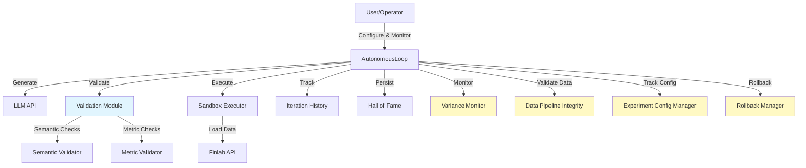
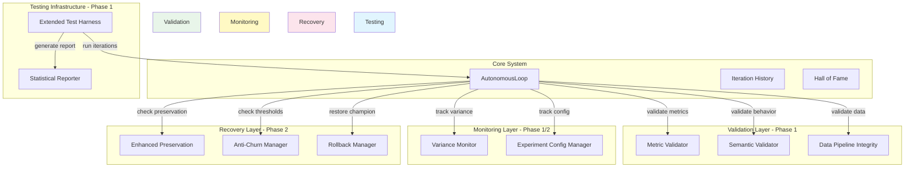

# Design: Learning System Stability Fixes

## Overview

This design implements comprehensive stability enhancements for the autonomous learning loop system, addressing critical issues identified in the 5-iteration Zen Challenge test:
- High performance variance (197% Sharpe swings)
- Preservation system false positives (62% degradation despite validation passing)
- Insufficient statistical validation (n=5 vs required n=50-200)
- Anomalous metric calculations (negative return + positive Sharpe)

The design prioritizes statistical validity and reproducibility over execution speed, with phased implementation focusing on Foundation (metrics, validation, testing infrastructure) before Tuning (learning convergence, preservation, anti-churn).

## Steering Document Alignment

### Technical Standards (tech.md)
- **Python Best Practices**: Type hints for all new classes, comprehensive docstrings, dataclass usage
- **Testing Standards**: Unit tests for metric calculations (Story 6), integration tests for 50-iteration harness (Story 3)
- **Code Quality**: Static validation integration (existing), semantic validators add behavioral checks
- **Performance**: Non-blocking variance monitoring (Story 1), <500ms preservation validation (Story 2)

### Project Structure (structure.md)
- **Module Organization**: New components under `src/validation/`, `src/metrics/`, `src/monitoring/`
- **Configuration**: Externalized anti-churn config to `config/learning_system.yaml`
- **Data Management**: Data pipeline integrity components in `src/data/`
- **Testing Infrastructure**: Extended test harness in `tests/integration/`

## Code Reuse Analysis

### Existing Components to Leverage

- **AutonomousLoop** (autonomous_loop.py lines 77-711): Core orchestration engine
  - **Leverage**: `run_iteration()` workflow (lines 104-344), champion management (lines 398-486)
  - **Extend**: Add variance monitoring hooks (Story 1), enhanced preservation validation (Story 2)

- **IterationHistory** (history.py): Iteration persistence and feedback generation
  - **Leverage**: `add_record()`, `get_record()`, `generate_feedback_summary()`
  - **Extend**: Add configuration snapshots (Story 8), data provenance tracking (Story 7)

- **ChampionStrategy** (autonomous_loop.py lines 32-74): Champion representation
  - **Leverage**: Dataclass structure, serialization methods
  - **Extend**: Add rollback metadata (Story 9), enhanced validation context (Story 2)

- **HallOfFameRepository** (src/repository/hall_of_fame.py): Strategy persistence
  - **Leverage**: `add_strategy()`, `get_current_champion()`, tier classification
  - **Extend**: Champion history tracking for rollback (Story 9)

- **Performance Attributor** (performance_attributor.py): Metric extraction and comparison
  - **Leverage**: `extract_strategy_params()`, `compare_strategies()`
  - **Extend**: Add metric validation (Story 6), behavioral similarity checks (Story 2)

- **Sandbox Executor** (sandbox_simple.py): Safe strategy execution
  - **Leverage**: `execute_strategy_safe()` with timeout and error handling
  - **Extend**: Add behavioral validation hooks (Story 5)

### Integration Points

- **Finlab Data API**: Real Taiwan stock market data
  - **Integration**: Data checksum validation before each iteration (Story 7)
  - **Dependency**: `finlab >= 1.5.3`, maintain compatibility with existing `data.get()` API

- **LLM Generation**: OpenRouter/Google Gemini API
  - **Integration**: Configuration tracking for model, temperature, prompts (Story 8)
  - **Dependency**: Existing `generate_strategy()` function, no changes required

- **File System**: Iteration persistence, champion storage
  - **Integration**: Rollback mechanism using file-based champion history (Story 9)
  - **Dependency**: Existing JSON serialization patterns

## Architecture

### System Context Diagram



### Component Architecture



## Component Interfaces (P0 - Implementation Contracts)

This section defines the core interfaces and protocols that all components must implement. These contracts ensure consistent integration with `AutonomousLoop` and other system components.

### Validation Hook Protocol

```python
from typing import Protocol, Dict, Any, Tuple, List, Optional
from dataclasses import dataclass

@dataclass
class ValidationReport:
    """Standard validation report returned by all validators."""
    passed: bool
    component: str  # Component name (e.g., "MetricValidator", "SemanticValidator")
    checks_performed: List[str]  # List of check names executed
    failures: List[Tuple[str, str]]  # [(check_name, reason)]
    warnings: List[Tuple[str, str]]  # [(check_name, message)]
    metadata: Dict[str, Any]  # Additional context (scores, thresholds, etc.)
    timestamp: str

class ValidationHook(Protocol):
    """Protocol for validation hooks integrated into AutonomousLoop."""

    def validate(
        self,
        code: str,
        execution_result: Optional[Any] = None,
        context: Optional[Dict[str, Any]] = None
    ) -> ValidationReport:
        """
        Execute validation check.

        Args:
            code: Generated strategy code
            execution_result: Optional execution result (FinlabReport) for runtime checks
            context: Optional context (champion, metrics, etc.)

        Returns:
            ValidationReport with detailed results

        Raises:
            ValidationSystemError: On infrastructure failure (not validation failure)
        """
        ...

class ValidationSystemError(Exception):
    """Raised when validation infrastructure fails (not validation logic)."""
    pass
```

### Monitoring Hook Protocol

```python
@dataclass
class MonitoringAlert:
    """Alert from monitoring components."""
    severity: str  # "info", "warning", "critical"
    component: str
    message: str
    context: Dict[str, Any]
    timestamp: str

class MonitoringHook(Protocol):
    """Protocol for non-blocking monitoring hooks."""

    def update(
        self,
        iteration_num: int,
        metrics: Dict[str, float],
        champion: Optional[Any] = None
    ) -> Optional[MonitoringAlert]:
        """
        Update monitoring state (non-blocking).

        Returns:
            Optional alert if threshold exceeded
        """
        ...
```

### Integration with AutonomousLoop

```python
# In AutonomousLoop.__init__()
self.validation_hooks: List[ValidationHook] = [
    MetricValidator(),
    SemanticValidator(),
    PreservationValidator()  # Only active during preservation mode
]

self.monitoring_hooks: List[MonitoringHook] = [
    VarianceMonitor(),
    DataPipelineIntegrity()
]

# In AutonomousLoop.run_iteration() - Validation Phase
def _run_validations(self, code: str, execution_result: Any) -> Tuple[bool, List[ValidationReport]]:
    """Run all validation hooks, collect reports."""
    reports = []
    for hook in self.validation_hooks:
        try:
            report = hook.validate(code, execution_result, context={...})
            reports.append(report)
            if not report.passed:
                logger.warning(f"{hook.__class__.__name__} failed: {report.failures}")
        except ValidationSystemError as e:
            # System error -> safe state, reject candidate
            logger.error(f"Validation system error: {e}")
            return False, reports

    all_passed = all(r.passed for r in reports)
    return all_passed, reports

# In AutonomousLoop.run_iteration() - Monitoring Phase
def _run_monitoring(self, iteration_num: int, metrics: Dict[str, float]) -> None:
    """Run all monitoring hooks (non-blocking, best effort)."""
    for hook in self.monitoring_hooks:
        try:
            alert = hook.update(iteration_num, metrics, self.champion)
            if alert and alert.severity == "critical":
                logger.critical(f"Monitoring alert: {alert.message}")
        except Exception as e:
            # Non-critical failure, log and continue
            logger.error(f"Monitoring hook {hook.__class__.__name__} failed: {e}")
```

## Components and Interfaces

### Phase 1: Foundation Components

#### 1. Metric Validator (Story 6)
**File**: `src/validation/metric_validator.py`

**Purpose**: Validate metric calculations for mathematical consistency and detect impossible combinations

**Interfaces**:
```python
class MetricValidator:
    def validate_metrics(
        self,
        metrics: Dict[str, float],
        report: FinlabReport
    ) -> Tuple[bool, List[str]]:
        """Validate metrics for mathematical consistency.

        Args:
            metrics: Extracted metrics dict (sharpe, return, volatility, etc.)
            report: Raw Finlab backtest report for audit trail

        Returns:
            (is_valid, error_messages)
        """

    def cross_validate_sharpe(
        self,
        total_return: float,
        volatility: float,
        sharpe: float,
        periods_per_year: int = 252
    ) -> Tuple[bool, str]:
        """Cross-validate Sharpe ratio calculation.

        Industry standard: Sharpe = (annualized_return - risk_free_rate) / annualized_volatility

        Returns:
            (is_valid, error_message_if_invalid)
        """

    def check_impossible_combinations(
        self,
        metrics: Dict[str, float]
    ) -> List[str]:
        """Detect mathematically impossible metric combinations.

        Examples:
        - Negative total return + high positive Sharpe
        - Zero volatility + non-zero Sharpe
        - Max drawdown > 100%

        Returns:
            List of detected anomalies
        """

    def generate_audit_trail(
        self,
        report: FinlabReport
    ) -> Dict[str, Any]:
        """Generate detailed calculation audit trail.

        Returns:
            Dict with intermediate values for debugging
        """
```

**Dependencies**:
- `src.constants.METRIC_SHARPE, METRIC_RETURN, METRIC_VOLATILITY`
- `numpy` for statistical calculations

**Reuses**:
- Existing metric extraction from `metrics_extractor.py`
- Validation pattern from `ast_validator.py`

**Integration**:
- Called in `AutonomousLoop.run_iteration()` after `execute_strategy_safe()` (line 260)
- Replaces trust in raw Finlab metrics with validated metrics

#### 2. Semantic Validator (Story 5)
**File**: `src/validation/semantic_validator.py`

**Purpose**: Validate strategy behavior and logic beyond AST syntax checks

**Interfaces**:
```python
class SemanticValidator:
    def validate_strategy(
        self,
        code: str,
        execution_result: Optional[FinlabReport] = None
    ) -> Tuple[bool, List[str]]:
        """Validate strategy semantics and behavior.

        Args:
            code: Generated strategy code
            execution_result: Optional execution result for runtime checks

        Returns:
            (is_valid, error_messages)
        """

    def check_position_concentration(
        self,
        position_df: pd.DataFrame
    ) -> Tuple[bool, str]:
        """Check for excessive position concentration.

        Rule: Max 20% per stock to ensure diversification
        """

    def check_portfolio_turnover(
        self,
        position_df: pd.DataFrame,
        rebalance_freq: str
    ) -> Tuple[bool, str]:
        """Check for excessive portfolio turnover.

        Rule: Annual turnover <500% to avoid excessive trading costs
        """

    def check_portfolio_size(
        self,
        position_df: pd.DataFrame
    ) -> Tuple[bool, str]:
        """Check portfolio has reasonable size.

        Rule: 5-50 stocks for effective diversification
        """

    def check_always_empty_or_full(
        self,
        position_df: pd.DataFrame
    ) -> Tuple[bool, str]:
        """Detect always-empty or always-full portfolios.

        Flags strategies that never trade or never exit
        """
```

**Dependencies**:
- `pandas` for position DataFrame analysis
- `ast_validator` for code structure analysis

**Reuses**:
- AST validation from `ast_validator.py` (existing syntax checks)
- Position extraction from `sandbox_simple.py`

**Integration**:
- Called in `AutonomousLoop.run_iteration()` at line 243 after AST validation
- Adds behavioral checks before execution

#### 3. Extended Test Harness (Story 3)
**File**: `tests/integration/extended_test_harness.py`

**Purpose**: Support 50-200 iteration test runs with comprehensive statistical analysis

**Interfaces**:
```python
class ExtendedTestHarness:
    def __init__(
        self,
        model: str,
        target_iterations: int = 50,
        checkpoint_interval: int = 10,
        checkpoint_dir: str = "checkpoints/"
    ):
        """Initialize extended test harness.

        Args:
            model: LLM model for generation
            target_iterations: Number of iterations to run (50-200)
            checkpoint_interval: Save checkpoint every N iterations
            checkpoint_dir: Directory for checkpoint files
        """

    def run_test(
        self,
        data: Any,
        resume_from_checkpoint: Optional[str] = None
    ) -> Dict[str, Any]:
        """Run extended test with checkpointing.

        Returns:
            Comprehensive test results with statistics
        """

    def save_checkpoint(self, iteration: int) -> str:
        """Save checkpoint for resume capability.

        Returns:
            Checkpoint file path
        """

    def generate_statistical_report(self) -> Dict[str, Any]:
        """Generate comprehensive statistical analysis.

        Returns:
            Dict with:
            - convergence_analysis: Variance over time, learning curve
            - effect_size: Cohen's d for improvement significance
            - confidence_intervals: 95% CI for mean Sharpe
            - significance_tests: p-value for learning effect
            - production_readiness: Go/no-go decision with reasoning
        """
```

**Dependencies**:
- `AutonomousLoop` for iteration execution
- `scipy.stats` for statistical tests
- `numpy` for numerical analysis

**Reuses**:
- `run_5iteration_test.py` as template (lines 70-232)
- `AutonomousLoop.run_iteration()` for execution

**Integration**:
- Standalone test script invoked manually or by CI/CD
- Generates reports consumed by human reviewers

#### 4. Data Pipeline Integrity (Story 7)
**File**: `src/data/pipeline_integrity.py`

**Purpose**: Ensure data consistency and reproducibility across iterations

**Interfaces**:
```python
class DataPipelineIntegrity:
    def compute_dataset_checksum(
        self,
        data: FinlabData
    ) -> str:
        """Compute SHA-256 checksum of dataset.

        Checksums key datasets used in strategies:
        - price:收盤價, price:成交金額
        - fundamental_features:ROE稅後
        - monthly_revenue:去年同月增減(%)

        Returns:
            Hex digest of combined dataset hash
        """

    def validate_data_consistency(
        self,
        data: FinlabData,
        expected_checksum: str
    ) -> Tuple[bool, str]:
        """Validate data matches expected checksum.

        Returns:
            (is_valid, error_message_if_invalid)
        """

    def record_data_provenance(
        self,
        iteration_num: int
    ) -> Dict[str, Any]:
        """Record complete data provenance for iteration.

        Returns:
            Dict with:
            - dataset_checksum
            - finlab_version
            - data_pull_timestamp
            - dataset_row_counts
        """
```

**Dependencies**:
- `hashlib` for SHA-256 checksums
- `finlab` for version detection

**Reuses**:
- None (new component)

**Integration**:
- Called in `AutonomousLoop.run_iteration()` before execution (line 260)
- Checksum stored in `IterationHistory` metadata

#### 5. Experiment Configuration Manager (Story 8)
**File**: `src/config/experiment_config_manager.py`

**Purpose**: Track all hyperparameters and settings for reproducibility

**Interfaces**:
```python
@dataclass
class ExperimentConfig:
    """Complete configuration snapshot."""
    model: str
    temperature: float
    prompt_template: str
    prompt_version: str
    anti_churn_threshold: float
    probation_period: int
    liquidity_threshold: float
    stop_loss: float
    rebalance_frequency: str
    python_version: str
    package_versions: Dict[str, str]
    api_endpoints: Dict[str, str]
    timestamp: str

class ExperimentConfigManager:
    def capture_config_snapshot(
        self,
        iteration_num: int
    ) -> ExperimentConfig:
        """Capture complete config snapshot for iteration."""

    def compute_config_diff(
        self,
        prev_config: ExperimentConfig,
        curr_config: ExperimentConfig
    ) -> Dict[str, Tuple[Any, Any]]:
        """Compute configuration changes between iterations.

        Returns:
            Dict of {param_name: (old_value, new_value)}
        """

    def export_config(
        self,
        config: ExperimentConfig,
        filepath: str
    ) -> None:
        """Export config for reproducibility."""

    def import_config(
        self,
        filepath: str
    ) -> ExperimentConfig:
        """Import config for reproduction."""
```

**Dependencies**:
- `sys`, `pkg_resources` for version detection
- `dataclasses` for config representation

**Reuses**:
- None (new component)

**Integration**:
- Called in `AutonomousLoop.run_iteration()` before generation (line 126)
- Config stored in `IterationHistory` alongside iteration record

### Phase 2: Tuning Components

#### 6. Variance Monitor (Story 1)
**File**: `src/monitoring/variance_monitor.py`

**Purpose**: Track performance variance and detect instability

**Interfaces**:
```python
class VarianceMonitor:
    def __init__(self, alert_threshold: float = 0.8):
        """Initialize variance monitor.

        Args:
            alert_threshold: σ threshold for alerts (default 0.8)
        """

    def update(
        self,
        iteration_num: int,
        sharpe: float
    ) -> None:
        """Update variance tracking with new iteration."""

    def get_rolling_variance(
        self,
        window: int = 10
    ) -> float:
        """Get rolling standard deviation of Sharpe ratios.

        Args:
            window: Rolling window size

        Returns:
            Standard deviation (σ) of Sharpe over window
        """

    def check_alert_condition(self) -> Tuple[bool, str]:
        """Check if variance exceeds alert threshold.

        Returns:
            (alert_triggered, context_message)
        """

    def generate_convergence_report(self) -> Dict[str, Any]:
        """Generate convergence analysis report.

        Returns:
            Dict with variance trends, convergence status, recommendations
        """
```

**Dependencies**:
- `numpy` for rolling statistics
- `collections.deque` for efficient rolling window

**Reuses**:
- Iteration metrics from `IterationHistory`

**Integration**:
- Called in `AutonomousLoop.run_iteration()` after champion update (line 320)
- Non-blocking monitoring with <100ms overhead

#### 7. Enhanced Preservation Validator (Story 2)
**File**: `src/validation/preservation_validator.py`

**Purpose**: Validate champion preservation with behavioral similarity

**Interfaces**:
```python
class PreservationValidator:
    def validate_preservation(
        self,
        generated_code: str,
        champion: ChampionStrategy,
        execution_metrics: Optional[Dict[str, float]] = None
    ) -> Tuple[bool, Dict[str, Any]]:
        """Enhanced preservation validation with behavioral checks.

        Args:
            generated_code: LLM-generated code to validate
            champion: Current champion strategy
            execution_metrics: Optional runtime metrics for behavioral validation

        Returns:
            (is_preserved, validation_report)

        Validation report includes:
        - parameter_preservation: Critical params maintained
        - behavioral_similarity: Performance within ±10%, turnover within ±20%
        - position_patterns: Concentration patterns maintained
        - false_positive_indicators: Flags potential false positives
        """

    def check_behavioral_similarity(
        self,
        champion_metrics: Dict[str, float],
        generated_metrics: Dict[str, float],
        champion_positions: pd.DataFrame,
        generated_positions: pd.DataFrame
    ) -> Tuple[bool, Dict[str, str]]:
        """Check behavioral similarity beyond just metrics.

        Checks:
        - Sharpe within ±10%
        - Portfolio turnover within ±20%
        - Position concentration patterns maintained

        Returns:
            (is_similar, deviation_details)
        """
```

**Dependencies**:
- `performance_attributor` for parameter extraction
- `pandas` for position analysis

**Reuses**:
- Existing `_validate_preservation()` in autonomous_loop.py (lines 561-631)

**Integration**:
- Replaces existing preservation validation at line 158 in autonomous_loop.py
- Adds behavioral checks beyond parameter matching

#### 8. Anti-Churn Configuration (Story 4)
**File**: `config/learning_system.yaml`, `src/config/anti_churn_manager.py`

**Purpose**: Externalized configuration for anti-churn thresholds with tuning support

**Configuration File** (`config/learning_system.yaml`):
```yaml
anti_churn:
  probation_period: 2  # Iterations within champion update
  probation_threshold: 0.10  # 10% improvement required during probation
  post_probation_threshold: 0.05  # 5% improvement after probation
  min_sharpe_for_champion: 0.5  # Minimum Sharpe to become champion

  # Tuning recommendations
  target_update_frequency: 0.15  # 10-20% of iterations
  tuning_range:
    probation_period: [1, 3]
    probation_threshold: [0.05, 0.15]
    post_probation_threshold: [0.03, 0.10]
```

**Manager Interface**:
```python
class AntiChurnManager:
    def __init__(self, config_file: str = "config/learning_system.yaml"):
        """Load anti-churn configuration."""

    def get_required_improvement(
        self,
        iteration_num: int,
        champion_iteration: int
    ) -> float:
        """Get required improvement threshold for current iteration."""

    def track_champion_update(
        self,
        iteration_num: int,
        updated: bool
    ) -> None:
        """Track champion update for frequency analysis."""

    def analyze_update_frequency(
        self,
        window: int = 50
    ) -> Dict[str, Any]:
        """Analyze champion update frequency.

        Returns:
            Dict with:
            - update_frequency: Percentage of iterations that update champion
            - within_target: Boolean if within 10-20% target
            - recommendations: Tuning suggestions if outside target
        """
```

**Dependencies**:
- `pyyaml` for config parsing
- Existing champion update logic

**Reuses**:
- Anti-churn logic from autonomous_loop.py lines 434-437

**Integration**:
- Replace hardcoded thresholds in `_update_champion()` (line 434)
- Load config in `AutonomousLoop.__init__()`

#### 9. Rollback Manager (Story 9)
**File**: `src/recovery/rollback_manager.py`

**Purpose**: Enable restoration of previous champion states

**Interfaces**:
```python
class RollbackManager:
    def __init__(self, hall_of_fame: HallOfFameRepository):
        """Initialize with Hall of Fame for champion history."""

    def get_champion_history(
        self,
        limit: int = 10
    ) -> List[ChampionStrategy]:
        """Get recent champion history.

        Args:
            limit: Number of historical champions to return

        Returns:
            List of ChampionStrategy sorted by timestamp (newest first)
        """

    def rollback_to_iteration(
        self,
        target_iteration: int,
        reason: str
    ) -> Tuple[bool, str]:
        """Rollback to specific iteration's champion.

        Args:
            target_iteration: Iteration number to rollback to
            reason: Human-readable reason for rollback

        Returns:
            (success, message)
        """

    def validate_rollback_champion(
        self,
        champion: ChampionStrategy,
        data: FinlabData
    ) -> Tuple[bool, Dict[str, Any]]:
        """Validate rolled-back champion still executes successfully.

        Returns:
            (is_valid, validation_report)
        """

    def record_rollback(
        self,
        from_iteration: int,
        to_iteration: int,
        reason: str,
        operator: str
    ) -> None:
        """Log rollback operation for audit trail."""
```

**Dependencies**:
- `HallOfFameRepository` for champion history
- `execute_strategy_safe` for validation

**Reuses**:
- Champion persistence from Hall of Fame
- Sandbox execution for validation

**Integration**:
- Callable from command-line tool or manual script
- Modifies `AutonomousLoop.champion` to restore previous state

## Data Models (P0 - Complete Schema Definitions)

All data models with complete field specifications and type annotations. These schemas are the contracts for all component interactions.

### Core Validation Models

#### ValidationReport
```python
from dataclasses import dataclass, field
from typing import Dict, Any, List, Tuple, Optional
from datetime import datetime

@dataclass
class ValidationReport:
    """Standard validation report returned by all validators."""
    passed: bool
    component: str  # Component name (e.g., "MetricValidator")
    checks_performed: List[str]  # List of check names executed
    failures: List[Tuple[str, str]]  # [(check_name, reason)]
    warnings: List[Tuple[str, str]] = field(default_factory=list)
    metadata: Dict[str, Any] = field(default_factory=dict)
    timestamp: str = field(default_factory=lambda: datetime.now().isoformat())

    def to_dict(self) -> Dict[str, Any]:
        """Serialize to dict for storage."""
        return {
            'passed': self.passed,
            'component': self.component,
            'checks_performed': self.checks_performed,
            'failures': self.failures,
            'warnings': self.warnings,
            'metadata': self.metadata,
            'timestamp': self.timestamp
        }
```

#### MonitoringAlert
```python
@dataclass
class MonitoringAlert:
    """Alert from monitoring components."""
    severity: str  # "info", "warning", "critical"
    component: str
    message: str
    context: Dict[str, Any] = field(default_factory=dict)
    timestamp: str = field(default_factory=lambda: datetime.now().isoformat())

    def is_critical(self) -> bool:
        return self.severity == "critical"
```

### Enhanced IterationRecord (Story 7, 8)
```python
@dataclass
class DataProvenance:
    """Data provenance metadata for reproducibility."""
    dataset_checksum: str  # SHA-256 of combined datasets
    finlab_version: str  # e.g., "1.5.3"
    data_pull_timestamp: str  # ISO format
    dataset_row_counts: Dict[str, int]  # {dataset_name: row_count}
    dataset_date_ranges: Dict[str, Tuple[str, str]]  # {dataset_name: (start, end)}

@dataclass
class ExperimentConfig:
    """Complete configuration snapshot for experiment reproducibility."""
    # LLM configuration
    model: str
    temperature: float
    prompt_template: str
    prompt_version: str

    # Learning system configuration
    anti_churn_threshold: float
    probation_period: int

    # Strategy parameters
    liquidity_threshold: float
    stop_loss: float
    rebalance_frequency: str

    # Environment
    python_version: str
    package_versions: Dict[str, str]  # {package_name: version}
    api_endpoints: Dict[str, str]  # {service: endpoint_url}

    # Metadata
    timestamp: str = field(default_factory=lambda: datetime.now().isoformat())

    def to_dict(self) -> Dict[str, Any]:
        """Serialize for storage."""
        return {
            'model': self.model,
            'temperature': self.temperature,
            'prompt_template': self.prompt_template,
            'prompt_version': self.prompt_version,
            'anti_churn_threshold': self.anti_churn_threshold,
            'probation_period': self.probation_period,
            'liquidity_threshold': self.liquidity_threshold,
            'stop_loss': self.stop_loss,
            'rebalance_frequency': self.rebalance_frequency,
            'python_version': self.python_version,
            'package_versions': self.package_versions,
            'api_endpoints': self.api_endpoints,
            'timestamp': self.timestamp
        }

@dataclass
class IterationRecord:
    """Complete iteration record with all enhancements."""
    # Existing fields (from history.py)
    iteration_num: int
    model: str
    code: str
    validation_passed: bool
    validation_errors: List[str]
    execution_success: bool
    execution_error: Optional[str]
    metrics: Optional[Dict[str, float]]
    feedback: str
    timestamp: str

    # NEW: Data provenance (Story 7)
    data_provenance: Optional[DataProvenance] = None

    # NEW: Configuration snapshot (Story 8)
    config_snapshot: Optional[ExperimentConfig] = None
    config_diff: Optional[Dict[str, Tuple[Any, Any]]] = None  # {param: (old, new)}

    # NEW: Validation details (Story 5, 6)
    validation_reports: List[ValidationReport] = field(default_factory=list)

    # NEW: Monitoring alerts
    monitoring_alerts: List[MonitoringAlert] = field(default_factory=list)

    def to_dict(self) -> Dict[str, Any]:
        """Serialize to dict for JSON storage."""
        return {
            'iteration_num': self.iteration_num,
            'model': self.model,
            'code': self.code,
            'validation_passed': self.validation_passed,
            'validation_errors': self.validation_errors,
            'execution_success': self.execution_success,
            'execution_error': self.execution_error,
            'metrics': self.metrics,
            'feedback': self.feedback,
            'timestamp': self.timestamp,
            'data_provenance': self.data_provenance.__dict__ if self.data_provenance else None,
            'config_snapshot': self.config_snapshot.to_dict() if self.config_snapshot else None,
            'config_diff': self.config_diff,
            'validation_reports': [r.to_dict() for r in self.validation_reports],
            'monitoring_alerts': [a.__dict__ for a in self.monitoring_alerts]
        }
```

### PreservationReport (Story 2)
```python
@dataclass
class BehavioralCheck:
    """Single behavioral similarity check result."""
    check_name: str  # "sharpe_similarity", "turnover_similarity", etc.
    passed: bool
    champion_value: float
    generated_value: float
    threshold: float
    deviation_pct: float
    reason: str

@dataclass
class PreservationReport:
    """Detailed preservation validation report."""
    is_preserved: bool

    # Parameter preservation
    parameter_checks: Dict[str, Tuple[bool, str]]  # {param: (passed, reason)}
    critical_params_preserved: List[str]
    missing_params: List[str]

    # Behavioral similarity
    behavioral_checks: List[BehavioralCheck]
    behavioral_similarity_score: float  # 0.0-1.0

    # False positive detection
    false_positive_risk: float  # 0.0-1.0 risk score
    false_positive_indicators: List[str]

    # Recommendations
    recommendations: List[str]  # Actionable guidance
    requires_manual_review: bool

    timestamp: str = field(default_factory=lambda: datetime.now().isoformat())

    def summary(self) -> str:
        """Human-readable summary."""
        status = "✅ PRESERVED" if self.is_preserved else "❌ NOT PRESERVED"
        param_status = f"{len([p for p, (passed, _) in self.parameter_checks.items() if passed])}/{len(self.parameter_checks)} params"
        behavioral_status = f"similarity {self.behavioral_similarity_score:.2%}"
        return f"{status} | {param_status} | {behavioral_status}"
```

### ConvergenceAnalysis (Story 1)
```python
@dataclass
class ConvergenceAnalysis:
    """Variance and convergence statistics over time."""
    # Variance tracking
    sharpe_history: List[Tuple[int, float]]  # [(iteration, sharpe)]
    rolling_variance: List[Tuple[int, float]]  # [(iteration, σ)]
    current_variance: float
    variance_threshold: float  # Alert threshold (default 0.8)

    # Convergence detection
    convergence_detected: bool
    convergence_iteration: Optional[int]  # When σ < 0.5 first achieved
    iterations_since_convergence: Optional[int]

    # Learning curve
    learning_trend: str  # "improving", "stable", "degrading", "volatile"
    trend_confidence: float  # 0.0-1.0

    # Alerts
    alert_triggered: bool
    alert_message: Optional[str]
    alert_severity: str  # "info", "warning", "critical"

    timestamp: str = field(default_factory=lambda: datetime.now().isoformat())

    def is_converged(self) -> bool:
        """Check if learning has converged."""
        return self.convergence_detected and self.current_variance < 0.5
```

### RollbackRecord (Story 9)
```python
@dataclass
class RollbackValidationReport:
    """Validation report for rolled-back champion."""
    execution_success: bool
    metrics: Optional[Dict[str, float]]
    validation_errors: List[str]
    warnings: List[str]
    timestamp: str

@dataclass
class RollbackRecord:
    """Complete rollback operation audit trail."""
    rollback_id: str  # UUID
    from_iteration: int
    to_iteration: int

    # Rollback context
    reason: str
    reason_code: str  # "PERFORMANCE_DEGRADATION", "VALIDATION_FAILURE", "MANUAL", etc.
    operator: str  # "system" or operator name

    # Champion details
    from_champion: Dict[str, Any]  # Previous champion snapshot
    to_champion: Dict[str, Any]  # Restored champion snapshot

    # Validation
    validation_passed: bool
    validation_report: Optional[RollbackValidationReport]

    # Outcome
    success: bool
    error_message: Optional[str]

    timestamp: str = field(default_factory=lambda: datetime.now().isoformat())

    def to_dict(self) -> Dict[str, Any]:
        """Serialize for audit log."""
        return {
            'rollback_id': self.rollback_id,
            'from_iteration': self.from_iteration,
            'to_iteration': self.to_iteration,
            'reason': self.reason,
            'reason_code': self.reason_code,
            'operator': self.operator,
            'from_champion': self.from_champion,
            'to_champion': self.to_champion,
            'validation_passed': self.validation_passed,
            'validation_report': self.validation_report.__dict__ if self.validation_report else None,
            'success': self.success,
            'error_message': self.error_message,
            'timestamp': self.timestamp
        }
```

### Statistical Analysis Models (Story 3)

```python
@dataclass
class EffectSizeAnalysis:
    """Cohen's d effect size calculation."""
    cohens_d: float
    interpretation: str  # "negligible", "small", "medium", "large"
    confidence_interval: Tuple[float, float]  # 95% CI

@dataclass
class SignificanceTest:
    """Statistical significance test results."""
    test_name: str  # "t-test", "mann-whitney", etc.
    p_value: float
    significance_level: float  # Typically 0.05
    is_significant: bool
    interpretation: str

@dataclass
class ProductionReadinessReport:
    """Complete statistical analysis for production readiness."""
    # Sample characteristics
    sample_size: int
    iterations_analyzed: List[int]

    # Central tendency
    mean_sharpe: float
    median_sharpe: float
    std_dev: float

    # Convergence
    convergence_analysis: ConvergenceAnalysis

    # Statistical tests
    effect_size: EffectSizeAnalysis
    significance_test: SignificanceTest
    confidence_interval: Tuple[float, float]  # 95% CI for mean

    # Production decision
    production_ready: bool
    decision_confidence: float  # 0.0-1.0
    blockers: List[str]  # Issues preventing production deployment
    recommendations: List[str]  # Next steps

    timestamp: str = field(default_factory=lambda: datetime.now().isoformat())

    def decision_summary(self) -> str:
        """One-line production readiness decision."""
        status = "✅ READY" if self.production_ready else "⛔ NOT READY"
        return f"{status} | n={self.sample_size} | Sharpe={self.mean_sharpe:.3f} | p={self.significance_test.p_value:.3f} | d={self.effect_size.cohens_d:.2f}"
```

## Error Handling

### Failure Mode Matrix (P0 - System Behavior Definition)

This matrix defines the exact system behavior for each component failure type. Critical for ensuring stability and preventing undefined states.

| Component | Failure Type | Scenario | Behavior | Champion Impact | Iteration Status | Alert Level |
|-----------|-------------|----------|----------|----------------|------------------|-------------|
| **MetricValidator** | Logical | Impossible metric combination detected | Reject candidate, log detailed error, add to feedback | Keep current | Failed | Warning |
| **MetricValidator** | System | Exception during validation (e.g., missing metrics) | Enter safe state, reject candidate, raise alert | Keep current | Failed | Critical |
| **MetricValidator** | Non-critical | Audit trail generation fails | Log error, continue with validation | No impact | Continue | Info |
| **SemanticValidator** | Logical | Excessive concentration/turnover detected | Reject candidate, add specific guidance to feedback | Keep current | Failed | Warning |
| **SemanticValidator** | System | Exception during position analysis | Enter safe state, reject candidate | Keep current | Failed | Critical |
| **SemanticValidator** | Non-critical | Warning threshold exceeded (not fatal) | Accept candidate, log warning | No impact | Success | Info |
| **PreservationValidator** | Logical | Behavioral divergence detected | Reject candidate, detailed report in feedback | Keep current | Failed | Warning |
| **PreservationValidator** | System | Exception during similarity check | Enter safe state, reject candidate | Keep current | Failed | Critical |
| **PreservationValidator** | Non-critical | False positive indicators detected | Accept with caution flag, manual review suggested | Accept candidate | Success | Warning |
| **DataPipelineIntegrity** | Logical | Data checksum mismatch | Halt iteration immediately, require manual refresh | Keep current | Blocked | Critical |
| **DataPipelineIntegrity** | System | Finlab API timeout (after retries) | Mark iteration as failed, log API error | Keep current | Failed | Critical |
| **DataPipelineIntegrity** | Non-critical | Provenance recording fails | Log error, continue execution | No impact | Continue | Warning |
| **VarianceMonitor** | Logical | Variance exceeds alert threshold | Log alert, continue execution (monitoring only) | No impact | Continue | Warning |
| **VarianceMonitor** | System | Exception during variance calculation | Log error, continue execution | No impact | Continue | Info |
| **VarianceMonitor** | Non-critical | N/A (all failures non-critical) | - | - | - | - |
| **ExperimentConfigManager** | Logical | N/A (no logical failures) | - | - | - | - |
| **ExperimentConfigManager** | System | Config snapshot write fails | Log error, continue execution, flag for review | No impact | Continue | Warning |
| **ExperimentConfigManager** | Non-critical | Config diff calculation fails | Log error, skip diff, continue | No impact | Continue | Info |
| **AntiChurnManager** | Logical | N/A (provides thresholds only) | - | - | - | - |
| **AntiChurnManager** | System | Config file load fails | Use hardcoded defaults, log critical error | No impact | Continue | Critical |
| **AntiChurnManager** | Non-critical | Update frequency analysis fails | Log error, skip analysis | No impact | Continue | Info |
| **RollbackManager** | Logical | Target champion no longer executes | Abort rollback, suggest alternatives | Keep current | Rollback Failed | Warning |
| **RollbackManager** | System | Champion history unavailable | Return error, explain requirement | No action | Rollback Blocked | Info |
| **RollbackManager** | Non-critical | Rollback logging fails | Complete rollback, log error separately | Rollback succeeds | Rollback Success | Warning |

### Error Handling Strategies

#### Safe State Protocol
When a critical system error occurs:
1. **Reject Candidate**: Do not promote candidate to champion
2. **Preserve Current Champion**: Keep existing champion unchanged
3. **Log Full Context**: Capture complete error state for debugging
4. **Raise Alert**: Critical-level alert to operator
5. **Optional Pause**: For repeated failures, suggest pausing loop

#### Retry Strategies
- **Finlab API**: 3 retries with exponential backoff (1s, 2s, 4s)
- **LLM API**: Existing retry logic unchanged (3 attempts)
- **File I/O**: 2 retries with 0.5s delay
- **Validation Hooks**: No retry (fail fast)

#### Graceful Degradation
- **Monitoring Failures**: Continue core loop, lose observability
- **Config Tracking Failures**: Continue execution, lose reproducibility
- **Non-critical Validators**: Log and continue, may accept lower-quality strategies

### Story 6: Metric Validation Errors

**Scenario 1: Impossible Metric Combination**
- **Example**: Negative total return (-15.8%) + positive Sharpe (0.8968)
- **Detection**: `MetricValidator.check_impossible_combinations()` flags inconsistency
- **Handling**:
  1. Log detailed error with audit trail
  2. Mark iteration as failed with `execution_error = "Metric validation failed: impossible combination"`
  3. Add to feedback: "Previous iteration had suspicious metrics - ensure return/volatility calculation is correct"
- **User Impact**: Iteration marked failed, feedback includes corrective guidance

**Scenario 2: Sharpe Ratio Miscalculation**
- **Example**: `cross_validate_sharpe()` detects calculated Sharpe doesn't match (return/volatility) formula
- **Detection**: Tolerance check: `abs(calculated - expected) > 0.1 * expected`
- **Handling**:
  1. Log warning with intermediate values
  2. Use recalculated Sharpe for champion comparison
  3. Report to user in validation summary
- **User Impact**: Transparent recalculation, iteration proceeds with corrected metric

### Story 5: Semantic Validation Errors

**Scenario 1: Excessive Position Concentration**
- **Example**: Single stock >20% of portfolio
- **Detection**: `check_position_concentration()` during execution
- **Handling**:
  1. Flag as semantic validation failure
  2. Add to validation_errors with stock ticker and concentration percentage
  3. Include in feedback: "Reduce concentration in [STOCK] from 35% to <20%"
- **User Impact**: Iteration marked failed, specific guidance provided

**Scenario 2: Always-Empty Portfolio**
- **Example**: `position.is_largest(10)` always returns empty DataFrame
- **Detection**: `check_always_empty_or_full()` detects zero positions across all dates
- **Handling**:
  1. Flag as semantic validation failure
  2. Add detailed error: "Portfolio always empty - check filter logic and factor calculations"
  3. Suggest debugging steps in feedback
- **User Impact**: Iteration marked failed, root cause analysis provided

### Story 3: Extended Test Harness Errors

**Scenario 1: Test Interrupted (e.g., system crash)**
- **Detection**: Checkpoint file exists but incomplete
- **Handling**:
  1. Offer resume option: `run_test(resume_from_checkpoint="checkpoint_iter_40.json")`
  2. Restore state from checkpoint: iteration history, champion, metrics
  3. Continue from interrupted iteration
- **User Impact**: No data loss, seamless resume

**Scenario 2: Statistical Significance Not Achieved**
- **Example**: After 50 iterations, p-value > 0.05 or Cohen's d < 0.4
- **Detection**: `generate_statistical_report()` analyzes results
- **Handling**:
  1. Report production readiness: "NOT READY - insufficient statistical evidence"
  2. Provide detailed reasoning: "p=0.12 (need p<0.05), d=0.3 (need d≥0.4)"
  3. Recommend: "Run 50 more iterations to increase statistical power"
- **User Impact**: Clear go/no-go decision with actionable next steps

### Story 7: Data Pipeline Errors

**Scenario 1: Data Corruption Detected**
- **Detection**: Checksum mismatch in `validate_data_consistency()`
- **Handling**:
  1. Halt iteration immediately before execution
  2. Log critical error with expected vs actual checksum
  3. Require manual data refresh before continuing
- **User Impact**: Prevents execution with corrupted data, requires user intervention

**Scenario 2: Finlab API Timeout**
- **Detection**: Exception during `data.get()` call
- **Handling**:
  1. Retry up to 3 times with exponential backoff
  2. If all retries fail, mark iteration as failed
  3. Log API error for debugging
- **User Impact**: Transparent retry, iteration fails only after exhausting retries

### Story 9: Rollback Errors

**Scenario 1: Target Champion No Longer Executes**
- **Detection**: `validate_rollback_champion()` execution fails
- **Handling**:
  1. Abort rollback operation
  2. Report validation failure: "Champion from iteration 45 no longer executes due to [ERROR]"
  3. Suggest alternative champions from history
- **User Impact**: Rollback prevented, alternatives suggested

**Scenario 2: No Champion History Available**
- **Detection**: `get_champion_history()` returns empty list
- **Handling**:
  1. Return error: "No champion history available for rollback"
  2. Explain: "First champion must be established before rollback is possible"
- **User Impact**: Clear explanation, no action available

## Testing Strategy

### Unit Testing (All Components)

**Story 6: Metric Validator Tests**
```python
# tests/validation/test_metric_validator.py
def test_sharpe_cross_validation_correct():
    """Verify correct Sharpe calculation passes validation."""

def test_sharpe_cross_validation_incorrect():
    """Verify incorrect Sharpe is detected."""

def test_impossible_combination_negative_return_positive_sharpe():
    """Detect negative return + high positive Sharpe."""

def test_impossible_combination_zero_volatility():
    """Detect zero volatility + non-zero Sharpe."""

def test_audit_trail_generation():
    """Verify audit trail captures intermediate values."""
```

**Story 5: Semantic Validator Tests**
```python
# tests/validation/test_semantic_validator.py
def test_position_concentration_pass():
    """Verify diversified portfolio passes."""

def test_position_concentration_fail():
    """Detect excessive concentration."""

def test_always_empty_portfolio():
    """Detect portfolio with zero positions."""

def test_portfolio_turnover_excessive():
    """Detect >500% annual turnover."""
```

**Story 7: Data Pipeline Integrity Tests**
```python
# tests/data/test_pipeline_integrity.py
def test_checksum_computation_deterministic():
    """Verify same data produces same checksum."""

def test_checksum_validation_mismatch():
    """Detect data corruption via checksum."""

def test_provenance_recording():
    """Verify provenance captures all required metadata."""
```

### Integration Testing

**Story 3: Extended Test Harness Integration**
```python
# tests/integration/test_extended_harness.py
def test_50_iteration_run_completes():
    """Verify 50-iteration test runs to completion."""

def test_checkpoint_resume_works():
    """Interrupt at iteration 25, verify resume from checkpoint."""

def test_statistical_report_generation():
    """Verify report includes all required analyses."""
```

**Story 1 + 2 + 4: Learning System Integration**
```python
# tests/integration/test_learning_system.py
def test_variance_monitoring_during_iterations():
    """Verify variance is tracked and alerts trigger."""

def test_preservation_with_behavioral_checks():
    """Verify enhanced preservation catches behavioral deviations."""

def test_anti_churn_configuration_loaded():
    """Verify externalized config is used correctly."""
```

### End-to-End Testing

**Scenario 1: Complete 50-Iteration Production Readiness Test**
```python
# tests/e2e/test_production_readiness.py
def test_50_iteration_production_readiness():
    """
    E2E test simulating full production readiness validation:
    1. Load real Finlab data
    2. Run 50 iterations with all stability features enabled
    3. Verify all validation systems function correctly
    4. Generate statistical report
    5. Assert production readiness decision is evidence-based
    """
```

**Scenario 2: Rollback Recovery Workflow**
```python
# tests/e2e/test_rollback_workflow.py
def test_rollback_after_degradation():
    """
    E2E test for rollback recovery:
    1. Establish champion at iteration 10
    2. Simulate degradation at iteration 30
    3. Execute rollback to iteration 10
    4. Verify champion restoration and continued operation
    """
```

---

**Design Version**: 1.1
**Last Updated**: 2025-10-12
**Status**: Ready for Implementation
**P0 Issues Addressed**:
- ✅ Component Interfaces defined (ValidationHook, MonitoringHook protocols)
- ✅ Failure Mode Matrix created (comprehensive error handling)
- ✅ Data Models complete (all @dataclass schemas with full specifications)
**Gemini 2.5 Pro Review**: All P0 recommendations implemented, P1/P2 noted for future consideration
**Next Step**: Break down into atomic implementation tasks in tasks.md
