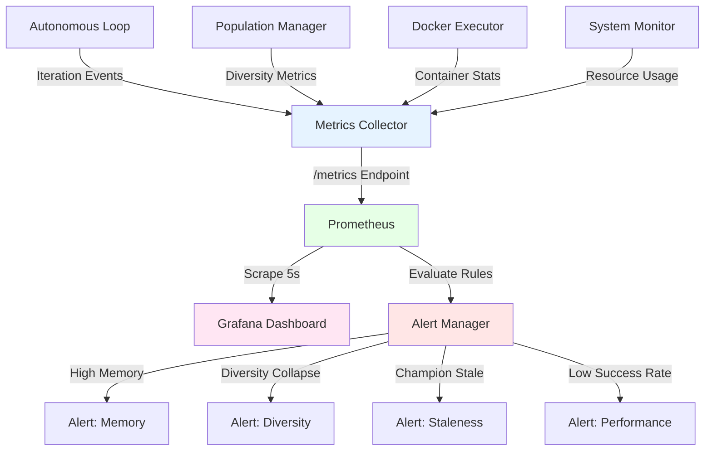

# Design Document: Resource Monitoring System

## Overview

This design implements a **comprehensive resource monitoring system** using Prometheus metrics, Grafana dashboards, and automated alerting to detect memory leaks, CPU exhaustion, diversity collapse, and other production stability issues in real-time.

**Architecture Pattern**: Observer/Publisher-Subscriber pattern - components publish metrics, centralized collector aggregates and exports to Prometheus.

## Steering Document Alignment

### Technical Standards (tech.md)
- **Metrics Collection**: Use Prometheus client library with standard metric types (Counter, Gauge, Histogram)
- **Logging**: Integrate with existing JSON logger for alert events
- **Configuration**: Monitoring settings in `config/monitoring_config.yaml`
- **Error Handling**: Non-blocking metrics collection - failures don't halt iteration loop

### Project Structure (structure.md)
- New module: `src/monitoring/resource_monitor.py` - System resource tracking
- New module: `src/monitoring/diversity_monitor.py` - Population diversity tracking
- New module: `src/monitoring/alert_manager.py` - Threshold-based alerting
- Extend: `src/monitoring/metrics_collector.py` - Add container and diversity metrics
- Config: `config/grafana_dashboard.json` - Pre-configured dashboard template
- Config: `config/monitoring_config.yaml` - Alert thresholds and retention policy

## Code Reuse Analysis

### Existing Components to Leverage
- **`src/monitoring/metrics_collector.py`**: Already exists, will be extended with new metrics
- **`prometheus_client` library**: Already in requirements.txt
- **`psutil` library**: For system resource monitoring
- **`docker` library**: For container stats (from docker-sandbox-security spec)

### Integration Points
- **Autonomous Loop**: Instrument iteration lifecycle events in `artifacts/working/modules/autonomous_loop.py`
- **Population Manager**: Track diversity in `src/population/population_manager.py`
- **Docker Executor**: Export container stats from `src/sandbox/docker_executor.py`
- **Champion Tracking**: Monitor staleness in `autonomous_loop.py` champion update logic

## Architecture



### Modular Design Principles
- **Single File Responsibility**:
  - `resource_monitor.py` - System CPU/memory only
  - `diversity_monitor.py` - Population diversity only
  - `alert_manager.py` - Alert evaluation only
- **Component Isolation**: Monitors don't depend on each other
- **Service Layer Separation**: Collection → Aggregation → Export → Alerting
- **Utility Modularity**: Reuse existing MetricsCollector, extend with new metrics

## Components and Interfaces

### Component 1: ResourceMonitor
- **Purpose:** Track system-level resource usage (CPU, memory, disk)
- **Interfaces:**
  ```python
  class ResourceMonitor:
      def __init__(self, metrics_collector: MetricsCollector):
          """Initialize with shared metrics collector"""

      def start_monitoring(self, interval_seconds: int = 5):
          """Start background thread collecting resource stats"""

      def stop_monitoring(self):
          """Stop background thread"""

      def get_current_stats(self) -> dict:
          """Return current CPU%, memory%, disk% for logging"""

      def _record_system_metrics(self):
          """Internal: collect and record to Prometheus"""
  ```
- **Dependencies:** `psutil`, `MetricsCollector`
- **Reuses:** Existing `MetricsCollector` infrastructure

### Component 2: DiversityMonitor
- **Purpose:** Track population diversity and champion staleness
- **Interfaces:**
  ```python
  class DiversityMonitor:
      def __init__(self, metrics_collector: MetricsCollector):
          """Initialize with shared metrics collector"""

      def record_diversity(self, iteration: int, diversity: float,
                          unique_count: int, total_count: int):
          """Record diversity metrics after each generation"""

      def record_champion_update(self, iteration: int, old_sharpe: float,
                                 new_sharpe: float):
          """Record champion change event"""

      def calculate_staleness(self, current_iteration: int,
                             last_update_iteration: int) -> int:
          """Return iterations since last champion update"""

      def check_diversity_collapse(self, window: int = 5) -> bool:
          """Return True if diversity <0.1 for last 5 iterations"""
  ```
- **Dependencies:** `MetricsCollector`, Population Manager
- **Reuses:** Diversity calculation from `src/population/population_manager.py`

### Component 3: ContainerMonitor
- **Purpose:** Track Docker container resource usage and cleanup status
- **Interfaces:**
  ```python
  class ContainerMonitor:
      def __init__(self, metrics_collector: MetricsCollector, docker_client):
          """Initialize with Docker client"""

      def record_container_created(self, container_id: str):
          """Increment active_containers gauge"""

      def record_container_stats(self, container_id: str):
          """Query docker.stats() and record memory/CPU usage"""

      def record_container_cleanup(self, container_id: str, success: bool):
          """Decrement active_containers, track cleanup failures"""

      def scan_orphaned_containers(self) -> list[str]:
          """Find containers with label=finlab-sandbox but status=exited"""

      def cleanup_orphaned_containers(self) -> int:
          """Remove orphaned containers, return count cleaned"""
  ```
- **Dependencies:** `docker` library, `MetricsCollector`
- **Reuses:** Docker client from `src/sandbox/docker_executor.py`

### Component 4: AlertManager
- **Purpose:** Evaluate alert conditions and trigger notifications
- **Interfaces:**
  ```python
  class AlertManager:
      def __init__(self, config: AlertConfig, metrics_collector: MetricsCollector):
          """Load alert thresholds from config"""

      def evaluate_alerts(self):
          """Check all conditions, trigger alerts if thresholds exceeded"""

      def _check_memory_threshold(self) -> Optional[Alert]:
          """Return alert if memory >80% of system"""

      def _check_diversity_collapse(self) -> Optional[Alert]:
          """Return alert if diversity <0.1 for 5 iterations"""

      def _check_champion_staleness(self) -> Optional[Alert]:
          """Return alert if champion unchanged for 20 iterations"""

      def _check_success_rate(self) -> Optional[Alert]:
          """Return alert if success rate <20% over 10 iterations"""

      def _trigger_alert(self, alert: Alert):
          """Log alert, increment alert counter, send notification"""
  ```
- **Dependencies:** `MetricsCollector`, Alert configuration
- **Reuses:** JSON logger for alert notifications

### Component 5: MetricsExporter (Extend Existing)
- **Purpose:** Expose /metrics endpoint for Prometheus scraping
- **Interfaces:**
  ```python
  # Extend existing MetricsCollector in src/monitoring/metrics_collector.py
  class MetricsCollector:
      # Existing metrics...

      # NEW: Resource metrics
      system_memory_usage = Gauge('system_memory_usage_bytes', 'System memory usage')
      system_cpu_usage = Gauge('system_cpu_usage_percent', 'System CPU usage')

      # NEW: Diversity metrics
      population_diversity = Gauge('population_diversity', 'Population diversity score')
      unique_strategy_count = Gauge('unique_strategy_count', 'Number of unique strategies')
      champion_staleness = Gauge('champion_staleness_iterations', 'Iterations since champion update')

      # NEW: Container metrics
      active_containers = Gauge('active_containers', 'Number of running containers')
      container_memory_usage = Gauge('container_memory_usage_bytes', 'Container memory', ['container_id'])
      container_cpu_usage = Gauge('container_cpu_usage_percent', 'Container CPU', ['container_id'])
      orphaned_containers = Gauge('orphaned_containers', 'Number of orphaned containers')

      # NEW: Alert metrics
      alerts_triggered_total = Counter('alerts_triggered_total', 'Total alerts', ['alert_type'])
  ```
- **Dependencies:** Prometheus client library
- **Reuses:** Existing HTTP server on port 8000

## Data Models

### Alert
```python
@dataclass
class Alert:
    alert_type: str          # "high_memory", "diversity_collapse", etc.
    severity: str            # "warning", "critical"
    message: str
    current_value: float
    threshold_value: float
    timestamp: str
    iteration_context: int
```

### MonitoringConfig
```python
@dataclass
class AlertConfig:
    memory_threshold_percent: float = 80.0
    diversity_collapse_threshold: float = 0.1
    diversity_collapse_window: int = 5
    champion_staleness_threshold: int = 20
    success_rate_threshold: float = 0.2
    success_rate_window: int = 10
    orphaned_container_threshold: int = 3

    @classmethod
    def from_yaml(cls, path: str) -> 'AlertConfig':
        """Load from config/monitoring_config.yaml"""
```

### SystemStats
```python
@dataclass
class SystemStats:
    timestamp: str
    memory_used_gb: float
    memory_total_gb: float
    memory_percent: float
    cpu_percent: float
    disk_used_gb: float
    disk_percent: float
```

## Error Handling

### Error Scenarios

1. **Prometheus HTTP Server Fails to Start**
   - **Handling:** Log error, continue without metrics export (degraded mode)
   - **User Impact:** Warning: "Metrics export disabled, Prometheus unavailable"
   - **Recovery:** Retry on next iteration, auto-recover if port becomes available

2. **psutil Resource Collection Fails**
   - **Handling:** Catch `psutil.Error`, log warning, skip this collection cycle
   - **User Impact:** Missing data points in Grafana (gaps in graphs)
   - **Recovery:** Automatic on next 5-second interval

3. **Docker Stats Query Timeout**
   - **Handling:** Timeout after 2s, log warning, use cached stats
   - **User Impact:** Stale container metrics (acceptable for monitoring)
   - **Recovery:** Next container stats query may succeed

4. **Alert Notification Failure**
   - **Handling:** Log alert locally even if notification fails
   - **User Impact:** Alert logged to JSON but may not reach operator
   - **Recovery:** Retry notification on next alert evaluation cycle

5. **Grafana Dashboard Connection Lost**
   - **Handling:** Prometheus continues collecting, Grafana auto-reconnects
   - **User Impact:** Dashboard shows "No data" until reconnection
   - **Recovery:** Grafana polls Prometheus every 5s, auto-recovers

## Testing Strategy

### Unit Testing

**ResourceMonitor Tests** (`tests/monitoring/test_resource_monitor.py`):
- Test psutil metrics collection
- Test background thread start/stop
- Test memory/CPU percentage calculations
- Mock psutil failures, verify graceful degradation
- **Coverage Target:** >85%

**DiversityMonitor Tests** (`tests/monitoring/test_diversity_monitor.py`):
- Test diversity recording with various values (0.0, 0.5, 1.0)
- Test champion staleness calculation
- Test diversity collapse detection (5 consecutive <0.1)
- **Coverage Target:** >90%

**ContainerMonitor Tests** (`tests/monitoring/test_container_monitor.py`):
- Mock Docker client, test container stats collection
- Test orphaned container detection
- Test cleanup success/failure tracking
- **Coverage Target:** >85%

**AlertManager Tests** (`tests/monitoring/test_alert_manager.py`):
- Test each alert condition independently
- Test alert triggering and logging
- Test threshold configuration loading
- Test alert suppression (don't re-alert same condition)
- **Coverage Target:** >90%

### Integration Testing

**End-to-End Monitoring** (`tests/integration/test_monitoring_system.py`):
1. **Metrics Export**:
   - Start monitors, wait 10s
   - Query http://localhost:8000/metrics
   - Verify all expected metrics present

2. **Alert Triggering**:
   - Simulate high memory (mock psutil to return 85%)
   - Verify alert triggered and logged
   - Verify `alerts_triggered_total{alert_type="high_memory"}` incremented

3. **Diversity Collapse Detection**:
   - Record diversity <0.1 for 5 iterations
   - Verify diversity collapse alert triggered
   - Record diversity >0.3, verify alert clears

4. **Container Monitoring**:
   - Create 3 containers, verify `active_containers=3`
   - Clean up 2, verify `active_containers=1`
   - Leave 1 orphaned, verify `orphaned_containers=1`
   - Call cleanup, verify `orphaned_containers=0`

**Performance Tests**:
- Measure metrics collection overhead (<1% of iteration time)
- Test with 100 containers (verify no slowdown)
- Test 1000 iteration history (verify diversity calculation <100ms)

### End-to-End Testing

**Production Simulation** (`tests/integration/test_production_monitoring.py`):
1. Run 50-iteration loop with full monitoring enabled
2. Inject failures: kill containers, exhaust memory, force diversity collapse
3. Verify all alerts triggered correctly
4. Verify Grafana dashboard reflects actual events
5. Verify final metrics export to JSON

**Grafana Dashboard Validation**:
1. Import `config/grafana_dashboard.json`
2. Run 20-iteration test
3. Manually verify all 4 panels update correctly
4. Verify annotations for champion updates appear
5. Verify alert thresholds displayed correctly

## Grafana Dashboard Design

### config/grafana_dashboard.json

**Panel 1: Resource Usage** (Top Left)
- Graph: Memory usage (GB) over time
- Graph: CPU usage (%) over time
- Graph: Execution time per iteration (seconds)
- Alert Threshold Lines: Memory at 80%, CPU at 90%

**Panel 2: Strategy Performance** (Top Right)
- Graph: Success rate (%) rolling 10-iteration average
- Graph: Sharpe ratio over iterations
- Graph: Max drawdown over iterations
- Annotation: Champion update events

**Panel 3: Diversity Metrics** (Bottom Left)
- Graph: Population diversity (0-1) over time
- Graph: Unique strategy count vs total population
- Graph: Champion age (iterations since update)
- Alert Threshold Line: Diversity at 0.1

**Panel 4: Container Stats** (Bottom Right)
- Graph: Active containers over time
- Graph: Total memory used by containers (GB)
- Graph: Orphaned containers count
- Alert Threshold Line: Orphaned at 3

## Configuration Example

### config/monitoring_config.yaml
```yaml
monitoring:
  enabled: true
  prometheus:
    port: 8000
    metrics_path: "/metrics"
    scrape_interval: 5  # seconds

  resource_monitor:
    enabled: true
    collection_interval: 5  # seconds

  diversity_monitor:
    enabled: true
    diversity_collapse_threshold: 0.1
    diversity_collapse_window: 5

  container_monitor:
    enabled: true
    stats_collection_interval: 10  # seconds

  alerts:
    enabled: true
    evaluation_interval: 10  # seconds

    memory_threshold_percent: 80.0
    cpu_threshold_percent: 90.0

    diversity_collapse:
      threshold: 0.1
      window: 5

    champion_staleness:
      threshold_iterations: 20

    success_rate:
      threshold_percent: 20.0
      window_iterations: 10

    orphaned_containers:
      threshold: 3
      auto_cleanup: true

  export:
    final_metrics_path: "metrics_final.json"
    prometheus_snapshot_path: "prometheus_metrics_final.txt"
    retention_days: 30

grafana:
  dashboard_path: "config/grafana_dashboard.json"
  datasource_url: "http://localhost:9090"  # Prometheus URL
  refresh_interval: "5s"
```

## Prometheus Metrics Catalog

### Resource Metrics
- `system_memory_usage_bytes` (Gauge): Current system memory usage
- `system_memory_total_bytes` (Gauge): Total system memory
- `system_cpu_usage_percent` (Gauge): CPU usage percentage
- `execution_time_seconds` (Histogram): Iteration execution time

### Strategy Performance Metrics
- `strategy_success_total` (Counter): Successful strategy executions
- `strategy_failure_total` (Counter): Failed strategy executions
- `strategy_sharpe_ratio` (Gauge): Most recent Sharpe ratio
- `strategy_max_drawdown` (Gauge): Most recent max drawdown

### Diversity Metrics
- `population_diversity` (Gauge): Diversity score 0.0-1.0
- `unique_strategy_count` (Gauge): Number of unique strategies
- `champion_staleness_iterations` (Gauge): Iterations since champion update
- `champion_updates_total` (Counter): Total champion updates

### Container Metrics
- `active_containers` (Gauge): Currently running containers
- `container_memory_usage_bytes` (Gauge, labeled by container_id): Memory per container
- `container_cpu_usage_percent` (Gauge, labeled by container_id): CPU per container
- `orphaned_containers` (Gauge): Containers not properly cleaned up
- `container_cleanup_success_total` (Counter): Successful cleanups
- `container_cleanup_failure_total` (Counter): Failed cleanups

### Alert Metrics
- `alerts_triggered_total` (Counter, labeled by alert_type): Total alerts triggered
- `alert_active` (Gauge, labeled by alert_type): Current active alerts (1=active, 0=resolved)

## Deployment Checklist

1. ✅ Install Prometheus (v2.40+)
2. ✅ Configure Prometheus scrape job for http://localhost:8000/metrics
3. ✅ Install Grafana (v9.0+)
4. ✅ Import dashboard from `config/grafana_dashboard.json`
5. ✅ Configure alert notification channels (email, Slack, PagerDuty)
6. ✅ Set `monitoring.enabled: true` in config
7. ✅ Run integration tests to verify metrics export
8. ✅ Verify Grafana dashboard displays correctly
9. ✅ Test alert triggering with simulated conditions

## Performance Considerations

- **Metrics Collection Overhead**: <1% of iteration execution time
- **Memory Overhead**: ~50MB for Prometheus client + metrics storage
- **Network Overhead**: ~10KB/s for Prometheus scraping
- **Storage**: ~1GB for 30 days of metrics at 5s resolution
- **Alert Evaluation**: <50ms per evaluation cycle (10s interval)

## Future Enhancements (Out of Scope)

- **Custom Metrics**: User-defined strategy-specific metrics
- **Anomaly Detection**: ML-based alert thresholds
- **Distributed Tracing**: OpenTelemetry integration for multi-node setups
- **Long-term Storage**: Prometheus remote write to InfluxDB/Victoria Metrics
- **Advanced Dashboards**: Template variables, drill-down panels
