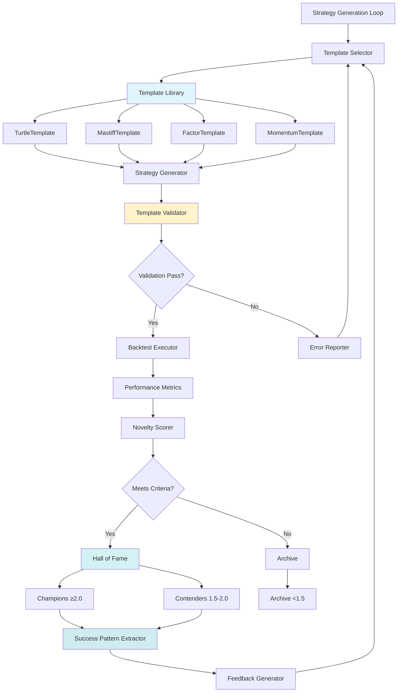
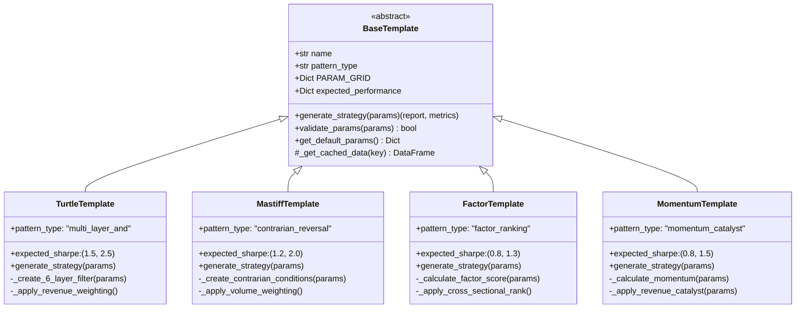
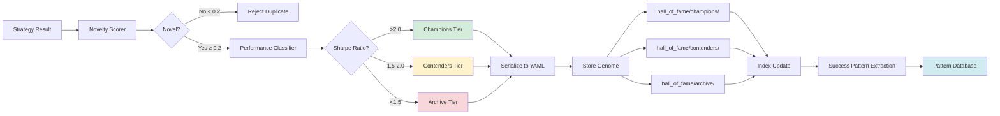

# Design Document: Strategy Template Library & Hall of Fame System

## Overview

This design implements a reusable strategy template library and Hall of Fame repository system for the Taiwan Stock Strategy Generation System. Building on Phase 1 validation (80% success rate with turtle variations), this system provides:

1. **Four Core Templates**: Parameterized strategy patterns (Turtle, Mastiff, Factor, Momentum) with validated ranges
2. **Hall of Fame Repository**: Persistent storage for validated strategies with complete genome tracking
3. **Template Validation**: Automated verification of generated strategies against specifications
4. **Intelligent Feedback**: Template recommendation system for iterative learning

**Key Innovation**: Shifts from ad-hoc strategy generation to systematic, template-based approach that eliminates the 90% oversimplification problem that caused 150-iteration failure (130/150 identical P/E strategies).

## Steering Document Alignment

### Technical Standards (tech.md)
- **Python Type Hints**: All functions use comprehensive type annotations
- **Data Caching Pattern**: Leverage existing `get_cached_data()` pattern from `turtle_strategy_generator.py`
- **YAML Serialization**: Human-readable strategy storage format
- **Error Handling**: Robust exception handling with context logging
- **Performance Budget**: <30s per strategy generation including backtest

### Project Structure (structure.md)
- **Templates Module**: `src/templates/` for strategy template classes
- **Repository Module**: `src/repository/` for Hall of Fame persistence
- **Validation Module**: `src/validation/` for template compliance checking
- **Integration**: Extends existing `performance_attributor.py` for pattern extraction

## Code Reuse Analysis

### Existing Components to Leverage

**1. `turtle_strategy_generator.py` (Phase 1 Implementation)**
- **Data Caching Pattern** (lines 71-76): Reuse `get_cached_data()` function pattern
  ```python
  _cached_data = {}
  def get_cached_data(key: str):
      if key not in _cached_data:
          _cached_data[key] = data.get(key)
      return _cached_data[key]
  ```
- **Parameter Grid Definition** (lines 29-61): Template for `PARAM_GRID` structure
- **Strategy Generation Function** (lines 83-159): Pattern for `generate_strategy()` implementation
- **6-Layer Filtering Logic** (lines 106-132): Core architecture for TurtleTemplate
- **Metrics Extraction** (lines 148-158): Standard metrics dictionary format

**2. `performance_attributor.py` (Complete Implementation)**
- **Parameter Extraction** (lines 14-214): `extract_strategy_params()` for validation
- **Success Pattern Extraction** (lines 486-569): `extract_success_patterns()` for Hall of Fame
- **Pattern Prioritization** (lines 572-605): `_prioritize_patterns()` for criticality scoring
- **Strategy Comparison** (lines 268-368): `compare_strategies()` for template matching

**3. `example/高殖利率烏龜.py` (Benchmark Strategy)**
- **6-Layer AND Filtering**: Reference architecture for TurtleTemplate
- **Revenue Growth Weighting**: `cond_all = cond_all * rev_growth_rate` pattern
- **Selection Logic**: `.is_largest(n_stocks)` for ranking

**4. `example/藏獒.py` (Innovative Strategy)**
- **Contrarian Selection**: `buy.is_smallest(n_stocks)` for MastiffTemplate
- **Volume Weighting**: `buy = vol_ma * buy` pattern
- **Strict Risk Controls**: `position_limit=1/3, stop_loss=0.08` for concentrated holdings

### Integration Points

**1. Existing `learning-system-enhancement` Spec**
- **Champion Tracking**: Template system provides genome data for champion preservation
- **Feedback Loop**: Template recommendations integrate with existing feedback mechanism
- **Performance Attribution**: Hall of Fame stores success patterns extracted by `performance_attributor.py`

**2. Data Layer**
- **Finlab Data API**: All templates use standardized `data.get()` calls
- **Caching Strategy**: Shared cache across all template instances for performance

**3. Validation Layer**
- **AST Validation**: Future migration from regex to AST parsing (existing plan)
- **Sandbox Execution**: Templates generate code executed in existing sandbox environment

## Architecture

### System Architecture Diagram



### Template Inheritance Hierarchy



### Hall of Fame System Architecture



## Components and Interfaces

### Component 1: BaseTemplate (Abstract Base)

**Purpose**: Abstract base class defining common template interface and utilities

**Public Interface**:
```python
class BaseTemplate(ABC):
    """Abstract base class for strategy templates."""

    @property
    @abstractmethod
    def name(self) -> str:
        """Template name (e.g., 'Turtle', 'Mastiff')."""
        pass

    @property
    @abstractmethod
    def pattern_type(self) -> str:
        """Architecture pattern (multi_layer_and|contrarian_reversal|factor_ranking|momentum_catalyst)."""
        pass

    @property
    @abstractmethod
    def PARAM_GRID(self) -> Dict[str, List[Any]]:
        """Parameter grid with validated ranges."""
        pass

    @property
    @abstractmethod
    def expected_performance(self) -> Dict[str, Tuple[float, float]]:
        """Expected performance ranges: sharpe_range, return_range, mdd_range."""
        pass

    @abstractmethod
    def generate_strategy(self, params: Dict[str, Any]) -> Tuple[object, Dict[str, Any]]:
        """Generate strategy from parameters.

        Returns:
            (report, metrics) where metrics contains:
            - sharpe_ratio: float
            - annual_return: float
            - max_drawdown: float
            - success: bool
        """
        pass

    def validate_params(self, params: Dict[str, Any]) -> Tuple[bool, List[str]]:
        """Validate parameters against PARAM_GRID.

        Returns:
            (is_valid, error_messages)
        """
        pass

    def get_default_params(self) -> Dict[str, Any]:
        """Get default parameters (midpoint of PARAM_GRID ranges)."""
        pass

    @staticmethod
    def _get_cached_data(key: str) -> Any:
        """Load and cache data to avoid repeated data.get() calls."""
        pass
```

**Dependencies**:
- `finlab.data` for data loading
- `finlab.backtest` for strategy execution
- `typing` for type hints

**Reuses**: Data caching pattern from `turtle_strategy_generator.py:71-76`

---

### Component 2: TurtleTemplate

**Purpose**: Implements 6-layer AND filtering strategy pattern with validated parameter ranges

**Public Interface**:
```python
class TurtleTemplate(BaseTemplate):
    """High dividend yield turtle strategy with 6-layer filtering."""

    name = "Turtle"
    pattern_type = "multi_layer_and"

    PARAM_GRID = {
        'yield_threshold': [4.0, 5.0, 6.0, 7.0, 8.0],
        'ma_short': [10, 20, 30],
        'ma_long': [40, 60, 80],
        'rev_short': [3, 6],
        'rev_long': [12, 18],
        'op_margin_threshold': [0, 3, 5],
        'director_threshold': [5, 10, 15],
        'vol_min': [30, 50, 100],
        'vol_max': [5000, 10000, 15000],
        'n_stocks': [5, 10, 15, 20],
        'stop_loss': [0.06, 0.08, 0.10],
        'take_profit': [0.3, 0.5, 0.7],
        'position_limit': [0.10, 0.125, 0.15, 0.20],
        'resample': ['M', 'W-FRI']
    }

    expected_performance = {
        'sharpe_range': (1.5, 2.5),
        'return_range': (0.20, 0.35),
        'mdd_range': (-0.25, -0.10)
    }

    def generate_strategy(self, params: Dict[str, Any]) -> Tuple[object, Dict]:
        """Generate turtle strategy with 6-layer filtering."""
        pass

    def _create_6_layer_filter(self, params: Dict) -> Any:
        """Create 6-layer AND filter: yield, technical, revenue, quality, insider, liquidity."""
        pass

    def _apply_revenue_weighting(self, conditions: Any, rev_growth: Any) -> Any:
        """Weight conditions by revenue growth rate."""
        pass
```

**Dependencies**:
- Inherits from `BaseTemplate`
- Uses Finlab datasets: `price:收盤價`, `price:成交股數`, `monthly_revenue:當月營收`, etc.

**Reuses**:
- Architecture from `example/高殖利率烏龜.py`
- Parameter grid from `turtle_strategy_generator.py:29-61`
- 6-layer logic from `turtle_strategy_generator.py:106-132`

---

### Component 3: MastiffTemplate

**Purpose**: Implements contrarian reversal strategy with low-volume selection

**Public Interface**:
```python
class MastiffTemplate(BaseTemplate):
    """Contrarian strategy targeting ignored stocks with revenue recovery."""

    name = "Mastiff"
    pattern_type = "contrarian_reversal"

    PARAM_GRID = {
        'lookback_period': [180, 250, 300],
        'rev_decline_threshold': [-10, -15, -20],
        'rev_growth_threshold': [50, 60, 70],
        'rev_bottom_ratio': [0.7, 0.8, 0.9],
        'rev_mom_threshold': [-40, -30, -20],
        'vol_min': [100, 200, 300],
        'n_stocks': [3, 5, 8, 10],
        'stop_loss': [0.06, 0.08, 0.10],
        'position_limit': [0.20, 0.25, 0.33],
        'resample': ['M']
    }

    expected_performance = {
        'sharpe_range': (1.2, 2.0),
        'return_range': (0.15, 0.30),
        'mdd_range': (-0.30, -0.15)
    }

    def generate_strategy(self, params: Dict[str, Any]) -> Tuple[object, Dict]:
        """Generate mastiff contrarian strategy."""
        pass

    def _create_contrarian_conditions(self, params: Dict) -> Any:
        """Create contrarian filters: price high, revenue recovery, ignored stocks."""
        pass

    def _apply_volume_weighting(self, conditions: Any, vol_ma: Any) -> Any:
        """Weight by volume and select LOWEST volume (contrarian)."""
        pass
```

**Dependencies**:
- Inherits from `BaseTemplate`
- Uses Finlab datasets: `price:收盤價`, `price:成交股數`, `monthly_revenue:*`

**Reuses**:
- Contrarian pattern from `example/藏獒.py`
- `.is_smallest(n_stocks)` selection logic
- Volume weighting pattern

---

### Component 4: FactorTemplate

**Purpose**: Single-factor ranking strategy for stable, low-turnover returns

**Public Interface**:
```python
class FactorTemplate(BaseTemplate):
    """Single factor ranking with cross-sectional selection."""

    name = "Factor"
    pattern_type = "factor_ranking"

    PARAM_GRID = {
        'factor_type': ['roe', 'operating_margin', 'dividend_yield', 'revenue_growth'],
        'factor_threshold': [0.5, 0.6, 0.7, 0.8],
        'ma_periods': [20, 60, 120],
        'vol_min': [100, 200, 500],
        'vol_momentum': [True, False],
        'n_stocks': [10, 15, 20, 30],
        'resample': ['M', 'Q']
    }

    expected_performance = {
        'sharpe_range': (0.8, 1.3),
        'return_range': (0.10, 0.20),
        'mdd_range': (-0.20, -0.10)
    }

    def generate_strategy(self, params: Dict[str, Any]) -> Tuple[object, Dict]:
        """Generate factor ranking strategy."""
        pass

    def _calculate_factor_score(self, params: Dict) -> Any:
        """Calculate factor score with normalization."""
        pass

    def _apply_cross_sectional_rank(self, factor: Any, params: Dict) -> Any:
        """Apply cross-sectional ranking using .rank(axis=1, pct=True)."""
        pass
```

**Dependencies**:
- Inherits from `BaseTemplate`
- Uses Finlab fundamental datasets

**Reuses**:
- Cross-sectional ranking pattern from STRATEGY_GENERATION_SYSTEM_SPEC.md
- Factor calculation patterns

---

### Component 5: MomentumTemplate

**Purpose**: Momentum + catalyst strategy for fast reaction to market trends

**Public Interface**:
```python
class MomentumTemplate(BaseTemplate):
    """Momentum strategy with revenue acceleration catalyst."""

    name = "Momentum"
    pattern_type = "momentum_catalyst"

    PARAM_GRID = {
        'momentum_window': [20, 60, 120],
        'ma_periods': [20, 60],
        'catalyst_type': ['revenue_accel', 'earnings_surprise', 'director_buy'],
        'catalyst_lookback': [1, 3, 6],
        'n_stocks': [10, 15, 20],
        'stop_loss': [0.08, 0.10, 0.12],
        'resample': ['W-FRI', 'M'],
        'resample_offset': ['0D', '11D']
    }

    expected_performance = {
        'sharpe_range': (0.8, 1.5),
        'return_range': (0.12, 0.25),
        'mdd_range': (-0.25, -0.12)
    }

    def generate_strategy(self, params: Dict[str, Any]) -> Tuple[object, Dict]:
        """Generate momentum + catalyst strategy."""
        pass

    def _calculate_momentum(self, params: Dict) -> Any:
        """Calculate price momentum indicator."""
        pass

    def _apply_revenue_catalyst(self, params: Dict) -> Any:
        """Apply revenue acceleration catalyst filter."""
        pass
```

**Dependencies**:
- Inherits from `BaseTemplate`
- Uses Finlab price and revenue datasets

**Reuses**:
- Momentum calculation patterns
- Revenue catalyst from `example/月營收與動能策略選股.py`

---

### Component 6: HallOfFameRepository

**Purpose**: Persistent storage and retrieval of validated strategies with genome tracking

**Public Interface**:
```python
class HallOfFameRepository:
    """Repository for storing and querying validated strategies."""

    def __init__(self, base_path: str = "hall_of_fame"):
        """Initialize repository with base storage path."""
        pass

    def add_strategy(
        self,
        iteration_num: int,
        code: str,
        parameters: Dict[str, Any],
        metrics: Dict[str, float],
        success_patterns: List[str]
    ) -> bool:
        """Add strategy to Hall of Fame.

        Returns:
            True if added successfully, False if duplicate or error
        """
        pass

    def get_champions(self, limit: int = 10) -> List[Dict]:
        """Retrieve champion strategies (Sharpe ≥2.0)."""
        pass

    def get_contenders(self, limit: int = 20) -> List[Dict]:
        """Retrieve contender strategies (Sharpe 1.5-2.0)."""
        pass

    def query_similar(
        self,
        strategy_code: str,
        max_distance: float = 0.3
    ) -> List[Dict]:
        """Find similar strategies within distance threshold."""
        pass

    def calculate_novelty_score(
        self,
        strategy_code: str
    ) -> float:
        """Calculate novelty score (0.0=duplicate, 1.0=novel)."""
        pass

    def _classify_tier(self, sharpe: float) -> str:
        """Classify strategy tier based on Sharpe ratio."""
        pass

    def _serialize_to_yaml(self, genome: Dict) -> str:
        """Serialize strategy genome to YAML format."""
        pass

    def _extract_factor_vector(self, code: str) -> np.ndarray:
        """Extract factor usage vector for novelty calculation."""
        pass
```

**Dependencies**:
- `pyyaml` for serialization
- `numpy` for cosine distance calculation
- `performance_attributor.py` for success pattern extraction

**Reuses**:
- `extract_success_patterns()` from `performance_attributor.py:486-569`
- `_prioritize_patterns()` from `performance_attributor.py:572-605`

---

### Component 7: TemplateValidator

**Purpose**: Automated validation of generated strategies against template specifications

**Public Interface**:
```python
class TemplateValidator:
    """Validates generated strategies against template specifications."""

    def validate_strategy(
        self,
        code: str,
        template: BaseTemplate,
        params: Dict[str, Any]
    ) -> Dict[str, Any]:
        """Validate strategy against template specification.

        Returns:
            {
                'status': 'PASS' | 'NEEDS_FIX' | 'FAIL',
                'errors': List[Dict[str, Any]],
                'warnings': List[Dict[str, Any]],
                'suggestions': List[str]
            }
        """
        pass

    def validate_turtle(self, code: str, params: Dict) -> List[Dict]:
        """Validate TurtleTemplate specific requirements."""
        pass

    def validate_mastiff(self, code: str, params: Dict) -> List[Dict]:
        """Validate MastiffTemplate specific requirements."""
        pass

    def test_parameter_sensitivity(
        self,
        template: BaseTemplate,
        baseline_params: Dict[str, Any]
    ) -> Dict[str, float]:
        """Test parameter sensitivity with ±20% variations.

        Returns:
            {param_name: stability_score} where <0.6 is sensitive
        """
        pass

    def _categorize_error(self, error: Dict) -> str:
        """Categorize error severity: CRITICAL | MODERATE | LOW."""
        pass

    def _generate_fix_suggestion(self, error: Dict) -> str:
        """Generate fix suggestion for common errors."""
        pass
```

**Dependencies**:
- Uses `performance_attributor.extract_strategy_params()` for validation
- Uses AST parsing (future migration)

**Reuses**:
- Parameter extraction from `performance_attributor.py:14-214`
- Validation patterns

---

### Component 8: TemplateFeedbackIntegrator

**Purpose**: Integrates template recommendations into existing feedback loop

**Public Interface**:
```python
class TemplateFeedbackIntegrator:
    """Integrates template system with feedback loop."""

    def __init__(
        self,
        hall_of_fame: HallOfFameRepository,
        templates: Dict[str, BaseTemplate]
    ):
        """Initialize with Hall of Fame and template registry."""
        pass

    def recommend_template(
        self,
        current_metrics: Dict[str, float],
        iteration_num: int,
        previous_template: Optional[str] = None
    ) -> Dict[str, Any]:
        """Recommend optimal template for next iteration.

        Returns:
            {
                'template_name': str,
                'rationale': str,
                'match_score': float,
                'suggested_params': Dict[str, Any]
            }
        """
        pass

    def calculate_template_match_score(
        self,
        strategy_code: str,
        template: BaseTemplate
    ) -> float:
        """Calculate how well strategy matches template (0.0-1.0)."""
        pass

    def get_champion_template_params(self) -> Optional[Dict[str, Any]]:
        """Get parameters from champion strategy if exists."""
        pass

    def _should_force_exploration(self, iteration_num: int) -> bool:
        """Check if forced exploration mode (iteration % 5 == 0)."""
        pass
```

**Dependencies**:
- `HallOfFameRepository` for champion retrieval
- Template registry
- Existing feedback mechanism

**Reuses**:
- Champion tracking from `learning-system-enhancement` spec
- Feedback patterns

---

## Data Models

### Strategy Genome (YAML Storage Format)

```yaml
iteration_num: 42
timestamp: "2025-10-10T14:23:45.123456"
template_name: "Turtle"
pattern_type: "multi_layer_and"

parameters:
  yield_threshold: 6.0
  ma_short: 20
  ma_long: 60
  rev_short: 3
  rev_long: 12
  op_margin_threshold: 3
  director_threshold: 10
  vol_min: 50
  vol_max: 10000
  n_stocks: 10
  stop_loss: 0.06
  take_profit: 0.5
  position_limit: 0.125
  resample: "M"

metrics:
  sharpe_ratio: 2.15
  annual_return: 0.2925
  max_drawdown: -0.1541
  win_rate: 0.65
  total_trades: 120

robustness:
  parameter_sensitivity:
    yield_threshold: 0.85
    ma_short: 0.92
    n_stocks: 0.78
  out_of_sample_sharpe: 1.98

novelty_score: 0.45

success_patterns:
  - "roe.rolling(window=4).mean() - 4-quarter smoothing reduces quarterly noise"
  - "liquidity_filter > 100,000,000 TWD - Selects stable, high-volume stocks"
  - "revenue_yoy.ffill() - Forward-filled revenue data handles missing values"

code: |
  from finlab import data
  from finlab.backtest import sim

  close = data.get("price:收盤價")
  # ... strategy code ...
```

### Template Registry Configuration

```python
TemplateConfig = {
    'name': str,                    # Template name
    'class': Type[BaseTemplate],    # Template class
    'pattern_type': str,            # Architecture pattern
    'expected_sharpe': Tuple[float, float],
    'success_rate_phase1': float,   # Historical success rate
    'use_cases': List[str],         # When to recommend
    'characteristics': List[str]    # Key features
}
```

### Validation Result Schema

```python
ValidationResult = {
    'status': str,                  # PASS | NEEDS_FIX | FAIL
    'errors': List[{
        'severity': str,            # CRITICAL | MODERATE | LOW
        'category': str,            # parameter | architecture | data | backtest
        'message': str,
        'line_number': Optional[int],
        'suggestion': str
    }],
    'warnings': List[{
        'category': str,
        'message': str
    }],
    'parameter_sensitivity': Dict[str, float],
    'timestamp': str
}
```

## Error Handling

### Error Scenarios

**1. Template Instantiation Failure**
- **Scenario**: Invalid PARAM_GRID definition or missing required attributes
- **Handling**: Raise `TemplateConfigurationError` with detailed message
- **User Impact**: System logs error and falls back to default parameters
- **Recovery**: Load backup parameter grid from configuration file

**2. Data Loading Failure**
- **Scenario**: `data.get()` call fails due to API timeout or missing dataset
- **Handling**: Retry 3x with exponential backoff, then raise `DataLoadError`
- **User Impact**: Strategy generation skipped for this iteration
- **Recovery**: Cache successful data loads, use stale cache if available

**3. Strategy Generation Exception**
- **Scenario**: Exception during strategy code execution (division by zero, NaN values)
- **Handling**: Catch exception, log full traceback, mark strategy as failed
- **User Impact**: Iteration marked as failed, feedback suggests parameter adjustments
- **Recovery**: Adjust parameters to avoid problematic conditions

**4. Validation Critical Errors**
- **Scenario**: Generated strategy fails critical validation checks
- **Handling**: Block execution, generate detailed error report
- **User Impact**: Strategy not executed, feedback includes fix suggestions
- **Recovery**: Trigger template regeneration with stronger constraints

**5. Hall of Fame Serialization Failure**
- **Scenario**: YAML serialization fails due to invalid data types or file permissions
- **Handling**: Log error, attempt write to backup location `hall_of_fame/backup/`
- **User Impact**: Strategy not persisted but iteration continues
- **Recovery**: Retry serialization on next successful strategy

**6. Novelty Calculation Failure**
- **Scenario**: Cosine distance calculation fails due to empty Hall of Fame or invalid vectors
- **Handling**: Return default novelty score of 1.0 (assume novel)
- **User Impact**: Strategy accepted even if might be duplicate
- **Recovery**: Manual review of Hall of Fame for duplicates

**7. Hall of Fame Size Overflow**
- **Scenario**: Hall of Fame exceeds 100 strategies
- **Handling**: Archive lowest 20% of Contenders, compress old strategies
- **User Impact**: Transparent maintenance operation
- **Recovery**: Full index maintained for fast lookup

**8. Parameter Sensitivity Test Timeout**
- **Scenario**: Sensitivity testing exceeds time budget (>5 minutes)
- **Handling**: Abort remaining tests, return partial results
- **User Impact**: Incomplete sensitivity scores reported
- **Recovery**: Mark parameters as "sensitivity_unknown"

## Testing Strategy

### Unit Testing

**Template Tests** (`tests/templates/test_*.py`):
- Valid parameter generation from PARAM_GRID
- Invalid parameter rejection (out of range, wrong type)
- Strategy generation success with default parameters
- Data caching functionality
- Metrics extraction accuracy

**Hall of Fame Tests** (`tests/repository/test_hall_of_fame.py`):
- Strategy genome serialization/deserialization
- Novelty score calculation accuracy
- Tier classification logic
- Query similarity functionality
- Duplicate rejection

**Validation Tests** (`tests/validation/test_validator.py`):
- Template-specific validation rules
- Error categorization logic
- Fix suggestion generation
- Parameter sensitivity calculation

**Coverage Target**: ≥80% for all template and repository modules

### Integration Testing

**Template Integration** (`tests/integration/test_templates.py`):
- Full strategy generation pipeline
- Template → Generation → Validation → Backtest → Metrics
- Data caching across multiple strategy generations
- Error handling and recovery

**Hall of Fame Integration** (`tests/integration/test_repository.py`):
- Multi-tier storage and retrieval
- Concurrent write operations
- Index consistency after archival
- Success pattern extraction integration

**Feedback Integration** (`tests/integration/test_feedback.py`):
- Template recommendation logic
- Champion-based parameter suggestions
- Forced exploration mode triggering

### End-to-End Testing

**Complete Workflow** (`tests/e2e/test_workflow.py`):
1. Initialize template library
2. Generate strategy from each template
3. Validate generated strategies
4. Execute backtests
5. Store successful strategies in Hall of Fame
6. Extract success patterns
7. Generate feedback recommendations
8. Verify feedback influences next iteration

**Performance Testing**:
- Template instantiation: <100ms per template
- Strategy generation: <30s including backtest
- Data caching: <10s for all datasets
- Hall of Fame query: <500ms for 100 strategies
- Validation: <5s per strategy

**Stress Testing**:
- Generate 50 strategies concurrently
- Hall of Fame with 200+ strategies
- Query similarity with 500+ strategies

## Implementation Phases

### Phase 1: Core Template Library (Tasks 1-15)
- BaseTemplate abstract class
- Four concrete template implementations
- Data caching infrastructure
- Basic parameter validation

### Phase 2: Hall of Fame System (Tasks 16-25)
- Repository implementation
- YAML serialization
- Novelty scoring
- Tier classification
- Success pattern extraction integration

### Phase 3: Validation System (Tasks 26-35)
- Template validator implementation
- Template-specific validation rules
- Error reporting and suggestions
- Parameter sensitivity testing

### Phase 4: Feedback Integration (Tasks 36-45)
- Template recommendation logic
- Champion parameter suggestions
- Forced exploration mode
- Integration with existing feedback loop

### Phase 5: Testing & Documentation (Tasks 46-50)
- Comprehensive unit tests
- Integration tests
- End-to-end tests
- Documentation and examples

---

**Document Version**: 1.0
**Status**: Ready for Review
**Next Action**: User approval before proceeding to Tasks Phase
**Dependencies**: Requires approved requirements.md

**Key Design Decisions**:
1. **Template inheritance**: Abstract base class ensures consistent interface
2. **YAML storage**: Human-readable format for strategy genomes
3. **Three-tier Hall of Fame**: Champions, Contenders, Archive for scalability
4. **Novelty scoring**: Cosine distance prevents duplicate strategies
5. **Reuse existing code**: Leverages validated Phase 1 patterns and performance_attributor.py
6. **Graceful degradation**: System continues with reduced functionality on non-critical errors
