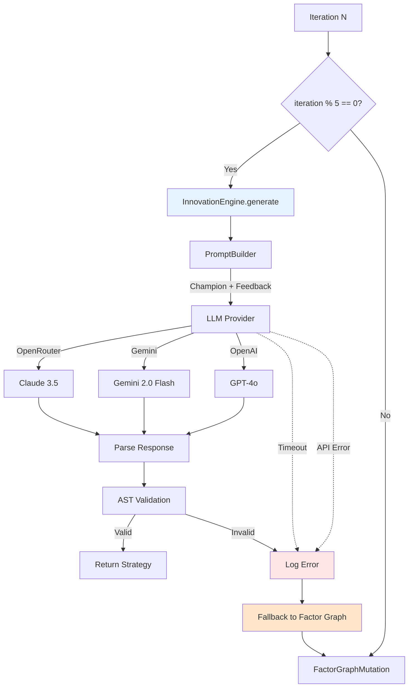

# Design Document: LLM Integration Activation

## Overview

This design **activates the InnovationEngine** in the autonomous iteration loop, enabling LLM-driven strategy innovation for 20% of iterations with automatic fallback to Factor Graph mutation on failures. The system provides robust error handling, API provider abstraction, and performance feedback to guide LLM improvements.

**Architecture Pattern**: Strategy + Chain of Responsibility - Abstract API provider selection, chain validation → execution → fallback on failure.

## Steering Document Alignment

### Technical Standards (tech.md)
- **API Abstraction**: Provider-agnostic interface for OpenRouter/Gemini/OpenAI
- **Error Handling**: Timeout, retry, and fallback mechanisms for all API calls
- **Logging**: Structured logging of all LLM calls, prompts, responses, failures
- **Configuration**: LLM settings in `config/learning_system.yaml`

### Project Structure (structure.md)
- Extend: `artifacts/working/modules/autonomous_loop.py` - Add LLM invocation logic
- Extend: `src/innovation/innovation_engine.py` - Add feedback loop and prompt engineering
- New module: `src/innovation/llm_providers.py` - Abstract API provider interface
- New module: `src/innovation/prompt_builder.py` - Construct prompts with feedback
- Config: `config/learning_system.yaml` - Add `llm` section

## Code Reuse Analysis

### Existing Components to Leverage
- **`src/innovation/innovation_engine.py`**: Already implemented (Tasks 3.1-3.3), needs activation
- **`src/mutation/factor_graph.py`**: Fallback mutation when LLM fails
- **`src/validation/ast_validator.py`**: Validate LLM-generated code
- **`artifacts/data/failure_patterns.json`**: Provide failure feedback to LLM

### Integration Points
- **Autonomous Loop**: `autonomous_loop.py` iteration selection logic
- **Validation Pipeline**: Reuse existing semantic/AST validators
- **Champion Tracking**: Pass champion code and metrics to LLM
- **Failure History**: Load from `failure_patterns.json` for prompts

## Architecture



## Components and Interfaces

### Component 1: LLMProviderInterface (Abstract Base)
- **Purpose:** Abstract API provider to support multiple LLM services
- **Interfaces:**
  ```python
  class LLMProviderInterface(ABC):
      @abstractmethod
      def generate(self, prompt: str, max_tokens: int, temperature: float) -> str:
          """Generate code from prompt, returns Python code"""

      @abstractmethod
      def get_cost_per_call(self) -> float:
          """Estimate cost in USD for typical call"""
  ```
- **Dependencies:** None (interface only)
- **Implementations:** `OpenRouterProvider`, `GeminiProvider`, `OpenAIProvider`

### Component 2: PromptBuilder
- **Purpose:** Construct prompts with champion feedback, failure history, and constraints
- **Interfaces:**
  ```python
  class PromptBuilder:
      def build_modification_prompt(self, champion_code: str,
                                    champion_metrics: dict,
                                    failure_history: list) -> str:
          """Build prompt for modifying champion strategy"""

      def build_creation_prompt(self, champion_approach: str,
                                 failure_history: list) -> str:
          """Build prompt for creating novel strategy"""

      def _extract_success_factors(self, code: str, metrics: dict) -> str:
          """Analyze what makes champion successful"""

      def _extract_failure_patterns(self, failure_history: list) -> str:
          """Extract common failure modes to avoid"""
  ```
- **Dependencies:** `failure_patterns.json` loader
- **Reuses:** Template prompts from `src/innovation/prompts/`

### Component 3: InnovationEngineExtension (Extend Existing)
- **Purpose:** Add feedback loop and provider selection to existing InnovationEngine
- **Interfaces:**
  ```python
  # Extend existing InnovationEngine in src/innovation/innovation_engine.py
  class InnovationEngine:
      def __init__(self, provider: LLMProviderInterface, prompt_builder: PromptBuilder):
          self.provider = provider
          self.prompt_builder = prompt_builder

      def generate_with_feedback(self, champion_code: str,
                                  champion_metrics: dict,
                                  failure_history: list,
                                  directive: str) -> str:
          """Generate strategy with feedback context"""
          if directive == "modify":
              prompt = self.prompt_builder.build_modification_prompt(...)
          else:  # "create"
              prompt = self.prompt_builder.build_creation_prompt(...)

          response = self.provider.generate(prompt, max_tokens=2000)
          code = self._extract_code(response)
          return code
  ```
- **Dependencies:** LLMProvider, PromptBuilder
- **Reuses:** Existing InnovationEngine base implementation

### Component 4: AutonomousLoopIntegration
- **Purpose:** Integrate LLM calls into iteration loop with fallback logic
- **Interfaces:**
  ```python
  # Extension to autonomous_loop.py
  def run_iteration(iteration: int, config: dict):
      use_llm = (iteration % 5 == 0) and config["llm"]["enabled"]

      if use_llm:
          try:
              code = innovation_engine.generate_with_feedback(
                  champion_code=champion.code,
                  champion_metrics=champion.metrics,
                  failure_history=load_failure_history(),
                  directive="modify" if random.random() < 0.7 else "create"
              )

              # Validate
              if not ast_validator.validate(code):
                  raise ValidationError("Invalid syntax")

          except (TimeoutError, APIError, ValidationError) as e:
              log_error(f"LLM failed: {e}, falling back to Factor Graph")
              code = factor_graph_mutation(champion.code)
      else:
          code = factor_graph_mutation(champion.code)

      return execute_strategy(code)
  ```
- **Dependencies:** InnovationEngine, FactorGraphMutation, validators
- **Reuses:** Existing iteration loop structure

## Data Models

### LLMConfig
```python
@dataclass
class LLMConfig:
    enabled: bool = False
    provider: str = "openrouter"  # openrouter, gemini, openai
    api_key: str = ""
    model_name: str = ""
    innovation_rate: float = 0.20  # 20% of iterations
    timeout_seconds: int = 60
    max_tokens: int = 2000
    temperature: float = 0.7
    fallback_to_factor_graph: bool = True

    @classmethod
    def from_yaml(cls, path: str) -> 'LLMConfig':
        """Load from config/learning_system.yaml"""
```

### LLMCallMetadata
```python
@dataclass
class LLMCallMetadata:
    timestamp: str
    iteration: int
    provider: str
    model: str
    prompt_length: int
    response_length: int
    latency_seconds: float
    success: bool
    error_message: Optional[str] = None
    validation_passed: bool = False
    cost_usd: float = 0.0
```

## Error Handling

### Error Scenarios

1. **API Timeout (>60s)**
   - **Handling:** Raise `TimeoutError`, log, fallback to Factor Graph
   - **User Impact:** Iteration completes using mutation instead
   - **Metrics:** Increment `llm_timeout_total`

2. **Invalid API Key / Auth Failure**
   - **Handling:** Log critical error, disable LLM for remaining iterations
   - **User Impact:** Warning: "LLM disabled due to auth failure"
   - **Metrics:** Set `llm_enabled=0`, increment `llm_auth_failure_total`

3. **Rate Limit Exceeded**
   - **Handling:** Exponential backoff (1s, 2s, 4s), max 3 retries
   - **User Impact:** Slight delay, fallback if retries exhausted
   - **Metrics:** Increment `llm_rate_limit_total`

4. **Invalid Code Response (Syntax Error)**
   - **Handling:** Log code snippet, increment `llm_validation_failure_total`, fallback
   - **User Impact:** Strategy generated via Factor Graph
   - **Metrics:** Record validation failure reason

5. **Network Error**
   - **Handling:** Retry once after 2s, fallback if fails
   - **User Impact:** Slight delay or Factor Graph fallback
   - **Metrics:** Increment `llm_network_error_total`

6. **High Failure Rate (>50% over 10 iterations)**
   - **Handling:** Log warning, reduce innovation_rate to 0.1 automatically
   - **User Impact:** Fewer LLM calls to conserve API quota
   - **Metrics:** Set `llm_innovation_rate=0.1`

## Testing Strategy

### Unit Testing

**LLMProviders Tests**:
- Mock API responses for each provider
- Test timeout enforcement
- Test retry logic on rate limits
- **Coverage:** >85%

**PromptBuilder Tests**:
- Test modification prompt generation
- Test creation prompt generation
- Test failure pattern extraction
- **Coverage:** >90%

### Integration Testing

**LLM API Integration**:
1. Call real API with test prompt (1 call, manual)
2. Verify response parsing
3. Verify code extraction

**Autonomous Loop Integration**:
1. Run 10 iterations with LLM enabled
2. Verify 2 iterations use LLM (20%)
3. Verify fallback works when API mocked to fail
4. Verify all iterations complete successfully

### End-to-End Testing

**100-Generation LLM Test** (Task 3.5):
1. Enable LLM with `innovation_rate=0.20`
2. Run 100 iterations
3. Verify ~20 use LLM, ~80 use Factor Graph
4. Verify >80% overall success rate
5. Analyze LLM-generated vs mutated strategy performance

## Configuration Example

### config/learning_system.yaml
```yaml
llm:
  enabled: true
  provider: "openrouter"  # openrouter, gemini, openai
  innovation_rate: 0.20   # 20% of iterations

  openrouter:
    api_key: "${OPENROUTER_API_KEY}"
    model: "anthropic/claude-3.5-sonnet"
    base_url: "https://openrouter.ai/api/v1"

  gemini:
    api_key: "${GOOGLE_API_KEY}"
    model: "gemini-2.0-flash-thinking-exp"

  openai:
    api_key: "${OPENAI_API_KEY}"
    model: "gpt-4o"

  generation:
    timeout_seconds: 60
    max_tokens: 2000
    temperature: 0.7
    max_retries: 3

  fallback:
    enabled: true
    auto_reduce_rate_on_failures: true
    failure_threshold: 0.5  # 50% failures
    reduced_innovation_rate: 0.1

  prompts:
    template_dir: "src/innovation/prompts"
    few_shot_examples: 2
```

## Prompt Engineering Templates

### Modification Prompt Template
```
You are a quantitative trading strategy developer. Your task is to modify an existing strategy to improve its performance.

**Current Champion Strategy:**
```python
{champion_code}
```

**Performance Metrics:**
- Sharpe Ratio: {sharpe}
- Max Drawdown: {max_drawdown}
- Win Rate: {win_rate}

**Success Factors to Preserve:**
{success_factors}

**Common Failures to Avoid:**
{failure_patterns}

**Constraints:**
1. Use FinLab API: data.get('price:收盤價'), data.get('fundamental_features:ROE')
2. Liquidity requirement: trading_value_mean > 150_000_000
3. Rebalancing: Weekly Friday (W-FRI)
4. Return function signature: def strategy(data) -> pd.Series

**Modification Directive:**
Modify this strategy to {target_metric_improvement}. Consider:
- Adjusting parameters (periods, thresholds)
- Adding/removing factors
- Refining entry/exit conditions

Return ONLY the complete modified Python function, no explanations.
```

## Performance Considerations

- **LLM Call Latency:** ~5-15s per API call (acceptable for 20% of iterations)
- **Cost per Iteration:** ~$0.05-0.10 (using cost-effective models)
- **Fallback Overhead:** <100ms (minimal impact)
- **Prompt Construction:** <50ms (negligible)

## Future Enhancements (Out of Scope)

- **Structured Innovation:** YAML/JSON specs instead of full code (Phase 2a)
- **Multi-shot Prompting:** Multiple LLM calls with refinement
- **Cost Optimization:** Batch API calls, use caching
- **A/B Testing:** Compare LLM vs Factor Graph performance
