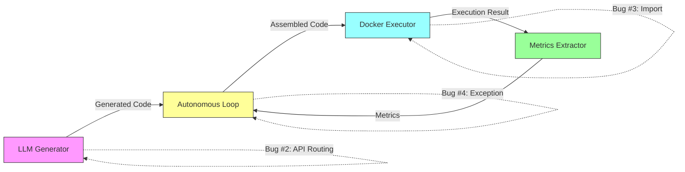

# Design Document

## Overview

This design establishes a systematic approach to fix 4 critical integration bugs and create a test framework to prevent future integration failures. The implementation follows a **test-first, minimal-change** philosophy: fix only what's broken, add tests to verify fixes, avoid any refactoring work.

**Scope**: Bug fixes (~50 lines) + test framework (characterization, unit, integration tests)
**Out of Scope**: Refactoring, architectural changes, code reorganization (see Requirement 7)

**Note**: This spec focuses exclusively on stabilization. Refactoring will be addressed in a separate future spec (`autonomous-loop-refactoring`) after all 8 completion criteria are met.

## Steering Document Alignment

This project does not currently have steering documents (product.md, tech.md, structure.md). The design follows observed project conventions:

### Observed Technical Patterns
- **Testing Framework**: pytest with fixtures in `tests/` directory
- **Mocking Strategy**: unittest.mock for external dependencies
- **Logging**: Python logging module with structured messages
- **Docker Integration**: docker-py library for container execution
- **Configuration**: YAML files in `config/` directory

### Observed Project Structure
```
finlab/
├── src/
│   ├── sandbox/          # Docker execution (Bug #1 location)
│   ├── innovation/       # LLM generation (Bug #2 location)
│   └── config/           # Configuration (Bug #3 location)
├── artifacts/working/modules/
│   └── autonomous_loop.py  # Main orchestrator (Bug #4 location)
├── tests/
│   ├── unit/            # Unit tests (new)
│   ├── integration/     # Integration tests (existing + new)
│   └── conftest.py      # Shared fixtures
└── config/              # YAML configurations
```

## Code Reuse Analysis

### Existing Components to Leverage
- **pytest framework**: Already used for integration tests in `tests/integration/`
- **Docker executor**: Existing `src/sandbox/docker_executor.py` - fix, don't rewrite
- **LLM generator**: Existing `src/innovation/llm_strategy_generator.py` - add validation only
- **Autonomous loop**: Existing `artifacts/working/modules/autonomous_loop.py` - minimal fixes
- **Mock fixtures**: Can reuse mock data patterns from manual test in `/tmp/docker_test_strategy.py`

### Integration Points
- **Docker API**: Existing integration via docker-py library
- **LLM APIs**: Existing integration via provider-specific clients (Google, OpenRouter)
- **File I/O**: Strategy code written to temp files before Docker execution
- **Logging**: Existing logging infrastructure - add diagnostic messages only

## Architecture

### Design Principles for Bug Fixes

1. **Minimal Change Principle**: Change only the lines necessary to fix each bug
2. **Test-First Approach**: Write failing test, then implement fix to make test pass
3. **Characterization Test**: Establish baseline behavior before any changes
4. **No Refactoring**: Strictly prohibited until Requirement 7 criteria are met (separate spec)

### Integration Boundary Map



**Critical Boundaries**:
1. **Boundary A→B**: LLM generation → Code assembly (Bug #2: API routing validation)
2. **Boundary B→C**: Code assembly → Docker execution (Bug #1: F-string evaluation)
3. **Boundary C→D**: Docker execution → Metrics extraction (Bug #3: Missing module)
4. **Boundary D→B**: Exception handling → State update (Bug #4: State propagation)

## Components and Interfaces

### Component 1: F-String Template Evaluator

**Purpose**: Ensure f-string templates are evaluated before Docker injection

**Location**: `artifacts/working/modules/autonomous_loop.py:344`

**Current Code**:
```python
complete_code = data_setup + "\n" + code + "\n" + metrics_extraction
```

**Investigation Needed**: Verify if `data_setup` f-string is evaluated properly. The template contains `{{}}` escaping which should become `{}` after evaluation.

**Potential Fix** (if needed):
```python
# Ensure f-string template is fully evaluated before Docker injection
complete_code = data_setup + "\n" + code + "\n" + metrics_extraction

# Add diagnostic logging
self.logger.debug(f"Complete code (first 500 chars): {complete_code[:500]}")

# Verify no {{}} remains (should all be {})
if '{{' in complete_code or '}}' in complete_code:
    self.logger.warning("F-string template may not be fully evaluated")
```

**Interfaces**:
- Input: `data_setup` (str), `code` (str), `metrics_extraction` (str)
- Output: `complete_code` (str) with all `{{}}` resolved to `{}`

**Dependencies**: None (pure string operation)

**Test Strategy**: Characterization test to verify current behavior, then fix if needed

### Component 2: LLM API Routing Validator

**Purpose**: Validate model name matches provider before API call

**Location**: `src/innovation/llm_strategy_generator.py` (new function)

**Implementation**:
```python
def _validate_model_provider_match(provider: str, model: str) -> None:
    """
    Validate model name matches provider capabilities.

    Args:
        provider: LLM provider name ('google', 'openrouter', 'anthropic')
        model: Model identifier (e.g., 'gemini-2.5-flash', 'anthropic/claude-3.5-sonnet')

    Raises:
        ValueError: If model/provider combination is invalid

    Examples:
        >>> _validate_model_provider_match('google', 'gemini-2.5-flash')  # OK
        >>> _validate_model_provider_match('google', 'anthropic/claude-3.5-sonnet')
        ValueError: Model 'anthropic/claude-3.5-sonnet' cannot be used with provider 'google'...
    """
    if provider == 'google':
        if model.startswith('anthropic/'):
            raise ValueError(
                f"Model '{model}' cannot be used with provider '{provider}'. "
                f"Anthropic models require provider='openrouter'."
            )
        if not model.startswith('gemini'):
            raise ValueError(
                f"Google provider requires gemini-* models, got: '{model}'"
            )

    # Can add more provider validations as needed
    # For now, only validate Google provider (the failing case)
```

**Integration Point**: Call this function in LLM generator `__init__()` method

**Interfaces**:
- Input: `provider` (str), `model` (str)
- Output: None (raises ValueError on mismatch)

**Dependencies**: None (pure validation logic)

**Test Strategy**: Unit tests with valid/invalid combinations

### Component 3: ExperimentConfig Module

**Purpose**: Provide minimal configuration snapshot capability

**Location**: `src/config/experiment_config.py` (new file)

**Implementation**:
```python
"""Configuration snapshot for experiment reproducibility."""
from dataclasses import dataclass, asdict
from typing import Dict, Any, Optional


@dataclass
class ExperimentConfig:
    """
    Captures configuration state for a single experiment iteration.

    This is a minimal implementation to fix import errors.
    Future enhancement may add validation, versioning, etc.

    Attributes:
        iteration: Iteration number
        config_snapshot: Dictionary containing full config state
        timestamp: ISO 8601 timestamp when config was captured
    """

    iteration: int
    config_snapshot: Dict[str, Any]
    timestamp: Optional[str] = None

    @classmethod
    def from_dict(cls, config_dict: Dict[str, Any]) -> 'ExperimentConfig':
        """
        Create ExperimentConfig from dictionary.

        Args:
            config_dict: Dictionary with iteration, config_snapshot, timestamp keys

        Returns:
            ExperimentConfig instance
        """
        return cls(**config_dict)

    def to_dict(self) -> Dict[str, Any]:
        """
        Convert ExperimentConfig to dictionary.

        Returns:
            Dictionary representation suitable for JSON serialization
        """
        return asdict(self)
```

**Interfaces**:
- `from_dict(config_dict)`: Create instance from dictionary
- `to_dict()`: Serialize instance to dictionary

**Dependencies**:
- `dataclasses` (Python standard library)
- `typing` (Python standard library)

**Test Strategy**: Unit tests for serialization/deserialization round-trip

### Component 4: Exception State Propagator

**Purpose**: Ensure exceptions update state to trigger diversity fallback

**Location**: `artifacts/working/modules/autonomous_loop.py:106-113`

**Current Code**:
```python
except Exception as e:
    self.logger.error(f"Error during iteration {self.iteration}: {e}")
    # self.last_result is NOT set here - BUG!
```

**Fixed Code**:
```python
except Exception as e:
    self.logger.error(f"Error during iteration {self.iteration}: {e}")
    self.last_result = False  # Trigger diversity fallback on next iteration
    self.logger.info("Setting last_result=False to enable diversity fallback")
```

**Interfaces**:
- Modifies: `self.last_result` (bool)
- Logs: Error message and state change notification

**Dependencies**:
- `self.logger` (existing logging instance)
- `self.last_result` (existing state variable)

**Test Strategy**: Integration test that triggers exception and verifies state change

## Data Models

### MetricsResult (existing)
```python
{
    'success': bool,
    'signal': Dict[str, float] | None,
    'error': str | None,
    'execution_time': float,
    'container_id': str,
    'logs': str
}
```

### ExperimentConfig (new)
```python
{
    'iteration': int,
    'config_snapshot': Dict[str, Any],
    'timestamp': str | None
}
```

### LLMConfig (existing, needs validation)
```python
{
    'provider': str,  # 'google' | 'openrouter' | 'anthropic'
    'model': str,     # Model name (must match provider)
    'temperature': float,
    # ... other fields
}
```

## Error Handling

### Error Scenario 1: F-String Not Evaluated

**Description**: F-string template contains `{{}}` which becomes `{}` in Python code sent to Docker, causing SyntaxError

**Current Behavior**: Container exits with code 1, no diagnostic info

**Fixed Behavior**:
1. Add diagnostic logging before file write: log first 500 chars of `complete_code`
2. Verify `{{}}` is resolved to `{}`
3. If not resolved, investigate why f-string evaluation failed

**User Impact**:
- Before: Silent failure, requires manual debugging
- After: Clear log message showing code sent to Docker

### Error Scenario 2: Wrong Provider for Model

**Description**: Config specifies `provider='google'` with `model='anthropic/claude-3.5-sonnet'`

**Current Behavior**: 404 error from Google API, fallback to Factor Graph (diversity never activates)

**Fixed Behavior**:
1. Validate at LLM initialization
2. Raise clear ValueError with correction guidance
3. Fail fast before API call

**User Impact**:
- Before: Cryptic 404 error, unclear cause
- After: Clear error: "Anthropic models require provider='openrouter'"

### Error Scenario 3: Missing Configuration Module

**Description**: Import `from src.config.experiment_config import ExperimentConfig` fails

**Current Behavior**: Warning logged every iteration, config snapshot not saved

**Fixed Behavior**:
1. Create minimal module
2. Import succeeds
3. Config snapshots saved correctly

**User Impact**:
- Before: Warning spam in logs
- After: Clean logs, reproducible experiments

### Error Scenario 4: Exception Doesn't Trigger Diversity

**Description**: Docker execution exception doesn't update `last_result`, so diversity fallback never activates

**Current Behavior**: Error logged, next iteration uses normal (non-diversity) LLM

**Fixed Behavior**:
1. Set `last_result = False` in exception handler
2. Log state change explicitly
3. Next iteration triggers diversity fallback

**User Impact**:
- Before: Diversity prompting never activates (0%)
- After: Diversity activates after failures (target >30%)

## Testing Strategy

### Characterization Test (Critical First Step)

**Purpose**: Establish baseline behavior before ANY changes

**Test File**: `tests/integration/test_characterization_baseline.py`

**Approach**:
```python
def test_current_system_behavior():
    """
    Characterization test: Document current behavior (even if wrong).

    This test captures the ACTUAL behavior before bug fixes.
    After fixes, this test will FAIL, which is expected.
    We then update it to verify correct behavior.
    """
    # Run one iteration with mocked LLM and Docker
    # Document:
    # 1. Does f-string evaluation happen? (check for {{}} in file)
    # 2. Does LLM API validation happen? (try wrong provider)
    # 3. Does config module import succeed?
    # 4. Does exception set last_result=False?

    # Assert current behavior (may be wrong, that's OK)
    # This gives us a safety net for future refactoring
```

### Unit Testing

**Test File**: `tests/unit/test_bug_fixes.py`

**Bug #2 - LLM API Validation**:
```python
def test_validate_google_provider_rejects_anthropic_model():
    """Bug #2: Validate model/provider matching"""
    with pytest.raises(ValueError, match="Anthropic models require"):
        _validate_model_provider_match('google', 'anthropic/claude-3.5-sonnet')


def test_validate_google_provider_accepts_gemini_model():
    """Bug #2: Validate Google provider accepts gemini models"""
    _validate_model_provider_match('google', 'gemini-2.5-flash')  # Should not raise
```

**Bug #3 - ExperimentConfig**:
```python
def test_experiment_config_serialization():
    """Bug #3: Verify ExperimentConfig module works"""
    config = ExperimentConfig(
        iteration=1,
        config_snapshot={'test': 'data'},
        timestamp='2025-11-02T12:00:00'
    )

    # Verify serialization round-trip
    config_dict = config.to_dict()
    restored = ExperimentConfig.from_dict(config_dict)
    assert restored.iteration == 1
    assert restored.config_snapshot == {'test': 'data'}
```

### Integration Testing

**Test File**: `tests/integration/test_docker_integration_boundaries.py`

**Bug #1 - F-String Evaluation**:
```python
def test_f_string_template_evaluated_before_docker(tmp_path, mock_docker_client):
    """
    Bug #1: Verify f-string template is evaluated before Docker execution.

    This test verifies complete_code contains '{}' not '{{}}' when written to file.
    """
    # Mock autonomous loop with real data_setup template
    # Execute one iteration
    # Read the file written for Docker
    # Assert: file contains 'STOCK_{:04d}'.format(i) not 'STOCK_{{:04d}}'.format(i)
    # Assert: no SyntaxError when exec() is called on file content
```

**Bug #4 - Exception State Propagation**:
```python
def test_exception_triggers_diversity_fallback(mock_docker_client, mock_llm_client):
    """
    Bug #4: Verify exceptions update last_result to trigger diversity.

    This test simulates Docker execution failure and verifies diversity activates.
    """
    # Mock Docker to raise exception
    mock_docker_client.containers.run.side_effect = Exception("Mock failure")

    # Run iteration 1 (should fail)
    loop = AutonomousLoop(config)
    loop.run_iteration()

    # Verify: last_result == False
    assert loop.last_result is False

    # Run iteration 2 (should use diversity LLM)
    # Verify: LLM call uses diversity model
```

### End-to-End Testing

**Test File**: `tests/integration/test_docker_integration_e2e.py`

**Full System Test**:
```python
def test_end_to_end_docker_execution_with_real_strategy():
    """
    E2E test: Verify complete flow from LLM generation to metrics extraction.

    Uses real strategy code (not LLM-generated, use fixed template).
    Mocks: LLM API, Docker execution
    Real: Code assembly, f-string evaluation, file writing
    """
    # 1. Mock LLM to return known-good strategy code
    # 2. Run autonomous loop iteration
    # 3. Verify: complete_code has no {{}}
    # 4. Verify: Docker receives syntactically valid Python
    # 5. Verify: Metrics extraction works (if Docker succeeds)
    # 6. Verify: Diagnostic logs present at each boundary
```

### Test Execution Order

```
1. Characterization test (establishes baseline)
   └─> EXPECTED: May fail (system is broken)

2. Unit tests (test fixes in isolation)
   └─> EXPECTED: Fail initially (bugs not fixed yet)

3. Implement bug fixes (minimal changes)
   └─> GOAL: Make unit tests pass

4. Integration tests (test boundaries)
   └─> EXPECTED: Fail initially, pass after fixes

5. E2E test (test full flow)
   └─> EXPECTED: Pass after all fixes

6. Update characterization test to verify correct behavior
   └─> GOAL: Document new baseline
```

### Test Coverage Requirements

- **Unit Tests**: 100% coverage of bug fix code (4 fixes, ~10 unit tests)
- **Integration Tests**: 100% coverage of integration boundaries (4 boundaries, ~4 integration tests)
- **E2E Tests**: At least 1 full system test verifying all fixes work together
- **Characterization Test**: 1 test establishing baseline before/after

**Total Test Suite**: ~15-20 tests, execution time <30 seconds

### Diagnostic Instrumentation

**Logging Additions** (all at DEBUG level to avoid log spam):

1. **LLM Initialization** (`src/innovation/llm_strategy_generator.py`):
   ```python
   self.logger.debug(f"LLM initialized: provider={provider}, model={model}")
   ```

2. **Code Assembly** (`artifacts/working/modules/autonomous_loop.py:344`):
   ```python
   self.logger.debug(f"Complete code (first 500 chars): {complete_code[:500]}")
   ```

3. **Docker Execution Result** (`src/sandbox/docker_executor.py`):
   ```python
   self.logger.debug(f"Docker result: {result}")
   ```

4. **Exception Handling** (`artifacts/working/modules/autonomous_loop.py:108`):
   ```python
   self.logger.info("Setting last_result=False to enable diversity fallback")
   ```

## Implementation Constraints

### Scope Limitations (from Requirement 7)

**DO NOT**:
- Refactor any files
- Reorganize code structure
- Extract new classes/modules (except ExperimentConfig which is required)
- Change architectural patterns
- Optimize code that is already working

**DO**:
- Fix bugs with minimal line changes
- Add tests for bug fixes
- Add diagnostic logging only
- Create missing module (ExperimentConfig) with minimal implementation

### Work Estimate

- **Bug Fix #1** (F-string): 2 lines + 10 lines logging = 12 lines, 30 min
- **Bug Fix #2** (Validation): 15 lines validation function + 2 lines call = 17 lines, 30 min
- **Bug Fix #3** (Module): New file ~25 lines, 30 min
- **Bug Fix #4** (Exception): 2 lines + 1 line logging = 3 lines, 15 min
- **Characterization Test**: ~50 lines, 1 hour
- **Unit Tests**: ~100 lines, 1 hour
- **Integration Tests**: ~150 lines, 1.5 hours
- **E2E Test**: ~75 lines, 1 hour

**Total**: ~57 lines of bug fixes, ~375 lines of tests, **5.5 hours**

## Success Criteria

### Immediate Success (after implementation)

- ✅ All unit tests pass (4 bugs covered)
- ✅ All integration tests pass (4 boundaries covered)
- ✅ E2E test passes (full flow works)
- ✅ Characterization test updated and passes

### System-Level Success (after deployment)

- ✅ Docker execution success rate >80% (currently 0%)
- ✅ Diversity-aware prompting activates ≥30% of eligible iterations (currently 0%)
- ✅ No regression in direct-execution mode (verify with existing tests)
- ✅ Configuration snapshots saved successfully (no import warnings)

### Spec Completion Criteria (Requirement 7)

All 8 conditions from Requirement 7 must be met to close this spec:
- ✅ All 4 critical bugs fixed
- ✅ Test framework established and integrated into CI
- ✅ Diagnostic instrumentation in place
- ✅ Characterization test passes
- ✅ System execution success rate >80% for 30+ iterations (verified via metrics)
- ✅ Diversity-aware prompting activates ≥30% of eligible iterations (verified via logs)
- ✅ No regression in direct-execution mode
- ✅ Maintenance difficulties observed and documented

**After ALL criteria met**: Evaluate whether to initiate `autonomous-loop-refactoring` spec.

## Post-Stabilization Handoff

This design focuses exclusively on stabilization. After this spec is complete and all success criteria are met, a separate specification (`autonomous-loop-refactoring`) may be created to address technical debt.

**Evidence to Gather During Implementation**:
- Document any maintenance difficulties encountered during bug fixes
- Note any performance bottlenecks discovered
- Capture developer feedback on code comprehension challenges
- Track which modules required the most changes

This evidence will inform the scope and priority of future refactoring work.
