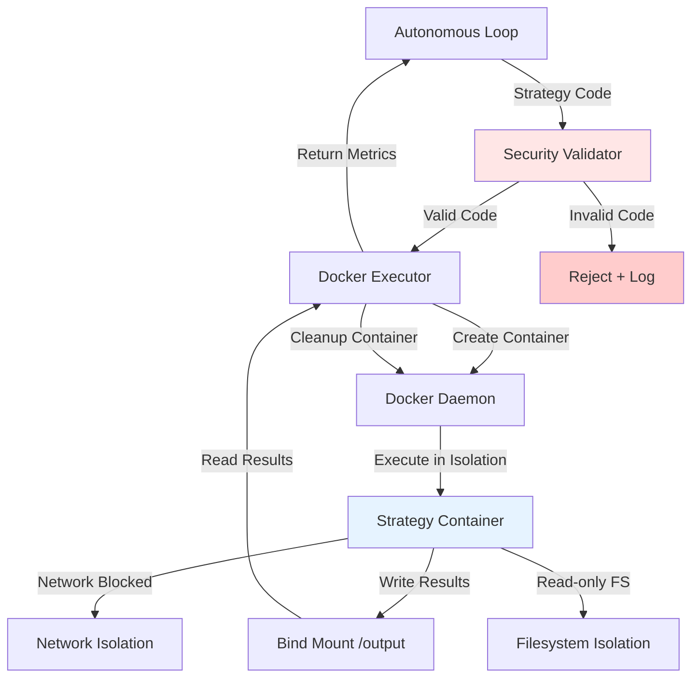

# Design Document: Docker Sandbox Security

## Overview

This design implements a **Docker-based isolated execution environment** for safely running LLM-generated Python strategies. The system creates ephemeral containers with strict resource limits, network isolation, read-only filesystems, and security profiles to prevent code injection attacks and resource exhaustion.

**Architecture Pattern**: Adapter/Wrapper pattern - wrapping existing backtest execution with Docker isolation layer without changing core logic.

## Steering Document Alignment

### Technical Standards (tech.md)
- **Error Handling**: All Docker API calls wrapped in try-except with specific error types
- **Logging**: Structured JSON logging for all container lifecycle events and security rejections
- **Resource Management**: Automatic cleanup of containers using Python context managers
- **Configuration**: Docker settings in `config/learning_system.yaml` with environment variable overrides

### Project Structure (structure.md)
- New module: `src/sandbox/docker_executor.py` - Container execution wrapper
- New module: `src/sandbox/security_validator.py` - Code validation before execution
- Config addition: `config/docker_config.yaml` - Container resource limits and security profiles
- Tests: `tests/sandbox/test_docker_executor.py`, `tests/sandbox/test_security_validator.py`

## Code Reuse Analysis

### Existing Components to Leverage
- **`src/backtest/executor.py`**: Current strategy execution logic - will be wrapped, not replaced
- **`src/validation/ast_validator.py`**: AST-based code validation - reused for syntax checking
- **Python `docker` library**: Official Docker SDK for container management
- **Logging infrastructure**: Existing JSON logger in `src/utils/json_logger.py`

### Integration Points
- **Autonomous Loop**: Modify `artifacts/working/modules/autonomous_loop.py` to use `DockerExecutor` when sandbox mode enabled
- **Config System**: Extend `config/learning_system.yaml` with Docker settings
- **Metrics Collection**: Integrate with existing Prometheus metrics in `src/monitoring/metrics_collector.py`

## Architecture



### Modular Design Principles
- **Single File Responsibility**:
  - `docker_executor.py` - Container lifecycle only
  - `security_validator.py` - Code validation only
  - `docker_config.py` - Configuration loading only
- **Component Isolation**: Docker layer completely decoupled from backtest logic
- **Service Layer Separation**: Validation → Execution → Cleanup as separate phases
- **Utility Modularity**: Reuse existing AST validator, JSON logger, metrics collector

## Components and Interfaces

### Component 1: SecurityValidator
- **Purpose:** Validate strategy code before execution to prevent code injection attacks
- **Interfaces:**
  ```python
  class SecurityValidator:
      def validate_code(self, code: str) -> tuple[bool, list[str]]:
          """Returns (is_valid, error_messages)"""

      def _check_dangerous_imports(self, ast_tree) -> list[str]:
          """Detect os.system, subprocess, eval, exec"""

      def _check_file_operations(self, ast_tree) -> list[str]:
          """Detect file operations outside /tmp"""

      def _check_network_operations(self, ast_tree) -> list[str]:
          """Detect socket, urllib, requests imports"""
  ```
- **Dependencies:** `ast` module, existing `ast_validator.py`
- **Reuses:** AST parsing logic from `src/validation/ast_validator.py`

### Component 2: DockerExecutor
- **Purpose:** Execute validated strategies in isolated Docker containers
- **Interfaces:**
  ```python
  class DockerExecutor:
      def __init__(self, config: DockerConfig):
          """Initialize with resource limits and security settings"""

      def execute_strategy(self, code: str, data: Any) -> dict:
          """Execute strategy and return metrics"""

      def _create_container(self, code: str) -> str:
          """Create container with security profiles, returns container_id"""

      def _run_container(self, container_id: str, timeout: int) -> dict:
          """Execute container with timeout"""

      def _cleanup_container(self, container_id: str):
          """Force remove container and child processes"""

      def cleanup_orphaned_containers(self):
          """Find and remove containers from previous failed runs"""
  ```
- **Dependencies:** `docker` library, `DockerConfig`, `SecurityValidator`
- **Reuses:** Existing execution patterns from `src/backtest/executor.py`

### Component 3: DockerConfig
- **Purpose:** Load and validate Docker configuration from YAML
- **Interfaces:**
  ```python
  @dataclass
  class DockerConfig:
      image: str = "python:3.10-slim"
      memory_limit: str = "2g"
      cpu_limit: float = 0.5
      timeout_seconds: int = 600
      network_mode: str = "none"
      read_only: bool = True
      tmpfs_size: str = "1g"
      seccomp_profile: str = "default"

      @classmethod
      def from_yaml(cls, path: str) -> 'DockerConfig':
          """Load from config/docker_config.yaml"""
  ```
- **Dependencies:** `yaml`, `dataclasses`
- **Reuses:** YAML loading pattern from `config/learning_system.yaml`

### Component 4: ContainerMonitor (Integration with existing metrics)
- **Purpose:** Export container resource usage to Prometheus
- **Interfaces:**
  ```python
  class ContainerMonitor:
      def record_container_created(self, container_id: str):
          """Increment active_containers metric"""

      def record_resource_usage(self, container_id: str, stats: dict):
          """Record memory_usage, cpu_usage from docker.stats()"""

      def record_container_cleanup(self, container_id: str, success: bool):
          """Track cleanup success/failure"""
  ```
- **Dependencies:** Existing `MetricsCollector` from `src/monitoring/metrics_collector.py`
- **Reuses:** Prometheus client library already in project

## Data Models

### DockerExecutionResult
```python
@dataclass
class DockerExecutionResult:
    success: bool
    metrics: dict           # Backtest metrics (sharpe, drawdown, etc.)
    container_id: str
    execution_time: float
    memory_used_mb: float
    cpu_percent: float
    error_message: Optional[str] = None
    security_rejections: list[str] = None
```

### SecurityValidationResult
```python
@dataclass
class SecurityValidationResult:
    is_valid: bool
    errors: list[str]
    warnings: list[str]
    dangerous_imports: list[str]
    file_operations: list[str]
    network_operations: list[str]
```

## Error Handling

### Error Scenarios

1. **Docker Daemon Unavailable**
   - **Handling:** Catch `docker.errors.DockerException`, log error, fall back to direct execution (if fallback enabled in config)
   - **User Impact:** Warning logged: "Docker unavailable, falling back to direct execution (UNSAFE)"
   - **Metrics:** Increment `docker_fallback_total` counter

2. **Container Creation Failure**
   - **Handling:** Catch `docker.errors.ImageNotFound`, `docker.errors.APIError`, retry once after image pull
   - **User Impact:** Strategy marked as failed, error logged with container logs
   - **Metrics:** Increment `container_creation_failed_total`

3. **Timeout During Execution**
   - **Handling:** After 10 minutes, forcefully stop container using `container.kill()`
   - **User Impact:** Strategy marked as timeout failure, partial results discarded
   - **Metrics:** Increment `execution_timeout_total`, record timeout duration

4. **Security Validation Rejection**
   - **Handling:** Log code snippet with rejection reason, increment `security_rejections_total`
   - **User Impact:** Strategy not executed, clear error message returned to autonomous loop
   - **Metrics:** Track rejection reasons: `dangerous_imports`, `file_operations`, `network_operations`

5. **Container Cleanup Failure**
   - **Handling:** Log orphaned container ID, schedule for background cleanup, alert operator if >3 orphaned
   - **User Impact:** Resource leak warning, may impact performance over time
   - **Metrics:** Increment `orphaned_containers` gauge, set `orphaned_containers_alert` if >3

6. **Memory/CPU Limit Exceeded**
   - **Handling:** Container automatically killed by Docker, catch `docker.errors.ContainerError`
   - **User Impact:** Strategy marked as resource exhaustion failure
   - **Metrics:** Increment `resource_limit_exceeded_total`

## Testing Strategy

### Unit Testing

**SecurityValidator Tests** (`tests/sandbox/test_security_validator.py`):
- Test dangerous imports detection: `os.system()`, `subprocess.call()`, `eval()`, `exec()`
- Test file operations: `/etc/passwd` access, `open('/root/...')`
- Test network operations: `urllib.request`, `socket.socket()`
- Test valid code passes: normal FinLab API usage
- **Coverage Target:** >90%

**DockerExecutor Tests** (`tests/sandbox/test_docker_executor.py`):
- Mock Docker daemon with `docker.from_env()` patch
- Test container creation with correct resource limits
- Test timeout enforcement (mock long-running container)
- Test cleanup on success and failure paths
- Test orphaned container detection and cleanup
- **Coverage Target:** >85%

**DockerConfig Tests** (`tests/sandbox/test_docker_config.py`):
- Test YAML loading with valid config
- Test defaults when config missing
- Test validation of invalid memory limits (`-1g`, `abc`)
- **Coverage Target:** 100% (simple dataclass)

### Integration Testing

**End-to-End Sandbox Tests** (`tests/integration/test_docker_sandbox.py`):
1. **Valid Strategy Execution**:
   - Real Docker container creation
   - Execute simple strategy (buy/hold)
   - Verify metrics returned correctly
   - Verify cleanup completes

2. **Security Rejection**:
   - Submit code with `os.system('rm -rf /')`
   - Verify rejection before container creation
   - Verify error logged with reason

3. **Resource Limit Enforcement**:
   - Submit memory-hungry strategy (allocate 3GB in loop)
   - Verify container killed at 2GB limit
   - Verify error returned to caller

4. **Network Isolation**:
   - Submit code attempting `requests.get('http://evil.com')`
   - Verify network blocked even if validation missed
   - Verify execution fails with network error

5. **Filesystem Isolation**:
   - Submit code attempting to write `/etc/malicious`
   - Verify permission denied
   - Submit code writing `/tmp/test.txt`
   - Verify succeeds (tmpfs writable)

**Performance Tests**:
- Measure overhead: Docker vs direct execution (<3s acceptable)
- Test parallel execution: 5 containers simultaneously
- Test cleanup under load: 100 containers created/destroyed

### End-to-End Testing

**Autonomous Loop Integration** (`tests/integration/test_autonomous_loop_sandbox.py`):
1. Run 10 iterations with Docker sandbox enabled
2. Verify all strategies execute in containers
3. Verify no orphaned containers remain after run
4. Verify metrics collected correctly

**Failure Recovery**:
1. Simulate Docker daemon crash mid-execution
2. Verify graceful fallback to direct execution (if enabled)
3. Verify orphaned container cleanup on next run

## Security Profiles

### Seccomp Profile (config/seccomp_profile.json)
```json
{
  "defaultAction": "SCMP_ACT_ERRNO",
  "architectures": ["SCMP_ARCH_X86_64"],
  "syscalls": [
    {"names": ["read", "write", "open", "close", "stat", "fstat"], "action": "SCMP_ACT_ALLOW"},
    {"names": ["execve", "fork", "clone"], "action": "SCMP_ACT_ERRNO"},
    {"names": ["socket", "connect", "bind"], "action": "SCMP_ACT_ERRNO"}
  ]
}
```
- Block process creation: `execve`, `fork`, `clone`
- Block network: `socket`, `connect`, `bind`
- Allow file I/O: `read`, `write`, `open`, `close`

## Configuration Example

### config/docker_config.yaml
```yaml
docker:
  enabled: true
  image: "python:3.10-slim"
  memory_limit: "2g"
  memory_swap_limit: "2g"  # Disable swap
  cpu_limit: 0.5
  timeout_seconds: 600
  network_mode: "none"
  read_only: true
  tmpfs:
    path: "/tmp"
    size: "1g"
    options: "rw,noexec,nosuid"
  seccomp_profile: "config/seccomp_profile.json"
  output_dir: "sandbox_output"
  cleanup_on_exit: true
  fallback_to_direct: false  # CRITICAL: Set false for production

monitoring:
  export_container_stats: true
  alert_on_orphaned_containers: 3
  prometheus_port: 8000
```

## Deployment Checklist

1. ✅ Install Docker Engine (v20.10+)
2. ✅ Build Python 3.10 base image with FinLab dependencies
3. ✅ Create seccomp profile at `config/seccomp_profile.json`
4. ✅ Configure `docker_config.yaml` with production settings
5. ✅ Set `fallback_to_direct: false` (no unsafe fallback in production)
6. ✅ Run integration tests to verify isolation
7. ✅ Set up Grafana alerts for orphaned containers
8. ✅ Document emergency Docker disable procedure

## Performance Considerations

- **Container Creation**: ~2-3s per container (includes image pull if needed)
- **Execution Overhead**: <5% vs direct execution for typical strategies
- **Memory Overhead**: ~100MB per container (Python runtime + dependencies)
- **Cleanup Time**: <1s per container
- **Parallel Execution**: Support up to 10 concurrent containers (configurable)

## Future Enhancements (Out of Scope)

- **Container Pooling**: Reuse containers to reduce creation overhead
- **GPU Access**: Enable CUDA for ML-based strategies
- **Network Whitelist**: Allow specific APIs (e.g., FinLab data only)
- **Persistent Cache**: Mount package cache to speed up dependency installation
