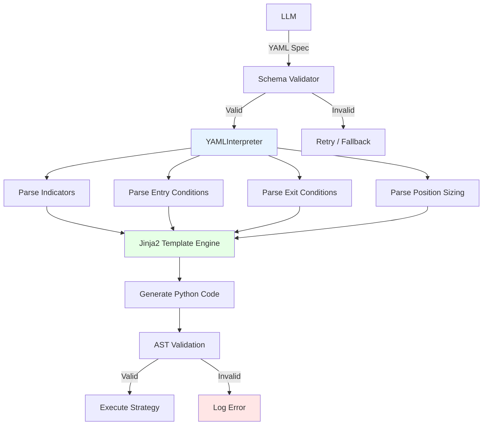

# Design Document: Structured Innovation MVP (Phase 2a)

## Overview

Implements YAML/JSON-based structured innovation where LLMs create declarative strategy specifications instead of full code. Templates generate syntactically correct Python code, reducing hallucination risk by 80% while maintaining 85% innovation coverage.

**Architecture Pattern:** Interpreter + Template Method - Parse YAML specs, interpret into Python using Jinja2 templates.

## Architecture



## Components and Interfaces

### Component 1: YAMLSchemaValidator
```python
class YAMLSchemaValidator:
    def validate(self, spec: dict) -> tuple[bool, list[str]]:
        """Validate against schemas/strategy_schema_v1.json"""

    def _check_required_fields(self, spec: dict) -> list[str]:
        """Verify metadata, indicators, entry_conditions, exit_conditions"""

    def _validate_indicators(self, indicators: dict) -> list[str]:
        """Check indicator types (technical, fundamental, custom)"""
```

### Component 2: YAMLToCodeGenerator
```python
class YAMLToCodeGenerator:
    def __init__(self, template_path: str = "src/generators/yaml_to_code_template.py"):
        self.jinja_env = jinja2.Environment(...)

    def generate_code(self, spec: dict) -> str:
        """Generate Python code from YAML spec"""

    def _generate_indicators_section(self, indicators: dict) -> str:
        """Generate: rsi = data.get('RSI_14')"""

    def _generate_entry_conditions_section(self, conditions: dict) -> str:
        """Generate: (rsi > 30) & (close > ma_50)"""

    def _generate_position_sizing_section(self, sizing: dict) -> str:
        """Generate: equal_weight, factor_weighted, etc."""
```

### Component 3: StructuredPromptBuilder
```python
class StructuredPromptBuilder:
    def build_yaml_generation_prompt(self, champion_yaml: dict,
                                     directive: str) -> str:
        """Build prompt requesting YAML spec modification/creation"""

    YAML_SCHEMA_EXAMPLE = """
metadata:
  name: "Momentum Strategy"
  strategy_type: "momentum"
  rebalancing: "W-FRI"

indicators:
  technical:
    - name: "rsi_14"
      type: "RSI"
      period: 14
    - name: "ma_50"
      type: "SMA"
      period: 50

entry_conditions:
  threshold_rules:
    - "rsi_14 > 30"
    - "close > ma_50"
  logical_operator: "AND"

exit_conditions:
  stop_loss_pct: 0.10
  take_profit_pct: 0.20

position_sizing:
  type: "equal_weight"
"""
```

### Component 4: Integration with InnovationEngine
```python
# Extend InnovationEngine
class InnovationEngine:
    def generate_structured(self, champion_yaml: dict, directive: str) -> str:
        """Generate YAML spec instead of full code"""
        prompt = structured_prompt_builder.build_yaml_generation_prompt(...)
        response = llm_provider.generate(prompt)
        spec_yaml = self._extract_yaml(response)

        # Validate
        is_valid, errors = yaml_validator.validate(spec_yaml)
        if not is_valid:
            raise ValidationError(errors)

        # Generate code from YAML
        code = yaml_to_code_generator.generate_code(spec_yaml)
        return code
```

## Data Models

### StrategySpec
```python
@dataclass
class StrategySpec:
    metadata: Metadata
    indicators: Indicators
    entry_conditions: EntryConditions
    exit_conditions: ExitConditions
    position_sizing: PositionSizing

@dataclass
class Metadata:
    name: str
    description: str
    strategy_type: str  # momentum, mean_reversion, factor_combination
    rebalancing: str    # M, W-FRI

@dataclass
class Indicators:
    technical: list[TechnicalIndicator]
    fundamental: list[FundamentalFactor]
    custom_calculations: list[str]
```

## Error Handling

1. **YAML Parsing Failure**
   - Extract YAML using regex: ```yaml\n(.*?)\n```
   - Retry once with explicit instruction
   - Fallback to full code generation

2. **Schema Validation Failure**
   - Log validation errors, increment `yaml_validation_failure_total`
   - Fallback to Factor Graph mutation

3. **Code Generation Template Error**
   - Log Jinja2 error, return empty code
   - Fallback to Factor Graph

## Testing Strategy

**Unit Tests:**
- Test schema validation with valid/invalid specs
- Test code generation for each indicator type
- Test entry/exit condition generation
- **Coverage:** >85%

**Integration Tests:**
- Generate YAML spec → validate → generate code → execute
- Test 3 strategy types: momentum, mean_reversion, factor_combination
- Verify >90% success rate vs ~60% for full code generation

## Configuration Example

### schemas/strategy_schema_v1.json
```json
{
  "$schema": "http://json-schema.org/draft-07/schema#",
  "type": "object",
  "required": ["metadata", "indicators", "entry_conditions"],
  "properties": {
    "metadata": {
      "type": "object",
      "required": ["name", "strategy_type", "rebalancing"],
      "properties": {
        "name": {"type": "string"},
        "strategy_type": {"enum": ["momentum", "mean_reversion", "factor_combination"]},
        "rebalancing": {"enum": ["M", "W-FRI", "W-MON"]}
      }
    },
    "indicators": {
      "type": "object",
      "properties": {
        "technical": {"type": "array", "items": {"type": "object"}},
        "fundamental": {"type": "array", "items": {"type": "object"}}
      }
    }
  }
}
```

### config/learning_system.yaml
```yaml
llm:
  mode: "structured"  # structured, code, hybrid
  hybrid_structured_ratio: 0.80  # 80% YAML, 20% full code
```

## Performance Considerations

- **YAML Parsing:** <10ms
- **Schema Validation:** <50ms
- **Code Generation:** <200ms
- **End-to-End:** <300ms (vs ~10s for LLM full code generation)

## Future Enhancements
- **Custom Indicator Plugins:** User-defined indicator types
- **Multi-condition Expressions:** Complex boolean logic
- **Backtesting Parameter Grid:** Define parameter ranges for optimization
