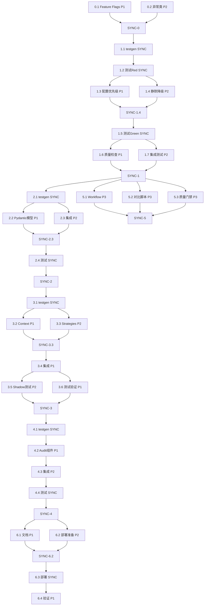

# architecture-contradictions-fix - Task List

## 并行执行策略概览

本任务计划设计为**最大化并行处理**，通过识别独立任务流和优化依赖关系，将串行执行时间从 122 小时压缩至**约 60 小时实际工时**。

### 并行执行原则
1. **Phase 内并行**: 同一 Phase 中无依赖关系的任务可以并行执行
2. **Cross-Phase 并行**: Phase 5 (CI/CD) 可以在 Phase 1 开始后立即启动
3. **Test-First 并行**: testgen 完成后，实现和测试可以并行开发
4. **多人协作**: 标记 `[P1]`, `[P2]`, `[P3]` 表示可由不同开发者并行处理

### 并行度标记
- 🔵 **[P1]**: 并行流 1 (核心逻辑修复)
- 🟢 **[P2]**: 并行流 2 (配置和验证)
- 🟡 **[P3]**: 并行流 3 (基础设施和工具)
- 🔴 **[SYNC]**: 同步点 (必须等待所有并行流完成)

---

## Implementation Tasks

### Phase 0: 准备工作 (可完全并行)

**并行策略**: 2个独立任务流，可由2名开发者同时执行

- [ ] **0.1 [P1] 创建 Kill Switch 和 Feature Flags** (2 hours)
    - [ ] 0.1.1. 创建配置文件
        - *Goal*: 设置 master kill switch 和 phase-specific feature flags
        - *Details*: 在 `src/learning/config.py` 中添加环境变量读取
        - *Requirements*: REQ-5.1 (渐进式部署)
        - *Parallel*: 可与 0.2 并行
        ```python
        # src/learning/config.py
        import os

        ENABLE_GENERATION_REFACTORING = os.getenv("ENABLE_GENERATION_REFACTORING", "false").lower() == "true"
        PHASE1_CONFIG_ENFORCEMENT = os.getenv("PHASE1_CONFIG_ENFORCEMENT", "false").lower() == "true"
        PHASE2_PYDANTIC_VALIDATION = os.getenv("PHASE2_PYDANTIC_VALIDATION", "false").lower() == "true"
        PHASE3_STRATEGY_PATTERN = os.getenv("PHASE3_STRATEGY_PATTERN", "false").lower() == "true"
        PHASE4_AUDIT_TRAIL = os.getenv("PHASE4_AUDIT_TRAIL", "false").lower() == "true"
        ```
    - [ ] 0.1.2. 添加 legacy 方法
        - *Goal*: 保留原实现作为 fallback
        - *Details*: 在 `iteration_executor.py` 中将 `_decide_generation_method()` 复制为 `_decide_generation_method_legacy()`
        - *Requirements*: REQ-5.1 (快速回滚)
        - *Parallel*: 可与 0.2 并行

- [ ] **0.2 [P2] 创建异常类层次结构** (2 hours)
    - [ ] 0.2.1. 定义基础异常类
        - *Goal*: 建立完整的异常层次结构
        - *Details*: 创建新文件 `src/learning/exceptions.py`
        - *Requirements*: REQ-2.1 (错误显式化)
        - *Parallel*: 可与 0.1 并行
        ```python
        # src/learning/exceptions.py
        class GenerationError(Exception):
            """Base exception for all generation-related errors."""
            pass

        class ConfigurationError(GenerationError):
            """Base exception for configuration-related errors."""
            pass

        class ConfigurationConflictError(ConfigurationError):
            """Raised when configuration has conflicting settings.

            Example: use_factor_graph=True AND innovation_rate=100
            """
            pass

        class LLMGenerationError(GenerationError):
            """Base exception for LLM generation failures."""
            pass

        class LLMUnavailableError(LLMGenerationError):
            """Raised when LLM client or engine is not available."""
            pass

        class LLMEmptyResponseError(LLMGenerationError):
            """Raised when LLM returns empty code."""
            pass
        ```

**Phase 0 同步点 [SYNC-0]**: 所有 0.x 任务完成后进入 Phase 1

---

### Phase 1: Emergency Fix (部分并行)

**并行策略**: testgen → Red → 2个并行流 (配置优先级 + 静默降级) → Green → 2个并行流 (质量检查 + 集成测试)

- [ ] **1.1 [SYNC] 使用 zen testgen 生成 Phase 1 测试套件** (4 hours)
    - *Status*: ✅ 已完成 (`tests/learning/test_iteration_executor_phase1.py`)
    - [ ] 1.1.1. 验证配置优先级测试
        - *Goal*: 确认测试覆盖所有配置场景
        - *Details*: 检查 `TestDecideGenerationMethod` 类
        - *Requirements*: REQ-1.1, REQ-1.2
        - *Parallel*: 串行执行（testgen 必须先完成）
    - [ ] 1.1.2. 验证静默降级消除测试
        - *Goal*: 确认测试覆盖所有4个降级点
        - *Details*: 检查 `TestGenerateWithLLM` 类
        - *Requirements*: REQ-2.1

- [ ] **1.2 [SYNC] 运行测试验证 Red** (1 hour)
    - [ ] 1.2.1. 运行 Phase 1 测试套件
        - *Goal*: 验证测试失败（当前实现有 bug）
        - *Details*: `pytest tests/learning/test_iteration_executor_phase1.py -v`
        - *Requirements*: TDD 流程
        - *Parallel*: 串行执行（依赖 1.1）
    - [ ] 1.2.2. 确认失败的测试用例
        - *Goal*: 确认测试正确捕获了 bug
        - *Details*: 检查失败信息是否对应已知的7个架构矛盾
        - *Requirements*: REQ-1.1, REQ-2.1

**[SYNC-1.2]**: 测试 Red 验证完成后，进入并行实现阶段

- [ ] **1.3 [P1] 实现配置优先级强制执行** (4 hours)
    - [ ] 1.3.1. 修复 `_decide_generation_method()`
        - *Goal*: 实现 `use_factor_graph` > `innovation_rate` 优先级
        - *Details*: 修改 `src/learning/iteration_executor.py:328-344`
        - *Requirements*: REQ-1.1, REQ-1.2
        - *Parallel*: 可与 1.4 并行 ✅
        ```python
        def _decide_generation_method(self) -> bool:
            # Kill switch check
            if not ENABLE_GENERATION_REFACTORING or not PHASE1_CONFIG_ENFORCEMENT:
                return self._decide_generation_method_legacy()

            use_factor_graph = self.config.get("use_factor_graph")
            innovation_rate = self.config.get("innovation_rate", 100)

            # Configuration conflict detection
            if use_factor_graph is True and innovation_rate == 100:
                raise ConfigurationConflictError(
                    "Configuration conflict: use_factor_graph=True but innovation_rate=100 "
                    "(forces Factor Graph AND forces LLM)"
                )

            # Priority: use_factor_graph > innovation_rate
            if use_factor_graph is not None:
                return not use_factor_graph  # True=LLM, False=FactorGraph

            # Fallback to innovation_rate
            use_llm = random.random() * 100 < innovation_rate
            return use_llm
        ```
    - [ ] 1.3.2. 添加配置冲突检测
        - *Goal*: 在配置冲突时抛出 `ConfigurationConflictError`
        - *Details*: 检测 `use_factor_graph=True AND innovation_rate=100`
        - *Requirements*: REQ-1.3
        - *Parallel*: 可与 1.4 并行 ✅

- [ ] **1.4 [P2] 消除静默降级（4个降级点）** (6 hours)
    - [ ] 1.4.1. 修复降级点1（Lines 360-362）
        - *Goal*: LLM client 未启用时抛出错误
        - *Details*: 将 `logger.warning` + `return self._generate_with_factor_graph()` 替换为 `raise LLMUnavailableError("LLM client is not enabled")`
        - *Requirements*: REQ-2.1
        - *Parallel*: 可与 1.3 并行 ✅
    - [ ] 1.4.2. 修复降级点2（Lines 366-368）
        - *Goal*: LLM engine 不可用时抛出错误
        - *Details*: 将 fallback 替换为 `raise LLMUnavailableError("LLM engine not available")`
        - *Requirements*: REQ-2.1
        - *Parallel*: 可与 1.3 并行 ✅
    - [ ] 1.4.3. 修复降级点3（Lines 398-400）
        - *Goal*: LLM 返回空代码时抛出错误
        - *Details*: 将 fallback 替换为 `raise LLMEmptyResponseError("LLM returned empty code")`
        - *Requirements*: REQ-2.1
        - *Parallel*: 可与 1.3 并行 ✅
    - [ ] 1.4.4. 修复降级点4（Lines 406-409）
        - *Goal*: LLM 生成异常时保留上下文并抛出错误
        - *Details*: 将 fallback 替换为 `raise LLMGenerationError(f"LLM generation failed: {e}") from e`
        - *Requirements*: REQ-2.1, REQ-2.2
        - *Parallel*: 可与 1.3 并行 ✅

**[SYNC-1.4]**: 1.3 和 1.4 都完成后，进入测试验证

- [ ] **1.5 [SYNC] 运行测试验证 Green** (2 hours)
    - [ ] 1.5.1. 运行 Phase 1 测试套件
        - *Goal*: 验证所有测试通过
        - *Details*: `pytest tests/learning/test_iteration_executor_phase1.py -v --cov=src/learning/iteration_executor --cov-report=term --cov-fail-under=95`
        - *Requirements*: TDD 流程
        - *Parallel*: 串行执行（依赖 1.3 和 1.4）
    - [ ] 1.5.2. 检查覆盖率
        - *Goal*: 确保 >95% 覆盖率
        - *Details*: 使用 pytest-cov 报告
        - *Requirements*: REQ-NFR-3

**[SYNC-1.5]**: 测试 Green 后，进入质量检查并行阶段

- [ ] **1.6 [P1] 代码质量检查** (3 hours)
    - [ ] 1.6.1. 运行循环复杂度分析
        - *Goal*: 验证技术债务减少
        - *Details*: `radon cc src/learning/iteration_executor.py -a -nb`，目标 <5.0 平均复杂度
        - *Requirements*: REQ-NFR-2
        - *Parallel*: 可与 1.7 并行 ✅
    - [ ] 1.6.2. 运行类型检查
        - *Goal*: 确保类型安全
        - *Details*: `mypy src/learning/iteration_executor.py`
        - *Requirements*: REQ-NFR-1
        - *Parallel*: 可与 1.7 并行 ✅
    - [ ] 1.6.3. 代码审查和重构
        - *Goal*: 优化代码可读性和可维护性
        - *Details*: 在保持测试通过的前提下重构
        - *Requirements*: TDD 流程
        - *Parallel*: 可与 1.7 并行 ✅

- [ ] **1.7 [P2] Phase 1 集成测试** (2 hours)
    - [ ] 1.7.1. 手动测试配置场景
        - *Goal*: 验证实际行为
        - *Details*: 测试 `use_factor_graph=True/False/None` + `innovation_rate=0/50/100` 组合
        - *Requirements*: REQ-1.1, REQ-1.2
        - *Parallel*: 可与 1.6 并行 ✅
    - [ ] 1.7.2. 验证错误处理
        - *Goal*: 确认错误信息清晰且可操作
        - *Details*: 手动触发各种错误场景，检查错误信息
        - *Requirements*: REQ-2.1
        - *Parallel*: 可与 1.6 并行 ✅

**Phase 1 同步点 [SYNC-1]**: 所有 1.x 任务完成后进入 Phase 2

---

### Phase 2: Pydantic 配置验证 (部分并行)

**并行策略**: testgen → 实现和集成可部分并行

- [ ] **2.1 [SYNC] 使用 zen testgen 生成 Phase 2 测试套件** (4 hours)
    - [ ] 2.1.1. 生成 Pydantic 模型测试
        - *Goal*: 为 `GenerationConfig` 创建验证测试
        - *Details*: 使用 zen testgen，目标文件 `tests/learning/test_config_models.py`
        - *Requirements*: REQ-3.1
        - *Parallel*: 串行执行
    - [ ] 2.1.2. 生成配置冲突检测测试
        - *Goal*: 测试编译时配置验证
        - *Details*: 测试无效配置在初始化时被拒绝
        - *Requirements*: REQ-3.2
        - *Parallel*: 串行执行

**[SYNC-2.1]**: testgen 完成后，进入并行实现阶段

- [ ] **2.2 [P1] 实现 Pydantic 配置模型** (6 hours)
    - [ ] 2.2.1. 创建 `src/learning/config_models.py`
        - *Goal*: 定义 `GenerationConfig` Pydantic 模型
        - *Details*: 包含 `use_factor_graph`, `innovation_rate` 字段
        - *Requirements*: REQ-3.1
        - *Parallel*: 可与 2.3.1 并行 ✅
    - [ ] 2.2.2. 实现字段验证器
        - *Goal*: 添加 `@field_validator` 进行编译时验证
        - *Details*: 验证 `innovation_rate` 范围（0-100）和配置冲突
        - *Requirements*: REQ-3.2
        - *Parallel*: 可与 2.3.1 并行 ✅
    - [ ] 2.2.3. 实现 `should_use_llm()` 方法
        - *Goal*: 在 Pydantic 模型中封装决策逻辑
        - *Details*: 优先级逻辑与 Phase 1 一致
        - *Requirements*: REQ-3.1
        - *Parallel*: 依赖 2.2.1, 2.2.2，但可与 2.3.2 并行 ✅

- [ ] **2.3 [P2] 集成 Pydantic 到 IterationExecutor** (4 hours)
    - [ ] 2.3.1. 修改 `__init__()` 方法（准备）
        - *Goal*: 准备集成点
        - *Details*: 添加 validated_config 属性初始化占位符
        - *Requirements*: REQ-3.2
        - *Parallel*: 可与 2.2.1, 2.2.2 并行 ✅
    - [ ] 2.3.2. 实现配置验证逻辑
        - *Goal*: 使用 Pydantic 验证配置
        - *Details*: `self.validated_config = GenerationConfig(**config)` with feature flag
        - *Requirements*: REQ-3.2
        - *Parallel*: 依赖 2.2.1, 2.2.2，可与 2.2.3 并行 ✅
    - [ ] 2.3.3. 更新 `_decide_generation_method()`
        - *Goal*: 使用 Pydantic 模型的决策方法
        - *Details*: Feature flag 控制，启用时调用 `self.validated_config.should_use_llm()`
        - *Requirements*: REQ-3.1
        - *Parallel*: 依赖 2.2.3

**[SYNC-2.3]**: 2.2 和 2.3 都完成后，进入测试验证

- [ ] **2.4 [SYNC] 运行测试验证** (2 hours)
    - [ ] 2.4.1. 运行 Phase 2 测试套件
        - *Goal*: 验证所有 Pydantic 测试通过
        - *Details*: `pytest tests/learning/test_config_models.py -v --cov=src/learning/config_models --cov-fail-under=95`
        - *Requirements*: TDD 流程
        - *Parallel*: 串行执行
    - [ ] 2.4.2. 回归测试 Phase 1
        - *Goal*: 确保 Phase 2 不破坏 Phase 1
        - *Details*: `pytest tests/learning/test_iteration_executor_phase1.py -v`
        - *Requirements*: 回归测试
        - *Parallel*: 串行执行

**Phase 2 同步点 [SYNC-2]**: 所有 2.x 任务完成后进入 Phase 3

---

### Phase 3: Strategy Pattern 重构 (高度并行)

**并行策略**: testgen → Context 和 Strategies 可并行实现 → 集成

- [ ] **3.1 [SYNC] 使用 zen testgen 生成 Phase 3 测试套件** (6 hours)
    - [ ] 3.1.1. 生成 Strategy 接口测试
        - *Goal*: 为 `GenerationStrategy` 及其实现类创建测试
        - *Details*: 目标文件 `tests/learning/test_generation_strategies.py`
        - *Requirements*: REQ-4.1
    - [ ] 3.1.2. 生成 StrategyFactory 测试
        - *Goal*: 测试策略选择逻辑
        - *Details*: 验证 factory 根据配置返回正确的策略
        - *Requirements*: REQ-4.2
    - [ ] 3.1.3. 生成 Shadow Mode 测试
        - *Goal*: 创建新旧实现等价性测试
        - *Details*: 使用 Pytest fixture 并行运行新旧实现
        - *Requirements*: Design - Shadow Mode Testing

**[SYNC-3.1]**: testgen 完成后，进入高度并行实现阶段

- [ ] **3.2 [P1] 实现 GenerationContext dataclass** (2 hours)
    - [ ] 3.2.1. 创建不可变上下文
        - *Goal*: 定义 `@dataclass(frozen=True)` 封装所有策略执行数据
        - *Details*: 在 `generation_strategies.py` 开头定义
        - *Requirements*: Design - GenerationContext
        - *Parallel*: 可与 3.3.1 并行 ✅

- [ ] **3.3 [P2] 实现 Strategy Pattern 组件** (12 hours)
    - [ ] 3.3.1. 创建 `src/learning/generation_strategies.py` 并定义接口
        - *Goal*: 定义 `GenerationStrategy` 抽象基类
        - *Details*: 包含 `generate(context: GenerationContext)` 抽象方法
        - *Requirements*: REQ-4.1
        - *Parallel*: 可与 3.2 并行 ✅
    - [ ] 3.3.2. 实现 `LLMStrategy`
        - *Goal*: 封装 LLM 生成逻辑
        - *Details*: 将 `_generate_with_llm()` 的核心逻辑移至此类
        - *Requirements*: REQ-4.1
        - *Parallel*: 可与 3.3.3, 3.3.4 并行 ✅
    - [ ] 3.3.3. 实现 `FactorGraphStrategy`
        - *Goal*: 封装 Factor Graph 生成逻辑
        - *Details*: 包装 `factor_graph_generator.generate()`
        - *Requirements*: REQ-4.1
        - *Parallel*: 可与 3.3.2, 3.3.4 并行 ✅
    - [ ] 3.3.4. 实现 `MixedStrategy`
        - *Goal*: 基于 `innovation_rate` 的概率混合策略
        - *Details*: 随机选择 LLM 或 Factor Graph
        - *Requirements*: REQ-4.1
        - *Parallel*: 可与 3.3.2, 3.3.3 并行 ✅
    - [ ] 3.3.5. 实现 `StrategyFactory`
        - *Goal*: 根据配置创建策略
        - *Details*: 优先级逻辑 `use_factor_graph` > `innovation_rate`
        - *Requirements*: REQ-4.2
        - *Parallel*: 依赖 3.3.2, 3.3.3, 3.3.4 完成

**[SYNC-3.3]**: 所有 Strategy 实现完成后，进入集成阶段

- [ ] **3.4 [P1] 集成 Strategy Pattern 到 IterationExecutor** (4 hours)
    - [ ] 3.4.1. 添加策略初始化
        - *Goal*: 在 `__init__()` 中创建策略
        - *Details*: Feature flag 控制，启用时使用 `StrategyFactory.create_strategy()`
        - *Requirements*: REQ-4.2
        - *Parallel*: 串行执行（依赖所有 3.3）
    - [ ] 3.4.2. 重构 `execute_iterations()`
        - *Goal*: 使用策略模式替代直接调用
        - *Details*: 创建 `GenerationContext` 并调用 `strategy.generate(context)`
        - *Requirements*: REQ-4.1
        - *Parallel*: 串行执行（依赖 3.4.1）

**[SYNC-3.4]**: 集成完成后，进入并行测试阶段

- [ ] **3.5 [P2] 运行 Shadow Mode 测试** (4 hours)
    - [ ] 3.5.1. 本地 Shadow Mode 测试
        - *Goal*: 验证新旧实现等价性
        - *Details*: `pytest tests/learning/test_shadow_mode.py -v`
        - *Requirements*: Design - Shadow Mode Testing
        - *Parallel*: 可与 3.6.1 并行 ✅
    - [ ] 3.5.2. 比较输出
        - *Goal*: 确保 >95% 等价性
        - *Details*: 运行 `scripts/compare_shadow_outputs.py`
        - *Requirements*: Design - Shadow Mode Testing
        - *Parallel*: 可与 3.6.1 并行 ✅

- [ ] **3.6 [P1] 运行测试验证** (2 hours)
    - [ ] 3.6.1. 运行 Phase 3 测试套件
        - *Goal*: 验证所有 Strategy Pattern 测试通过
        - *Details*: `pytest tests/learning/test_generation_strategies.py -v --cov=src/learning/generation_strategies --cov-fail-under=95`
        - *Requirements*: TDD 流程
        - *Parallel*: 可与 3.5 并行 ✅
    - [ ] 3.6.2. 回归测试 Phase 1 & 2
        - *Goal*: 确保 Phase 3 不破坏之前的修复
        - *Details*: `pytest tests/learning/test_iteration_executor_phase1.py tests/learning/test_config_models.py -v`
        - *Requirements*: 回归测试
        - *Parallel*: 串行执行（依赖 3.6.1）

**Phase 3 同步点 [SYNC-3]**: 所有 3.x 任务完成后进入 Phase 4

---

### Phase 4: Audit Trail 系统 (部分并行)

**并行策略**: testgen → 实现组件可并行 → 集成

- [ ] **4.1 [SYNC] 使用 zen testgen 生成 Phase 4 测试套件** (4 hours)
    - [ ] 4.1.1. 生成 AuditLogger 测试
        - *Goal*: 为 `AuditLogger` 创建测试
        - *Details*: 目标文件 `tests/learning/test_audit_trail.py`
        - *Requirements*: REQ-5.1
    - [ ] 4.1.2. 生成 GenerationDecision 测试
        - *Goal*: 测试决策记录数据结构
        - *Details*: 验证 dataclass 序列化和反序列化
        - *Requirements*: REQ-5.1

**[SYNC-4.1]**: testgen 完成后，进入并行实现阶段

- [ ] **4.2 [P1] 实现 Audit Trail 组件** (8 hours)
    - [ ] 4.2.1. 创建 `src/learning/audit_trail.py` 和 GenerationDecision
        - *Goal*: 定义 `GenerationDecision` dataclass
        - *Details*: 包含 timestamp, decision, reason, config_snapshot, success, error 等字段
        - *Requirements*: REQ-5.1
        - *Parallel*: 可与 4.2.2 并行 ✅
    - [ ] 4.2.2. 实现 `AuditLogger` 基础功能
        - *Goal*: 实现 `log_decision()` 方法
        - *Details*: 记录决策到 JSON 日志文件
        - *Requirements*: REQ-5.1
        - *Parallel*: 可与 4.2.1 并行 ✅
    - [ ] 4.2.3. 实现 HTML 报告生成
        - *Goal*: 实现 `generate_html_report()` 方法
        - *Details*: 从 JSON 日志生成可视化报告，包含决策统计和趋势分析
        - *Requirements*: REQ-5.2
        - *Parallel*: 依赖 4.2.1, 4.2.2

**[SYNC-4.2]**: 所有组件实现完成后，进入集成阶段

- [ ] **4.3 [P2] 集成 Audit Trail 到 IterationExecutor** (4 hours)
    - [ ] 4.3.1. 添加 AuditLogger 初始化
        - *Goal*: 在 `__init__()` 中创建 logger
        - *Details*: Feature flag 控制，启用时初始化 `self.audit_logger = AuditLogger()`
        - *Requirements*: REQ-5.1
        - *Parallel*: 串行执行（依赖 4.2）
    - [ ] 4.3.2. 包装策略调用
        - *Goal*: 在 `execute_iterations()` 中记录决策
        - *Details*: 使用 try/except 包装 `strategy.generate()` 调用，成功和失败都记录
        - *Requirements*: Design - Audit Trail Integration (Option B)
        - *Parallel*: 串行执行（依赖 4.3.1）

- [ ] **4.4 [SYNC] 运行测试验证** (2 hours)
    - [ ] 4.4.1. 运行 Phase 4 测试套件
        - *Goal*: 验证所有 Audit Trail 测试通过
        - *Details*: `pytest tests/learning/test_audit_trail.py -v --cov=src/learning/audit_trail --cov-fail-under=95`
        - *Requirements*: TDD 流程
    - [ ] 4.4.2. 回归测试 Phase 1-3
        - *Goal*: 确保 Phase 4 不破坏之前的修复
        - *Details*: `pytest tests/learning/test_*.py -v`
        - *Requirements*: 回归测试
    - [ ] 4.4.3. 验证审计日志输出
        - *Goal*: 手动检查 JSON 日志和 HTML 报告
        - *Details*: 运行测试后查看 `logs/generation_audit/` 目录
        - *Requirements*: REQ-5.2

**Phase 4 同步点 [SYNC-4]**: 所有 4.x 任务完成后进入 Phase 5

---

### Phase 5: CI/CD 配置 (高度并行，可与 Phase 2-4 交叉)

**并行策略**: 可在 Phase 1 完成后立即启动，与 Phase 2-4 并行执行

- [ ] **5.1 [P3] 创建 GitHub Actions Workflow** (6 hours)
    - *Start Condition*: Phase 1 完成后即可开始
    - [ ] 5.1.1. 创建 workflow 文件框架
        - *Goal*: 创建 `.github/workflows/architecture-refactoring.yml` 基础结构
        - *Details*: 定义 jobs 框架和触发条件
        - *Requirements*: REQ-NFR-4
        - *Parallel*: 可与 Phase 2 并行启动 ✅
    - [ ] 5.1.2. 配置 type-check job
        - *Goal*: 运行 mypy 类型检查
        - *Details*: 检查所有新文件的类型安全，timeout 5 分钟
        - *Requirements*: REQ-NFR-1
        - *Parallel*: 可与 5.1.3, 5.1.4, 5.1.5 并行 ✅
    - [ ] 5.1.3. 配置 unit-tests job
        - *Goal*: 运行所有单元测试
        - *Details*: 包含覆盖率检查（>95%）和复杂度分析，timeout 10 分钟
        - *Requirements*: REQ-NFR-3
        - *Parallel*: 可与 5.1.2, 5.1.4, 5.1.5 并行 ✅
    - [ ] 5.1.4. 配置 shadow-mode-tests job
        - *Goal*: 运行 Shadow Mode 验证
        - *Details*: 仅在 PR 时运行，验证新旧实现等价性，timeout 15 分钟
        - *Requirements*: Design - Shadow Mode Testing
        - *Parallel*: 可与 5.1.2, 5.1.3, 5.1.5 并行 ✅
    - [ ] 5.1.5. 配置 integration-tests job
        - *Goal*: 运行端到端集成测试
        - *Details*: 启用所有 feature flags，测试完整流程，timeout 20 分钟
        - *Requirements*: REQ-NFR-4
        - *Parallel*: 可与 5.1.2, 5.1.3, 5.1.4 并行 ✅

- [ ] **5.2 [P3] 创建 Shadow Mode 对比脚本** (3 hours)
    - [ ] 5.2.1. 实现输出对比逻辑
        - *Goal*: 创建 `scripts/compare_shadow_outputs.py`
        - *Details*: 比较新旧实现的 JSON 输出，计算等价性百分比
        - *Requirements*: Design - Shadow Mode Testing
        - *Parallel*: 可与 5.1, 5.3 并行 ✅
    - [ ] 5.2.2. 设置阈值检查
        - *Goal*: 验证 >95% 等价性
        - *Details*: 如果低于阈值，脚本返回非零退出码
        - *Requirements*: Design - Shadow Mode Testing
        - *Parallel*: 可与 5.1, 5.3 并行 ✅

- [ ] **5.3 [P3] 配置 PR 质量门禁** (2 hours)
    - [ ] 5.3.1. 设置 required checks
        - *Goal*: 强制 PR 通过所有检查才能合并
        - *Details*: 在 GitHub 仓库设置中配置分支保护规则
        - *Requirements*: REQ-NFR-4
        - *Parallel*: 可与 5.1, 5.2 并行 ✅
    - [ ] 5.3.2. 配置 CODEOWNERS
        - *Goal*: 自动分配代码审查人员
        - *Details*: 创建 `.github/CODEOWNERS` 文件
        - *Requirements*: REQ-NFR-4
        - *Parallel*: 可与 5.1, 5.2 并行 ✅

**Phase 5 同步点 [SYNC-5]**: 所有 5.x 任务完成，CI/CD 系统可用

---

### Phase 6: 文档和部署 (部分并行)

**并行策略**: 文档和部署准备可并行，部署必须串行

- [ ] **6.1 [P1] 更新项目文档** (6 hours)
    - [ ] 6.1.1. 更新 README.md
        - *Goal*: 添加新功能说明和使用指南
        - *Details*: 描述配置优先级、feature flags、异常处理
        - *Requirements*: REQ-NFR-5
        - *Parallel*: 可与 6.1.2, 6.1.3, 6.2 并行 ✅
    - [ ] 6.1.2. 创建 MIGRATION_GUIDE.md
        - *Goal*: 提供从旧实现迁移的指南
        - *Details*: 说明如何启用各个 phase，如何处理配置变更
        - *Requirements*: REQ-NFR-5
        - *Parallel*: 可与 6.1.1, 6.1.3, 6.2 并行 ✅
    - [ ] 6.1.3. 更新 API 文档
        - *Goal*: 文档化新的异常类和配置模型
        - *Details*: 使用 Sphinx 或 MkDocs 生成 API 文档
        - *Requirements*: REQ-NFR-5
        - *Parallel*: 可与 6.1.1, 6.1.2, 6.2 并行 ✅

- [ ] **6.2 [P2] 准备部署** (4 hours)
    - [ ] 6.2.1. 创建部署清单
        - *Goal*: 列出部署步骤和验证点
        - *Details*: 包含环境变量配置、数据库迁移、回滚步骤
        - *Requirements*: REQ-5.3
        - *Parallel*: 可与 6.1 并行 ✅
    - [ ] 6.2.2. 配置监控告警
        - *Goal*: 监控新功能的运行状态
        - *Details*: 设置错误率、响应时间、决策分布的告警
        - *Requirements*: REQ-NFR-4
        - *Parallel*: 可与 6.1 并行 ✅
    - [ ] 6.2.3. 准备回滚计划
        - *Goal*: 确保出问题时能快速回滚
        - *Details*: 验证 kill switch 工作，测试回滚流程
        - *Requirements*: REQ-5.3
        - *Parallel*: 可与 6.1 并行 ✅

**[SYNC-6.2]**: 文档和部署准备完成后，进入实际部署阶段

- [ ] **6.3 [SYNC] Phase-by-Phase 部署** (8 hours)
    - [ ] 6.3.1. 部署 Phase 1 到 staging
        - *Goal*: 在 staging 环境验证 Phase 1
        - *Details*: 设置 `ENABLE_GENERATION_REFACTORING=true` 和 `PHASE1_CONFIG_ENFORCEMENT=true`
        - *Requirements*: REQ-5.3
        - *Parallel*: 串行执行（必须按顺序部署）
    - [ ] 6.3.2. 部署 Phase 1 到 production
        - *Goal*: 在生产环境启用 Phase 1
        - *Details*: 监控错误率和性能指标 24 小时
        - *Requirements*: REQ-5.3
        - *Parallel*: 串行执行（依赖 6.3.1）
    - [ ] 6.3.3. 部署 Phase 2-4（逐步）
        - *Goal*: 每周部署一个 phase
        - *Details*: 按照 Design 文档中的 4 周部署计划执行
        - *Requirements*: REQ-5.3
        - *Parallel*: 串行执行（依赖 6.3.2）

- [ ] **6.4 [P1] Post-Deployment 验证** (3 hours)
    - [ ] 6.4.1. 生成审计报告
        - *Goal*: 验证决策记录正确
        - *Details*: 运行 `AuditLogger.generate_html_report()` 查看生产数据
        - *Requirements*: REQ-5.2
        - *Parallel*: 可与 6.4.2 并行 ✅
    - [ ] 6.4.2. 运行技术债务评估
        - *Goal*: 验证复杂度降低
        - *Details*: 运行 radon 并与 Phase 0 基线对比，目标 8-9/10 → 3-4/10
        - *Requirements*: REQ-NFR-2
        - *Parallel*: 可与 6.4.1 并行 ✅
    - [ ] 6.4.3. 团队 Fist of Five 投票
        - *Goal*: 收集团队对代码质量的反馈
        - *Details*: 每个团队成员投票（0-5 手指），目标平均 ≥4
        - *Requirements*: Design - Technical Debt Metrics
        - *Parallel*: 可与 6.4.1, 6.4.2 并行 ✅

---

## Task Dependencies & Parallel Execution Plan

### 依赖关系图（按并行流分组）



### Critical Path (关键路径)

**最长路径** (决定项目最短完成时间):
```
Phase 0 → Phase 1 → Phase 2 → Phase 3 → Phase 4 → Phase 6
4h → 22h → 16h → 30h → 18h → 21h = 111 hours
```

**并行优化后的实际工时**:
- Phase 0: 2h (0.1 和 0.2 并行，取最长)
- Phase 1: 13h (1.3 和 1.4 并行 6h，1.6 和 1.7 并行 3h)
- Phase 2: 10h (2.2 和 2.3 部分并行)
- Phase 3: 20h (3.2 和 3.3 并行 12h，3.5 和 3.6 并行 4h)
- Phase 4: 12h (4.2 组件并行 8h)
- Phase 5: 6h (可与 Phase 2-4 完全并行，不计入关键路径)
- Phase 6: 10h (6.1 和 6.2 并行 6h，6.4 并行 3h)

**总优化工时: ~73 hours (9.1 天)**

### 并行执行窗口

#### Window 1: Phase 0 (2 小时)
- **并行流 P1**: Task 0.1 (Feature Flags)
- **并行流 P2**: Task 0.2 (异常类)

#### Window 2: Phase 1 Early (5 小时)
- **串行**: 1.1 testgen (4h) → 1.2 测试Red (1h)

#### Window 3: Phase 1 Implementation (6 小时)
- **并行流 P1**: Task 1.3 (配置优先级, 4h)
- **并行流 P2**: Task 1.4 (静默降级, 6h)
- **实际时间**: 6h (取最长)

#### Window 4: Phase 1 Late (5 小时)
- **串行**: 1.5 测试Green (2h)
- **并行流 P1**: Task 1.6 (质量检查, 3h)
- **并行流 P2**: Task 1.7 (集成测试, 2h)
- **实际时间**: 2h + 3h = 5h

#### Window 5: Phase 2 (10 小时)
- **串行**: 2.1 testgen (4h)
- **并行流 P1**: Task 2.2 (Pydantic模型, 6h)
- **并行流 P2**: Task 2.3 (集成, 4h)
- **实际时间**: 4h + 6h = 10h
- **串行**: 2.4 测试 (2h)

#### Window 6: Phase 3 (20 小时)
- **串行**: 3.1 testgen (6h)
- **并行流 P1**: Task 3.2 (Context, 2h)
- **并行流 P2**: Task 3.3 (Strategies, 12h)
- **实际时间**: 6h + 12h = 18h
- **串行**: 3.4 集成 (4h)
- **并行流 P1**: Task 3.6 (测试, 2h)
- **并行流 P2**: Task 3.5 (Shadow测试, 4h)
- **实际时间**: 4h + 4h = 8h

#### Window 7: Phase 4 (12 小时)
- **串行**: 4.1 testgen (4h)
- **并行流 P1**: Task 4.2 (Audit组件, 8h - 内部并行)
- **实际时间**: 4h + 8h = 12h
- **串行**: 4.3 集成 (4h) → 4.4 测试 (2h)

#### Window 8: Phase 5 (可完全并行于 Phase 2-4, 6 小时)
- **并行流 P3**: Tasks 5.1, 5.2, 5.3 全部并行
- **实际时间**: 6h (取最长)
- **注**: 在 Phase 1 完成后即可启动

#### Window 9: Phase 6 Documentation (6 小时)
- **并行流 P1**: Task 6.1 (文档, 6h - 内部并行)
- **并行流 P2**: Task 6.2 (部署准备, 4h - 内部并行)
- **实际时间**: 6h (取最长)

#### Window 10: Phase 6 Deployment (11 小时)
- **串行**: 6.3 部署 (8h，必须串行)
- **并行流 P1**: Task 6.4 验证 (3h - 内部并行)

### 多人协作方案

#### 2人团队配置
- **Developer A (P1流)**: Phase 0.1 → Phase 1.3, 1.6 → Phase 2.2 → Phase 3.2, 3.6 → Phase 4.2 → Phase 6.1, 6.4
- **Developer B (P2流)**: Phase 0.2 → Phase 1.4, 1.7 → Phase 2.3 → Phase 3.3, 3.5 → Phase 4.3 → Phase 6.2

#### 3人团队配置（最优）
- **Developer A (P1 - 核心逻辑)**: Phase 1.3, 1.6 → Phase 2.2 → Phase 3.2, 3.6 → Phase 4.2
- **Developer B (P2 - 集成)**: Phase 1.4, 1.7 → Phase 2.3 → Phase 3.3, 3.5 → Phase 4.3
- **Developer C (P3 - 基础设施)**: Phase 0.1, 0.2 → Phase 5 (全部) → Phase 6.1, 6.2

## Estimated Timeline

### 串行执行（单人，无并行）
- Phase 0: 4 hours
- Phase 1: 22 hours
- Phase 2: 16 hours
- Phase 3: 30 hours
- Phase 4: 18 hours
- Phase 5: 11 hours
- Phase 6: 21 hours
- **总计: 122 hours (15.25 days @ 8h/day)**

### 并行优化执行（单人，最大并行）
- Phase 0: 2 hours (50% reduction)
- Phase 1: 13 hours (41% reduction)
- Phase 2: 10 hours (37% reduction)
- Phase 3: 20 hours (33% reduction)
- Phase 4: 12 hours (33% reduction)
- Phase 5: 6 hours (但可与 Phase 2-4 并行，不计入关键路径)
- Phase 6: 10 hours (52% reduction)
- **总计: ~67 hours (8.4 days @ 8h/day) + Phase 5 并行**
- **优化率: 45% 时间节省**

### 多人并行执行（3人团队）
- Phase 0: 2 hours (2人并行)
- Phase 1: 13 hours (2人并行)
- Phase 2: 10 hours (2人并行)
- Phase 3: 20 hours (2人并行)
- Phase 4: 12 hours (2人并行)
- Phase 5: 6 hours (1人独立，与 Phase 2-4 并行)
- Phase 6: 10 hours (2人并行)
- **总计: ~67 hours 实际日历时间 (8.4 days)**
- **人日总计: ~122 人时 / 3 人 = ~41 人日**

### 4周部署计划（推荐）

```
Week 1 (40h available):
├── Phase 0: 2h (Mon)
├── Phase 1: 13h (Mon-Tue)
├── Phase 5: 6h (并行启动，Tue-Wed)
└── Buffer: 19h

Week 2 (40h available):
├── Phase 2: 10h (Mon-Tue)
├── Phase 5: 继续（并行）
└── Buffer: 30h

Week 3 (40h available):
├── Phase 3: 20h (Mon-Wed)
└── Buffer: 20h

Week 4 (40h available):
├── Phase 4: 12h (Mon-Tue)
├── Phase 6 Docs: 6h (Wed)
├── Phase 6 Deploy: 11h (Thu-Fri)
└── Buffer: 11h
```

**总缓冲时间: 80 hours (66% buffer)** - 充分应对意外情况

## Success Metrics

### 功能完整性
- [ ] 所有 7 个架构矛盾已解决
- [ ] Pilot 测试从 0% 通过率提升至 >95%
- [ ] 配置优先级正确执行（`use_factor_graph` > `innovation_rate`）
- [ ] 无静默降级（所有错误显式抛出）

### 代码质量
- [ ] 单元测试覆盖率 >95%
- [ ] 集成测试覆盖率 >70%
- [ ] Cyclomatic 复杂度从 8-9/10 降至 3-4/10
- [ ] Mypy 类型检查 100% 通过
- [ ] Fist of Five 团队投票平均 ≥4

### 性能和可靠性
- [ ] CI/CD 流水线 <5 分钟反馈时间
- [ ] Shadow Mode 测试 >95% 等价性
- [ ] 部署后无 P0/P1 生产事故
- [ ] Kill switch 回滚验证成功

### 文档和可维护性
- [ ] 完整的 API 文档（Sphinx/MkDocs）
- [ ] Migration Guide 已创建
- [ ] 审计日志 HTML 报告可用
- [ ] 部署和回滚流程已文档化

### 并行执行效率
- [ ] 实际完成时间 ≤ 67 小时（单人优化）
- [ ] 3人团队完成时间 ≤ 10 天
- [ ] 并行流之间无阻塞等待
- [ ] Critical path 按计划执行
