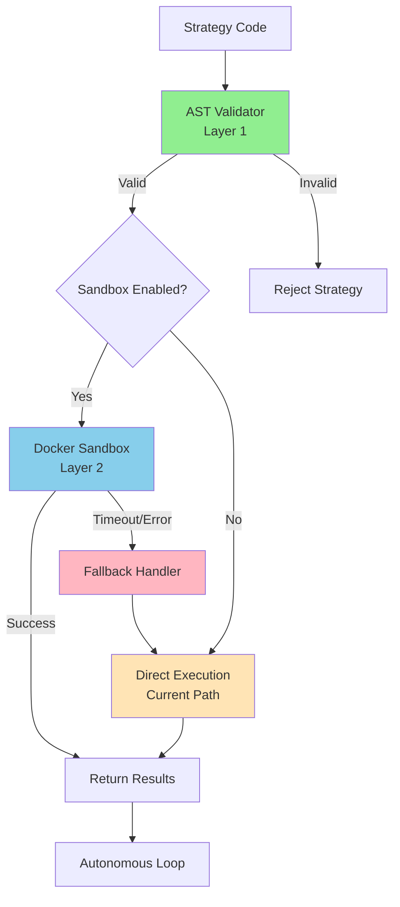

# Design Document: Docker Sandbox Integration Testing

## Overview

This design document outlines the testing and integration architecture for the Docker Sandbox security layer. The Docker Sandbox (91% complete, 2,529 lines) provides container-based isolation for strategy execution, complementing the existing AST validation layer to create a **dual-layer security defense**.

**Design Goals**:
1. **Validate Existing Implementation**: Test all Docker Sandbox components without modifying core functionality
2. **Seamless Integration**: Add sandbox execution to autonomous loop with <50 lines of changes
3. **Graceful Degradation**: Automatic fallback to AST-only on sandbox failures
4. **Performance Transparency**: Comprehensive benchmarking to inform enable/disable decision
5. **Zero Regression**: Maintain 100% backward compatibility with `sandbox.enabled: false`

**Architecture Approach**: Wrapper-based integration with test-driven validation

## Steering Document Alignment

### Technical Standards (tech.md)

**Testing Standards**:
- ≥90% code coverage for new integration code
- Type hints for all public interfaces
- Comprehensive docstrings following project conventions
- Pytest for all test modules

**Logging Standards**:
- Structured logging using project's JSON logger
- Log levels: INFO (sandbox usage), WARNING (fallback), ERROR (failures)
- Include metadata: strategy_id, execution_time, sandbox_enabled, fallback_triggered

**Configuration Standards**:
- Single feature flag: `sandbox.enabled: true/false` in `config/learning_system.yaml`
- Environment variable override: `SANDBOX_ENABLED=true`
- Backward compatible defaults (disabled)

### Project Structure (structure.md)

**Test Organization**:
```
tests/
├── sandbox/                          ← NEW: Sandbox-specific tests
│   ├── test_docker_lifecycle.py      ← Basic container operations
│   ├── test_resource_limits.py       ← CPU/Memory/Disk enforcement
│   ├── test_seccomp_security.py      ← Syscall blocking
│   └── test_sandbox_fallback.py      ← Fallback mechanism
├── integration/
│   ├── test_sandbox_integration.py   ← NEW: Autonomous loop integration
│   └── test_sandbox_e2e.py           ← NEW: 5-iteration smoke test
└── performance/
    └── test_sandbox_performance.py   ← NEW: Overhead benchmarking
```

**Minimal Core Changes**:
- `artifacts/working/modules/autonomous_loop.py`: +40 lines (integration wrapper)
- `config/learning_system.yaml`: Already has sandbox section (lines 704+)
- No changes to existing sandbox modules (`src/sandbox/*.py`)

## Code Reuse Analysis

### Existing Components to Leverage

**Docker Sandbox Infrastructure** (Already Complete):
- **`src/sandbox/docker_executor.py`**: Container lifecycle management (613 lines)
  - `execute_strategy(code, config)` - Main execution entry point
  - `_create_container()`, `_start_container()`, `_wait_for_completion()`
  - Already implements timeout, resource limits, cleanup
- **`src/sandbox/security_validator.py`**: AST validation (365 lines)
  - Current production defense layer
  - Will remain active as Layer 1 (sandbox is Layer 2)
- **`src/sandbox/docker_config.py`**: Configuration dataclass (329 lines)
  - `DockerConfig.from_yaml()` - Load from config file
  - Resource limits, timeout settings, image configuration
- **`src/sandbox/container_monitor.py`**: Resource tracking (619 lines)
  - Monitor CPU, memory, disk usage during execution
  - Integration point for monitoring system
- **`src/sandbox/runtime_monitor.py`**: Security monitoring (584 lines)
  - Detect security violations, log suspicious behavior
  - Task 17 (Tier 1 security hardening)

**Configuration** (Already Exists):
- **`config/docker_config.yaml`**: Docker-specific settings
- **`config/seccomp_profile.json`**: Syscall whitelist/blacklist
- **`config/learning_system.yaml`**: Line 704+ has sandbox section with `enabled: false`

**Monitoring System** (87% Complete, 4,578 lines):
- **`src/monitoring/metrics_collector.py`**: Prometheus metrics (1,166 lines)
  - Can add sandbox-specific metrics: `sandbox_executions_total`, `sandbox_fallback_total`
- **`src/monitoring/resource_monitor.py`**: System resource tracking (238 lines)
  - Monitor overhead of sandbox vs. AST-only

### Integration Points

**Autonomous Evolution Loop**:
- **`artifacts/working/modules/autonomous_loop.py`**: Current execution point
  - Line ~200-250: Strategy execution block (estimate)
  - **Current flow**: `strategy_code → AST validation → direct execution`
  - **New flow**: `strategy_code → AST validation → [sandbox OR direct] execution`

**Existing Validation Pipeline**:
- AST validation already separates valid/invalid strategies
- Sandbox will receive only AST-validated strategies (dual-layer)
- Validation failures continue to use current error handling

**Test Infrastructure**:
- **`tests/integration/test_autonomous_loop_e2e.py`**: Existing E2E test (if exists)
- **`pytest` fixtures**: Reuse for temp directories, mock data, config loading

## Architecture

### High-Level Architecture



### Modular Design Principles

**Single File Responsibility**:
- Each test module tests one specific aspect (lifecycle, limits, security, integration)
- Integration wrapper in `autonomous_loop.py` is ~40 lines (one clear responsibility)
- Fallback logic isolated in a dedicated function

**Component Isolation**:
- Test modules are independent (can run in parallel)
- Sandbox wrapper doesn't modify existing sandbox code
- Fallback mechanism is self-contained

**Service Layer Separation**:
- **Execution Layer**: `docker_executor.py` (no changes)
- **Integration Layer**: New wrapper in `autonomous_loop.py`
- **Testing Layer**: Separate test modules by concern

### Integration Wrapper Design

**Design Pattern**: Adapter + Strategy pattern

```python
# In autonomous_loop.py (NEW CODE)
class SandboxExecutionWrapper:
    """Wraps strategy execution with optional Docker Sandbox"""

    def __init__(self, config):
        self.sandbox_enabled = config.get('sandbox', {}).get('enabled', False)
        self.executor = DockerExecutor() if self.sandbox_enabled else None
        self.fallback_count = 0

    def execute_strategy(self, strategy_code: str) -> Tuple[Dict, Dict]:
        """Execute strategy with sandbox (if enabled) or direct execution"""
        if not self.sandbox_enabled:
            return self._direct_execution(strategy_code)

        try:
            return self._sandbox_execution(strategy_code)
        except (TimeoutError, DockerError) as e:
            logger.warning(f"Sandbox execution failed: {e}, falling back to direct")
            self.fallback_count += 1
            return self._direct_execution(strategy_code)

    def _sandbox_execution(self, code: str) -> Tuple[Dict, Dict]:
        """Execute in Docker container"""
        result = self.executor.execute_strategy(code, self.docker_config)
        metadata = {'sandbox_used': True, 'fallback': False}
        return result, metadata

    def _direct_execution(self, code: str) -> Tuple[Dict, Dict]:
        """Direct execution (current AST-only path)"""
        # Existing execution logic (unchanged)
        result = ... # Current implementation
        metadata = {'sandbox_used': False, 'fallback': self.sandbox_enabled}
        return result, metadata
```

**Integration Impact**: ~40 lines added, existing code untouched

## Components and Interfaces

### Component 1: Test Suite - Basic Functionality

**File**: `tests/sandbox/test_docker_lifecycle.py`

**Purpose**: Validate container start, execute, stop lifecycle

**Test Cases**:
- `test_container_startup_success()`: Container starts within 10 seconds
- `test_container_execution_success()`: Strategy executes and returns results
- `test_container_cleanup_success()`: Container terminates within 5 seconds
- `test_container_startup_failure()`: Handles Docker daemon errors gracefully
- `test_concurrent_containers()`: 5 parallel executions succeed

**Interfaces**:
```python
def test_container_startup_success():
    """Test: Container starts successfully within timeout"""
    executor = DockerExecutor()
    start_time = time.time()
    container = executor._create_container(strategy_code)
    duration = time.time() - start_time

    assert container is not None
    assert duration < 10.0  # Requirement 1.1
    assert container.status == 'created'
```

**Dependencies**: `DockerExecutor`, pytest fixtures for strategy code

**Reuses**: Existing `DockerExecutor` class, no modifications

---

### Component 2: Test Suite - Resource Limits

**File**: `tests/sandbox/test_resource_limits.py`

**Purpose**: Validate CPU, Memory, Disk limits enforcement

**Test Cases**:
- `test_memory_limit_enforcement()`: OOMKilled when exceeding 2GB
- `test_cpu_timeout_enforcement()`: Terminated at 300 seconds
- `test_disk_limit_enforcement()`: Restricted at 1GB writes
- `test_resource_violation_logging()`: Violations logged correctly
- `test_autonomous_loop_continues()`: Loop doesn't halt on limit violations

**Interfaces**:
```python
def test_memory_limit_enforcement():
    """Test: Container terminated when exceeding memory limit"""
    # Create strategy that allocates excessive memory
    memory_hog_code = "x = [0] * (3 * 1024 * 1024 * 1024)  # 3GB"

    executor = DockerExecutor()
    result = executor.execute_strategy(memory_hog_code, config)

    assert result['status'] == 'OOMKilled'  # Requirement 2.1
    assert 'memory' in result['error_message'].lower()
```

**Dependencies**: `DockerExecutor`, `DockerConfig` with limits

**Reuses**: Existing limit configuration in `docker_config.py`

---

### Component 3: Test Suite - Seccomp Security

**File**: `tests/sandbox/test_seccomp_security.py`

**Purpose**: Validate dangerous syscalls blocked by Seccomp

**Test Cases**:
- `test_file_io_blocked()`: open, read, write blocked
- `test_network_blocked()`: socket, connect blocked
- `test_process_manipulation_blocked()`: fork, exec, kill blocked
- `test_time_manipulation_blocked()`: settimeofday blocked
- `test_allowed_syscalls_permitted()`: Safe syscalls like getpid still work

**Interfaces**:
```python
def test_file_io_blocked():
    """Test: File I/O syscalls blocked by Seccomp"""
    malicious_code = """
    try:
        with open('/etc/passwd', 'r') as f:
            data = f.read()
    except PermissionError:
        print('BLOCKED')  # Expected
    """

    executor = DockerExecutor()
    result = executor.execute_strategy(malicious_code, config)

    assert 'BLOCKED' in result['stdout']  # Requirement 3.1
    # OR assert result['status'] == 'SecurityViolation'
```

**Dependencies**: `DockerExecutor`, Seccomp profile from `config/seccomp_profile.json`

**Reuses**: Existing Seccomp configuration (no changes)

---

### Component 4: Integration Wrapper

**File**: `artifacts/working/modules/autonomous_loop.py` (MODIFIED)

**Purpose**: Integrate sandbox execution with fallback into autonomous loop

**Integration Points**:
```python
# BEFORE (Current):
def run_iteration(strategy_code):
    # AST validation
    if not validate_ast(strategy_code):
        return None

    # Direct execution
    results = execute_strategy_direct(strategy_code)
    return results

# AFTER (With Sandbox):
def run_iteration(strategy_code):
    # AST validation (unchanged)
    if not validate_ast(strategy_code):
        return None

    # Sandbox execution with fallback (NEW)
    wrapper = SandboxExecutionWrapper(config)
    results, metadata = wrapper.execute_strategy(strategy_code)

    # Log metadata (NEW)
    logger.info("Iteration complete", extra=metadata)
    return results
```

**Interfaces**:
```python
class SandboxExecutionWrapper:
    def __init__(self, config: Dict): ...
    def execute_strategy(self, code: str) -> Tuple[Dict, Dict]: ...
    def _sandbox_execution(self, code: str) -> Tuple[Dict, Dict]: ...
    def _direct_execution(self, code: str) -> Tuple[Dict, Dict]: ...
    def get_fallback_stats(self) -> Dict: ...
```

**Dependencies**: `DockerExecutor`, existing execution pipeline

**Reuses**: Entire existing execution path unchanged (wrapped, not replaced)

---

### Component 5: Integration Tests

**File**: `tests/integration/test_sandbox_integration.py`

**Purpose**: Validate autonomous loop integration with sandbox

**Test Cases**:
- `test_sandbox_enabled_routing()`: Strategies routed to sandbox when enabled
- `test_sandbox_disabled_routing()`: Direct execution when disabled
- `test_fallback_on_timeout()`: Automatic fallback on timeout
- `test_fallback_on_docker_error()`: Automatic fallback on Docker errors
- `test_metadata_tracking()`: sandbox_used and fallback flags recorded

**Interfaces**:
```python
def test_fallback_on_timeout():
    """Test: Automatic fallback to direct execution on timeout"""
    config = {'sandbox': {'enabled': True, 'timeout': 1}}  # 1 second
    slow_strategy = "import time; time.sleep(10)"  # 10 seconds

    wrapper = SandboxExecutionWrapper(config)
    result, metadata = wrapper.execute_strategy(slow_strategy)

    assert metadata['fallback'] == True  # Requirement 4.2
    assert result is not None  # Iteration continues
```

**Dependencies**: `SandboxExecutionWrapper`, pytest fixtures

**Reuses**: Existing autonomous loop test infrastructure

---

### Component 6: Performance Benchmarks

**File**: `tests/performance/test_sandbox_performance.py`

**Purpose**: Measure sandbox overhead and compare vs. AST-only

**Test Cases**:
- `test_5_iteration_smoke_test()`: Record timings for 5 iterations
- `test_20_iteration_validation()`: Record average iteration time
- `test_overhead_calculation()`: Calculate percentage overhead
- `test_success_rate_parity()`: Verify 100% success in both modes

**Interfaces**:
```python
def test_overhead_calculation():
    """Test: Calculate sandbox overhead vs. AST-only baseline"""
    # Baseline (AST-only)
    config_ast = {'sandbox': {'enabled': False}}
    ast_times = run_n_iterations(20, config_ast)
    ast_avg = np.mean(ast_times)

    # Sandbox
    config_sandbox = {'sandbox': {'enabled': True}}
    sandbox_times = run_n_iterations(20, config_sandbox)
    sandbox_avg = np.mean(sandbox_times)

    overhead = (sandbox_avg - ast_avg) / ast_avg * 100

    # Requirement 5.3
    assert overhead < 100, f"Overhead {overhead:.1f}% exceeds 100%"
    logger.info(f"Sandbox overhead: {overhead:.1f}%")

    return overhead  # Used for decision framework
```

**Dependencies**: Autonomous loop, time measurement utilities

**Reuses**: Existing iteration execution, metrics collection

## Data Models

### ExecutionResult

```python
@dataclass
class ExecutionResult:
    """Result of strategy execution (sandbox or direct)"""
    status: str  # 'success', 'timeout', 'error', 'OOMKilled', 'SecurityViolation'
    metrics: Dict[str, float]  # Sharpe, Calmar, etc.
    stdout: str
    stderr: str
    execution_time: float
    error_message: Optional[str] = None
```

### ExecutionMetadata

```python
@dataclass
class ExecutionMetadata:
    """Metadata about execution method"""
    sandbox_used: bool
    fallback_triggered: bool
    fallback_reason: Optional[str] = None  # 'timeout', 'docker_error', 'resource_limit'
    container_id: Optional[str] = None
    execution_time: float
```

### PerformanceBenchmark

```python
@dataclass
class PerformanceBenchmark:
    """Performance comparison results"""
    ast_only_avg: float
    ast_only_std: float
    sandbox_avg: float
    sandbox_std: float
    overhead_pct: float
    success_rate_ast: float
    success_rate_sandbox: float
    decision: str  # 'enable_default', 'optional', 'document_only', 'do_not_use'
```

## Error Handling

### Error Scenario 1: Container Startup Failure

**Description**: Docker daemon not running or image not available

**Handling**:
```python
try:
    container = executor._create_container(code)
except DockerError as e:
    logger.error(f"Container startup failed: {e}")
    # Automatic fallback to direct execution
    return wrapper._direct_execution(code)
```

**User Impact**: Iteration continues via fallback, WARNING logged

---

### Error Scenario 2: Container Timeout

**Description**: Strategy execution exceeds 300 second limit

**Handling**:
```python
try:
    result = executor._wait_for_completion(container, timeout=300)
except TimeoutError:
    logger.warning(f"Container timeout after 300s, falling back")
    executor._cleanup_container(container)  # Force cleanup
    return wrapper._direct_execution(code)
```

**User Impact**: Iteration continues via fallback, WARNING logged

---

### Error Scenario 3: Resource Limit Violation

**Description**: Strategy exceeds memory (2GB) or disk (1GB)

**Handling**:
```python
if result['status'] == 'OOMKilled':
    logger.info(f"Strategy {strategy_id} exceeded memory limit")
    # Log as expected behavior (not fallback)
    return ExecutionResult(status='OOMKilled', error_message='Memory limit exceeded')
```

**User Impact**: Strategy marked as failed (not a sandbox failure), no fallback needed

---

### Error Scenario 4: Seccomp Violation

**Description**: Strategy attempts dangerous syscall

**Handling**:
```python
if 'Operation not permitted' in result['stderr']:
    logger.warning(f"Security violation detected in {strategy_id}")
    # Log violation details
    runtime_monitor.log_violation(strategy_id, syscall_name)
    return ExecutionResult(status='SecurityViolation', error_message=result['stderr'])
```

**User Impact**: Strategy rejected, violation logged for audit

---

### Error Scenario 5: Backward Compatibility Regression

**Description**: Enabling sandbox breaks existing tests

**Handling**:
```python
# In pytest fixture
@pytest.fixture
def sandbox_disabled_config():
    """Ensure backward compatibility tests use AST-only"""
    return {'sandbox': {'enabled': False}}

# All existing tests use this fixture → no sandbox involvement
```

**User Impact**: Existing functionality unchanged, zero regression

## Testing Strategy

### Unit Testing

**Scope**: Individual Docker Sandbox components (already implemented)

**Approach**:
- **Lifecycle Tests**: `test_docker_lifecycle.py` - Container start/stop/cleanup
- **Limits Tests**: `test_resource_limits.py` - Memory/CPU/Disk enforcement
- **Security Tests**: `test_seccomp_security.py` - Syscall blocking

**Key Components to Test**:
- `DockerExecutor.execute_strategy()` - Main execution method
- `DockerConfig.from_yaml()` - Configuration loading
- `SecurityValidator` - Seccomp profile validation
- Fallback logic in `SandboxExecutionWrapper`

**Coverage Target**: ≥90% for integration code (~40 lines in `autonomous_loop.py`)

---

### Integration Testing

**Scope**: Autonomous loop integration with sandbox

**Approach**:
- **Integration Tests**: `test_sandbox_integration.py` - Wrapper behavior
- **E2E Tests**: `test_sandbox_e2e.py` - 5-iteration smoke test with real strategies

**Key Flows to Test**:
1. **Happy Path**: Sandbox enabled → successful execution → results returned
2. **Fallback Path**: Sandbox timeout → automatic fallback → AST-only execution
3. **Disabled Path**: Sandbox disabled → direct execution (current behavior)
4. **Mixed Path**: 50% sandbox success, 50% fallback → autonomous loop continues

**Test Data**: Use existing Turtle, Momentum, Factor templates as strategy code

---

### Performance Testing

**Scope**: Overhead measurement and decision framework

**Approach**:
- **Smoke Test**: 5 iterations, quick validation (5-10 minutes)
- **Validation Test**: 20 iterations, statistical significance (30-40 minutes)
- **Overhead Calculation**: Compare AST-only baseline vs. sandbox average

**Key Scenarios to Test**:
1. **Best Case**: Simple strategies with minimal data loading
2. **Typical Case**: Standard strategies with Taiwan stock data (~10M points)
3. **Worst Case**: Complex strategies with maximum data access

**Decision Criteria** (from Requirements):
```python
if overhead < 50% and functional_tests_pass:
    decision = 'enable_default'
elif overhead < 100% and functional_tests_pass:
    decision = 'optional_feature'
else:
    decision = 'document_only'
```

---

### End-to-End Testing

**Scope**: Full system behavior with sandbox in production-like conditions

**Approach**:
- **20-generation test**: Run full autonomous evolution cycle with sandbox
- **Monitoring validation**: Verify metrics collection works correctly
- **Failure recovery**: Test system recovery from various failure modes

**User Scenarios to Test**:
1. **Researcher runs evolution**: Sandbox enabled, 20 iterations complete successfully
2. **Docker daemon crashes mid-evolution**: System falls back and continues
3. **Resource limit hit**: Strategy rejected, evolution continues with next candidate
4. **Seccomp violation detected**: Security audit log populated, strategy rejected

## Implementation Phases

### Phase 1: Basic Functionality Tests (Days 1-2)
- Implement `test_docker_lifecycle.py`
- Implement `test_resource_limits.py`
- Implement `test_seccomp_security.py`
- **Deliverable**: All Requirement 1-3 tests pass

### Phase 2: Integration (Days 3-5)
- Implement `SandboxExecutionWrapper` in `autonomous_loop.py`
- Implement `test_sandbox_integration.py`
- Implement `test_sandbox_e2e.py` (5-iteration smoke test)
- **Deliverable**: Requirement 4 tests pass, smoke test completes

### Phase 3: Performance Benchmarking (Days 6-8)
- Implement `test_sandbox_performance.py`
- Run 20-iteration validation test (both modes)
- Calculate overhead and populate decision matrix
- **Deliverable**: Requirement 5 complete, overhead data collected

### Phase 4: Decision & Documentation (Days 9-10)
- Apply decision framework (Requirement 6)
- Update `config/learning_system.yaml` based on decision
- Document rationale in `STATUS.md`
- Update README with activation instructions (if optional)
- **Deliverable**: Requirement 6 complete, decision documented

## Success Metrics

**Functional Success**:
- ✅ All unit tests pass (Req 1-3)
- ✅ All integration tests pass (Req 4)
- ✅ 5-iteration smoke test: 100% success rate
- ✅ 20-iteration validation test: 100% success rate

**Performance Success**:
- ✅ Overhead measured and documented
- ✅ Decision framework applied
- ✅ Configuration updated based on data

**Integration Success**:
- ✅ Zero regressions with `sandbox.enabled: false`
- ✅ Fallback mechanism validated under failure conditions
- ✅ Monitoring integration verified

## Open Questions

1. **Taiwan stock data loading**: Does the ~10M data point load happen per-container or once globally?
   - **Resolution path**: Test with minimal vs. full data load strategies

2. **Windows multiprocessing spawn overhead**: Is the 120s+ timeout from STATUS.md still relevant?
   - **Resolution path**: Empirical testing in Phase 3 will measure actual overhead

3. **Docker image caching**: Can we pre-pull images to reduce startup time?
   - **Resolution path**: Test with pre-pulled images vs. on-demand pull

4. **Concurrent execution**: Should we support parallel container execution?
   - **Resolution path**: Implement sequential first (simpler), parallel as future enhancement if needed

## Risks and Mitigations

| Risk | Impact | Mitigation |
|------|--------|------------|
| Overhead >100% | HIGH | Decision framework allows documenting as optional |
| Docker Desktop not installed | MEDIUM | Clear error message, fallback to AST-only |
| Seccomp too restrictive | LOW | Iterative testing with real strategies |
| Fallback masking failures | MEDIUM | Comprehensive logging, failure rate monitoring |

## Future Enhancements (Out of Scope)

- **Container Image Optimization**: Custom minimal images for faster startup
- **Process Pool Pre-warming**: Maintain warm container pool
- **Multi-host Orchestration**: Kubernetes/Docker Swarm for parallel execution
- **GPU Resource Limits**: Extend limits beyond CPU/Memory/Disk
- **Linux-specific Optimizations**: Fork vs. spawn multiprocessing
