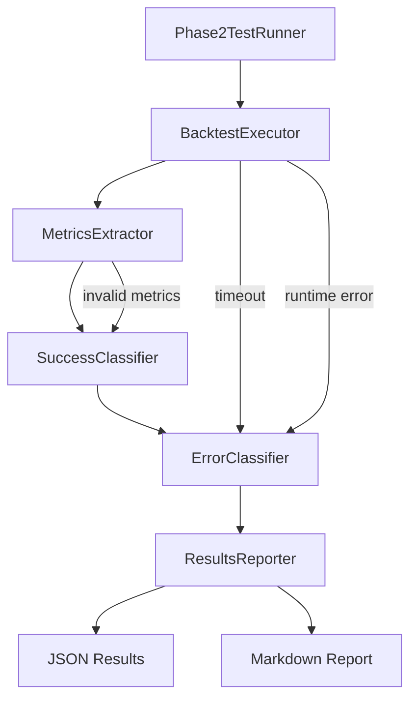

# Design Document

## Overview

The Phase 2 Backtest Execution system provides a robust framework for executing AI-generated trading strategies with real finlab data and measuring their actual performance. Unlike Phase 1 (static validation), this system performs **real strategy execution** with data loading, computation, and backtest simulation to determine true success rates.

**Core Problem**: Previously we only validated that strategies use correct dataset keys (static check). Now we need to verify they actually **run without errors** and **produce valid performance metrics**.

**Solution**: Modular execution pipeline with timeout protection, metrics extraction, three-level classification, and comprehensive error reporting.

## Steering Document Alignment

### Technical Standards (tech.md)

*Note: No formal tech.md exists yet for this project. Following Python best practices:*
- **Modular Design**: Separate concerns into focused classes/modules
- **Type Safety**: Use Python type hints for all public interfaces
- **Error Handling**: Explicit exception handling with detailed logging
- **Testing**: Unit tests for each component, integration tests for full pipeline

### Project Structure (structure.md)

*Note: No formal structure.md exists yet. Following existing patterns:*
- Place test scripts in project root (e.g., `run_phase2_backtest_execution.py`)
- Core execution logic in `src/backtest/` (new module)
- Metrics utilities in `src/backtest/metrics.py` (exists, extend it)
- Results output to project root as JSON/markdown files

## Code Reuse Analysis

### Existing Components to Leverage

- **`src/backtest/metrics.py`**: Contains `MetricsExtractor` class - will extend for Sharpe/return extraction
- **`artifacts/working/modules/poc_claude_test.py`**: Strategy generation logic - will reuse for loading generated code
- **`artifacts/working/modules/static_validator.py`**: Static validation - will call before execution
- **Timeout Utilities**: Python's `signal` module or `multiprocessing.Pool.apply_async()` with timeout
- **JSON Logging**: Use Python's `json` module for structured results

### Integration Points

- **Generated Strategy Files**: Read from `generated_strategy_fixed_iter*.py` files (20 files from Phase 1)
- **Finlab Data Access**: Must have finlab session authenticated, use existing `data.get()` API
- **Sandbox Environment**: Execute in isolated Python namespace using `exec()` with restricted globals
- **Results Storage**: Write to `phase2_backtest_results.json` and `PHASE2_BACKTEST_REPORT.md`

## Architecture

The system follows a **pipeline architecture** with 5 sequential stages:



### Modular Design Principles

- **Single File Responsibility**: Each component in separate file under `src/backtest/`
- **Component Isolation**: `BacktestExecutor` knows nothing about metrics extraction
- **Service Layer Separation**:
  - Execution layer: `BacktestExecutor`
  - Analysis layer: `MetricsExtractor`, `SuccessClassifier`, `ErrorClassifier`
  - Presentation layer: `ResultsReporter`
- **Utility Modularity**: Share timeout logic, error patterns as separate utilities

## Components and Interfaces

### Component 1: BacktestExecutor
- **Purpose:** Execute strategy code with finlab data context and timeout protection
- **File:** `src/backtest/executor.py`
- **Interfaces:**
  ```python
  class ExecutionResult:
      success: bool
      code: str
      report: Optional[Any]  # finlab sim() report object
      error: Optional[str]
      error_type: Optional[str]  # 'timeout' | 'runtime' | 'data_missing' | 'other'
      execution_time: float

  class BacktestExecutor:
      def execute_strategy(code: str, timeout_seconds: int = 420) -> ExecutionResult:
          """Execute strategy code with timeout protection"""
  ```
- **Dependencies:**
  - Python `signal` module (timeout)
  - Finlab `data`, `sim` objects (must be in globals)
- **Reuses:** Existing finlab session, no new dependencies

### Component 2: MetricsExtractor
- **Purpose:** Extract Sharpe Ratio, Total Return, Max Drawdown, Win Rate from sim() report
- **File:** `src/backtest/metrics.py` (extend existing)
- **Interfaces:**
  ```python
  class StrategyMetrics:
      sharpe_ratio: Optional[float]
      total_return: Optional[float]
      max_drawdown: Optional[float]
      win_rate: Optional[float]
      has_valid_metrics: bool  # True if Sharpe exists and not NaN

  class MetricsExtractor:
      def extract_metrics(report: Any) -> StrategyMetrics:
          """Extract metrics from finlab sim() report object"""
  ```
- **Dependencies:**
  - Finlab report object structure
  - `pandas` for NaN checking
- **Reuses:** Existing `src/backtest/metrics.py` structure

### Component 3: SuccessClassifier
- **Purpose:** Classify strategies into Level 1/2/3 based on execution and metrics
- **File:** `src/backtest/classifier.py`
- **Interfaces:**
  ```python
  class SuccessLevel(Enum):
      LEVEL_0_FAILED = 0       # Execution failed
      LEVEL_1_EXECUTION = 1     # Execution success
      LEVEL_2_VALID_METRICS = 2 # Has valid metrics
      LEVEL_3_POSITIVE_PERF = 3 # Sharpe > 0

  class SuccessClassifier:
      def classify(execution_result: ExecutionResult, metrics: StrategyMetrics) -> SuccessLevel:
          """Classify success level based on execution and metrics"""
  ```
- **Dependencies:**
  - `ExecutionResult` from executor
  - `StrategyMetrics` from extractor
- **Reuses:** None (new component)

### Component 4: ErrorClassifier
- **Purpose:** Categorize errors into timeout, data missing, calculation errors, etc.
- **File:** `src/backtest/error_classifier.py`
- **Interfaces:**
  ```python
  class ErrorCategory(Enum):
      TIMEOUT = "timeout"
      MISSING_DATA = "missing_data"
      CALCULATION_ERROR = "calculation_error"
      SYNTAX_ERROR = "syntax_error"
      OTHER = "other"

  class ErrorClassifier:
      def classify_error(error_message: str) -> ErrorCategory:
          """Classify error based on message patterns"""

      def group_errors(results: List[ExecutionResult]) -> Dict[ErrorCategory, List[str]]:
          """Group errors by category for reporting"""
  ```
- **Dependencies:**
  - Regular expressions for pattern matching
- **Reuses:** None (new component)

### Component 5: ResultsReporter
- **Purpose:** Generate JSON and markdown reports with statistics
- **File:** `src/backtest/reporter.py`
- **Interfaces:**
  ```python
  class ReportData:
      total_strategies: int
      level_1_count: int
      level_2_count: int
      level_3_count: int
      level_1_rate: float
      level_2_rate: float
      level_3_rate: float
      avg_sharpe: Optional[float]
      avg_execution_time: float
      error_distribution: Dict[ErrorCategory, int]
      strategy_results: List[Dict]  # Individual strategy details

  class ResultsReporter:
      def generate_json_report(data: ReportData, output_path: str) -> None:
          """Generate structured JSON results file"""

      def generate_markdown_report(data: ReportData, output_path: str) -> None:
          """Generate human-readable markdown report"""
  ```
- **Dependencies:**
  - Python `json` module
  - Python string formatting
- **Reuses:** None (new component)

### Component 6: Phase2TestRunner (Main Controller)
- **Purpose:** Orchestrate the entire test execution pipeline for 20 strategies
- **File:** `run_phase2_backtest_execution.py` (project root)
- **Interfaces:**
  ```python
  class Phase2TestRunner:
      def __init__(strategy_files: List[str], timeout: int = 420):
          """Initialize with list of strategy files to test"""

      def run_all() -> ReportData:
          """Execute all strategies and generate report"""

      def run_single(strategy_file: str) -> Tuple[ExecutionResult, StrategyMetrics, SuccessLevel]:
          """Execute single strategy (for testing)"""
  ```
- **Dependencies:**
  - All 5 components above
  - Progress logging
- **Reuses:** Existing generated strategy files from Phase 1

## Data Models

### ExecutionResult
```python
@dataclass
class ExecutionResult:
    success: bool              # Did execution complete without errors?
    code: str                  # Strategy code that was executed
    report: Optional[Any]      # finlab sim() report object (if success)
    error: Optional[str]       # Error message (if failure)
    error_type: Optional[str]  # 'timeout' | 'runtime' | 'data_missing' | 'other'
    execution_time: float      # Time taken in seconds
    strategy_file: str         # Source file name
```

### StrategyMetrics
```python
@dataclass
class StrategyMetrics:
    sharpe_ratio: Optional[float]     # Sharpe Ratio (None if NaN or missing)
    total_return: Optional[float]     # Total return % (None if NaN or missing)
    max_drawdown: Optional[float]     # Max drawdown % (None if NaN or missing)
    win_rate: Optional[float]         # Win rate % (None if unavailable)
    has_valid_metrics: bool           # True if sharpe_ratio is not None/NaN
```

### ReportData
```python
@dataclass
class ReportData:
    total_strategies: int                     # Total tested (should be 20)
    level_1_count: int                        # Execution success count
    level_2_count: int                        # Valid metrics count
    level_3_count: int                        # Positive performance count
    level_1_rate: float                       # L1 / total (target ≥ 0.6)
    level_2_rate: float                       # L2 / total
    level_3_rate: float                       # L3 / total (target ≥ 0.4)
    avg_sharpe: Optional[float]               # Avg Sharpe for L2+ strategies
    avg_execution_time: float                 # Avg time per strategy
    min_execution_time: float                 # Fastest execution
    max_execution_time: float                 # Slowest execution
    error_distribution: Dict[str, int]        # ErrorCategory -> count
    strategy_results: List[Dict]              # Individual results
    test_start_time: str                      # ISO timestamp
    test_end_time: str                        # ISO timestamp
    total_duration: float                     # Total test duration in seconds
```

## Error Handling

### Error Scenarios

1. **Timeout Error (7 minutes exceeded)**
   - **Handling:**
     - Use `multiprocessing.Process` with `join(timeout=420)` for cross-platform timeout
     - Terminate process if still alive after timeout
     - Mark as `error_type='timeout'`
   - **User Impact:** Strategy marked as Level 0 (failed), counted in timeout category

2. **Missing Dataset Error**
   - **Handling:**
     - Catch exceptions containing "KeyError" or dataset name
     - Classify as `error_type='data_missing'`
     - Extract missing dataset key from error message
   - **User Impact:** Strategy marked as Level 0, error logged with missing key

3. **Calculation Error (division by zero, invalid operations)**
   - **Handling:**
     - Catch `ValueError`, `ZeroDivisionError`, `TypeError`
     - Classify as `error_type='calculation_error'`
   - **User Impact:** Strategy marked as Level 0, error details logged

4. **Syntax Error (should not happen after Phase 1, but defensive)**
   - **Handling:**
     - Catch `SyntaxError` during `exec()`
     - Classify as `error_type='syntax_error'`
   - **User Impact:** Strategy marked as Level 0, immediate investigation required

5. **Invalid Metrics (NaN Sharpe Ratio)**
   - **Handling:**
     - Check `pd.isna(sharpe_ratio)` after extraction
     - Mark `has_valid_metrics=False`
   - **User Impact:** Strategy marked as Level 1 (execution success) but NOT Level 2

6. **Report Object Not Found**
   - **Handling:**
     - Check if `report` variable exists in execution namespace
     - If missing, mark as execution failure
   - **User Impact:** Strategy marked as Level 0, logged as "no report generated"

## Testing Strategy

### Unit Testing

**File:** `tests/backtest/test_executor.py`
- Test timeout mechanism with intentional infinite loop
- Test error classification with mock exceptions
- Test metrics extraction with mock finlab reports

**File:** `tests/backtest/test_classifier.py`
- Test Level 1/2/3 classification logic
- Test edge cases (Sharpe = 0, Sharpe = NaN, negative Sharpe)

**File:** `tests/backtest/test_error_classifier.py`
- Test regex patterns for error categorization
- Test error grouping with multiple similar errors

### Integration Testing

**File:** `tests/integration/test_phase2_execution.py`
- Test end-to-end execution with 3 mock strategies:
  1. Simple valid strategy (should reach Level 3)
  2. Strategy with timeout (infinite loop)
  3. Strategy with missing dataset
- Verify JSON report generation
- Verify markdown report generation

### End-to-End Testing

**Test Scenario 1: Subset Validation**
- Run on 3 real strategies from Phase 1 (`generated_strategy_fixed_iter0.py`, `iter1.py`, `iter2.py`)
- Verify execution completes within expected time
- Verify results match manual validation

**Test Scenario 2: Full 20-Strategy Run**
- Execute all 20 strategies from Phase 1
- Verify total time < 140 minutes (20 * 7 min timeout)
- Verify success rates meet targets (L1 ≥ 60%, L3 ≥ 40%)
- Review error distribution for patterns

## Implementation Notes

### Execution Environment Setup

The `BacktestExecutor` must provide finlab context using multiprocessing for reliable cross-platform timeout:
```python
from multiprocessing import Process, Queue
import time

def _execute_in_process(code: str, result_queue: Queue):
    """Execute strategy code in isolated process"""
    try:
        from finlab import data
        from finlab.backtest import sim
        import pandas as pd
        import numpy as np

        execution_globals = {
            'data': data,
            'sim': sim,
            'pd': pd,
            'np': np
        }

        exec(code, execution_globals)
        report = execution_globals.get('report')
        result_queue.put(('success', report))
    except Exception as e:
        result_queue.put(('error', str(e), type(e).__name__))

def execute_strategy(code: str, timeout_seconds: int = 420) -> ExecutionResult:
    """Execute strategy with multiprocessing-based timeout"""
    result_queue = Queue()
    process = Process(target=_execute_in_process, args=(code, result_queue))

    start_time = time.time()
    process.start()
    process.join(timeout=timeout_seconds)

    if process.is_alive():
        # Timeout occurred
        process.terminate()
        process.join()  # Wait for termination
        return ExecutionResult(
            success=False,
            error_type='timeout',
            error=f'Strategy execution exceeded {timeout_seconds}s timeout',
            execution_time=timeout_seconds
        )

    # Process completed within timeout
    if not result_queue.empty():
        result = result_queue.get()
        if result[0] == 'success':
            return ExecutionResult(
                success=True,
                report=result[1],
                execution_time=time.time() - start_time
            )
        else:
            # Execution error
            return ExecutionResult(
                success=False,
                error=result[1],
                error_type=classify_error(result[2]),
                execution_time=time.time() - start_time
            )
```

**Benefits of multiprocessing approach:**
- **Cross-platform**: Works reliably on Windows, macOS, and Linux
- **True isolation**: Process-level isolation prevents memory leaks and resource issues
- **Reliable timeout**: Effective even for I/O blocking and C extensions
- **Thread-safe**: No signal handler conflicts with multi-threaded code

### Progress Visibility

Use simple print statements during execution:
```python
print(f"[{i+1}/20] Executing {strategy_file}...")
print(f"  → Execution time: {exec_time:.1f}s")
print(f"  → Level: {level.name}")
```

### File Organization

```
finlab/
├── src/
│   └── backtest/
│       ├── __init__.py
│       ├── executor.py          # BacktestExecutor
│       ├── metrics.py           # MetricsExtractor (extend existing)
│       ├── classifier.py        # SuccessClassifier
│       ├── error_classifier.py  # ErrorClassifier
│       └── reporter.py          # ResultsReporter
├── tests/
│   ├── backtest/
│   │   ├── test_executor.py
│   │   ├── test_classifier.py
│   │   └── test_error_classifier.py
│   └── integration/
│       └── test_phase2_execution.py
├── run_phase2_backtest_execution.py  # Main test runner
├── phase2_backtest_results.json      # Output (generated)
└── PHASE2_BACKTEST_REPORT.md         # Output (generated)
```

## Security Considerations

- **Sandboxing:** Use restricted `globals` dict in `exec()` - no `__import__`, `open`, `os`, `sys`
- **Timeout Protection:** Hard 7-minute limit per strategy to prevent runaway execution
- **Resource Limits:** Consider adding memory limits (optional enhancement)
- **Authenticated Access:** Finlab data access uses existing session, no credential passing

## Performance Optimizations

- **Parallel Execution (Future Enhancement):** Could execute strategies in parallel using `multiprocessing.Pool` to reduce total time from 140 min to ~30 min (with 5 workers)
- **Caching:** Finlab data is cached by finlab library, no additional caching needed
- **Early Exit:** If error pattern affects >50% of strategies, consider alerting user to stop and fix

## Success Criteria

- All 5 components implemented and unit tested
- Integration test passes with 3 mock strategies
- Full 20-strategy execution completes successfully
- JSON and markdown reports generated correctly
- Success rates measured and documented (even if below targets)
