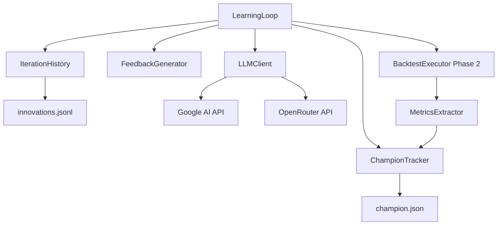

# Design Document

## Overview

Phase 3 Learning Iteration implements the **autonomous learning loop** that enables AI-generated strategies to learn from execution results. The system creates a feedback cycle: execute strategy → extract metrics → generate feedback → call LLM with feedback → generate improved strategy.

**Core Innovation**: Unlike static generators, this system uses **real LLM APIs** (Gemini, OpenRouter) with natural language feedback from previous iterations, enabling genuine learning through iteration history.

**Architecture Pattern**: Pipeline with persistent state (JSONL history file + champion.json)

```
Iteration N:
  Load History → Generate Feedback → Call LLM → Execute Strategy → Extract Metrics → Update Champion → Save to History
                                                    ↓
                                              (Phase 2 Executor)
```

## Steering Document Alignment

### Technical Standards (tech.md)

*Following Python best practices:*
- **Modular Design**: Separate history, feedback, LLM client, champion tracking, main loop
- **Type Safety**: Python dataclasses with type hints for all data structures
- **Error Handling**: Graceful degradation (LLM fail → Factor Graph, corrupt history → empty start)
- **Logging**: Structured logging for debugging and monitoring

### Project Structure (structure.md)

*Following existing patterns:*
- Core learning logic in `src/learning/` (new modular structure)
- History files in `artifacts/data/innovations.jsonl`
- Champion tracking in project root `champion.json`
- Configuration in `config/learning_system.yaml`

## Code Reuse Analysis

### Existing Components to Leverage

- **`artifacts/working/modules/autonomous_loop.py`**: Current monolithic loop - **WILL BE REFACTORED** and moved to `src/learning/learning_loop.py` with modular structure (see Component 5)
- **`artifacts/working/modules/poc_claude_test.py`**: LLM API client (Gemini + OpenRouter) - adapt for use in `src/learning/llm_client.py`
- **`artifacts/working/modules/history.py`**: Basic history structure - create new version in `src/learning/iteration_history.py` with full functionality
- **Phase 2 Components**: `BacktestExecutor`, `MetricsExtractor`, `SuccessClassifier` - integrate directly
- **`src/backtest/metrics.py`**: Sharpe extraction - already integrated in Phase 2

### Refactoring Strategy for autonomous_loop.py

**Current Problem**: `autonomous_loop.py` has become a monolithic file with **2,981 lines** (50% larger than initially estimated), mixing 12+ concerns (orchestration, LLM calls, metrics, logging, monitoring, champion tracking, iteration execution, feedback generation).

**Refactoring Plan**:
1. **Extract** iteration logic into `iteration_executor.py` (new)
2. **Extract** feedback generation into `feedback_generator.py` (new)
3. **Extract** champion tracking into `champion_tracker.py` (new)
4. **Extract** LLM client wrapper into `llm_client.py` (new)
5. **Keep** `autonomous_loop.py` as lightweight entry point (~200 lines) that:
   - Loads configuration
   - Initializes all components
   - Runs main loop calling other components
   - Generates final summary

**Benefits**:
- Each file <300 lines, single responsibility
- Easier testing (mock individual components)
- Clearer separation of concerns
- Maintainable and extensible

### Integration Points

- **Phase 2 Executor**: Call `BacktestExecutor.execute_strategy()` for each iteration
- **History Storage**: JSONL format (one JSON per line) in `artifacts/data/innovations.jsonl`
- **LLM APIs**: Google AI (primary), OpenRouter (fallback) via `poc_claude_test.generate_strategy()`
- **Configuration**: YAML config loading via existing patterns

## Architecture

The system follows a **stateful pipeline architecture** with 5 core components:



### Modular Design Principles

- **Single File Responsibility**: Each component in separate file
- **Component Isolation**: IterationHistory knows nothing about LLM, FeedbackGenerator knows nothing about execution
- **Service Layer Separation**:
  - **Storage layer**: IterationHistory (JSONL read/write)
  - **Intelligence layer**: FeedbackGenerator, LLMClient
  - **Control layer**: LearningLoop (orchestration)
  - **Execution layer**: Phase 2 components (already built)
- **Utility Modularity**: Share retry logic, timeout handling as utilities

## Components and Interfaces

### Component 1: IterationHistory
- **Purpose:** Persist and retrieve iteration records from JSONL file
- **File:** `src/learning/iteration_history.py` (new)
- **Interfaces:**
  ```python
  @dataclass
  class IterationRecord:
      iteration: int
      strategy_code: str
      execution_success: bool
      sharpe_ratio: Optional[float]
      total_return: Optional[float]
      max_drawdown: Optional[float]
      classification_level: int  # 0-3
      error_message: Optional[str]
      error_category: Optional[str]
      error_stacktrace: Optional[str]  # Full stack trace for debugging
      execution_time: float
      timestamp: str
      model_used: str

  class IterationHistory:
      def __init__(history_file: str = "artifacts/data/innovations.jsonl"):
          """Initialize with history file path"""

      def load_recent(n: int = 5) -> List[IterationRecord]:
          """Load N most recent iterations"""

      def save_iteration(record: IterationRecord) -> None:
          """Append iteration to JSONL file"""

      def get_all() -> List[IterationRecord]:
          """Load all iterations (use sparingly, can be slow)"""

      def get_successful() -> List[IterationRecord]:
          """Get all iterations with classification_level >= 1"""

      def get_best_sharpe() -> Optional[IterationRecord]:
          """Get iteration with highest Sharpe Ratio"""
  ```
- **Dependencies:**
  - Python `json` module
  - File I/O
- **Reuses:** Existing `history.py` structure
- **Error Handling:** Corrupted JSONL → skip bad lines, log warning, continue

### Component 2: FeedbackGenerator
- **Purpose:** Generate natural language feedback from iteration history for LLM
- **File:** `src/learning/feedback_generator.py` (new)
- **Interfaces:**
  ```python
  @dataclass
  class FeedbackContext:
      recent_iterations: List[IterationRecord]
      champion_sharpe: Optional[float]
      current_iteration: int
      total_iterations: int

  class FeedbackGenerator:
      def generate_feedback(context: FeedbackContext) -> str:
          """Generate feedback text for LLM (max 500 words)"""

      def _summarize_success(record: IterationRecord) -> str:
          """Summarize successful iteration"""

      def _summarize_failure(record: IterationRecord) -> str:
          """Summarize failed iteration with actionable guidance"""

      def _generate_trend_analysis(iterations: List[IterationRecord]) -> str:
          """Analyze Sharpe trend over iterations"""
  ```
- **Dependencies:**
  - IterationRecord dataclass
  - String formatting
- **Reuses:** None (new component)
- **Feedback Format:**
  ```
  Iteration 5/20

  Recent Performance:
  - Iteration 4: Sharpe 0.8, Level 3 ✓ (improved from 0.5)
  - Iteration 3: Failed (timeout) - avoid infinite loops
  - Iteration 2: Sharpe 0.5, Level 3 ✓

  Champion: Sharpe 0.8 (Iteration 4)
  Target: Beat 0.8 to become new champion

  Recommendations:
  - Continue using adjusted data (etl:adj_close)
  - Factor combinations in Iter 4 worked well (momentum + quality + value)
  - Avoid computationally expensive rolling operations
  ```

### Component 3: LLMClient (Wrapper)
- **Purpose:** Unified interface for LLM API calls with retry and fallback
- **File:** `src/learning/llm_client.py` (new wrapper)
- **Interfaces:**
  ```python
  @dataclass
  class LLMRequest:
      iteration_num: int
      feedback: str
      model: str  # 'gemini-2.5-flash', 'gpt-5', etc.
      timeout: int = 60

  @dataclass
  class LLMResponse:
      success: bool
      strategy_code: str
      error: Optional[str]
      tokens_used: Optional[int]
      cost_estimate: Optional[float]
      generation_time: float

  class LLMClient:
      def generate_strategy(request: LLMRequest) -> LLMResponse:
          """Call LLM API with retry and timeout"""

      def _call_with_retry(request: LLMRequest, max_retries: int = 3) -> LLMResponse:
          """Retry with exponential backoff"""

      def _extract_code(llm_response: str) -> str:
          """Extract Python code from LLM response"""
  ```
- **Dependencies:**
  - **Reuses:** `poc_claude_test.generate_strategy()` - wraps it with retry logic
  - Google AI SDK, OpenRouter SDK
  - `tenacity` for retry (or implement manual exponential backoff)
- **Fallback Strategy:**
  1. Try Google AI (Gemini)
  2. If quota exceeded → OpenRouter with same model
  3. If all fail → return error, caller falls back to Factor Graph

### Component 4: ChampionTracker
- **Purpose:** Track best-performing strategy and detect staleness
- **File:** `src/learning/champion_tracker.py` (new)
- **Interfaces:**
  ```python
  @dataclass
  class ChampionStrategy:
      iteration: int
      strategy_code: str
      sharpe_ratio: float
      total_return: float
      max_drawdown: float
      timestamp: str
      iterations_since_update: int

  class ChampionTracker:
      def __init__(champion_file: str = "champion.json"):
          """Initialize with champion file path"""

      def load_champion() -> Optional[ChampionStrategy]:
          """Load current champion from JSON file"""

      def update_champion(iteration_record: IterationRecord) -> bool:
          """Update champion if Sharpe is better, return True if updated"""

      def is_stale(threshold: int = 20) -> bool:
          """Check if champion hasn't been updated for N iterations"""

      def get_sharpe_target() -> float:
          """Get champion Sharpe as target to beat"""
  ```
- **Dependencies:**
  - Python `json` module
  - File I/O
- **Reuses:** None (new component)
- **Update Logic:**
  - If `new_sharpe > champion_sharpe`: update
  - If `new_sharpe == champion_sharpe` and `new_drawdown < champion_drawdown`: update
  - Increment `iterations_since_update` on each iteration

### Component 5: LearningLoop (Lightweight Main Controller)
- **Purpose:** Lightweight orchestrator that delegates to specialized components
- **File:** `src/learning/learning_loop.py` (**NEW** - refactored from `artifacts/working/modules/autonomous_loop.py`)
- **Size:** Target ~200 lines (down from 2000+)
- **Interfaces:**
  ```python
  @dataclass
  class LoopConfig:
      max_iterations: int
      model: str
      innovation_rate: float  # 0.0-1.0, % of iterations using LLM
      history_file: str
      champion_file: str
      config_file: str

  class LearningLoop:
      """Lightweight orchestrator - delegates to specialized components"""

      def __init__(config: LoopConfig):
          """Initialize by loading config and creating component instances"""
          self.config = config
          # Initialize components (all in separate files):
          self.history = IterationHistory(config.history_file)
          self.feedback_gen = FeedbackGenerator()
          self.llm_client = LLMClient()
          self.champion = ChampionTracker(config.champion_file)
          self.iteration_executor = IterationExecutor()  # NEW component

      def run() -> LoopSummary:
          """Execute full learning loop - simple orchestration logic"""
          for i in range(self.config.max_iterations):
              record = self.iteration_executor.execute_iteration(
                  iteration_num=i,
                  history=self.history,
                  feedback_gen=self.feedback_gen,
                  llm_client=self.llm_client,
                  champion=self.champion,
                  config=self.config
              )
              self.history.save_iteration(record)
          return self.generate_summary()

      def generate_summary() -> LoopSummary:
          """Generate final summary from history and champion"""
  ```
- **Dependencies:**
  - All Phase 3 components (history, feedback, llm, champion, iteration_executor)
  - Configuration loading (YAML)
- **Refactoring Notes:**
  - Move all iteration logic to `IterationExecutor` (new Component 6)
  - Move all LLM-specific logic to `LLMClient` (Component 3)
  - Move all feedback logic to `FeedbackGenerator` (Component 2)
  - Keep only: config loading, component initialization, main loop, summary generation

### Component 6: IterationExecutor (Extracted from autonomous_loop.py)
- **Purpose:** Execute a single iteration (was inside autonomous_loop.py, now extracted)
- **File:** `src/learning/iteration_executor.py` (NEW - extracted from autonomous_loop.py)
- **Size:** Target ~250 lines
- **Interfaces:**
  ```python
  class IterationExecutor:
      """Executes single iteration - extracted from autonomous_loop.py"""

      def __init__():
          # Initialize Phase 2 components:
          self.backtest_executor = BacktestExecutor()
          self.metrics_extractor = MetricsExtractor()
          self.classifier = SuccessClassifier()

      def execute_iteration(
          iteration_num: int,
          history: IterationHistory,
          feedback_gen: FeedbackGenerator,
          llm_client: LLMClient,
          champion: ChampionTracker,
          config: LoopConfig
      ) -> IterationRecord:
          """Execute single iteration - 10-step process"""
          # 1. Load recent history
          # 2. Generate feedback
          # 3. Decide: LLM or Factor Graph
          # 4. Generate strategy (call LLM or Factor Graph)
          # 5. Execute strategy (Phase 2)
          # 6. Extract metrics (Phase 2)
          # 7. Classify success level (Phase 2)
          # 8. Update champion if better
          # 9. Create IterationRecord
          # 10. Return record (caller saves to history)
  ```
- **Dependencies:**
  - Phase 2 components (executor, metrics, classifier)
  - Phase 3 components (passed as parameters)
- **Purpose of Extraction:** Separate iteration logic from loop orchestration, enable easier testing

## Data Models

### IterationRecord
```python
@dataclass
class IterationRecord:
    iteration: int                    # Iteration number (0-indexed)
    strategy_code: str                # Generated Python code
    execution_success: bool           # Did execution complete?
    sharpe_ratio: Optional[float]     # None if execution failed
    total_return: Optional[float]     # None if execution failed
    max_drawdown: Optional[float]     # None if execution failed
    classification_level: int         # 0-3 (Phase 2 classification)
    error_message: Optional[str]      # If execution failed
    error_category: Optional[str]     # timeout | data_missing | calculation | other
    error_stacktrace: Optional[str]   # Full stack trace for debugging (not used in LLM feedback)
    execution_time: float             # Time in seconds
    timestamp: str                    # ISO 8601 format
    model_used: str                   # 'gemini-2.5-flash' | 'factor_graph' | etc.
```

### ChampionStrategy
```python
@dataclass
class ChampionStrategy:
    iteration: int                    # Which iteration became champion
    strategy_code: str                # Full Python code
    sharpe_ratio: float               # Champion's Sharpe
    total_return: float               # Champion's return %
    max_drawdown: float               # Champion's drawdown %
    timestamp: str                    # When it became champion
    iterations_since_update: int      # How long it's been champion (staleness)
```

### FeedbackContext
```python
@dataclass
class FeedbackContext:
    recent_iterations: List[IterationRecord]  # Last 5 iterations
    champion_sharpe: Optional[float]          # Current champion's Sharpe
    current_iteration: int                    # Current iteration number (e.g., 5)
    total_iterations: int                     # Total planned (e.g., 20)
```

### LoopSummary
```python
@dataclass
class LoopSummary:
    total_iterations: int                     # Total executed
    successful_iterations: int                # Level 1+ count
    level_3_count: int                        # Positive Sharpe count
    champion: Optional[ChampionStrategy]      # Best strategy
    avg_sharpe: float                         # Average of successful iterations
    sharpe_progression: List[float]           # Sharpe over time (for plotting)
    execution_success_rate: float             # % that executed successfully
    llm_usage_count: int                      # How many used LLM vs Factor Graph
    total_execution_time: float               # Total time in seconds
    recommendation: str                       # "Ready for production" | "Needs more iterations" | etc.
```

## Error Handling

### Error Scenarios

1. **LLM API Timeout (60 seconds exceeded)**
   - **Handling:**
     - Set timeout on API call using `requests.timeout` or `asyncio.wait_for`
     - Catch `TimeoutError` exception
     - Fall back to Factor Graph mutation
   - **User Impact:** Iteration uses Factor Graph instead of LLM, logged as fallback

2. **LLM API Quota Exceeded**
   - **Handling:**
     - Catch quota error from Google AI (`ResourceExhausted`)
     - Automatically retry with OpenRouter
     - If OpenRouter also fails, fall back to Factor Graph
   - **User Impact:** Seamless fallback, logged as "Google AI quota exceeded, used OpenRouter"

3. **History File Corrupted**
   - **Handling:**
     - Try to load JSONL line by line
     - Skip malformed lines, log warning
     - If file completely unreadable, start with empty history
   - **User Impact:** Some history lost but system continues (degraded mode)

4. **Champion File Missing or Corrupt**
   - **Handling:**
     - If file doesn't exist, create new champion from first Level 3 strategy
     - If file corrupted, log error and use no champion (start fresh)
   - **User Impact:** No champion reference for feedback, but learning continues

5. **LLM Returns Invalid Code**
   - **Handling:**
     - Try to extract code from response (regex for ```python blocks)
     - Run static validation (Phase 1 validator)
     - If invalid, log error and retry with stronger prompt constraints
     - After 3 retries, fall back to Factor Graph
   - **User Impact:** Wasted LLM calls, but iteration still completes with Factor Graph

6. **Execution Failure (from Phase 2)**
   - **Handling:**
     - Already handled by Phase 2 executor
     - Save failure to history with error details
     - Continue to next iteration
   - **User Impact:** Iteration marked as failed, feedback generated for next iteration to avoid same error

## Testing Strategy

### Unit Testing

**File:** `tests/learning/test_iteration_history.py`
- Test JSONL save and load
- Test handling of corrupted lines
- Test recent iterations filtering

**File:** `tests/learning/test_feedback_generator.py`
- Test feedback generation with various scenarios (all success, all failure, mixed)
- Test trend analysis
- Test word limit (max 500 words)

**File:** `tests/learning/test_champion_tracker.py`
- Test champion update logic (better Sharpe, equal Sharpe with better drawdown)
- Test staleness detection
- Test JSON save/load

**File:** `tests/learning/test_llm_client.py`
- Mock LLM API calls
- Test retry logic with exponential backoff
- Test fallback from Google AI to OpenRouter
- Test code extraction from various response formats

### Integration Testing

**File:** `tests/integration/test_learning_loop.py`
- Test 3-iteration learning loop with mock components
- Verify history saves correctly after each iteration
- Verify champion updates when better Sharpe found
- Test graceful degradation (LLM fail → Factor Graph)

### End-to-End Testing

**Test Scenario 1: 5-Iteration Learning Test**
- Run 5 real iterations with Gemini API
- Verify Sharpe improvement or at least execution success
- Check champion tracking works
- Validate all components integrate correctly

**Test Scenario 2: LLM Fallback Test**
- Mock Google AI to fail (quota exceeded)
- Verify OpenRouter is called
- Mock both to fail
- Verify Factor Graph fallback works

## Implementation Notes

### Configuration File (config/learning_system.yaml)

```yaml
learning_loop:
  max_iterations: 20
  model: "gemini-2.5-flash"  # or "gpt-5", "anthropic/claude-opus-4", etc.
  innovation_rate: 0.8  # 80% LLM, 20% Factor Graph
  history_file: "artifacts/data/innovations.jsonl"
  champion_file: "champion.json"

llm:
  timeout_seconds: 60
  max_retries: 3
  retry_delay_base: 2  # Exponential backoff base (2, 4, 8 seconds)

execution:
  timeout_seconds: 420  # 7 minutes per strategy (Phase 2)

feedback:
  max_recent_iterations: 5
  max_words: 500
  include_code_snippets: false  # Too verbose for prompt

champion:
  staleness_threshold: 20  # Flag if no update for 20 iterations
```

### LLM Prompt Structure

The feedback will be injected into LLM prompt:

```
You are an expert quantitative trading strategy developer.

Previous Iteration Results:
{feedback_text}

Task: Generate an improved trading strategy that:
1. Uses adjusted price data (etl:adj_close) NOT raw data
2. Aims to achieve Sharpe Ratio > {champion_sharpe}
3. Learns from previous failures (avoid timeouts, missing data)
4. Executes within 7 minutes

Generate only Python code, no explanations.
```

### Iteration Loop Pseudocode

```python
def run_iteration(iteration_num):
    # 1. Load history
    recent = history.load_recent(n=5)

    # 2. Generate feedback
    feedback_ctx = FeedbackContext(
        recent_iterations=recent,
        champion_sharpe=champion_tracker.get_sharpe_target(),
        current_iteration=iteration_num,
        total_iterations=config.max_iterations
    )
    feedback = feedback_gen.generate_feedback(feedback_ctx)

    # 3. Decide: LLM or Factor Graph?
    use_llm = random.random() < config.innovation_rate

    # 4. Generate strategy
    if use_llm:
        llm_request = LLMRequest(iteration_num, feedback, config.model)
        llm_response = llm_client.generate_strategy(llm_request)
        if llm_response.success:
            code = llm_response.strategy_code
            model_used = config.model
        else:
            # Fallback to Factor Graph
            code = factor_graph.mutate()
            model_used = "factor_graph_fallback"
    else:
        code = factor_graph.mutate()
        model_used = "factor_graph"

    # 5-7. Execute, extract metrics, classify (Phase 2)
    exec_result = executor.execute_strategy(code)
    metrics = metrics_extractor.extract_metrics(exec_result.report)
    level = classifier.classify(exec_result, metrics)

    # 8. Update champion
    if metrics.sharpe_ratio and metrics.sharpe_ratio > champion_tracker.get_sharpe_target():
        champion_tracker.update_champion(iteration_record)

    # 9. Save to history
    record = IterationRecord(
        iteration=iteration_num,
        strategy_code=code,
        execution_success=exec_result.success,
        sharpe_ratio=metrics.sharpe_ratio,
        ...
    )
    history.save_iteration(record)

    return record
```

### File Organization

```
finlab/
├── src/
│   └── learning/
│       ├── __init__.py
│       ├── learning_loop.py                 # LearningLoop (refactored - ~200 lines, thin orchestrator)
│       ├── iteration_executor.py            # IterationExecutor (extracted from autonomous_loop.py)
│       ├── iteration_history.py             # IterationHistory (new)
│       ├── feedback_generator.py            # FeedbackGenerator (new)
│       ├── llm_client.py                    # LLMClient (new wrapper)
│       └── champion_tracker.py              # ChampionTracker (new)
├── artifacts/
│   └── data/
│       └── innovations.jsonl                # Iteration history (JSONL)
├── config/
│   └── learning_system.yaml                 # Configuration
├── champion.json                             # Current champion (generated)
├── tests/
│   ├── learning/
│   │   ├── test_iteration_history.py
│   │   ├── test_feedback_generator.py
│   │   ├── test_champion_tracker.py
│   │   ├── test_llm_client.py
│   │   └── test_iteration_executor.py
│   └── integration/
│       └── test_learning_loop.py
└── run_learning_loop.py                     # Main entry point (new)
```

**Refactoring Impact**:
- **Before**: `autonomous_loop.py` **2,981 lines** (monolithic, in `artifacts/working/modules/`)
- **After**: 6 focused files in `src/learning/`, realistic size estimates based on analysis:
  - `learning_loop.py`: ~200 lines (orchestration only)
  - `iteration_executor.py`: ~800 lines (iteration logic - larger than estimated)
  - `iteration_history.py`: ~150 lines (JSONL I/O)
  - `feedback_generator.py`: ~100 lines (feedback generation - smaller than estimated)
  - `llm_client.py`: ~150 lines (LLM wrapper)
  - `champion_tracker.py`: ~600 lines (champion tracking - much larger than estimated)
- **Total**: ~2,000 lines across 6 files vs 2,981 in 1 file (33% reduction)
- **Largest Method**: `_run_freeform_iteration` (555 lines) → extract to `iteration_executor.py`
- **Champion Management**: 10 methods (~600 lines total) → extract to `champion_tracker.py`

## Refactoring Implementation Roadmap

This section provides **step-by-step guidance** for decomposing `autonomous_loop.py` (2,981 lines) into 6 focused modules. The roadmap follows an **incremental approach** to minimize risk and enable continuous testing.

### Phase 1: Extract LLM Client (Week 1, Days 1-2)

**Target**: `src/learning/llm_client.py` (~150 lines)

**Rationale**: Minimal dependencies, easiest to isolate, provides immediate value for testing

**Steps**:
1. **Create module structure**:
   - Create `src/learning/__init__.py`
   - Create `src/learning/llm_client.py`
   - Define `LLMClient`, `LLMRequest`, `LLMResponse` dataclasses

2. **Extract LLM initialization code**:
   - Lines 637-781 from `autonomous_loop.py`
   - Method: `_initialize_llm()` (145 lines)
   - Includes: API setup, retry logic, fallback to OpenRouter

3. **Write tests before refactoring** (TDD):
   - `tests/learning/test_llm_client.py`
   - Mock Google AI and OpenRouter APIs
   - Test retry with exponential backoff
   - Test fallback logic
   - Test code extraction from responses

4. **Update autonomous_loop.py**:
   - Replace `_initialize_llm()` with `LLMClient` instantiation
   - Verify original tests still pass
   - Run integration test to ensure no breakage

**Success Criteria**: LLM client extracted, all tests green, autonomous_loop.py calls new module

### Phase 2: Extract Champion Tracker (Week 1, Days 3-4)

**Target**: `src/learning/champion_tracker.py` (~600 lines)

**Rationale**: Self-contained, clear interface, high-value extraction (removes 20% of file)

**Steps**:
1. **Create module**:
   - Define `ChampionStrategy` dataclass
   - Define `ChampionTracker` class

2. **Extract champion management methods** (Lines 1793-2658):
   - `_load_champion()` (lines 1793-1844)
   - `_update_champion()` (lines 1845-1979)
   - `_create_champion()` (lines 1980-2015)
   - `_save_champion()` (lines 2016-2026)
   - `_save_champion_to_hall_of_fame()` (lines 2027-2049)
   - `_compare_with_champion()` (lines 2050-2089)
   - `_get_best_cohort_strategy()` (lines 2348-2429)
   - `_demote_champion_to_hall_of_fame()` (lines 2430-2452)
   - `_promote_to_champion()` (lines 2453-2476)
   - `_check_champion_staleness()` (lines 2477-2658)

3. **Write characterization tests first**:
   - Document current behavior of all 10 methods
   - Create test suite covering all champion update scenarios
   - Test JSON save/load, staleness detection, comparison logic

4. **Refactor with confidence**:
   - Move methods to `ChampionTracker` class
   - Replace calls in `autonomous_loop.py` with `self.champion_tracker.*`
   - Verify all tests pass (both old and new)

**Success Criteria**: Champion tracking fully extracted, autonomous_loop.py reduced by ~600 lines

### Phase 3: Extract Iteration History (Week 2, Days 1-2)

**Target**: `src/learning/iteration_history.py` (~150 lines)

**Rationale**: Foundational data layer, needed by feedback generator

**Steps**:
1. **Create module with JSONL handling**:
   - Define `IterationRecord` dataclass (already specified in design)
   - Implement `IterationHistory` class with load/save methods

2. **Extract history management code**:
   - JSONL append logic
   - Recent iterations filtering
   - Corrupted line handling

3. **Write tests**:
   - Test JSONL save and load
   - Test handling of malformed lines (resilience)
   - Test filtering (recent N, successful only, best Sharpe)

4. **Update autonomous_loop.py**:
   - Replace inline history management with `IterationHistory` class
   - Verify backward compatibility with existing `innovations.jsonl`

**Success Criteria**: History management extracted, JSONL operations isolated, all tests pass

### Phase 4: Extract Feedback Generator (Week 2, Days 3-4)

**Target**: `src/learning/feedback_generator.py` (~100 lines)

**Rationale**: Depends on history and champion (already extracted), stateless and testable

**Steps**:
1. **Create module**:
   - Define `FeedbackContext` dataclass
   - Define `FeedbackGenerator` class

2. **Extract feedback building logic** (Lines 1145-1236):
   - `_build_population_context()` (92 lines)
   - Trend analysis code
   - Success/failure summarization

3. **Write tests**:
   - Test feedback generation with various scenarios (all success, all failure, mixed)
   - Test trend analysis with improving/declining Sharpe
   - Test word limit enforcement (max 500 words)
   - Test champion reference in feedback

4. **Update autonomous_loop.py**:
   - Replace inline feedback building with `FeedbackGenerator.generate_feedback()`
   - Pass `FeedbackContext` with history and champion data

**Success Criteria**: Feedback generation extracted, LLM prompts use new module, tests pass

### Phase 5: Extract Iteration Executor (Week 3, Days 1-3)

**Target**: `src/learning/iteration_executor.py` (~800 lines)

**Rationale**: Core logic, depends on all previous modules, largest extraction

**Steps**:
1. **Create module**:
   - Define `IterationExecutor` class
   - Initialize Phase 2 components (BacktestExecutor, MetricsExtractor, SuccessClassifier)

2. **Extract iteration execution logic** (Lines 929-1792):
   - `run_iteration()` (lines 1114-1236)
   - `_run_freeform_iteration()` (lines 1237-1792, **555 lines!**)
   - `_run_template_mode_iteration()` (lines 929-1030)
   - `_run_template_iteration_wrapper()` (lines 1031-1144)

3. **Write comprehensive tests**:
   - Unit tests for iteration execution with mocked components
   - Integration tests with real Phase 2 executor
   - Test both freeform and template modes
   - Test error handling and timeout scenarios

4. **Refactor incrementally**:
   - Start with smallest method (`_run_template_mode_iteration`)
   - Move to wrapper method
   - Finally tackle `_run_freeform_iteration` (break into sub-methods if needed)
   - Update autonomous_loop.py to call `IterationExecutor.execute_iteration()`

**Success Criteria**: Iteration logic extracted, autonomous_loop.py reduced to ~200 lines

### Phase 6: Finalize Learning Loop (Week 3, Days 4-5)

**Target**: `src/learning/learning_loop.py` (~200 lines)

**Rationale**: Final orchestrator, delegates to all extracted modules

**Steps**:
1. **Rename and refactor**:
   - Move remaining autonomous_loop.py code to `learning_loop.py`
   - Keep only: config loading, component initialization, main loop, summary generation

2. **Implement dependency injection**:
   - Orchestrator creates all components and passes them as arguments
   - Remove all inline business logic
   - Main loop becomes simple iteration over `IterationExecutor.execute_iteration()`

3. **Write integration tests**:
   - Test full learning loop with 3 mock iterations
   - Verify component interactions
   - Test graceful degradation (LLM fail → Factor Graph)

4. **Deprecate old autonomous_loop.py**:
   - Add deprecation warning to old file
   - Update all entry points to use new `learning_loop.py`
   - Keep old file for 1 release cycle for backward compatibility

**Success Criteria**: Full modular architecture in place, all tests pass, old monolithic file deprecated

## Testing Strategy for Refactoring

### Characterization Tests (Before Refactoring)

**Purpose**: Document current behavior before changing code structure

**Approach**:
1. **Write tests for existing autonomous_loop.py**:
   - Test each major method in isolation (with mocking)
   - Document expected inputs and outputs
   - Capture current edge cases and error handling

2. **Create baseline test suite**:
   - Run full learning loop with 3-5 iterations
   - Record all outputs (history, champion, logs)
   - Use as regression baseline after refactoring

3. **Identify brittle areas**:
   - Methods with tight coupling (high risk)
   - Complex control flow (high complexity)
   - External dependencies (need mocking)

### Test-Driven Refactoring (During Extraction)

**For each extracted module**:

1. **Write unit tests first** (TDD):
   - Define expected interface
   - Write tests for all public methods
   - Include edge cases and error scenarios

2. **Extract code into new module**:
   - Move code to new file
   - Refactor to match test interface
   - Run tests continuously (should turn green)

3. **Update integration tests**:
   - Verify old code path still works
   - Gradually switch to new module
   - Ensure backward compatibility

4. **Run regression suite**:
   - Compare new outputs to baseline from characterization tests
   - Verify no behavioral changes
   - Fix any discrepancies immediately

### Test Coverage Requirements

| Module | Target Coverage | Priority |
|--------|----------------|----------|
| `llm_client.py` | 90% | High (API calls, retry logic) |
| `champion_tracker.py` | 95% | Critical (core business logic) |
| `iteration_history.py` | 90% | High (data persistence) |
| `feedback_generator.py` | 85% | Medium (mostly string formatting) |
| `iteration_executor.py` | 90% | Critical (main execution path) |
| `learning_loop.py` | 80% | Medium (thin orchestrator) |

### Continuous Integration

**After each phase**:
1. All unit tests must pass
2. All integration tests must pass
3. Baseline regression tests must match
4. No degradation in execution time (performance parity)

## Risk Mitigation and Complexity Management

### Risk 1: File Size Discrepancy (50% Larger Than Estimated)

**Discovery**: autonomous_loop.py is **2,981 lines**, not ~2,000 as initially estimated

**Impact**:
- Champion tracking is **6x larger** than estimated (~600 lines vs ~100)
- Iteration executor is **3.2x larger** than estimated (~800 lines vs ~250)
- Total extracted code ~2,000 lines vs 1,050 estimated

**Mitigation**:
1. **Revised module size targets**:
   - Accept that some modules will be larger (champion_tracker, iteration_executor)
   - Focus on single responsibility, not arbitrary line limits
   - Consider sub-modules if any single file exceeds 1,000 lines

2. **Incremental extraction with frequent commits**:
   - Commit after each method extraction (Git allows easy rollback)
   - Tag milestones (e.g., "phase1-llm-client-complete")
   - Keep autonomous_loop.py functional throughout refactoring

3. **Parallel work streams**:
   - Extract smallest modules first (llm_client, iteration_history)
   - Large modules last (iteration_executor, champion_tracker)
   - Maintain working version on main branch at all times

### Risk 2: Breaking Existing Functionality

**Concern**: Refactoring 2,981 lines could introduce subtle bugs

**Mitigation**:
1. **Characterization test suite**:
   - Run before refactoring: record all outputs (history, champion, metrics)
   - Run after each phase: verify outputs match baseline
   - Treat any discrepancy as regression (fix before proceeding)

2. **Dual implementation period**:
   - Keep old autonomous_loop.py functional for 1 release cycle
   - Add feature flag: `use_legacy_loop = False` in config
   - Allow easy rollback if issues discovered in production

3. **Incremental rollout**:
   - Phase 1-2: Internal testing only
   - Phase 3-4: Deploy to staging environment
   - Phase 5-6: Production deployment with monitoring

### Risk 3: Hidden Dependencies and Coupling

**Concern**: Methods may have hidden dependencies not visible in code review

**Mitigation**:
1. **Dependency mapping before extraction**:
   - Use static analysis tools (e.g., `pydeps`, `modulegraph`)
   - Document all method calls and data flows
   - Identify circular dependencies (must be broken)

2. **Interface design first**:
   - Define clean interfaces for each module before extracting
   - Use dependency injection (pass dependencies as parameters)
   - Avoid global state and shared mutable objects

3. **Mock aggressively in tests**:
   - Mock external dependencies (Phase 2 executor, LLM APIs, file I/O)
   - Test each module in isolation
   - Integration tests verify components work together

### Risk 4: Performance Regression

**Concern**: Modular design might introduce overhead

**Mitigation**:
1. **Benchmark before refactoring**:
   - Measure baseline: execution time per iteration
   - Measure baseline: memory usage
   - Record LLM API latency, file I/O times

2. **Benchmark after each phase**:
   - Verify no significant overhead (< 5% increase acceptable)
   - Profile with `cProfile` if performance degrades
   - Optimize hot paths if needed

3. **Performance optimizations**:
   - Cache champion data in memory (avoid repeated JSON loads)
   - Only load recent history (not entire JSONL file)
   - Use lazy initialization for expensive resources

### Risk 5: Incomplete Extraction (Code Left Behind)

**Concern**: Some logic might remain in autonomous_loop.py, defeating purpose

**Mitigation**:
1. **Target file size enforcement**:
   - After Phase 6, autonomous_loop.py (renamed to learning_loop.py) should be ≤ 250 lines
   - Any remaining business logic flagged for extraction
   - Use linting rules to warn on file size

2. **Code review checklist**:
   - [ ] All LLM logic in `llm_client.py`?
   - [ ] All champion logic in `champion_tracker.py`?
   - [ ] All history logic in `iteration_history.py`?
   - [ ] All feedback logic in `feedback_generator.py`?
   - [ ] All iteration logic in `iteration_executor.py`?
   - [ ] learning_loop.py is thin orchestrator only?

3. **Automated checks**:
   - Add pre-commit hook: fail if learning_loop.py > 300 lines
   - Static analysis: detect complex methods (> 50 lines) in learning_loop.py
   - Require justification for any business logic in orchestrator

### Risk 6: Incomplete Testing

**Concern**: Modular design requires more comprehensive test suite

**Mitigation**:
1. **Test coverage requirements** (see Testing Strategy section above)
2. **Mandatory test writing before extraction**:
   - No extraction PR approved without tests
   - Tests must be written before code is moved (TDD)
3. **Integration test suite**:
   - Test all 6 modules working together
   - Test error scenarios (LLM timeout, file corruption, etc.)
   - Test backward compatibility with existing data files

## Performance Optimizations

- **History Loading**: Only load recent N iterations (default 5), not entire file
- **JSONL Format**: Allows O(1) append, efficient for streaming writes
- **Lazy Champion Load**: Load champion.json only when needed, cache in memory
- **Feedback Caching**: Cache generated feedback for retry scenarios (same iteration, different LLM call)

## Security Considerations

- **API Keys**: Load from `GOOGLE_API_KEY` and `OPENROUTER_API_KEY` environment variables
- **Prompt Injection**: Sanitize any user-provided feedback context (though not applicable here)
- **Code Execution**: Leverage Phase 2 sandboxing (restricted globals in exec())
- **File Permissions**: Champion.json and innovations.jsonl should be write-protected in production

## Success Criteria

- All 5 components implemented and unit tested
- Integration test passes with 3 mock iterations
- 5-iteration real test shows learning (Sharpe improvement or error reduction)
- Champion tracking works correctly
- LLM fallback to Factor Graph works seamlessly
- Configuration can control all key parameters (model, iteration count, innovation rate)
