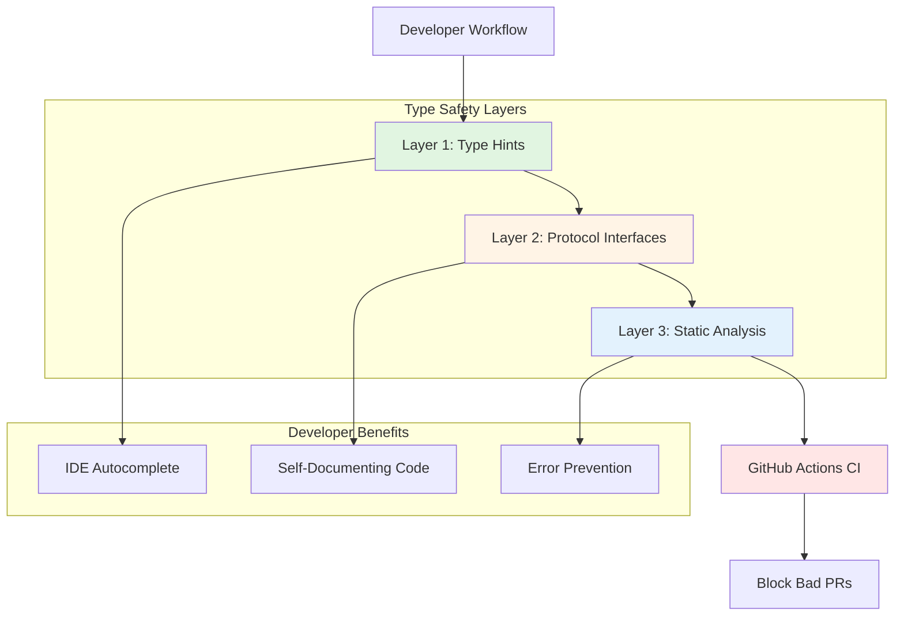
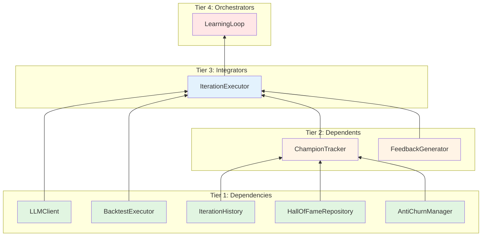

# Design Document

## Overview

The Quality Assurance System introduces a three-layer type safety and automation infrastructure:

**Layer 1: Type Hints** - Function signature annotations using Python's standard typing module
**Layer 2: Protocol Interfaces** - Structural type contracts defining component boundaries
**Layer 3: Static Analysis + CI** - mypy enforcement with GitHub Actions automation

This design follows a **gradual, non-invasive adoption strategy** aligned with the project principle "避免過度工程化" (avoid over-engineering). Type hints are added incrementally to existing code without refactoring, Protocol interfaces document existing contracts, and CI automation runs in parallel without blocking development.

**Key Design Principle**: Maximum safety with minimum disruption.

## Steering Document Alignment

### Technical Standards (tech.md)

**Python 3.10+ Type Hints**:
- Leverages PEP 484 (Type Hints), PEP 544 (Protocol), PEP 586 (Literal)
- Modern type features: Union, Optional, Literal, TypedDict
- Aligns with tech.md: "Python 3.10+ for modern type hints"

**Code Quality Tools Integration**:
- Extends existing mypy ≥1.18.0, pytest ≥8.4.0, flake8 ≥7.3.0
- No new runtime dependencies (type hints are comments)
- Dev dependencies only: mypy configuration

**Testing Framework**:
- Integrates with existing pytest setup (926 tests)
- Adds E2E smoke tests to CI (test_phase8_e2e_smoke.py)
- Maintains >80% code coverage requirement

### Project Structure (structure.md)

**File Organization**:
```
src/
├── interfaces.py              # NEW: Central Protocol definitions
├── learning/                  # MODIFIED: Add type hints
│   ├── learning_loop.py
│   ├── iteration_executor.py
│   ├── iteration_history.py
│   ├── champion_tracker.py
│   └── feedback_generator.py
├── backtest/                  # MODIFIED: Add type hints
│   └── executor.py
└── repository/                # MODIFIED: Add type hints
    └── hall_of_fame.py

.github/
└── workflows/
    └── quality-check.yml      # NEW: CI workflow

mypy.ini                       # NEW: mypy configuration
```

**Naming Conventions**:
- Protocol interfaces: `I` prefix (e.g., `IHistoryRepository`, `IChampionTracker`)
- Follows structure.md PascalCase for classes, snake_case for functions
- Type aliases: PascalCase (e.g., `MetricsDict`, `IterationNum`)

## Code Reuse Analysis

### Existing Components to Leverage

**Phase 8 E2E Test Suite** (`test_phase8_e2e_smoke.py`):
- Already validates 8 critical integration points
- 4 comprehensive tests (ChampionTracker init, update_champion API, full init, single iteration)
- Will be integrated into CI without modification

**Existing Development Tools**:
- `mypy.ini` stub (exists but minimal configuration)
- `requirements-dev.txt` (already includes mypy ≥1.18.0)
- `pytest` infrastructure (926 tests, test runners configured)

**Project Principles** (CLAUDE.md, product.md):
- "避免過度工程化" - guides minimal configuration approach
- "80/20 principle" - public APIs only, not 100% coverage
- "Gradual improvement" - incremental type adoption

### Integration Points

**Development Workflow**:
- Type checking integrates into existing `pytest` workflow
- CI runs parallel to existing manual testing
- IDE autocomplete enhancement (VSCode, PyCharm)

**Existing Code**:
- No breaking changes to public APIs
- Type hints added as annotations only (no logic changes)
- Backward compatible (Python ignores type hints at runtime)

**Test Infrastructure**:
- E2E tests run in GitHub Actions (same environment as pytest)
- Coverage reports extend existing pytest-cov setup
- No new test framework needed

## Architecture

### Three-Layer Quality Assurance Architecture



### Modular Design Principles

**Single File Responsibility**:
- `src/interfaces.py`: Protocol definitions ONLY (no implementations)
- `mypy.ini`: Type checking configuration ONLY
- `.github/workflows/quality-check.yml`: CI orchestration ONLY

**Component Isolation**:
- Type hints added per-module (IterationHistory, ChampionTracker independent)
- Protocols defined separately from implementations (loose coupling)
- CI job isolation (type-check job independent from test job)

**Service Layer Separation**:
- Interfaces layer (Protocols) separate from implementation
- Configuration layer (mypy.ini) separate from code
- Automation layer (CI) separate from development

**Utility Modularity**:
- Type aliases in interfaces.py (centralized definitions)
- Common type patterns (MetricsDict, FilePath) reusable
- Per-module mypy configuration (granular control)

### Implementation Strategy: Bottom-Up Dependency Order



**Rationale**: Type hints must be added from bottom to top to avoid forward references and circular imports. When typing `ChampionTracker`, the types for `IterationHistory`, `HallOfFameRepository`, and `AntiChurnManager` must already exist.

## Components and Interfaces

### Component 1: Central Interface Definitions (`src/interfaces.py`)

- **Purpose:** Define Protocol interfaces for all core components, preventing circular imports and documenting contracts
- **Interfaces:**
  ```python
  class IHistoryRepository(Protocol):
      def get_all(self) -> List[IterationRecord]: ...
      def save(self, record: IterationRecord) -> None: ...
      def get_recent(self, n: int) -> List[IterationRecord]: ...

  class IChampionTracker(Protocol):
      def get_champion(self) -> Optional[IterationRecord]: ...
      def update_champion(self, iteration_num: int, code: str,
                         metrics: Dict[str, float]) -> bool: ...

  class ILLMClient(Protocol):
      def is_enabled(self) -> bool: ...
      def generate(self, prompt: str) -> str: ...

  class IBacktestExecutor(Protocol):
      def execute(self, strategy_code: str, data: Any, sim: Any,
                 **kwargs) -> ExecutionResult: ...

  class IFeedbackGenerator(Protocol):
      def generate_feedback(self, iteration_num: int,
                           metrics: Optional[Dict[str, float]],
                           execution_result: Dict[str, Any],
                           classification_level: Optional[str],
                           error_msg: Optional[str] = None) -> str: ...
  ```
- **Dependencies:** Python stdlib `typing` module only
- **Reuses:** Standard PEP 544 Protocol pattern

**Design Rationale**: Centralized interfaces prevent circular imports that often arise when components need to reference each other's types. Protocol enables structural subtyping (duck typing with type safety).

### Component 2: mypy Configuration (`mypy.ini`)

- **Purpose:** Configure gradual type checking with per-module strictness
- **Interfaces:** Configuration file (not code)
- **Dependencies:** mypy ≥1.18.0
- **Reuses:** Standard mypy configuration format

**Configuration Strategy**:
```ini
[mypy]
# Lenient base configuration
python_version = 3.11
warn_return_any = True
warn_unused_configs = True
ignore_missing_imports = True  # Don't fail on third-party without stubs
disallow_untyped_defs = False  # Gradual adoption
check_untyped_defs = False     # Gradual adoption

# Strict checking for fully typed core modules
[mypy-src.interfaces]
disallow_untyped_defs = True

[mypy-src.learning.iteration_history]
disallow_untyped_defs = True
disallow_incomplete_defs = True

[mypy-src.learning.champion_tracker]
disallow_untyped_defs = True
disallow_incomplete_defs = True

# Future: Enable strict mode for more modules as typed
```

**Design Rationale**: Lenient base configuration prevents "boil the ocean" problem (thousands of errors on untyped code). Per-module strictness enables gradual tightening as modules gain type coverage.

### Component 3: GitHub Actions CI Workflow (`.github/workflows/quality-check.yml`)

- **Purpose:** Automate type checking and E2E testing on every PR
- **Interfaces:** GitHub Actions YAML workflow
- **Dependencies:** Ubuntu runner, Python 3.11, mypy, pytest
- **Reuses:** Standard GitHub Actions patterns

**Workflow Design**:
```yaml
name: Quality Assurance Checks

on:
  pull_request:
    branches: [main]
  push:
    branches: [main]

jobs:
  type-check:
    runs-on: ubuntu-latest
    steps:
      - uses: actions/checkout@v4
      - uses: actions/setup-python@v4
        with:
          python-version: '3.11'
      - name: Install dependencies
        run: |
          pip install --upgrade pip
          pip install -r requirements.txt
          pip install -r requirements-dev.txt
      - name: Run mypy type checking
        run: mypy src/

  e2e-tests:
    runs-on: ubuntu-latest
    steps:
      - uses: actions/checkout@v4
      - uses: actions/setup-python@v4
        with:
          python-version: '3.11'
      - name: Install dependencies
        run: |
          pip install --upgrade pip
          pip install -r requirements.txt
          pip install -r requirements-dev.txt
      - name: Run E2E smoke tests
        run: pytest test_phase8_e2e_smoke.py -v
```

**Design Rationale**: Parallel jobs (type-check and e2e-tests) for faster feedback. Separate jobs allow independent success/failure (e.g., type errors don't prevent running tests).

### Component 4: Type Hints in Existing Modules

- **Purpose:** Add type annotations to public APIs without changing logic
- **Interfaces:** Enhanced function signatures with type hints
- **Dependencies:** `typing` module, `src/interfaces.py` for Protocol types
- **Reuses:** Existing code structure unchanged

**Example Transformation** (`src/learning/iteration_history.py`):
```python
# BEFORE (untyped)
def get_all(self):
    records = []
    # ...
    return records

def save(self, record):
    # ...
    with open(self.filepath, 'a') as f:
        f.write(json.dumps(record_dict) + '\n')

# AFTER (typed)
def get_all(self) -> List[IterationRecord]:
    records: List[IterationRecord] = []
    # ...
    return records

def save(self, record: IterationRecord) -> None:
    # ...
    with open(self.filepath, 'a') as f:
        f.write(json.dumps(record_dict) + '\n')
```

**Design Rationale**: Type hints are pure annotations (no runtime effect). Existing logic unchanged, only metadata added. If types are wrong, mypy catches it before runtime.

## Data Models

### Type Aliases (defined in `src/interfaces.py`)

```python
from typing import Dict, List, Optional, Any, Union
from pathlib import Path

# Common type aliases
MetricsDict = Dict[str, float]
FilePath = Union[str, Path]
IterationNum = int
StrategyCode = str

# Result types
ExecutionResult = Any  # Will be properly typed in backtest/executor.py
ClassificationLevel = Literal["LEVEL_0", "LEVEL_1", "LEVEL_2", "LEVEL_3"]
```

**Design Rationale**: Type aliases improve readability (`MetricsDict` vs `Dict[str, float]`) and enable centralized changes (if MetricsDict structure evolves).

### IterationRecord Structure

Already exists as dataclass, will add full type hints:

```python
@dataclass
class IterationRecord:
    iteration_num: int
    generation_method: str
    strategy_code: Optional[str]
    strategy_id: Optional[str]
    strategy_generation: Optional[int]
    execution_result: Dict[str, Any]
    metrics: Optional[MetricsDict]
    classification_level: ClassificationLevel
    timestamp: str
    champion_updated: bool
    feedback_used: str
```

### Configuration Types

```python
class MyPyConfig(TypedDict, total=False):
    python_version: str
    warn_return_any: bool
    ignore_missing_imports: bool
    disallow_untyped_defs: bool
```

## Error Handling

### Error Scenarios

1. **Scenario: mypy Type Error on PR**
   - **Handling:** CI fails with clear error message pointing to mismatch
   - **User Impact:** Developer sees exact file:line and type mismatch, fixes before merge
   - **Recovery:** Update code to match types or add `# type: ignore` comment if legitimate

2. **Scenario: Circular Import from Type Hints**
   - **Handling:** Use `from __future__ import annotations` and `TYPE_CHECKING` block
   - **User Impact:** None (Python defers type annotation evaluation)
   - **Example:**
     ```python
     from __future__ import annotations
     from typing import TYPE_CHECKING

     if TYPE_CHECKING:
         from src.learning.champion_tracker import ChampionTracker

     def process(tracker: ChampionTracker) -> None:
         ...
     ```

3. **Scenario: Third-Party Library Without Type Stubs**
   - **Handling:** `ignore_missing_imports = True` in mypy.ini base config
   - **User Impact:** mypy doesn't fail on untyped dependencies (e.g., finlab)
   - **Recovery:** Can add `# type: ignore` per-import or install type stubs if available

4. **Scenario: E2E Test Failure in CI**
   - **Handling:** CI fails, GitHub blocks merge with clear test output
   - **User Impact:** Developer sees which of 4 E2E tests failed and why
   - **Recovery:** Fix code to pass test, re-run CI

5. **Scenario: False Positive from mypy**
   - **Handling:** Developer can add `# type: ignore[specific-error]` comment
   - **User Impact:** Unblocked after documenting reason for ignore
   - **Example:**
     ```python
     result = func()  # type: ignore[no-untyped-call]  # Finlab library untyped
     ```

## Testing Strategy

### Unit Testing

**Approach:** Verify type checking catches known errors

**Test Cases:**
1. **Positive Test**: Correct types pass mypy
   - Write test file with proper types
   - Run `mypy test_file.py`
   - Assert exit code 0 (success)

2. **Negative Test**: Wrong types fail mypy
   - Write test file with intentional type mismatch
   - Run `mypy test_file.py`
   - Assert exit code 1 (failure) and error message contains expected text

**Example Test** (`tests/type_checking/test_mypy_validation.py`):
```python
def test_correct_types_pass_mypy():
    """Verify properly typed code passes mypy."""
    test_code = '''
from src.interfaces import IHistoryRepository
from src.learning.iteration_history import IterationHistory

history: IHistoryRepository = IterationHistory(filepath="test.jsonl")
records = history.get_all()  # Should return List[IterationRecord]
'''
    result = subprocess.run(['mypy', '-c', test_code], capture_output=True)
    assert result.returncode == 0

def test_type_mismatch_fails_mypy():
    """Verify type mismatches are caught by mypy."""
    test_code = '''
from src.interfaces import IChampionTracker
from src.learning.champion_tracker import ChampionTracker

tracker: IChampionTracker = ChampionTracker()
# Wrong: update_champion expects (int, str, Dict), not (str, int, Dict)
tracker.update_champion("wrong", 123, {})  # Type error expected
'''
    result = subprocess.run(['mypy', '-c', test_code], capture_output=True)
    assert result.returncode == 1
    assert b"Argument 1" in result.stderr  # Error mentions wrong argument
```

### Integration Testing

**Approach:** E2E smoke tests validate integration points (already exist)

**Test Coverage** (`test_phase8_e2e_smoke.py`):
1. **ChampionTracker Initialization**: Verifies all dependencies injected correctly
2. **update_champion API**: Verifies correct parameter signature used
3. **Full System Init**: Verifies all 8 components initialize without TypeError
4. **Single Iteration**: Verifies complete flow executes end-to-end

**CI Integration**:
- E2E tests run in `e2e-tests` job
- Fail if any test fails (4/4 must pass)
- Test output visible in GitHub Actions UI

### End-to-End Testing

**Approach:** CI workflow exercises complete quality assurance pipeline

**Test Scenario: PR Submission**
1. Developer creates PR with code changes
2. GitHub Actions triggers `quality-check` workflow
3. Parallel jobs run:
   - `type-check`: mypy validates types
   - `e2e-tests`: Smoke tests validate integration
4. Both jobs must succeed to merge
5. If either fails, PR blocked with error details

**Success Criteria**:
- CI completes in <5 minutes
- Clear error messages on failure
- Zero false positives (legitimate code not blocked)

**Regression Prevention**: If Phase 8 errors are reintroduced:
- Fix #1, #2, #6: mypy catches parameter/method name mismatches
- Fix #3: mypy catches missing required parameters
- Fix #4: mypy catches wrong method signature
- Fix #5: mypy catches wrong class type
- Fix #7, #8: E2E tests catch runtime behavior changes

## Migration Path

### Phase 1: Foundation (Task 1-2)

1. Create `src/interfaces.py` with 5 Protocol definitions
2. Configure `mypy.ini` with lenient base + strict core modules
3. Verify mypy runs successfully on existing code (may have warnings, no errors)

**Success Criteria**: `mypy src/` exits with code 0 (warnings OK)

### Phase 2: Type Tier 1 Modules (Task 3)

Add type hints to bottom-layer dependencies:
- `src/learning/iteration_history.py`
- `src/repository/hall_of_fame.py`
- `src/config/anti_churn_manager.py`
- `src/learning/llm_client.py`
- `src/backtest/executor.py`

**Success Criteria**: All Tier 1 modules pass mypy strict mode

### Phase 3: Type Tier 2-4 Modules (Task 4-5)

Add type hints to higher layers:
- Tier 2: `champion_tracker.py`, `feedback_generator.py`
- Tier 3: `iteration_executor.py`
- Tier 4: `learning_loop.py`

**Success Criteria**: All core modules fully typed, mypy reports 0 errors

### Phase 4: CI Automation (Task 6)

1. Create `.github/workflows/quality-check.yml`
2. Test workflow on draft PR
3. Enable as required check for PRs to main

**Success Criteria**: CI runs on test PR, reports pass/fail correctly

### Phase 5: Documentation (Task 7)

Update developer documentation:
- README.md: Add "Type Checking" section
- CONTRIBUTING.md: Add mypy instructions
- CI badge: Add type-check status badge

**Success Criteria**: Documentation complete, type checking visible to contributors

## Dependencies and Integration

**New Dependencies** (dev only):
- None (mypy already in requirements-dev.txt ≥1.18.0)

**Modified Files**:
- `src/interfaces.py` (new)
- `src/learning/*.py` (type hints added)
- `src/backtest/executor.py` (type hints added)
- `mypy.ini` (new configuration)
- `.github/workflows/quality-check.yml` (new)

**Integration Points**:
- Existing pytest infrastructure (E2E tests)
- Existing GitHub Actions (new workflow added)
- Existing development workflow (type checking optional locally, enforced in CI)

**Backward Compatibility**:
- 100% compatible (type hints are annotations, no runtime effect)
- Old code works unchanged (gradual typing)
- No breaking changes to public APIs

---

**Document Version**: 1.0
**Status**: Draft - Pending Approval
**Last Updated**: 2025-11-06
**Author**: Development Team
**Reviewers**: TBD
**Related Docs**:
- Requirements Document (requirements.md)
- Tech Stack (steering/tech.md)
- Project Structure (steering/structure.md)
- Phase 8 E2E Test Report (PHASE8_E2E_TEST_REPORT.md)
