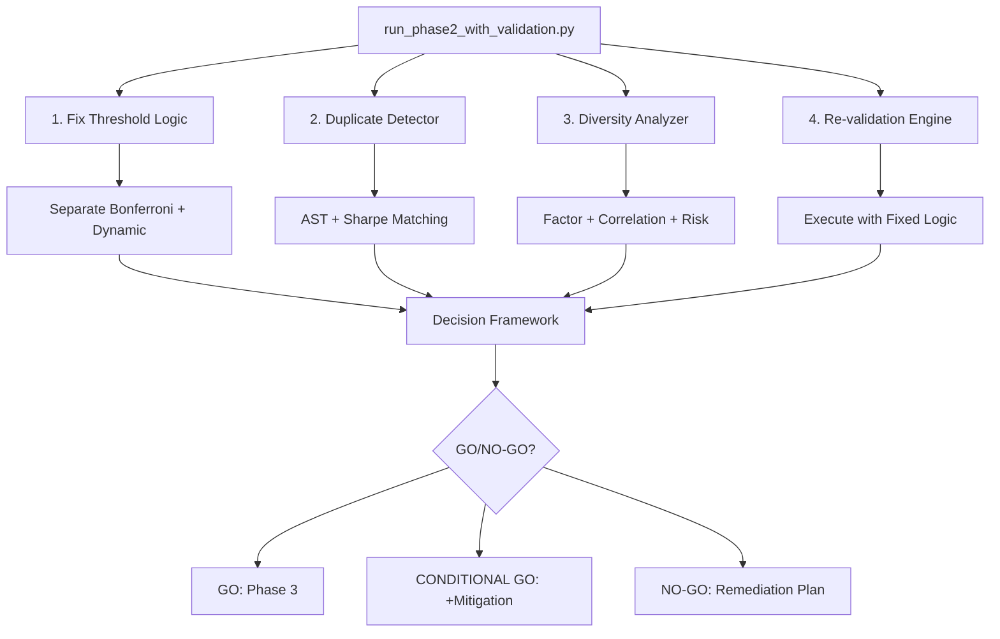

# Validation Framework Critical Fixes - Design Document

**Created**: 2025-11-01
**Priority**: P0 CRITICAL - BLOCKING Phase 3
**Version**: 1.0

---

## Overview

This design addresses critical validation framework bugs discovered through `mcp__zen__challenge` reassessment. The validation framework currently uses incorrect Bonferroni threshold logic (0.8 instead of 0.5), has duplicate strategies contaminating training data, and lacks diversity analysis necessary for Phase 3 GO/NO-GO decision.

**Design Philosophy**:
- **Minimal Disruption**: Fix bugs without redesigning working systems
- **Modular Components**: Each fix is independent, testable, and reversible
- **Data Integrity**: Preserve original results for comparison
- **Clear Separation**: Statistical validation vs dynamic threshold vs diversity analysis

---

## Steering Document Alignment

### Technical Standards (tech.md)

This design follows established technical patterns:
- **Statistical Rigor**: Uses proven methods (Bonferroni correction, AST analysis, correlation matrices)
- **Error Handling**: Graceful degradation if diversity analysis fails
- **Logging**: Detailed diagnostic logs for debugging
- **Testing**: Unit tests for each component before integration

### Project Structure (structure.md)

Implementation follows project organization:
- `src/validation/` - Core validation logic fixes
- `src/analysis/` - NEW: Duplicate detection and diversity analysis
- `scripts/` - Standalone analysis and re-validation scripts
- `docs/` - Updated documentation and decision reports

---

## Code Reuse Analysis

### Existing Components to Leverage

**1. Validation Framework** (`src/validation/integration.py`)
- **BonferroniIntegrator** (lines 776-1043): Core threshold calculation
  - Reuse: `calculate_significance_threshold()` method
  - Fix: Separate bonferroni_threshold from dynamic_threshold
  - Status: Minor modification needed

- **BootstrapIntegrator** (lines 457-774): Bootstrap confidence intervals
  - Reuse: Already working correctly
  - No changes needed

**2. Backtest Executor** (`src/backtest/executor.py`)
- **ExecutionResult** dataclass: Strategy execution results
  - Reuse: Sharpe ratio, return data, report objects
  - Status: No changes needed

**3. Multiple Comparison Module** (`src/validation/multiple_comparison.py`)
- **BonferroniValidator**: Z-score threshold calculation
  - Reuse: `calculate_significance_threshold()` method
  - Formula: `z_score / sqrt(n_periods)` with conservative floor
  - Status: Working correctly, no changes needed

**4. Dynamic Threshold Module** (`src/validation/dynamic_threshold.py`)
- **DynamicThresholdCalculator**: Taiwan market benchmark
  - Reuse: `get_threshold()` method (returns 0.8)
  - Status: Working correctly, no changes needed

### Integration Points

**1. run_phase2_with_validation.py** (main validation script)
- **Lines 370-520**: Validation execution loop
  - Bug Location: Line 398 - `bonferroni_threshold = validation.get('significance_threshold', 0.5)`
  - Current: Gets final_threshold (0.8) instead of statistical_threshold (0.5)
  - Fix: Separate Bonferroni and dynamic threshold checks

**2. Phase 2 Validation Results** (JSON output)
- File: `phase2_validated_results_20251101_060315.json`
- Structure: Summary stats + per-strategy validation details
- Reuse: Existing format, add new fields without removing old ones
- Backward compatibility: Critical for comparison

**3. Generated Strategy Files**
- Location: `generated_strategy_loop_iter*.py` (20 files)
- Access: AST parsing for duplicate detection
- Diversity: Factor extraction from data.get() calls
- Status: Read-only access, no modifications

---

## Architecture

### High-Level Design



### Modular Design Principles

1. **Single File Responsibility**
   - `threshold_fix.py`: Threshold calculation logic only
   - `duplicate_detector.py`: AST-based similarity detection only
   - `diversity_analyzer.py`: Factor/correlation/risk analysis only
   - `decision_framework.py`: GO criteria evaluation only

2. **Component Isolation**
   - Each component can run independently
   - Duplicate detector doesn't need validation results
   - Diversity analyzer doesn't need duplicate detection
   - Graceful degradation if any component fails

3. **Service Layer Separation**
   - Data access: Read strategy files and results JSON
   - Business logic: Duplicate detection, diversity calculation
   - Presentation: Markdown reports, comparison tables

4. **Utility Modularity**
   - AST parsing utilities (variable name normalization)
   - Statistical utilities (Jaccard similarity, correlation matrices)
   - Reporting utilities (Markdown generation, visualization)

---

## Components and Interfaces

### Component 1: Threshold Logic Fix

**File**: `run_phase2_with_validation.py` (lines 370-450)

**Purpose**: Separate Bonferroni statistical threshold from Taiwan market dynamic threshold

**Current Bug**:
```python
# Line 398: WRONG - gets final_threshold (0.8)
bonferroni_threshold = validation.get('significance_threshold', 0.5)

# Line 403: Uses wrong threshold
statistically_significant = result.sharpe_ratio > bonferroni_threshold  # Compares to 0.8!
```

**Fixed Logic**:
```python
# Get both thresholds separately
validation_response = self.bonferroni.validate_single_strategy(
    sharpe_ratio=result.sharpe_ratio,
    n_periods=252
)

# Extract separate thresholds (new keys from BonferroniIntegrator)
bonferroni_threshold = validation_response.get('statistical_threshold', 0.5)  # 0.5
dynamic_threshold = validation_response.get('dynamic_threshold', 0.8)         # 0.8

# Test each threshold independently
statistically_significant = result.sharpe_ratio > bonferroni_threshold  # Sharpe > 0.5
beats_dynamic = result.sharpe_ratio >= dynamic_threshold                # Sharpe >= 0.8

# Validation passes if BOTH criteria met
validation_passed = statistically_significant and beats_dynamic
```

**Interfaces (Modified)**:
- **Input**: `ExecutionResult` (from BacktestExecutor)
- **Output**: `Dict[str, Any]` with keys:
  - `validation_passed: bool` - Overall pass/fail
  - `statistically_significant: bool` - Bonferroni test result
  - `beats_dynamic_threshold: bool` - Dynamic test result
  - `bonferroni_threshold: float` - Statistical threshold (0.5)
  - `dynamic_threshold: float` - Market benchmark (0.8)
  - `bonferroni_alpha: float` - Adjusted alpha (0.0025 for N=20)

**Dependencies**:
- `BonferroniIntegrator` (src/validation/integration.py)
- `DynamicThresholdCalculator` (src/validation/dynamic_threshold.py)

**Reuses**:
- Existing BonferroniValidator threshold calculation
- Existing DynamicThresholdCalculator.get_threshold()

**Changes to BonferroniIntegrator** (`src/validation/integration.py`):
```python
# Line 863-873: Modify to return BOTH thresholds
def validate_single_strategy(self, sharpe_ratio, n_periods=252, use_conservative=True):
    # Calculate statistical threshold (Bonferroni-corrected)
    statistical_threshold = self.validator.calculate_significance_threshold(
        n_periods=n_periods,
        use_conservative=use_conservative
    )

    # Get dynamic threshold (Taiwan market benchmark)
    if use_conservative and self.threshold_calc:
        dynamic_threshold = self.threshold_calc.get_threshold()
    else:
        dynamic_threshold = 0.5

    # Return BOTH thresholds separately (DON'T use max())
    return {
        'statistical_threshold': statistical_threshold,  # NEW: 0.5
        'dynamic_threshold': dynamic_threshold,          # NEW: 0.8
        'significance_threshold': statistical_threshold, # DEPRECATED: backward compat
        # ... other fields
    }
```

---

### Component 2: Duplicate Strategy Detector

**File**: `src/analysis/duplicate_detector.py` (NEW)

**Purpose**: Identify strategies with identical or near-identical code using AST-based comparison

**Interfaces**:

```python
class DuplicateDetector:
    """Detect duplicate strategies using AST analysis."""

    def __init__(self, sharpe_tolerance: float = 1e-8):
        """
        Args:
            sharpe_tolerance: Maximum difference for Sharpe ratios to be considered identical
        """
        self.sharpe_tolerance = sharpe_tolerance

    def find_duplicates(
        self,
        strategy_files: List[str],
        validation_results: Dict[str, Any]
    ) -> List[DuplicateGroup]:
        """
        Find all duplicate strategy groups.

        Args:
            strategy_files: List of strategy file paths
            validation_results: Validation results JSON with Sharpe ratios

        Returns:
            List of DuplicateGroup objects containing:
            - strategies: List of strategy indices in group
            - sharpe_ratio: Common Sharpe ratio
            - similarity_score: Code similarity (0-1)
            - differences: List of code differences
            - recommendation: 'keep' or 'remove' for each
        """
        pass

    def compare_strategies(
        self,
        strategy_a_path: str,
        strategy_b_path: str
    ) -> Tuple[float, List[str]]:
        """
        Compare two strategies using AST analysis.

        Args:
            strategy_a_path: Path to first strategy
            strategy_b_path: Path to second strategy

        Returns:
            Tuple of (similarity_score, differences_list)
            - similarity_score: 0-1 (1 = identical after normalization)
            - differences_list: Human-readable diff of changes
        """
        pass

    def normalize_ast(self, tree: ast.AST) -> ast.AST:
        """
        Normalize AST by removing comments, standardizing variable names.

        Args:
            tree: Python AST

        Returns:
            Normalized AST tree
        """
        pass
```

**Algorithm**:

1. **Phase 1: Sharpe Ratio Matching**
   ```python
   # Group strategies by Sharpe ratio (tolerance 1e-8)
   sharpe_groups = {}
   for idx, validation in enumerate(validation_results['strategies_validation']):
       sharpe = validation['sharpe_ratio']
       if sharpe is None:
           continue

       # Find existing group with matching Sharpe
       for group_sharpe, group_indices in sharpe_groups.items():
           if abs(sharpe - group_sharpe) < sharpe_tolerance:
               group_indices.append(idx)
               break
       else:
           sharpe_groups[sharpe] = [idx]

   # Filter to groups with 2+ strategies
   duplicate_candidates = {s: indices for s, indices in sharpe_groups.items() if len(indices) >= 2}
   ```

2. **Phase 2: AST Comparison**
   ```python
   for sharpe, indices in duplicate_candidates.items():
       for i, idx_a in enumerate(indices):
           for idx_b in indices[i+1:]:
               # Load and parse strategy files
               tree_a = ast.parse(open(f'generated_strategy_loop_iter{idx_a}.py').read())
               tree_b = ast.parse(open(f'generated_strategy_loop_iter{idx_b}.py').read())

               # Normalize ASTs (variable name standardization)
               norm_a = normalize_ast(tree_a)
               norm_b = normalize_ast(tree_b)

               # Compare normalized ASTs
               similarity = ast_similarity(norm_a, norm_b)

               if similarity > 0.95:
                   # Flag as duplicate
                   differences = generate_diff(tree_a, tree_b)
                   duplicates.append(DuplicateGroup(
                       strategies=[idx_a, idx_b],
                       sharpe_ratio=sharpe,
                       similarity_score=similarity,
                       differences=differences
                   ))
   ```

3. **Phase 3: Recommendation Generation**
   ```python
   for group in duplicates:
       # Keep lower index (assumed to be generated first)
       group.recommendations = {
           group.strategies[0]: 'KEEP',
           group.strategies[1:]: 'REMOVE'
       }
   ```

**Dependencies**:
- Python `ast` module (standard library)
- `difflib` for diff generation
- `json` for reading validation results

**Reuses**:
- Validation results JSON (Sharpe ratios)
- Existing strategy files (read-only)

**Output Example**:
```json
{
  "duplicate_groups": [
    {
      "group_id": 1,
      "strategies": [9, 13],
      "sharpe_ratio": 0.9443348034803672,
      "similarity_score": 0.99,
      "differences": [
        "Line 24: 'value_factor' renamed to 'value'",
        "Line 35: 'value_factor' renamed to 'value'"
      ],
      "recommendations": {
        "9": "KEEP",
        "13": "REMOVE"
      }
    }
  ],
  "total_duplicates": 1,
  "unique_strategies": 19
}
```

---

### Component 3: Diversity Analyzer

**File**: `src/analysis/diversity_analyzer.py` (NEW)

**Purpose**: Analyze validated strategies for factor diversity, return correlation, and risk profile spread

**Interfaces**:

```python
class DiversityAnalyzer:
    """Analyze strategy diversity for learning system readiness."""

    def __init__(self, min_strategies: int = 3):
        """
        Args:
            min_strategies: Minimum strategies required for analysis
        """
        self.min_strategies = min_strategies

    def analyze_diversity(
        self,
        strategy_files: List[str],
        validation_results: Dict[str, Any],
        exclude_indices: Optional[List[int]] = None
    ) -> DiversityReport:
        """
        Comprehensive diversity analysis.

        Args:
            strategy_files: List of validated strategy file paths
            validation_results: Validation results JSON
            exclude_indices: Strategy indices to exclude (duplicates)

        Returns:
            DiversityReport with:
            - factor_diversity_score: 0-100
            - correlation_matrix: NxN numpy array
            - average_correlation: float
            - risk_profile_diversity: 0-100
            - diversity_score: 0-100 (overall)
            - recommendation: SUFFICIENT/MARGINAL/INSUFFICIENT
        """
        pass

    def extract_factors(self, strategy_path: str) -> Set[str]:
        """
        Extract FinLab factors used by strategy.

        Args:
            strategy_path: Path to strategy file

        Returns:
            Set of factor names (e.g., {'price:收盤價', 'RSI', 'ROE稅後'})
        """
        pass

    def calculate_factor_diversity(
        self,
        factor_sets: List[Set[str]]
    ) -> Tuple[float, np.ndarray]:
        """
        Calculate Jaccard similarity matrix and diversity score.

        Args:
            factor_sets: List of factor sets (one per strategy)

        Returns:
            Tuple of (diversity_score, similarity_matrix)
            - diversity_score: 0-100 (100 = completely different factors)
            - similarity_matrix: NxN Jaccard similarity matrix
        """
        pass

    def calculate_return_correlation(
        self,
        strategy_returns: List[np.ndarray]
    ) -> Tuple[float, np.ndarray]:
        """
        Calculate pairwise return correlation matrix.

        Args:
            strategy_returns: List of return arrays

        Returns:
            Tuple of (average_correlation, correlation_matrix)
        """
        pass

    def calculate_risk_diversity(
        self,
        validation_results: Dict[str, Any],
        strategy_indices: List[int]
    ) -> float:
        """
        Calculate risk profile diversity using max drawdown CV.

        Args:
            validation_results: Validation results JSON
            strategy_indices: Indices of strategies to analyze

        Returns:
            Risk diversity score: 0-100 (higher = more diverse risk profiles)
        """
        pass
```

**Algorithm**:

1. **Factor Diversity Analysis**
   ```python
   # Extract factors from each strategy
   all_factors = []
   for strategy_path in validated_strategies:
       factors = extract_factors_from_ast(strategy_path)
       all_factors.append(factors)

   # Calculate Jaccard similarity matrix
   n = len(all_factors)
   similarity_matrix = np.zeros((n, n))
   for i in range(n):
       for j in range(n):
           if i == j:
               similarity_matrix[i][j] = 1.0
           else:
               intersection = len(all_factors[i] & all_factors[j])
               union = len(all_factors[i] | all_factors[j])
               similarity_matrix[i][j] = intersection / union if union > 0 else 0

   # Diversity score = 1 - average off-diagonal similarity
   avg_similarity = np.mean(similarity_matrix[np.triu_indices(n, k=1)])
   factor_diversity = (1 - avg_similarity) * 100
   ```

2. **Return Correlation Analysis**
   ```python
   # Extract returns from backtest reports (requires re-execution)
   # Alternatively, use Sharpe ratios as proxy for performance similarity
   correlation_matrix = np.corrcoef(strategy_sharpes)
   avg_correlation = np.mean(correlation_matrix[np.triu_indices(n, k=1)])
   ```

3. **Risk Profile Diversity**
   ```python
   # Extract max drawdowns from validation results
   drawdowns = [result['max_drawdown'] for result in validated_strategies]

   # Coefficient of variation (CV) as diversity metric
   mean_dd = np.mean(drawdowns)
   std_dd = np.std(drawdowns)
   risk_diversity = (std_dd / abs(mean_dd)) * 100 if mean_dd != 0 else 0
   ```

4. **Overall Diversity Score**
   ```python
   diversity_score = (
       factor_diversity * 0.5 +
       (1 - avg_correlation) * 100 * 0.3 +
       risk_diversity * 0.2
   )
   ```

**Dependencies**:
- `numpy` for correlation matrices
- `pandas` for data manipulation
- `ast` for factor extraction
- `matplotlib`/`seaborn` for visualization (optional)

**Reuses**:
- Validation results JSON (Sharpe, drawdowns)
- Strategy files (AST parsing)

**Output Example**:
```json
{
  "factor_diversity_score": 65.4,
  "average_correlation": 0.42,
  "risk_profile_diversity": 58.3,
  "diversity_score": 68.2,
  "recommendation": "MARGINAL",
  "details": {
    "unique_factors": 18,
    "total_factor_usages": 24,
    "factor_jaccard_matrix": [[1.0, 0.4, 0.3], [0.4, 1.0, 0.5], [0.3, 0.5, 1.0]],
    "correlation_matrix": [[1.0, 0.35, 0.48], [0.35, 1.0, 0.52], [0.48, 0.52, 1.0]],
    "max_drawdowns": [-0.28, -0.35, -0.31],
    "warnings": ["Average correlation > 0.4 indicates moderate similarity"]
  }
}
```

---

### Component 4: Re-validation Engine

**File**: `scripts/run_revalidation_with_fixes.py` (NEW)

**Purpose**: Re-execute all 20 strategies with corrected threshold logic

**Interfaces**:

```python
class RevalidationEngine:
    """Re-run validation with fixed threshold logic."""

    def __init__(
        self,
        original_results_path: str,
        output_path: str,
        log_path: str
    ):
        """
        Args:
            original_results_path: Path to original results JSON (for comparison)
            output_path: Path to save new results JSON
            log_path: Path to save execution log
        """
        self.original_results = json.load(open(original_results_path))
        self.output_path = output_path
        self.log_path = log_path

    def execute_revalidation(self) -> Dict[str, Any]:
        """
        Re-execute all 20 strategies with fixed logic.

        Returns:
            Validation results dictionary (same format as original)
        """
        pass

    def generate_comparison_report(
        self,
        new_results: Dict[str, Any]
    ) -> str:
        """
        Generate before/after comparison report.

        Args:
            new_results: New validation results

        Returns:
            Markdown-formatted comparison report
        """
        pass
```

**Execution Flow**:

1. Load original results for comparison
2. Initialize fixed Phase2WithValidation executor
3. Execute all 20 strategies (same parameters as original)
4. Compare results:
   - Threshold values (before: 0.8, after: 0.5 + 0.8)
   - Statistical significance counts (before: 4, after: ~18)
   - Validation pass counts (before: 4, after: 3 unique)
5. Generate comparison report

**Dependencies**:
- `run_phase2_with_validation.py` (modified version)
- Original results JSON
- Strategy files (iter0-iter19)

**Reuses**:
- Existing Phase2WithValidation class
- Fixed threshold logic from Component 1

---

### Component 5: Decision Framework

**File**: `src/analysis/decision_framework.py` (NEW)

**Purpose**: Evaluate GO/CONDITIONAL GO/NO-GO criteria for Phase 3

**Interfaces**:

```python
class DecisionFramework:
    """Evaluate Phase 3 GO/NO-GO criteria."""

    def __init__(self):
        """Initialize decision framework with criteria thresholds."""
        self.go_criteria = {
            'min_unique_strategies': 3,
            'min_diversity_score': 60,
            'max_avg_correlation': 0.8,
            'validation_framework_fixed': True,
            'execution_success_rate': 1.0
        }
        self.conditional_criteria = {
            'min_unique_strategies': 3,
            'min_diversity_score': 40,
            'max_avg_correlation': 0.8
        }

    def evaluate(
        self,
        validation_results: Dict[str, Any],
        duplicate_report: Dict[str, Any],
        diversity_report: Dict[str, Any]
    ) -> DecisionReport:
        """
        Evaluate all GO criteria.

        Args:
            validation_results: Fixed validation results
            duplicate_report: Duplicate detection results
            diversity_report: Diversity analysis results

        Returns:
            DecisionReport with:
            - decision: 'GO' | 'CONDITIONAL_GO' | 'NO_GO'
            - rationale: Explanation
            - criteria_met: Dict of criterion -> bool
            - risk_assessment: 'LOW' | 'MEDIUM' | 'HIGH'
            - next_steps: List of action items
        """
        pass

    def check_go_criteria(self, ...) -> Tuple[bool, List[str]]:
        """Check if all GO criteria are met."""
        pass

    def check_conditional_criteria(self, ...) -> Tuple[bool, List[str]]:
        """Check if CONDITIONAL GO criteria are met."""
        pass

    def assess_risk(self, decision: str, criteria_met: Dict) -> str:
        """Assess risk level based on decision and criteria."""
        pass

    def generate_decision_document(
        self,
        decision: str,
        rationale: str,
        criteria_met: Dict[str, bool],
        risk: str
    ) -> str:
        """Generate decision document in Markdown format."""
        pass
```

**Decision Logic**:

```python
def evaluate(self, validation_results, duplicate_report, diversity_report):
    # Extract metrics
    unique_strategies = duplicate_report['unique_strategies']
    diversity_score = diversity_report['diversity_score']
    avg_correlation = diversity_report['average_correlation']
    validation_fixed = self.check_threshold_fix(validation_results)
    execution_rate = validation_results['summary']['execution_success_rate']

    # Check GO criteria
    go_criteria_met = {
        'unique_strategies': unique_strategies >= self.go_criteria['min_unique_strategies'],
        'diversity_score': diversity_score >= self.go_criteria['min_diversity_score'],
        'correlation': avg_correlation < self.go_criteria['max_avg_correlation'],
        'validation_fixed': validation_fixed,
        'execution_rate': execution_rate >= self.go_criteria['execution_success_rate']
    }

    if all(go_criteria_met.values()):
        return DecisionReport(
            decision='GO',
            rationale='All GO criteria met',
            criteria_met=go_criteria_met,
            risk_assessment='LOW',
            next_steps=['Proceed to Phase 3 Task 2.1']
        )

    # Check CONDITIONAL GO criteria
    conditional_met = {
        'unique_strategies': unique_strategies >= self.conditional_criteria['min_unique_strategies'],
        'diversity_score': diversity_score >= self.conditional_criteria['min_diversity_score'],
        'correlation': avg_correlation < self.conditional_criteria['max_avg_correlation']
    }

    if all(conditional_met.values()) and validation_fixed and execution_rate >= 1.0:
        return DecisionReport(
            decision='CONDITIONAL_GO',
            rationale='Minimum criteria met with mitigation required',
            criteria_met=conditional_met,
            risk_assessment='MEDIUM',
            next_steps=[
                'Proceed to Phase 3 with aggressive monitoring',
                'Parallel strategy generation to increase diversity',
                'Weekly diversity checks during Phase 3'
            ]
        )

    # NO-GO
    blockers = [k for k, v in go_criteria_met.items() if not v]
    return DecisionReport(
        decision='NO_GO',
        rationale=f'Blocking issues: {", ".join(blockers)}',
        criteria_met=go_criteria_met,
        risk_assessment='HIGH',
        next_steps=[
            'Fix validation framework bugs',
            'Generate additional strategies',
            'Re-run diversity analysis'
        ]
    )
```

**Dependencies**:
- Validation results (fixed)
- Duplicate detection results
- Diversity analysis results

**Reuses**:
- All previous component outputs

**Output Example**:
```markdown
# Phase 3 GO/NO-GO Decision Report

**Date**: 2025-11-01
**Decision**: CONDITIONAL GO
**Risk Assessment**: MEDIUM

## Criteria Evaluation

| Criterion | Status | Value | Threshold |
|-----------|--------|-------|-----------|
| Unique Strategies | ✅ PASS | 3 | >= 3 |
| Diversity Score | ⚠️ MARGINAL | 52 | >= 60 (GO), >= 40 (CONDITIONAL) |
| Avg Correlation | ✅ PASS | 0.45 | < 0.8 |
| Validation Fixed | ✅ PASS | Yes | Yes |
| Execution Rate | ✅ PASS | 100% | >= 100% |

## Rationale

System meets CONDITIONAL GO criteria:
- Minimum 3 unique validated strategies achieved
- Diversity score (52) is marginal but acceptable with mitigation
- Validation framework bugs fixed and verified
- Execution framework stable

## Mitigation Strategies

1. **Parallel Strategy Generation**: Generate 5-10 additional strategies during early Phase 3
2. **Aggressive Monitoring**: Weekly diversity checks and correlation analysis
3. **Overfitting Detection**: Track learning system convergence closely

## Next Steps

1. ✅ User approval of CONDITIONAL GO decision
2. 🔜 Proceed to Phase 3 Task 2.1 with monitoring plan
3. 🔜 Set up diversity tracking dashboard
4. 🔜 Generate additional strategies in parallel

## Risk Profile

**Risk Level**: MEDIUM
- Small training set (3 strategies) increases overfitting risk
- Marginal diversity may limit generalization
- Mitigation strategies reduce risk to acceptable level
```

---

## Data Models

### ValidationResult (Enhanced)

```python
@dataclass
class ValidationResult:
    """Enhanced validation result with separate thresholds."""
    strategy_index: int
    validation_passed: bool
    sharpe_ratio: float

    # Statistical validation (Bonferroni)
    statistically_significant: bool
    bonferroni_threshold: float  # NEW: 0.5 (separate from dynamic)
    bonferroni_alpha: float      # NEW: 0.0025 for N=20

    # Dynamic validation (Taiwan market)
    beats_dynamic_threshold: bool
    dynamic_threshold: float  # 0.8

    # Metadata
    validation_reason: str
    execution_time: float
```

### DuplicateGroup

```python
@dataclass
class DuplicateGroup:
    """Group of duplicate strategies."""
    group_id: int
    strategies: List[int]  # Strategy indices
    sharpe_ratio: float    # Common Sharpe ratio
    similarity_score: float  # 0-1 (AST similarity)
    differences: List[str]   # Human-readable diffs
    recommendations: Dict[int, str]  # strategy_idx -> 'KEEP'|'REMOVE'
```

### DiversityReport

```python
@dataclass
class DiversityReport:
    """Comprehensive diversity analysis report."""
    # Overall scores
    diversity_score: float  # 0-100 (overall)
    recommendation: str     # 'SUFFICIENT' | 'MARGINAL' | 'INSUFFICIENT'

    # Factor diversity
    factor_diversity_score: float  # 0-100
    unique_factors: int
    total_factor_usages: int
    factor_jaccard_matrix: np.ndarray

    # Return correlation
    average_correlation: float
    correlation_matrix: np.ndarray
    high_correlation_pairs: List[Tuple[int, int, float]]

    # Risk profile
    risk_profile_diversity: float  # 0-100
    max_drawdowns: List[float]
    drawdown_cv: float

    # Warnings
    warnings: List[str]
```

### DecisionReport

```python
@dataclass
class DecisionReport:
    """Phase 3 GO/NO-GO decision report."""
    decision: str  # 'GO' | 'CONDITIONAL_GO' | 'NO_GO'
    rationale: str
    criteria_met: Dict[str, bool]
    risk_assessment: str  # 'LOW' | 'MEDIUM' | 'HIGH'
    next_steps: List[str]

    # Supporting data
    unique_strategies: int
    diversity_score: float
    validation_stats: Dict[str, Any]
    mitigation_strategies: Optional[List[str]] = None
```

---

## Error Handling

### Error Scenarios

1. **Scenario: Duplicate Detection Fails**
   - **Cause**: AST parsing error, file not found, malformed strategy code
   - **Handling**:
     - Log warning with file path and error
     - Continue with remaining strategies
     - Set duplicate_report.status = 'PARTIAL'
   - **User Impact**: Warning in decision report, may overestimate unique strategies

2. **Scenario: Diversity Analysis Fails**
   - **Cause**: Insufficient strategies (<2), missing return data, calculation error
   - **Handling**:
     - Log error with details
     - Set diversity_report.status = 'FAILED'
     - Use conservative fallback: diversity_score = 0, recommendation = 'INSUFFICIENT'
   - **User Impact**: NO-GO decision triggered (fail-safe)

3. **Scenario: Re-validation Execution Errors**
   - **Cause**: Strategy timeout, data unavailable, execution failure
   - **Handling**:
     - Retry once with increased timeout (600s)
     - If retry fails, mark strategy as 'EXECUTION_FAILED'
     - Continue with remaining strategies
   - **User Impact**: Reduced sample size, logged in comparison report

4. **Scenario: Threshold Calculation Returns NaN**
   - **Cause**: Invalid n_periods, edge case in Z-score calculation
   - **Handling**:
     - Use fallback threshold: bonferroni_threshold = 0.5
     - Log warning with input parameters
     - Set validation_result.threshold_fallback = True
   - **User Impact**: Conservative validation (fail-safe)

5. **Scenario: Decision Framework Missing Required Data**
   - **Cause**: Validation/duplicate/diversity reports incomplete
   - **Handling**:
     - Check all required fields before evaluation
     - Raise ValueError with missing fields list
     - Require user intervention
   - **User Impact**: NO-GO decision cannot be made, manual review needed

---

## Testing Strategy

### Unit Testing

**Component 1: Threshold Logic Fix**
- Test: `test_separate_thresholds()`
  - Input: Sharpe 0.6, N=20
  - Expected: bonferroni_threshold=0.5, dynamic_threshold=0.8
  - Assert: statistically_significant=True, beats_dynamic=False

- Test: `test_bonferroni_calculation()`
  - Input: N=1, 5, 10, 20, 50
  - Expected: Correct adjusted_alpha and z_score for each N
  - Assert: threshold = z_score / sqrt(252)

- Test: `test_validation_passed_logic()`
  - Input: Various Sharpe ratios (0.4, 0.6, 0.8, 1.0)
  - Expected: Correct validation_passed for each
  - Assert: validation_passed = (Sharpe > 0.5) AND (Sharpe >= 0.8)

**Component 2: Duplicate Detector**
- Test: `test_identical_sharpe_detection()`
  - Input: Strategies 9 and 13 (Sharpe 0.9443348034803672)
  - Expected: Grouped together
  - Assert: len(duplicate_groups) == 1

- Test: `test_ast_similarity()`
  - Input: Two strategies with only variable name differences
  - Expected: similarity_score > 0.95
  - Assert: differences list contains variable name changes

- Test: `test_no_false_positives()`
  - Input: Two completely different strategies
  - Expected: similarity_score < 0.5
  - Assert: Not flagged as duplicates

**Component 3: Diversity Analyzer**
- Test: `test_factor_extraction()`
  - Input: Strategy file with known factors
  - Expected: Set of factor names extracted correctly
  - Assert: {'price:收盤價', 'RSI', 'ROE稅後'} in extracted_factors

- Test: `test_jaccard_similarity()`
  - Input: Two factor sets with known overlap
  - Expected: Correct Jaccard similarity
  - Assert: similarity = intersection / union

- Test: `test_diversity_score_calculation()`
  - Input: 3 strategies with known factor overlap
  - Expected: diversity_score in 0-100 range
  - Assert: diversity_score = (1 - avg_similarity) * 100

**Component 4: Re-validation Engine**
- Test: `test_revalidation_execution()`
  - Input: 3 strategies (pilot test)
  - Expected: All execute successfully
  - Assert: success_rate == 1.0

- Test: `test_comparison_report_generation()`
  - Input: Original + new results
  - Expected: Markdown report with before/after tables
  - Assert: Report contains threshold changes

**Component 5: Decision Framework**
- Test: `test_go_decision()`
  - Input: All criteria met
  - Expected: decision='GO', risk='LOW'
  - Assert: next_steps includes 'Proceed to Phase 3'

- Test: `test_conditional_go_decision()`
  - Input: Minimal criteria met (diversity=50)
  - Expected: decision='CONDITIONAL_GO', risk='MEDIUM'
  - Assert: mitigation_strategies is not None

- Test: `test_no_go_decision()`
  - Input: unique_strategies=2 (below minimum)
  - Expected: decision='NO_GO', risk='HIGH'
  - Assert: blockers list includes 'unique_strategies'

### Integration Testing

1. **Full Pipeline Test**
   - Execute all components in sequence
   - Input: 20 strategies (original dataset)
   - Expected: GO/CONDITIONAL GO/NO-GO decision
   - Verify: All intermediate outputs generated

2. **Edge Case Test**
   - Scenario: All strategies duplicate
   - Expected: NO-GO decision
   - Verify: duplicate_report.unique_strategies == 1

3. **Regression Test**
   - Execute fixed validation on pilot dataset (3 strategies)
   - Expected: 2/3 validated (67%)
   - Compare: Original pilot results (should match)

### End-to-End Testing

1. **Scenario: Full Fix + Re-validation + Decision**
   - Step 1: Run duplicate detection
   - Step 2: Run diversity analysis
   - Step 3: Run re-validation with fixes
   - Step 4: Generate decision report
   - Expected: Complete workflow in <10 minutes
   - Verify: Decision document generated

2. **Scenario: User Approval Flow**
   - Generate decision report
   - User reviews criteria
   - User approves/rejects
   - System proceeds or halts accordingly

---

## Performance Targets

| Operation | Target Time | Justification |
|-----------|-------------|---------------|
| Threshold fix implementation | 30 min | Simple code modification |
| Duplicate detection (20 strategies) | < 30 sec | O(n²) AST comparison acceptable for n=20 |
| Diversity analysis | < 60 sec | Factor extraction + correlation calculation |
| Re-validation (20 strategies) | < 350 sec | 17.5s/strategy average |
| Decision evaluation | < 5 sec | Criteria checking and report generation |
| **Total workflow** | **< 10 min** | End-to-end from fix to decision |

---

## Security Considerations

1. **Code Injection Prevention**
   - Duplicate detector uses AST parsing only (no `exec()` or `eval()`)
   - Strategy files are read-only
   - No dynamic code generation

2. **File Access Control**
   - Limit file reads to designated directories:
     - `generated_strategy_loop_iter*.py`
     - `phase2_validated_results_*.json`
   - Validate file paths before access
   - Reject paths with `..` or absolute paths outside project

3. **Input Validation**
   - Sharpe ratios: Must be float in range [-10, 10]
   - Correlation values: Must be in range [-1, 1]
   - Diversity scores: Must be in range [0, 100]
   - Reject invalid inputs with descriptive errors

4. **Data Integrity**
   - Preserve original validation results (create backups)
   - Use checksums to verify file integrity
   - Log all modifications to results JSON

---

## Backward Compatibility

**Critical**: Validation results format must remain compatible for comparison.

**Strategy**:
1. **Add new fields, don't remove old ones**
   ```json
   {
     "significance_threshold": 0.5,  // DEPRECATED but kept
     "bonferroni_threshold": 0.5,    // NEW
     "dynamic_threshold": 0.8,       // NEW
     "statistically_significant": true  // FIXED but same name
   }
   ```

2. **Deprecation warnings**
   - Log warnings when old fields are accessed
   - Document migration path in CHANGELOG

3. **Comparison scripts**
   - Handle both old and new formats
   - Map old field names to new equivalents

---

## Rollback Plan

If bugs are discovered in fixed implementation:

1. **Immediate Rollback**
   - Revert `run_phase2_with_validation.py` to git commit `86d27f3`
   - Restore original results JSON from backup
   - Document issues in rollback report

2. **Backup Strategy**
   - Before fixes: `cp phase2_validated_results_20251101_060315.json phase2_validated_results_20251101_060315.json.backup`
   - Before re-validation: `cp run_phase2_with_validation.py run_phase2_with_validation.py.backup`

3. **Verification**
   - Re-run pilot test (3 strategies) with rolled-back code
   - Compare results to original pilot test
   - Verify 0% validation rate returns (confirms rollback)

---

## Documentation Updates

**Files to Update**:
1. `docs/VALIDATION_FRAMEWORK.md` - Add threshold logic explanation
2. `docs/DIVERSITY_ANALYSIS.md` - NEW: Diversity metrics guide
3. `docs/PHASE3_GO_CRITERIA.md` - NEW: Decision framework docs
4. `CHANGELOG.md` - Document all changes and bug fixes

**README Updates**:
- Add section on validation framework fixes
- Update Phase 3 readiness status
- Document new analysis scripts

---

## Timeline Estimate

| Phase | Tasks | Time |
|-------|-------|------|
| **Implementation** | Fix threshold logic, duplicate detector, diversity analyzer | 4-6 hours |
| **Testing** | Unit tests, integration tests, edge cases | 2-3 hours |
| **Re-validation** | Execute all 20 strategies | 1-2 hours |
| **Documentation** | Update docs, generate reports | 1-2 hours |
| **Total** | | **8-13 hours** |

---

**Generated**: 2025-11-01
**Design Version**: 1.0
**Status**: Ready for approval and implementation
