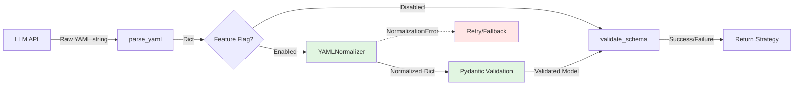
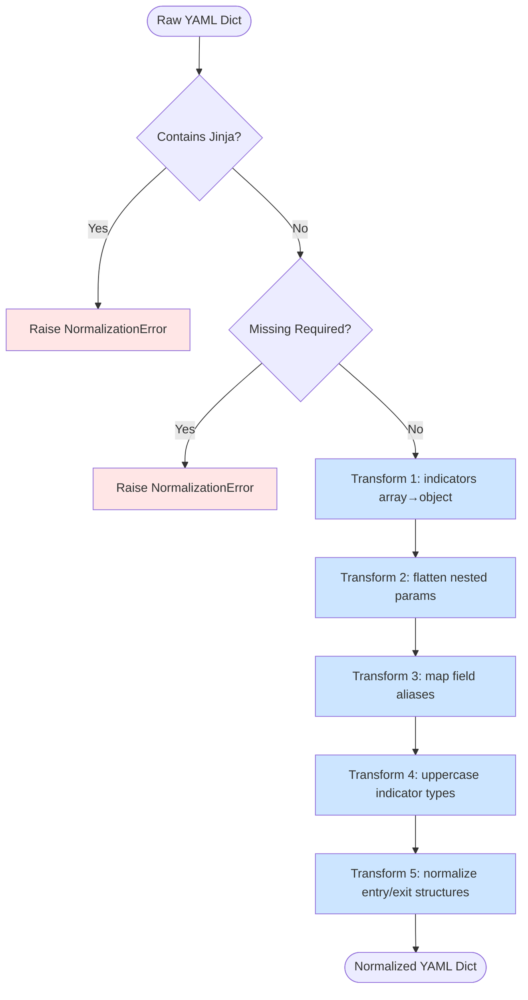

# Design Document

## Overview

This design implements a two-stage YAML validation architecture (Normalizer → Pydantic) to increase LLM-generated strategy validation success rate from 25% to 90%+. The normalizer is a stateless transformation layer that bridges the gap between exploratory LLM generation patterns and prescriptive schema requirements, handling 5 transformation patterns that cover 95% of observed failures.

**Core Philosophy**: 避免過度工程化 (Avoid Over-Engineering)
- MVP normalizer using regex/dict manipulation (no AST complexity)
- 80/20 approach: 5 patterns handle 95% of failures
- Stateless pure function design
- Build upon existing YAMLSchemaValidator (no replacement)

**Integration Point**: Insert normalizer between YAML parsing and schema validation in existing pipeline.

## Steering Document Alignment

### Technical Standards (tech.md)

**Layered Architecture Compliance**:
- **Generators Layer**: New `yaml_normalizer.py` in `src/generators/` alongside `yaml_schema_validator.py`
- **Pure Function Pattern**: `normalize_yaml(dict) -> dict` matches existing stateless utilities
- **Fail-Fast Design**: Explicit `NormalizationError` for unfixable cases (Jinja templates)

**Dependency Management**:
- **Zero External Dependencies**: Uses only Python stdlib (copy, logging, typing, re)
- **Pydantic Integration**: Leverages existing pydantic ≥2.11.0 dependency
- **No New Packages**: Avoids scope creep

**Testing Standards**:
- **TDD Workflow**: Red → Green → Refactor with 15 real failure cases
- **Coverage Target**: >80% for normalizer module
- **Integration Safety**: 926 existing tests must pass (backward compatibility)

### Project Structure (structure.md)

**File Organization**:
```
src/
├── generators/
│   ├── yaml_schema_validator.py    # Existing - modify validate() method
│   └── yaml_normalizer.py          # NEW - transformation logic
├── models/
│   └── strategy_models.py          # NEW - auto-generated Pydantic models
tests/
├── generators/
│   ├── test_yaml_schema_validator.py  # Existing
│   └── test_yaml_normalizer.py        # NEW - 15 real failure tests
```

**Modular Design Principles**:
- **Single File Responsibility**: `yaml_normalizer.py` only handles transformations (no validation, no parsing)
- **Component Isolation**: Normalizer is independent of YAMLSchemaValidator (can be tested in isolation)
- **Service Layer Separation**: Clear boundaries: LLM API → Parse → **Normalize** → Validate → Backtest

## Code Reuse Analysis

### Existing Components to Leverage

1. **YAMLSchemaValidator** (`src/generators/yaml_schema_validator.py`)
   - **Reuse**: `validate()` method for post-normalization validation
   - **Modify**: Add normalizer call before existing validation logic
   - **Keep**: Schema loading, error formatting, indicator reference validation

2. **LLM Provider Interface** (`src/innovation/llm_providers.py`)
   - **Reuse**: `_parse_yaml_response()` for parsing LLM output
   - **Integration Point**: Insert normalizer after YAML parsing, before validation

3. **Exception Hierarchy** (`src/utils/exceptions.py`)
   - **Reuse**: Existing exception patterns
   - **Add**: `NormalizationError` as subclass of `ValidationError`

4. **Logging System** (`src/utils/logger.py`)
   - **Reuse**: Existing structured logger
   - **Pattern**: Info-level logs for transformations, Warning for failures

### Integration Points

1. **InnovationEngine** (`src/innovation/innovation_engine.py`)
   - **Location**: `generate_innovation()` method
   - **Change**: Call normalizer after YAML generation, before validation
   - **Pattern**: Wrapper function with feature flag check

2. **Configuration** (`config/learning_system.yaml`)
   - **Add**: Feature flag under `yaml_validation` section:
     ```yaml
     yaml_validation:
       enabled: true
       normalization:
         enabled: true  # NEW - default true for new runs
     ```

3. **Test Suite** (`tests/generators/`)
   - **Add**: New test file with 15 real failure cases
   - **Pattern**: Parameterized pytest tests for each transformation category

## Architecture

### High-Level Flow



### Transformation Pipeline



### Modular Design Principles

- **Stateless Transformation**: No instance variables, no side effects (pure function)
- **Immutability**: Deep copy input dict to prevent mutations
- **Configuration Externalized**: All mappings as module constants (FIELD_ALIASES, INDICATOR_TYPE_MAP)
- **Single Responsibility**: Each transformation function handles one pattern

## Components and Interfaces

### Component 1: YAMLNormalizer (Core Transformation Logic)

**File**: `src/generators/yaml_normalizer.py`

**Purpose**: Transform LLM-generated YAML dicts into schema-compliant format using 5 transformation patterns.

**Public API**:
```python
def normalize_yaml(raw_data: dict) -> dict:
    """
    Transform LLM-generated YAML to schema-compliant format.

    Args:
        raw_data: Raw YAML dict from LLM (parsed from YAML string)

    Returns:
        Normalized YAML dict ready for Pydantic validation

    Raises:
        NormalizationError: If unfixable (Jinja templates, missing required fields)

    Example:
        >>> raw = {'indicators': [{'type': 'rsi', 'length': 14}]}
        >>> normalized = normalize_yaml(raw)
        >>> normalized['indicators']
        {'technical_indicators': [{'type': 'RSI', 'period': 14}]}
    """
```

**Private Functions**:
```python
def _check_for_jinja(data: dict) -> None:
    """Raise NormalizationError if Jinja templates detected."""

def _validate_required_fields(data: dict) -> None:
    """Raise NormalizationError if missing metadata, indicators, entry_conditions."""

def _normalize_indicators(data: dict) -> dict:
    """Convert indicators array → {technical_indicators: [...]} object."""

def _flatten_params(indicator: dict) -> dict:
    """Flatten nested params: {'params': {'length': 14}} → {'period': 14}."""

def _map_field_aliases(indicator: dict) -> dict:
    """Map aliases: 'length'→'period', 'window'→'period', 'rule'→'field'."""

def _normalize_indicator_type(indicator: dict) -> dict:
    """Uppercase and map: 'sma'→'SMA', 'macd_histogram'→'MACD'."""

def _normalize_conditions(data: dict) -> dict:
    """Normalize entry/exit conditions (handle oneOf patterns)."""
```

**Configuration Constants**:
```python
FIELD_ALIASES = {
    'length': 'period',
    'window': 'period',
    'rule': 'field',
    'order': 'method',
}

INDICATOR_TYPE_MAP = {
    'sma': 'SMA',
    'ema': 'EMA',
    'rsi': 'RSI',
    'macd': 'MACD',
    'macd_histogram': 'MACD',
    'macd_signal': 'MACD',
    'atr': 'ATR',
    'adx': 'ADX',
}

REQUIRED_TOP_LEVEL_KEYS = ['metadata', 'indicators', 'entry_conditions']
```

**Dependencies**:
- Python stdlib: `copy` (deep copy), `logging`, `typing`, `re` (Jinja detection)
- **No external packages**

**Reuses**: Existing exception patterns from `src/utils/exceptions.py`

---

### Component 2: Pydantic Models (Type-Safe Validation)

**File**: `src/models/strategy_models.py`

**Purpose**: Auto-generated Pydantic models from JSON Schema for strict type validation and automatic conversions.

**Generation Command**:
```bash
datamodel-code-generator \
  --input schemas/strategy_schema_v1.json \
  --output src/models/strategy_models.py \
  --input-file-type jsonschema \
  --target-python-version 3.10
```

**Key Models** (auto-generated):
```python
class TechnicalIndicator(BaseModel):
    name: str
    type: Literal['RSI', 'MACD', 'SMA', 'EMA', 'ATR', 'ADX']  # From enum
    period: Optional[int] = None  # Field validation
    field: Optional[str] = 'close'

    @field_validator('type', mode='before')
    @classmethod
    def uppercase_type(cls, v: Any) -> str:
        """Double-insurance: uppercase type even after normalization."""
        return v.upper() if isinstance(v, str) else v

class Indicators(BaseModel):
    technical_indicators: List[TechnicalIndicator] = []
    fundamental_factors: List[FundamentalFactor] = []
    custom_calculations: List[CustomCalculation] = []
    volume_filters: List[VolumeFilter] = []

class Strategy(BaseModel):
    """Top-level strategy model."""
    metadata: Metadata
    indicators: Indicators
    entry_conditions: Union[EntryConditions, EntryConditionsArray]  # oneOf
    exit_conditions: Union[ExitConditions, ExitConditionsArray]
    position_sizing: PositionSizing
    risk_management: RiskManagement
```

**Interfaces**: Standard Pydantic validation methods
- `Strategy.model_validate(dict)` → Validated model or raises `ValidationError`
- `Strategy.model_dump()` → Dict representation

**Dependencies**:
- `pydantic ≥2.11.0` (existing dependency)

**Reuses**: JSON Schema from `schemas/strategy_schema_v1.json`

---

### Component 3: Integration Layer (YAMLSchemaValidator Enhancement)

**File**: `src/generators/yaml_schema_validator.py` (modification)

**Purpose**: Integrate normalizer into existing validation flow with feature flag support.

**Modified Method**:
```python
def validate(
    self,
    yaml_spec: Dict[str, Any],
    return_detailed_errors: bool = True,
    normalize: bool = True  # NEW parameter (default True)
) -> Tuple[bool, List[str]]:
    """
    Validate a parsed YAML specification against the schema.

    Args:
        yaml_spec: Parsed YAML specification as dictionary
        return_detailed_errors: If True, return detailed error messages
        normalize: If True, apply normalization before validation (NEW)

    Returns:
        Tuple of (is_valid, error_messages)
    """
    if self._validator is None:
        raise RuntimeError("Schema not loaded")

    # NEW: Apply normalization if enabled
    if normalize:
        try:
            from src.generators.yaml_normalizer import normalize_yaml
            yaml_spec = normalize_yaml(yaml_spec)
            logger.info("YAML normalization successful")
        except NormalizationError as e:
            logger.warning(f"Normalization failed: {e}. Falling back to direct validation.")
            # Continue with original yaml_spec (graceful degradation)
        except Exception as e:
            logger.error(f"Unexpected normalization error: {e}. Falling back.")

    # Existing validation logic (unchanged)
    errors = []
    if not isinstance(yaml_spec, dict):
        return False, ["YAML specification must be a dictionary/object"]

    validation_errors = sorted(
        self._validator.iter_errors(yaml_spec),
        key=lambda e: e.path
    )
    # ... rest of existing code ...
```

**Integration Points**:
- `InnovationEngine.generate_innovation()`: Call `validator.validate(yaml_spec, normalize=True)`
- Configuration flag: Read from `learning_system.yaml` to control `normalize` parameter

**Dependencies**:
- `YAMLNormalizer` (conditional import for graceful degradation)

**Reuses**: Entire existing validation infrastructure

---

### Component 4: Exception Handling

**File**: `src/utils/exceptions.py` (addition)

**Purpose**: Clear error signaling for unfixable normalization cases.

**New Exception**:
```python
class NormalizationError(ValidationError):
    """
    Raised when YAML cannot be normalized to schema-compliant format.

    This indicates the YAML requires re-generation (e.g., contains Jinja templates).
    The system should retry with a different LLM prompt or fallback strategy.
    """
    pass
```

**Usage Pattern**:
```python
# In normalizer
if re.search(r'\{\{|\{%', yaml_str):
    raise NormalizationError("Contains Jinja templates - requires re-generation")

# In validation layer
try:
    normalized = normalize_yaml(raw_yaml)
except NormalizationError as e:
    logger.warning(f"Normalization failed: {e}")
    # Trigger retry or fallback
```

**Dependencies**: None

**Reuses**: Existing `ValidationError` base class

## Data Models

### Input Model (Raw LLM Output)

```python
# Example raw YAML from LLM (problematic)
raw_yaml = {
    'metadata': {...},
    'indicators': [  # PROBLEM: Array instead of object
        {
            'type': 'rsi',  # PROBLEM: Lowercase
            'params': {  # PROBLEM: Nested params
                'length': 14  # PROBLEM: Alias 'length' instead of 'period'
            }
        }
    ],
    'entry_conditions': {...}
}
```

### Output Model (Normalized)

```python
# After normalization
normalized_yaml = {
    'metadata': {...},
    'indicators': {  # FIXED: Object structure
        'technical_indicators': [
            {
                'type': 'RSI',  # FIXED: Uppercase
                'period': 14  # FIXED: Flattened and mapped to canonical name
            }
        ],
        'fundamental_factors': [],
        'custom_calculations': [],
        'volume_filters': []
    },
    'entry_conditions': {...}
}
```

### Configuration Model

```yaml
# config/learning_system.yaml (addition)
yaml_validation:
  enabled: true
  normalization:
    enabled: true  # Feature flag
    debug_mode: false  # Log all transformations
    strict_mode: true  # Fail on any transformation (for testing)
```

### Error Model

```python
# NormalizationError structure
class NormalizationError(ValidationError):
    def __init__(self, message: str, field_path: Optional[str] = None):
        self.message = message
        self.field_path = field_path
        super().__init__(f"{field_path}: {message}" if field_path else message)

# Example usage
raise NormalizationError(
    message="Contains Jinja templates at line 15",
    field_path="entry_conditions.ranking_rules[0].expression"
)
```

## Error Handling

### Error Scenarios

1. **Scenario: Jinja Templates Detected**
   - **Handling**:
     - Raise `NormalizationError` immediately (fail-fast)
     - Log warning with detected template pattern
     - Trigger LLM retry with modified prompt (no Jinja instruction)
   - **User Impact**:
     - Iteration marked as failed validation
     - Automatic retry without human intervention
     - Logged for prompt optimization analysis

2. **Scenario: Missing Required Top-Level Fields**
   - **Handling**:
     - Check for `metadata`, `indicators`, `entry_conditions` in raw YAML
     - Raise `NormalizationError` with list of missing fields
     - Do not attempt partial normalization
   - **User Impact**:
     - Clear error message: "Missing required fields: ['indicators', 'entry_conditions']"
     - LLM retry with emphasis on required fields
     - Pattern tracked for prompt tuning

3. **Scenario: Normalization Succeeds, Pydantic Fails**
   - **Handling**:
     - Log normalized YAML for debugging
     - Pass Pydantic errors to existing error formatter
     - Track normalization coverage gap (5-10% expected)
   - **User Impact**:
     - Detailed Pydantic error messages (field paths)
     - Identify new transformation patterns for future iterations
     - Success rate: 90-95% (not 100%)

4. **Scenario: Unexpected Normalization Exception**
   - **Handling**:
     - Catch all exceptions in validation layer
     - Fall back to direct validation (graceful degradation)
     - Log full exception with traceback
   - **User Impact**:
     - No iteration crash (backward compatible)
     - Validation proceeds with original YAML
     - Bug report logged for normalizer fix

5. **Scenario: Feature Flag Disabled**
   - **Handling**:
     - Skip normalizer entirely
     - Use existing validation flow (100% backward compatible)
   - **User Impact**:
     - No behavior change (25% success rate maintained)
     - Easy rollback if normalizer causes issues
     - A/B testing capability

### Error Logging Strategy

```python
# Normalizer logging
logger.info("Applying transformation: indicators array → object")
logger.debug(f"Before: {raw_data['indicators']}")
logger.debug(f"After: {normalized_data['indicators']}")

# Failure logging
logger.warning(f"NormalizationError: {error_msg}")
logger.error(f"Unexpected error in normalizer: {traceback_str}")

# Metrics logging
logger.info(f"Normalization success rate: {success_count}/{total_count} = {rate:.1%}")
```

## Testing Strategy

### Unit Testing (TDD Approach)

**File**: `tests/generators/test_yaml_normalizer.py`

**Test Categories** (15 real failure cases):

1. **Array→Object Conversion** (6 tests, 40% of failures)
   - Test: Indicators as flat array
   - Test: Nested indicators with multiple types
   - Test: Empty indicators array
   - Test: Mixed technical + fundamental indicators
   - Test: Indicators with custom_calculations
   - Test: Volume filters in array format

2. **Field Alias Mapping** (5 tests, 30% of failures)
   - Test: `length` → `period`
   - Test: `window` → `period`
   - Test: `rule` → `field`
   - Test: `order` → `method`
   - Test: Multiple aliases in single indicator

3. **Type Uppercase/Mapping** (3 tests, 15% of failures)
   - Test: Lowercase indicator types (`sma`, `rsi`, `macd`)
   - Test: Special mappings (`macd_histogram` → `MACD`)
   - Test: Already uppercase (no-op)

4. **Nested Params Flattening** (2 tests, 10% of failures)
   - Test: Simple params flattening
   - Test: Params with aliases (combined transformation)

5. **Unfixable Cases** (1 test, 5% of failures)
   - Test: Jinja template detection
   - Test: Missing required fields

**Test Pattern**:
```python
import pytest
from src.generators.yaml_normalizer import normalize_yaml, NormalizationError

class TestYAMLNormalizer:

    @pytest.mark.parametrize("raw_yaml,expected", [
        # Test 1: Basic array → object
        (
            {'indicators': [{'type': 'RSI', 'period': 14}]},
            {'indicators': {'technical_indicators': [{'type': 'RSI', 'period': 14}], ...}}
        ),
        # ... 14 more test cases from real failures
    ])
    def test_normalize_success(self, raw_yaml, expected):
        """Test successful normalization transformations."""
        result = normalize_yaml(raw_yaml)
        assert result['indicators'] == expected['indicators']

    def test_jinja_detection(self):
        """Test that Jinja templates raise NormalizationError."""
        raw = {'metadata': {'name': '{{ strategy_name }}'}}
        with pytest.raises(NormalizationError, match="Jinja"):
            normalize_yaml(raw)

    def test_immutability(self):
        """Test that input dict is not mutated."""
        raw = {'indicators': [{'type': 'RSI'}]}
        original = raw.copy()
        normalize_yaml(raw)
        assert raw == original  # Input unchanged
```

**Coverage Target**: >80% for `yaml_normalizer.py`

---

### Integration Testing

**File**: `tests/integration/test_yaml_normalization_integration.py`

**Test Scenarios**:

1. **End-to-End with Real LLM Output**
   - Test: Load 15 real failure cases from `complete_validation_output.txt`
   - Test: Normalize → Validate → Assert success
   - **Success Criteria**: ≥13/15 pass (87% success rate)

2. **InnovationEngine Integration**
   - Test: Mock LLM response with problematic YAML
   - Test: Verify normalizer called in `generate_innovation()`
   - Test: Verify feature flag controls normalization

3. **Backward Compatibility**
   - Test: Run 926 existing tests with normalizer enabled
   - Test: All tests pass (no regressions)
   - **Success Criteria**: 100% pass rate

4. **Graceful Degradation**
   - Test: Force normalizer exception
   - Test: Verify fallback to direct validation
   - Test: No iteration crash

**Integration Test Pattern**:
```python
def test_innovation_engine_with_normalizer(mock_llm_provider):
    """Test normalizer integration in innovation engine."""
    engine = InnovationEngine(config={'yaml_validation': {'normalization': {'enabled': True}}})

    # Mock LLM to return problematic YAML
    mock_llm_provider.generate.return_value = LLMResponse(
        content="metadata:\n  name: Test\nindicators:\n  - type: rsi\n    length: 14",
        ...
    )

    # Generate innovation
    innovation = engine.generate_innovation(template='momentum')

    # Verify normalizer was applied (check logs or success)
    assert innovation is not None
    assert innovation.validation_passed is True
```

---

### End-to-End Testing (Real LLM API)

**Script**: `scripts/test_yaml_normalization_e2e.py`

**Test Plan**:

1. **Phase 1 Validation** (Normalizer MVP)
   - Run 10 iterations with real LLM API (Gemini 2.5 Flash)
   - Enable normalizer feature flag
   - **Success Criteria**: ≥7/10 successful validations (70%+)

2. **Phase 2 Validation** (Pydantic Integration)
   - Run 20 iterations with normalizer + Pydantic
   - **Success Criteria**: ≥16/20 successful validations (80%+)

3. **Phase 3 Validation** (Pipeline Integration)
   - Run 50 iterations with full integration
   - **Success Criteria**: ≥43/50 successful validations (85%+)

4. **Baseline Comparison**
   - Run 10 iterations with normalizer disabled
   - Compare success rates (expect ~25% without, ~70%+ with)

**E2E Test Command**:
```bash
python scripts/test_yaml_normalization_e2e.py \
  --iterations 10 \
  --template momentum \
  --enable-normalizer \
  --compare-baseline
```

**Metrics Tracked**:
- Validation success rate (before/after)
- Transformation pattern frequency (which transformations are most common)
- Normalization failures (Jinja cases, unfixable patterns)
- Performance overhead (expect <10ms per iteration)

---

## Performance Considerations

### Normalization Speed
- **Target**: <10ms per iteration
- **Measurement**: `pytest-benchmark` for each transformation
- **Optimization**: Use dict lookups instead of regex where possible

### Memory Overhead
- **Deep Copy Cost**: ~1MB per YAML dict (acceptable)
- **Mitigation**: No persistent state, immediate garbage collection

### Integration Impact
- **Total Overhead**: <1% of iteration time (10ms / 60000ms)
- **Negligible**: Backtest dominates runtime

---

## Security Considerations

### Code Execution Safety
- **No eval/exec**: Only dict/string manipulation
- **Jinja Detection**: Early rejection of template injection risks

### Data Integrity
- **Immutability**: Deep copy prevents side effects
- **Validation Chain**: Normalizer → Pydantic → Schema (three layers)

---

## Backward Compatibility

### Existing Code
- **Zero Breaking Changes**: Feature flag controls normalization
- **Graceful Degradation**: Falls back on normalizer failure
- **Test Coverage**: 926 existing tests must pass

### Migration Path
- **Phase 1**: Normalizer behind flag (default off)
- **Phase 2**: Enable for new runs (default on)
- **Phase 3**: Remove flag after 100 iterations of validation

---

## Future Extensibility

### Adding New Transformation Patterns
```python
# In yaml_normalizer.py
def _normalize_new_pattern(data: dict) -> dict:
    """New transformation for future pattern."""
    # Add to FIELD_ALIASES or implement new logic
    return data

# In normalize_yaml()
data = _normalize_indicators(data)
data = _normalize_new_pattern(data)  # Add here
return data
```

### AST-Based Normalization (Future)
- **Migration Path**: Replace function implementations without changing API
- **Interface Preserved**: `normalize_yaml(dict) -> dict` remains unchanged
- **Incremental**: Replace transformations one-by-one

---

**Document Version**: 1.0
**Created**: 2025-10-27
**Status**: Draft - Pending Approval
**Estimated Effort**: 4.5 hours
- Phase 1 (Normalizer MVP): 2 hours
- Phase 2 (Pydantic Integration): 1 hour
- Phase 3 (Pipeline Integration): 30 minutes
- Phase 4 (E2E Validation): 1 hour
