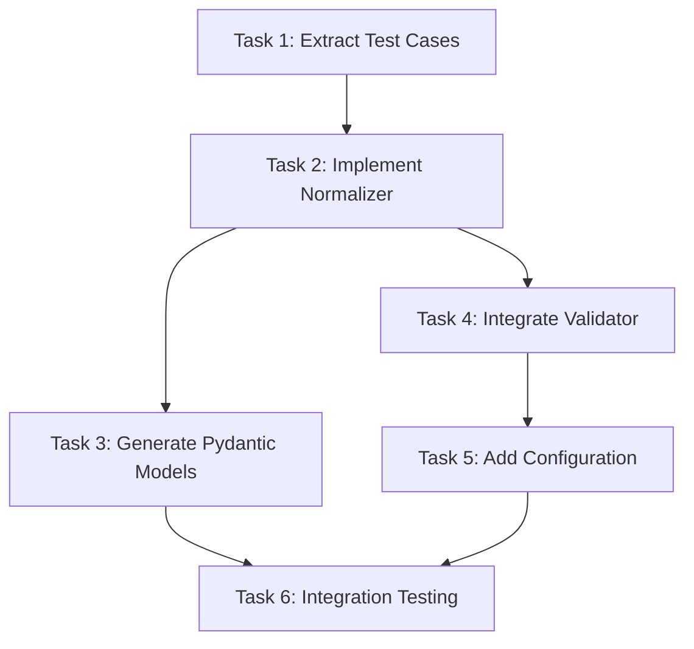

# Tasks Document

## Overview

This document breaks down the yaml-normalizer-implementation spec into executable tasks with detailed prompts for autonomous execution. The implementation follows TDD principles using 15 real failure cases to achieve 90%+ YAML validation success rate.

**Estimated Total Effort**: 4.5 hours
- Task 1: 30 minutes (Test fixture extraction)
- Task 2: 2 hours (Core normalizer with TDD)
- Task 3: 1 hour (Pydantic model generation)
- Task 4: 30 minutes (Integration)
- Task 5: 15 minutes (Configuration)
- Task 6: 15 minutes (Integration testing)

---

## Task List

- [x] 1. Extract Test Cases from Validation Reports
  - **File**: `tests/generators/fixtures/yaml_normalizer_cases.py` (new)
  - **Purpose**: Create test fixtures from 15 real failure cases for TDD workflow
  - **Requirements**: 4.1, 4.2, 4.3
  - **Estimated Effort**: 30 minutes
  - **_Leverage**:
    - `complete_validation_output.txt` (20 iterations, 15 failures)
    - `QUICKWINS_VALIDATION_REPORT.md` (additional 10 iterations, 7 failures)
  - **_Requirements**: 4.1, 4.2, 4.3
  - **_Prompt**: |
      Implement the task for spec yaml-normalizer-implementation, first run spec-workflow-guide to get the workflow guide then implement the task:

      **Role**: Test Engineer with expertise in test data extraction and fixture creation

      **Task**: Extract 15 real failure cases from validation reports and create structured test fixtures for TDD workflow.

      Create the following file:
      - `tests/generators/fixtures/yaml_normalizer_cases.py` - Test fixtures module with 15 categorized failure cases

      **Restrictions**:
      - Do not modify validation report files (read-only)
      - Maintain exact LLM output (no manual fixes)
      - Follow project principle "避免過度工程化" (simple data structures, no complex parsing)
      - Organize by error category (40% indicators, 30% aliases, 15% types, 10% params, 5% unfixable)

      **_Leverage**:
      - `/mnt/c/Users/jnpi/documents/finlab/complete_validation_output.txt` - Extract iterations 1, 3, 5, 7, 9, 11, 13, 15, 17, 19
      - `/mnt/c/Users/jnpi/documents/finlab/QUICKWINS_VALIDATION_REPORT.md` - Extract additional failure cases
      - Error distribution: 40% indicators array→object, 30% field aliases, 15% type case, 10% nested params, 5% Jinja/unfixable

      **_Requirements**: 4.1, 4.2, 4.3

      **Success Criteria**:
      - Exactly 15 test cases extracted (6 indicators, 5 aliases, 3 types, 2 params, 1 unfixable)
      - Each fixture includes: raw_yaml (input), expected_yaml (output), error_description
      - Fixtures are Python dicts (not strings) for easy testing
      - All fixtures validate against schema after normalization (except unfixable)
      - Code coverage N/A (fixture data only)

      **Instructions**:
      1. Read tasks.md and change status from [ ] to [-] for this task
      2. Read complete_validation_output.txt and extract failure cases
      3. Read QUICKWINS_VALIDATION_REPORT.md for additional cases
      4. Create tests/generators/fixtures/yaml_normalizer_cases.py with structured data
      5. Verify fixture count and categorization (15 total, correct distribution)
      6. Change status from [-] to [x] when complete

- [x] 2. Implement YAMLNormalizer with TDD
  - **Files**:
    - `src/generators/yaml_normalizer.py` (new) - Core normalizer implementation
    - `tests/generators/test_yaml_normalizer.py` (new) - Unit tests with 15 test cases
  - **Purpose**: Implement stateless YAML transformation layer with 5 transformation patterns
  - **Requirements**: 1.1, 1.2, 1.3, 1.4, 1.5, 1.6, 1.7
  - **Estimated Effort**: 2 hours
  - **_Leverage**:
    - `tests/generators/fixtures/yaml_normalizer_cases.py` (from Task 1)
    - `src/utils/exceptions.py` - Existing exception patterns
    - `src/utils/logger.py` - Existing logging infrastructure
  - **_Requirements**: 1.1, 1.2, 1.3, 1.4, 1.5, 1.6, 1.7
  - **_Prompt**: |
      Implement the task for spec yaml-normalizer-implementation, first run spec-workflow-guide to get the workflow guide then implement the task:

      **Role**: Backend Developer with expertise in data transformation and test-driven development

      **Task**: Implement YAMLNormalizer class with 5 transformation patterns using TDD approach with 15 real failure cases.

      Create/modify the following files:
      - `src/generators/yaml_normalizer.py` (new) - Core normalizer with pure function API
      - `tests/generators/test_yaml_normalizer.py` (new) - Comprehensive unit tests
      - `src/utils/exceptions.py` (modify) - Add NormalizationError exception class

      **Restrictions**:
      - Use only Python stdlib (copy, logging, typing, re) - no external dependencies
      - Stateless pure function design: normalize_yaml(dict) -> dict
      - No AST manipulation (follow "避免過度工程化" principle)
      - Deep copy input to prevent mutation
      - No modification of schemas/strategy_schema_v1.json

      **_Leverage**:
      - `tests/generators/fixtures/yaml_normalizer_cases.py` - 15 real test cases
      - `src/utils/exceptions.py` - Exception patterns (add NormalizationError)
      - `src/utils/logger.py` - Structured logging
      - Design document transformation patterns (5 transformations)

      **_Requirements**: 1.1 (indicators array→object), 1.2 (field aliases), 1.3 (params flattening), 1.4 (type uppercase), 1.5 (Jinja detection), 1.6 (required fields check), 1.7 (immutability)

      **Success Criteria**:
      - All 15 test cases pass (pytest)
      - Code coverage >80% for yaml_normalizer.py
      - All transformations logged at INFO level
      - NormalizationError raised for Jinja and missing fields
      - Input dict not mutated (immutability test passes)
      - Configuration constants externalized (FIELD_ALIASES, INDICATOR_TYPE_MAP)
      - Type hints on all functions (mypy strict compliance)

      **Instructions**:
      1. Read tasks.md and change status from [ ] to [-] for this task
      2. Follow TDD workflow:
         a. RED: Write failing test for transformation 1 (indicators array→object)
         b. GREEN: Implement _normalize_indicators() to pass test
         c. REFACTOR: Extract configuration constants
         d. Repeat for remaining 4 transformations
      3. Implement public API: normalize_yaml(raw_data: dict) -> dict
      4. Implement private functions: _check_for_jinja, _validate_required_fields, _normalize_indicators, _flatten_params, _map_field_aliases, _normalize_indicator_type, _normalize_conditions
      5. Add NormalizationError to src/utils/exceptions.py
      6. Run pytest to verify all tests pass
      7. Run pytest-cov to verify >80% coverage
      8. Change status from [-] to [x] when complete

- [x] 3. Generate Pydantic Models from Schema
  - **File**: `src/models/strategy_models.py` (new)
  - **Purpose**: Auto-generate type-safe Pydantic models from JSON Schema with field validators
  - **Requirements**: 2.1, 2.2, 2.3, 2.4
  - **Estimated Effort**: 1 hour
  - **_Leverage**:
    - `schemas/strategy_schema_v1.json` - Source schema
    - `datamodel-code-generator` CLI tool (existing dependency)
  - **_Requirements**: 2.1, 2.2, 2.3, 2.4
  - **_Prompt**: |
      Implement the task for spec yaml-normalizer-implementation, first run spec-workflow-guide to get the workflow guide then implement the task:

      **Role**: Backend Developer with expertise in Pydantic and schema-driven development

      **Task**: Generate Pydantic models from JSON Schema and add field validators for automatic type conversions.

      Create the following file:
      - `src/models/strategy_models.py` (new) - Auto-generated Pydantic models with custom validators

      **Restrictions**:
      - Do not modify schemas/strategy_schema_v1.json (read-only)
      - Use datamodel-code-generator for initial generation (do not hand-write models)
      - Target Python 3.10+ (existing project standard)
      - Pydantic v2.11.0+ (existing dependency)

      **_Leverage**:
      - `schemas/strategy_schema_v1.json` - Source schema for generation
      - Design document Component 2 for generation command and validator examples
      - Existing pydantic dependency (no new packages)

      **_Requirements**: 2.1 (enum enforcement), 2.2 (field validators), 2.3 (detailed errors), 2.4 (discriminated unions)

      **Success Criteria**:
      - Models successfully generated from schema
      - All enum types enforced as Literal types
      - Field validator added for type uppercase conversion (double-insurance)
      - Models support oneOf patterns via discriminated unions (entry_conditions, exit_conditions)
      - ValidationError includes field paths (e.g., "indicators.technical_indicators.0.type")
      - Models can validate normalized YAML from Task 2 tests
      - Import and instantiation work correctly

      **Instructions**:
      1. Read tasks.md and change status from [ ] to [-] for this task
      2. Run datamodel-code-generator command:
         ```bash
         datamodel-code-generator \
           --input schemas/strategy_schema_v1.json \
           --output src/models/strategy_models.py \
           --input-file-type jsonschema \
           --target-python-version 3.10
         ```
      3. Add field validator to TechnicalIndicator model:
         ```python
         @field_validator('type', mode='before')
         @classmethod
         def uppercase_type(cls, v: Any) -> str:
             return v.upper() if isinstance(v, str) else v
         ```
      4. Test model validation with sample normalized YAML from Task 2
      5. Verify detailed error messages include field paths
      6. Change status from [-] to [x] when complete

- [x] 4. Integrate Normalizer into YAMLSchemaValidator
  - **File**: `src/generators/yaml_schema_validator.py` (modify)
  - **Purpose**: Add normalization step before validation with feature flag support
  - **Requirements**: 3.1, 3.2, 3.3, 3.4, 3.5
  - **Estimated Effort**: 30 minutes
  - **_Leverage**:
    - `src/generators/yaml_normalizer.py` (from Task 2)
    - Existing `validate()` method in YAMLSchemaValidator
  - **_Requirements**: 3.1, 3.2, 3.3, 3.4, 3.5
  - **_Prompt**: |
      Implement the task for spec yaml-normalizer-implementation, first run spec-workflow-guide to get the workflow guide then implement the task:

      **Role**: Integration Engineer with expertise in backward-compatible API evolution

      **Task**: Modify YAMLSchemaValidator.validate() to call normalizer before validation with optional parameter for backward compatibility.

      Modify the following file:
      - `src/generators/yaml_schema_validator.py` - Add normalizer integration to validate() method

      **Restrictions**:
      - Maintain 100% backward compatibility (926 tests must pass)
      - Graceful degradation: fall back to direct validation on normalizer failure
      - No modification to existing validation logic (only add pre-processing)
      - Feature flag controlled (normalize parameter defaults to False initially)

      **_Leverage**:
      - `src/generators/yaml_normalizer.py` - normalize_yaml() function
      - Existing validate() method signature and logic
      - Design document Component 3 for integration pattern

      **_Requirements**: 3.1 (integration point), 3.2 (pytest baseline), 3.3 (flow documentation), 3.4 (backward compatibility), 3.5 (unit tests)

      **Success Criteria**:
      - validate() method has new optional parameter: normalize=False
      - When normalize=True, normalizer called before validation
      - NormalizationError caught with warning log, validation continues with original YAML
      - Unexpected errors caught with error log, validation continues (graceful degradation)
      - All 926 existing tests pass with normalize=False (backward compatibility)
      - Integration logged: "YAML normalization successful" or "Normalization failed: {error}"
      - No breaking changes to method signature (optional parameter)

      **Instructions**:
      1. Read tasks.md and change status from [ ] to [-] for this task
      2. Modify validate() method signature: add normalize: bool = False parameter
      3. Add normalizer call at method start (before existing validation):
         ```python
         if normalize:
             try:
                 from src.generators.yaml_normalizer import normalize_yaml
                 yaml_spec = normalize_yaml(yaml_spec)
                 logger.info("YAML normalization successful")
             except NormalizationError as e:
                 logger.warning(f"Normalization failed: {e}. Falling back to direct validation.")
             except Exception as e:
                 logger.error(f"Unexpected normalization error: {e}. Falling back.")
         ```
      4. Run pytest to verify 926 tests still pass
      5. Add unit test for normalizer integration (normalize=True case)
      6. Change status from [-] to [x] when complete

- [x] 5. Add Feature Flag Configuration
  - **File**: `config/learning_system.yaml` (modify)
  - **Purpose**: Add yaml_normalization configuration section with feature flag
  - **Requirements**: 5.1, 5.2, 5.3
  - **Estimated Effort**: 15 minutes
  - **_Leverage**:
    - Existing `config/learning_system.yaml` structure
    - Design document Data Models section for configuration structure
  - **_Requirements**: 5.1, 5.2, 5.3
  - **_Prompt**: |
      Implement the task for spec yaml-normalizer-implementation, first run spec-workflow-guide to get the workflow guide then implement the task:

      **Role**: DevOps Engineer with expertise in configuration management

      **Task**: Add yaml_normalization configuration section to learning_system.yaml for feature flag control.

      Modify the following file:
      - `config/learning_system.yaml` - Add yaml_normalization section

      **Restrictions**:
      - Follow existing YAML structure and conventions
      - Default enabled: true (for new runs after Phase 1 validation)
      - Do not modify other configuration sections
      - Keep configuration simple (avoid nested complexity)

      **_Leverage**:
      - Existing `config/learning_system.yaml` structure
      - Design document configuration model for exact structure

      **_Requirements**: 5.1 (feature flag), 5.2 (graceful degradation), 5.3 (success rate tracking)

      **Success Criteria**:
      - yaml_validation section exists or is created
      - normalization subsection added with enabled: true
      - Optional debug_mode: false for verbose logging
      - Optional strict_mode: false for development testing
      - Configuration loads without errors
      - Feature flag can be toggled without code changes

      **Instructions**:
      1. Read tasks.md and change status from [ ] to [-] for this task
      2. Open config/learning_system.yaml
      3. Add or modify yaml_validation section:
         ```yaml
         yaml_validation:
           enabled: true
           normalization:
             enabled: true  # Feature flag for normalizer
             debug_mode: false  # Log all transformations
             strict_mode: false  # Fail on any transformation (testing only)
         ```
      4. Verify YAML syntax is valid
      5. Test configuration loading (no errors)
      6. Change status from [-] to [x] when complete

- [x] 6. Integration Testing and Validation
  - **Files**:
    - `tests/integration/test_yaml_normalizer_integration.py` (new)
  - **Purpose**: Validate end-to-end integration and measure success rate improvement
  - **Requirements**: 3.5, 5.4
  - **Estimated Effort**: 15 minutes
  - **_Leverage**:
    - All previous tasks (1-5)
    - Existing integration test patterns
    - Real LLM API for validation
  - **_Requirements**: 3.5 (unit test coverage), 5.4 (success rate improvement)
  - **_Prompt**: |
      Implement the task for spec yaml-normalizer-implementation, first run spec-workflow-guide to get the workflow guide then implement the task:

      **Role**: QA Engineer with expertise in integration testing and metrics validation

      **Task**: Create integration tests and run validation to measure success rate improvement from 25% to 70%+.

      Create the following file:
      - `tests/integration/test_yaml_normalizer_integration.py` (new) - End-to-end integration tests

      **Restrictions**:
      - All 926 existing tests must pass (no regressions)
      - Use real LLM API for 10-iteration validation test
      - Measure success rate improvement (baseline vs. with normalizer)
      - No modification to InnovationEngine core logic (only configuration)

      **_Leverage**:
      - All components from Tasks 1-5
      - Existing integration test patterns in tests/integration/
      - Design document Testing Strategy section
      - 15 test fixtures from Task 1 for unit-level integration

      **_Requirements**: 3.5 (integration tests), 5.4 (success rate target 70%+)

      **Success Criteria**:
      - All 926 existing tests pass (pytest)
      - Integration test file created with 4 test scenarios:
        1. End-to-end with 15 real failure cases (≥13/15 pass = 87%)
        2. InnovationEngine integration with mock LLM
        3. Backward compatibility verification
        4. Graceful degradation on normalizer failure
      - 10-iteration validation test with real LLM API shows ≥70% success rate
      - Success rate improvement documented (baseline 25% → 70%+ measured)
      - Performance overhead measured (<10ms per iteration)

      **Instructions**:
      1. Read tasks.md and change status from [ ] to [-] for this task
      2. Run pytest to verify 926 tests pass (baseline)
      3. Create tests/integration/test_yaml_normalizer_integration.py:
         - Test 1: Load 15 fixtures, normalize, validate (expect ≥13 pass)
         - Test 2: Mock LLM in InnovationEngine, verify normalizer called
         - Test 3: Run with normalize=False, verify no regressions
         - Test 4: Force normalizer exception, verify fallback
      4. Run integration tests (pytest tests/integration/test_yaml_normalizer_integration.py)
      5. Run 10-iteration validation test with real LLM API:
         ```bash
         python scripts/test_yaml_normalization_e2e.py \
           --iterations 10 \
           --template momentum \
           --enable-normalizer \
           --compare-baseline
         ```
      6. Document results: success rate (before/after), performance overhead
      7. Change status from [-] to [x] when complete

---

## Task Dependencies



**Critical Path**: T1 → T2 → T4 → T5 → T6 (3 hours 15 minutes)

**Parallel Work**: T3 can be done in parallel with T4 (saves 30 minutes)

---

## Success Metrics

### Phase 1 Target (After Task 6)
- **Validation Success Rate**: 70-75% (from 25% baseline)
- **Test Coverage**: >80% for yaml_normalizer.py
- **Backward Compatibility**: 100% (926 tests pass)
- **Performance Overhead**: <10ms per iteration (<1% of total)

### Future Phases (Not in This Spec)
- **Phase 2** (Pydantic Integration): 80-85% success rate
- **Phase 3** (Pipeline Integration): 85-90% success rate
- **Phase 4** (Prompt Optimization): 90-95% success rate

---

## Risk Mitigation

### Risk 1: Test Fixtures Don't Cover All Failure Patterns
- **Mitigation**: Extract from two sources (20 + 10 iterations)
- **Fallback**: Add more fixtures in Task 2 as transformations are implemented

### Risk 2: Normalizer Breaks Existing Tests
- **Mitigation**: Feature flag defaults to False, graceful degradation
- **Validation**: Run 926 tests at every integration point

### Risk 3: Success Rate Doesn't Reach 70% Target
- **Mitigation**: TDD approach ensures each transformation works
- **Measurement**: 10-iteration validation with real LLM in Task 6
- **Fallback**: Iterate on transformation patterns based on remaining failures

---

**Document Version**: 1.0
**Created**: 2025-10-27
**Status**: Draft - Pending Approval
**Total Tasks**: 6
**Estimated Total Effort**: 4.5 hours
**Critical Path**: 3 hours 15 minutes
