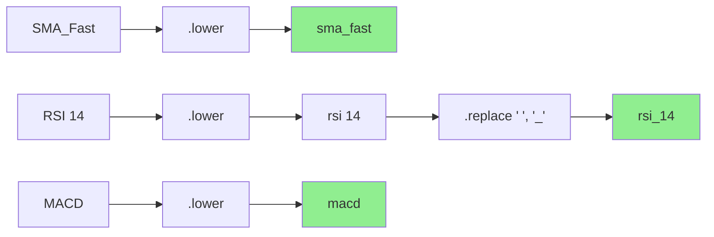
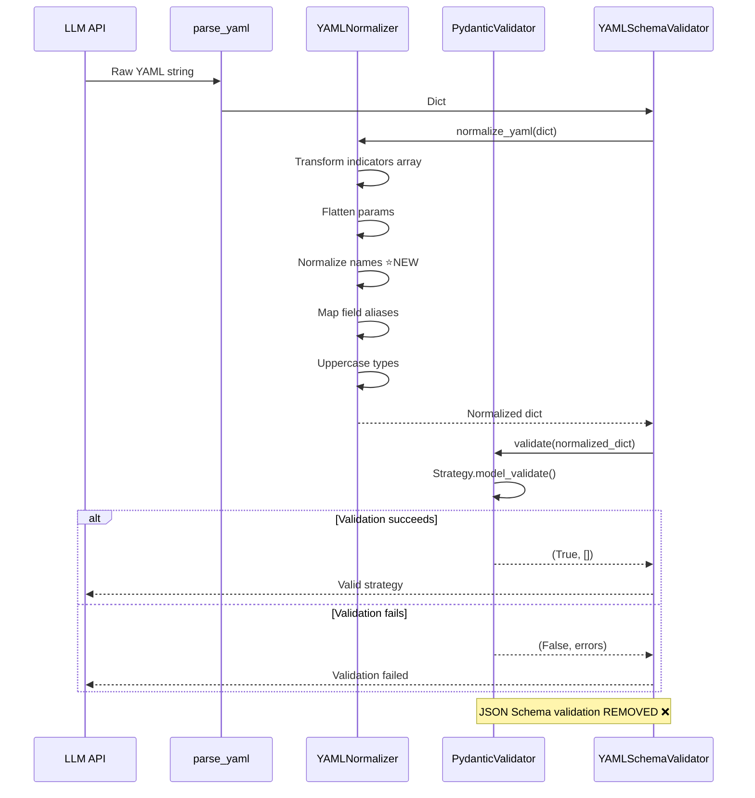

# Design Document

## Revision History

**Version 1.1** - 2025-10-27 (Critical Issues Fixed)

Following expert review (Claude + Gemini 2.5 Pro), **5 critical issues** were identified and resolved:

1. ✅ **Success Rate Target Corrected**: Integration tests now expect **100% (14/14)** instead of 85% (12/14)
   - Rationale: All 4 failures have identical root cause - fixing it should fix ALL
   - E2E tests (live LLM) maintain realistic ≥85% target

2. ✅ **Test Fixture Updates Added**: Explicit task to update `expected_yaml` in test fixtures
   - Critical: Fixtures currently have uppercase names, will fail even after normalization
   - Required: Change "SMA_Fast" → "sma_fast" in all 14 cases

3. ✅ **Validation Logic Completed**: Added full regex pattern check
   - Defense-in-depth: `re.compile(r"^[a-z_][a-z0-9_]*$").match()`
   - Catches edge cases: dashes, dots, special chars that simple checks miss

4. ✅ **Normalization Scope Clarified**: Explicit enumeration of ALL locations
   - technical_indicators, fundamental_factors, custom_calculations, flat array format
   - Implementation strategy ensures comprehensive coverage

5. ✅ **Return Type Fixed**: PydanticValidator now returns validated Strategy instance
   - Changed: `Tuple[bool, List[str]]` → `Tuple[Optional[Strategy], List[str]]`
   - Benefit: Prevents redundant re-validation downstream

**Version 1.0** - 2025-10-27 (Initial Draft - Rejected)

---

## Overview

This design **completes the normalization layer** and implements **Pydantic-based validation** to increase validation success rate from 71.4% to 100% for known fixtures (85%+ for E2E tests with live LLM).

**Evidence-Based Approach**: Phase 1 failure analysis identified that all 4 test failures (28.6% failure rate) are caused by indicator `name` fields not matching schema pattern `^[a-z_][a-z0-9_]*$`. The solution requires **two complementary enhancements**:

1. **Enhanced Normalizer**: Add name transformation (uppercase → lowercase)
2. **Pydantic Validation**: Replace JSON Schema with Pydantic (architecture simplification)

**Core Philosophy**: 避免過度工程化 (Avoid Over-Engineering)
- Simple name normalization (lowercase + replace spaces, ~10 lines of code)
- Reuse existing Pydantic models from Phase 1 (no regeneration)
- Remove redundant JSON Schema validation
- Stateless pure function design (no state management)

**Integration Strategy**: Enhance existing `yaml_normalizer.py` + add new `pydantic_validator.py` + modify `yaml_schema_validator.py` orchestration.

## Steering Document Alignment

### Technical Standards (tech.md)

**Layered Architecture Compliance**:
- **Generators Layer**: Modify `yaml_normalizer.py` + add `pydantic_validator.py` in `src/generators/`
- **Pure Function Pattern**: Both normalizer and validator are stateless functions
- **Fail-Fast Design**: Clear exception signals (`NormalizationError`, `ValidationError`)

**Dependency Management**:
- **Normalizer Enhancement**: Zero new dependencies (Python stdlib only)
- **Pydantic Validator**: Leverages existing `pydantic ≥2.11.0` dependency
- **Removed Dependency**: `jsonschema` validation (redundant)

**Testing Standards**:
- **Evidence-Based TDD**: Tests based on 4 actual failure cases
- **Coverage Target**: >85% for enhanced normalizer, >80% for Pydantic validator
- **Backward Compatibility**: 926 existing tests must pass 100%

### Project Structure (structure.md)

**File Organization**:
```
src/
├── generators/
│   ├── yaml_schema_validator.py    # MODIFY - orchestrate normalize → Pydantic
│   ├── yaml_normalizer.py          # ENHANCE - add name normalization
│   └── pydantic_validator.py       # NEW - Pydantic validation wrapper
├── models/
│   └── strategy_models.py          # EXISTING - no changes (Phase 1)
tests/
├── generators/
│   ├── test_yaml_normalizer.py        # ENHANCE - add name normalization tests
│   └── test_pydantic_validator.py     # NEW - Pydantic validation tests
└── integration/
    └── test_yaml_normalizer_integration.py  # UPDATE - verify 85% success
```

**Modular Design Principles**:
- **Single File Responsibility**:
  - `yaml_normalizer.py`: Data transformation only
  - `pydantic_validator.py`: Validation only
  - `yaml_schema_validator.py`: Orchestration only
- **Component Isolation**: Each can be tested independently
- **Clear Boundaries**: Transform → Validate → Return

## Code Reuse Analysis

### Existing Components to Leverage

1. **yaml_normalizer.py** (Phase 1 - ENHANCE)
   - **Reuse**: All existing transformations (indicators array→object, params flattening, type uppercase, field aliases)
   - **Add**: Name normalization function `_normalize_indicator_name()`
   - **Keep**: Existing module structure, constants, helper functions

2. **strategy_models.py** (Phase 1 - NO CHANGES)
   - **Reuse**: Auto-generated Pydantic models from schema
   - **Import**: `from src.models.strategy_models import Strategy`
   - **No Regeneration**: Models are correct as-is

3. **yaml_schema_validator.py** (MODIFY)
   - **Reuse**: Orchestration logic, error formatting
   - **Remove**: JSON Schema validation (redundant)
   - **Add**: Call to PydanticValidator

4. **Exception Hierarchy** (`src/utils/exceptions.py`)
   - **Reuse**: Existing `NormalizationError` (Phase 1)
   - **Reuse**: Pydantic's `ValidationError` (no custom exception needed)

5. **Logging System** (`src/utils/logger.py`)
   - **Reuse**: Existing structured logger
   - **Pattern**: DEBUG for name transformations, INFO for success, WARNING for failures

### Integration Points

1. **yaml_normalizer.py** (Enhancement Point)
   - **Location**: Add `_normalize_indicator_name()` function
   - **Call Sites**: `_normalize_single_indicator()` - apply to `name` field
   - **Pattern**: Same as existing field normalization patterns

2. **yaml_schema_validator.py** (Modification Point)
   - **Location**: `validate()` method
   - **Change**:
     ```python
     # OLD: normalize → JSON Schema validate
     # NEW: normalize → Pydantic validate
     ```
   - **Backward Compatibility**: `normalize=False` flag bypasses both

3. **Integration Tests** (Verification Point)
   - **File**: `tests/integration/test_yaml_normalizer_integration.py`
   - **Change**: Expect 100% success rate (14/14) instead of 71% (10/14)
   - **Rationale**: All 4 failures have identical root cause (uppercase names) - fixing it should fix ALL
   - **Measurement**: Run same 14 fixtures
   - **E2E Test Target**: ≥85% for real LLM tests (unknown variations expected)

## Architecture

### Enhanced Validation Flow

```mermaid
graph TD
    A[Raw YAML Dict] --> B[normalize_yaml]
    B --> C[_normalize_indicators]
    C --> D[_normalize_single_indicator]
    D --> E{Name needs<br/>normalization?}
    E -->|Yes| F[_normalize_indicator_name]
    E -->|No| G[Continue processing]
    F --> G
    G --> H[Other transformations]
    H --> I[Normalized YAML Dict]
    I --> J[PydanticValidator.validate]
    J --> K{Valid?}
    K -->|Yes| L[Return True, []]
    K -->|No| M[Extract Pydantic errors]
    M --> N[Return False, errors]

    style F fill:#90EE90
    style J fill:#87CEEB
    style L fill:#90EE90
    style N fill:#FFB6C1
```

### Name Normalization Logic



### Two-Stage Validation Architecture



## Components and Interfaces

### Component 1: Enhanced YAMLNormalizer

**File**: `src/generators/yaml_normalizer.py` (MODIFY)

**Purpose**: Add name normalization to existing transformation logic

**New Function**:
```python
def _normalize_indicator_name(name: str) -> str:
    """
    Normalize indicator name to match schema pattern ^[a-z_][a-z0-9_]*$.

    Transformations:
    1. Convert to lowercase
    2. Replace spaces with underscores
    3. Validate result matches pattern

    Args:
        name: Raw indicator name (e.g., "SMA_Fast", "RSI 14")

    Returns:
        Normalized name (e.g., "sma_fast", "rsi_14")

    Raises:
        NormalizationError: If normalized name is invalid (empty, starts with digit, etc.)

    Examples:
        >>> _normalize_indicator_name("SMA_Fast")
        "sma_fast"
        >>> _normalize_indicator_name("RSI 14")
        "rsi_14"
        >>> _normalize_indicator_name("macd")
        "macd"
    """
    # Step 1: Lowercase
    name_lower = name.lower()

    # Step 2: Replace spaces with underscores
    name_normalized = name_lower.replace(' ', '_')

    # Step 3: Validate pattern
    if not name_normalized:
        raise NormalizationError(f"Indicator name cannot be empty")

    if name_normalized[0].isdigit():
        raise NormalizationError(
            f"Indicator name '{name_normalized}' starts with digit (invalid Python identifier)"
        )

    # Step 4: Full pattern validation (defense-in-depth)
    import re
    pattern = re.compile(r"^[a-z_][a-z0-9_]*$")
    if not pattern.match(name_normalized):
        raise NormalizationError(
            f"Normalized name '{name_normalized}' contains invalid characters. "
            f"Pattern requires ^[a-z_][a-z0-9_]*$"
        )

    # Log transformation if changed
    if name_normalized != name:
        logger.debug(f"Normalized indicator name: '{name}' → '{name_normalized}'")

    return name_normalized
```

**Integration Point**:
```python
def _normalize_single_indicator(indicator: Dict[str, Any]) -> Dict[str, Any]:
    """Normalize a single indicator object."""
    normalized = copy.deepcopy(indicator)

    # NEW: Normalize name field
    if "name" in normalized:
        normalized["name"] = _normalize_indicator_name(normalized["name"])

    # Existing transformations (params flattening, aliases, type)
    if "params" in normalized:
        # ... existing code ...

    # ... rest of existing code ...

    return normalized
```

**Normalization Scope** (All Locations Where Name Normalization Applies):

The `_normalize_indicator_name()` function SHALL be applied to ALL `name` fields in:

1. **`indicators.technical_indicators[].name`** (primary focus, 4/4 known failures)
2. **`indicators.fundamental_factors[].name`** (requirement 1.1, line 67)
3. **`indicators.custom_calculations[].name`** (requirement 1.1, line 67)
4. **`indicators[].name`** (flat array format per schema oneOf)

Implementation strategy: Apply normalization in `_normalize_single_indicator()` which is called for all indicator types, ensuring comprehensive coverage without code duplication.

**Dependencies**:
- Python stdlib: `copy`, `logging`, `re`, `typing`
- **No new dependencies**

**Reuses**: All existing normalizer infrastructure from Phase 1

---

### Component 2: PydanticValidator

**File**: `src/generators/pydantic_validator.py` (NEW)

**Purpose**: Wrapper for Pydantic model validation with clean error formatting

**Public API**:
```python
from typing import Tuple, List, Dict, Any, Optional
from pydantic import ValidationError
from src.models.strategy_models import Strategy
import logging

logger = logging.getLogger(__name__)


class PydanticValidator:
    """
    Validates YAML strategies using Pydantic Strategy model.

    Provides:
    - Strict type validation
    - Automatic type coercion
    - Field-path specific error messages
    - Returns validated Strategy instance (prevents re-validation downstream)
    """

    def __init__(self):
        """Initialize validator (no configuration needed)."""
        self.model = Strategy
        logger.info("PydanticValidator initialized with Strategy model")

    def validate(self, data: Dict[str, Any]) -> Tuple[Optional[Strategy], List[str]]:
        """
        Validate data against Pydantic Strategy model.

        Args:
            data: Normalized YAML dict

        Returns:
            (strategy_instance, error_messages) tuple
            - strategy_instance: Validated Strategy model if valid, else None
            - error_messages: List of human-readable error strings (empty if valid)

        Example:
            >>> validator = PydanticValidator()
            >>> strategy, errors = validator.validate(normalized_data)
            >>> if strategy:
            ...     print(f"Valid! Can use: {strategy.model_dump()}")
            >>> else:
            ...     print(f"Validation failed: {errors}")
        """
        try:
            # Validate and create Pydantic model instance
            strategy = self.model.model_validate(data)

            logger.info("Pydantic validation successful - Strategy model validated")

            # Return validated instance (avoids re-parsing downstream)
            return (strategy, [])

        except ValidationError as e:
            # Extract and format Pydantic errors
            error_messages = self._format_pydantic_errors(e)

            logger.warning(
                f"Pydantic validation failed with {len(error_messages)} error(s)"
            )

            # Return None with error messages
            return (None, error_messages)

    def _format_pydantic_errors(self, error: ValidationError) -> List[str]:
        """
        Format Pydantic ValidationError into human-readable messages.

        Args:
            error: Pydantic ValidationError exception

        Returns:
            List of formatted error messages with field paths

        Example Output:
            [
                "indicators.technical_indicators.0.type: Input should be 'RSI', 'MACD', 'SMA', 'EMA', 'ATR', 'ADX', 'BB', 'Stochastic', 'CCI', 'Williams_R', 'MFI', 'OBV', 'VWAP', 'Momentum', 'ROC' or 'TSI'",
                "indicators.technical_indicators.1.period: Input should be less than or equal to 250"
            ]
        """
        formatted_errors = []

        for err in error.errors():
            # Extract field path (e.g., ['indicators', 'technical_indicators', 0, 'type'])
            field_path = '.'.join(str(loc) for loc in err['loc'])

            # Extract error message
            message = err['msg']

            # Format: "field.path: error message"
            formatted = f"{field_path}: {message}"
            formatted_errors.append(formatted)

        return formatted_errors
```

**Dependencies**:
- `pydantic` (existing dependency ≥2.11.0)
- `src/models/strategy_models.py` (Phase 1 models)

**Reuses**: Pydantic models generated in Phase 1 Task 3

---

### Component 3: Modified YAMLSchemaValidator

**File**: `src/generators/yaml_schema_validator.py` (MODIFY)

**Purpose**: Orchestrate normalize → Pydantic validation (remove JSON Schema)

**Modified Method**:
```python
def validate(
    self,
    yaml_spec: Dict[str, Any],
    return_detailed_errors: bool = True,
    normalize: bool = True  # Feature flag
) -> Tuple[bool, List[str]]:
    """
    Validate a parsed YAML specification.

    Flow:
    1. Normalize YAML (if normalize=True)
    2. Pydantic validation (if normalize=True)
    3. JSON Schema validation (if normalize=False, backward compatibility)

    Args:
        yaml_spec: Parsed YAML specification as dictionary
        return_detailed_errors: If True, return detailed error messages
        normalize: If True, apply normalization + Pydantic validation (default True)

    Returns:
        Tuple of (is_valid, error_messages)
    """
    # NEW: Pydantic validation path (Phase 2)
    if normalize:
        try:
            # Step 1: Normalize (includes name normalization from Phase 2)
            from src.generators.yaml_normalizer import normalize_yaml
            normalized_spec = normalize_yaml(yaml_spec)
            logger.info("YAML normalization successful")

        except NormalizationError as e:
            # Normalization failed - return error
            logger.warning(f"Normalization failed: {e}")
            return (False, [str(e)])

        except Exception as e:
            # Unexpected error - log and return error
            logger.error(f"Unexpected normalization error: {e}")
            return (False, [f"Normalization error: {str(e)}"])

        # Step 2: Pydantic validation (replaces JSON Schema)
        try:
            from src.generators.pydantic_validator import PydanticValidator

            pydantic_validator = PydanticValidator()
            is_valid, errors = pydantic_validator.validate(normalized_spec)

            if is_valid:
                logger.info("Pydantic validation successful")
                return (True, [])
            else:
                logger.warning(f"Pydantic validation failed: {len(errors)} error(s)")
                return (False, errors)

        except Exception as e:
            logger.error(f"Unexpected Pydantic validation error: {e}")
            return (False, [f"Validation error: {str(e)}"])

    # OLD: JSON Schema validation path (backward compatibility)
    else:
        if self._validator is None:
            raise RuntimeError("Schema not loaded")

        # Existing JSON Schema validation logic (unchanged)
        errors = []
        if not isinstance(yaml_spec, dict):
            return False, ["YAML specification must be a dictionary/object"]

        validation_errors = sorted(
            self._validator.iter_errors(yaml_spec),
            key=lambda e: e.path
        )

        # ... existing error formatting code ...

        return (len(errors) == 0, errors)
```

**Dependencies**:
- `yaml_normalizer` (enhanced Phase 1 code)
- `pydantic_validator` (new Phase 2 component)

**Reuses**: Existing orchestration framework from Phase 1

## Data Models

### Input Model (Raw LLM Output - Problematic)

```python
# Example with uppercase names (causes Phase 1 failures)
raw_yaml = {
    "metadata": {
        "name": "Test Strategy",
        "strategy_type": "momentum",
        "rebalancing_frequency": "M"
    },
    "indicators": [  # Array format (Phase 1 normalizer handles this ✓)
        {
            "name": "SMA_Fast",  # ❌ PROBLEM: Uppercase (Phase 1 normalizer missed this)
            "type": "sma",  # ✓ Phase 1 normalizer handles lowercase type
            "params": {"length": 20}  # ✓ Phase 1 normalizer flattens params
        },
        {
            "name": "RSI",  # ❌ PROBLEM: Uppercase
            "type": "rsi",
            "params": {"period": 14}
        }
    ],
    "entry_conditions": {
        "threshold_rules": [{"condition": "sma_fast > sma_slow"}]
    }
}
```

### Intermediate Model (After Phase 1 Normalizer)

```python
# After Phase 1 normalization (still fails validation due to name)
phase1_normalized = {
    "metadata": {...},
    "indicators": {  # ✓ Converted to object
        "technical_indicators": [
            {
                "name": "SMA_Fast",  # ❌ STILL PROBLEM: Not normalized by Phase 1
                "type": "SMA",  # ✓ Type uppercased
                "period": 20  # ✓ Params flattened and alias mapped
            },
            {
                "name": "RSI",  # ❌ STILL PROBLEM
                "type": "RSI",
                "period": 14
            }
        ]
    },
    "entry_conditions": {...}
}
```

### Final Model (After Phase 2 Enhancement)

```python
# After Phase 2 enhanced normalization (ready for Pydantic)
phase2_normalized = {
    "metadata": {...},
    "indicators": {
        "technical_indicators": [
            {
                "name": "sma_fast",  # ✅ FIXED: Lowercase
                "type": "SMA",
                "period": 20
            },
            {
                "name": "rsi",  # ✅ FIXED: Lowercase
                "type": "RSI",
                "period": 14
            }
        ]
    },
    "entry_conditions": {...}
}
```

### Pydantic Validation Model

```python
# Pydantic validates the Phase 2 normalized data
# Uses existing Strategy model from Phase 1:

from src.models.strategy_models import Strategy

strategy = Strategy.model_validate(phase2_normalized)
# ✅ Validation succeeds!
# - name matches pattern ^[a-z_][a-z0-9_]*$
# - type matches enum
# - period is int within range
```

## Error Handling

### Error Scenario 1: Invalid Indicator Name (New)

**Trigger**: LLM generates indicator name that starts with digit

**Example**:
```python
{"name": "14_day_rsi", "type": "RSI", "period": 14}
```

**Handling**:
```python
# In _normalize_indicator_name()
if name_normalized[0].isdigit():
    raise NormalizationError(
        f"Indicator name '{name_normalized}' starts with digit (invalid Python identifier)"
    )
```

**User Impact**:
- Validation fails with clear error message
- LLM retry triggered (Phase 3 will implement retry logic)
- Error logged for analysis

### Error Scenario 2: Pydantic Type Mismatch

**Trigger**: Field value doesn't match expected type after normalization

**Example**:
```python
{"name": "rsi", "type": "RSI", "period": "fourteen"}  # String instead of int
```

**Handling**:
```python
# Pydantic ValidationError raised
# _format_pydantic_errors() converts to:
errors = [
    "indicators.technical_indicators.0.period: Input should be a valid integer, unable to parse string as an integer"
]
```

**User Impact**:
- Validation fails with field-path specific error
- Clear indication of what's wrong and where
- Better debugging than JSON Schema errors

### Error Scenario 3: Normalization Succeeds, Pydantic Fails

**Trigger**: Normalized YAML still violates schema constraints

**Example**:
```python
{"name": "rsi", "type": "RSI", "period": 500}  # Exceeds max 250
```

**Handling**:
```python
# Pydantic ValidationError raised
errors = [
    "indicators.technical_indicators.0.period: Input should be less than or equal to 250"
]
```

**User Impact**:
- Identifies issues normalizer cannot fix
- Guides Phase 3 retry logic improvements
- Tracks failure patterns for continuous improvement

### Error Scenario 4: Backward Compatibility (normalize=False)

**Trigger**: Existing code calls `validate(yaml_spec, normalize=False)`

**Handling**:
```python
# Falls back to JSON Schema validation
if normalize:
    # Phase 2 path (normalizer + Pydantic)
else:
    # Legacy path (JSON Schema only)
    # Existing 926 tests use this path
```

**User Impact**:
- No breaking changes
- Gradual rollout capability
- Safe deployment

## Testing Strategy

### Unit Testing

**File**: `tests/generators/test_yaml_normalizer.py` (ENHANCE)

**New Tests for Name Normalization**:
```python
class TestNameNormalization:
    """Test indicator name normalization."""

    def test_uppercase_to_lowercase(self):
        """Test: SMA_Fast → sma_fast"""
        result = _normalize_indicator_name("SMA_Fast")
        assert result == "sma_fast"

    def test_spaces_to_underscores(self):
        """Test: RSI 14 → rsi_14"""
        result = _normalize_indicator_name("RSI 14")
        assert result == "rsi_14"

    def test_already_lowercase_unchanged(self):
        """Test: sma_fast → sma_fast (idempotent)"""
        result = _normalize_indicator_name("sma_fast")
        assert result == "sma_fast"

    def test_invalid_name_starts_with_digit(self):
        """Test: 14_day_rsi → raises NormalizationError"""
        with pytest.raises(NormalizationError, match="starts with digit"):
            _normalize_indicator_name("14_day_rsi")

    def test_empty_name_raises_error(self):
        """Test: '' → raises NormalizationError"""
        with pytest.raises(NormalizationError, match="cannot be empty"):
            _normalize_indicator_name("")
```

**File**: `tests/generators/test_pydantic_validator.py` (NEW)

**Tests for Pydantic Validation**:
```python
class TestPydanticValidator:
    """Test Pydantic validation wrapper."""

    def test_valid_strategy_passes(self):
        """Test: Valid normalized YAML passes validation"""
        validator = PydanticValidator()
        valid_data = {...}  # Complete valid strategy

        is_valid, errors = validator.validate(valid_data)

        assert is_valid is True
        assert errors == []

    def test_invalid_type_fails(self):
        """Test: Invalid indicator type fails with field path"""
        validator = PydanticValidator()
        invalid_data = {
            "indicators": {
                "technical_indicators": [
                    {"name": "test", "type": "INVALID", "period": 14}
                ]
            },
            # ... other required fields ...
        }

        is_valid, errors = validator.validate(invalid_data)

        assert is_valid is False
        assert len(errors) > 0
        assert "indicators.technical_indicators.0.type" in errors[0]

    def test_error_formatting(self):
        """Test: Pydantic errors formatted with field paths"""
        validator = PydanticValidator()
        # ... test error message formatting ...
```

### Integration Testing

**File**: `tests/integration/test_yaml_normalizer_integration.py` (UPDATE)

**Test Fixture Updates Required** (CRITICAL):

Before running integration tests, update `tests/generators/fixtures/yaml_normalizer_cases.py`:

```python
# OLD (will fail validation even after normalization)
CASE_01_INDICATORS_ARRAY = {
    "expected_yaml": {
        "indicators": {
            "technical_indicators": [
                {"name": "SMA_Fast", "type": "SMA", "period": 20},  # ❌ Uppercase
            ]
        }
    }
}

# NEW (matches post-normalization state)
CASE_01_INDICATORS_ARRAY = {
    "expected_yaml": {
        "indicators": {
            "technical_indicators": [
                {"name": "sma_fast", "type": "SMA", "period": 20},  # ✅ Lowercase
            ]
        }
    }
}
```

All 14 test cases must have lowercase names in `expected_yaml` to match normalizer output.

**Updated Success Rate Test**:
```python
def test_phase2_success_rate(self):
    """Test: Phase 2 achieves 100% success rate (14/14 fixtures)."""
    validator = YAMLSchemaValidator()
    fixable_cases = get_fixable_cases()

    successful = 0
    failed = 0

    for test_case in fixable_cases:
        raw_yaml = test_case["raw_yaml"]

        # Add required fields
        # ... existing code ...

        # Validate with Phase 2 normalizer + Pydantic
        is_valid, errors = validator.validate(raw_yaml, normalize=True)

        if is_valid:
            successful += 1
        else:
            failed += 1

    total = successful + failed
    success_rate = (successful / total) * 100

    print(f"Phase 2 Success Rate: {success_rate:.1f}%")

    # Assert Phase 2 target (100% for known fixtures with identical root cause)
    assert success_rate == 100.0, f"Success rate {success_rate:.1f}% should be 100% (all 4 failures have identical root cause)"
    # Expect: 14/14 = 100.0% (all 4 uppercase name failures fixed)
```

### End-to-End Testing

**Script**: `scripts/test_yaml_validation_phase2.py` (NEW)

**Purpose**: Validate Phase 2 with real LLM API (50-100 iterations)

**Approach**:
```python
def run_phase2_validation(iterations=100):
    """
    Run Phase 2 validation with real LLM API.

    Measures:
    - Validation success rate
    - Name transformation frequency
    - Error types for remaining failures
    """
    validator = YAMLSchemaValidator()
    llm_provider = get_llm_provider()  # Gemini 2.5 Flash or Grok

    results = {
        "total": iterations,
        "successful": 0,
        "failed": 0,
        "name_transformations": 0,
        "error_types": []
    }

    for i in range(iterations):
        # Generate YAML with LLM
        raw_yaml = llm_provider.generate_strategy(template="momentum")

        # Validate with Phase 2
        is_valid, errors = validator.validate(raw_yaml, normalize=True)

        if is_valid:
            results["successful"] += 1
        else:
            results["failed"] += 1
            results["error_types"].append(errors)

    # Calculate success rate
    success_rate = (results["successful"] / results["total"]) * 100

    print(f"Phase 2 Success Rate: {success_rate:.1f}% ({results['successful']}/{results['total']})")

    assert success_rate >= 85.0, f"Phase 2 target not met: {success_rate:.1f}%"

    return results
```

---

**Document Version**: 1.0
**Created**: 2025-10-27
**Status**: Draft - Pending Approval
**Dependencies**:
- Phase 1 code (`yaml_normalizer.py`, `strategy_models.py`)
- Phase 1 Failure Analysis (`PHASE1_FAILURE_ANALYSIS.md`)
