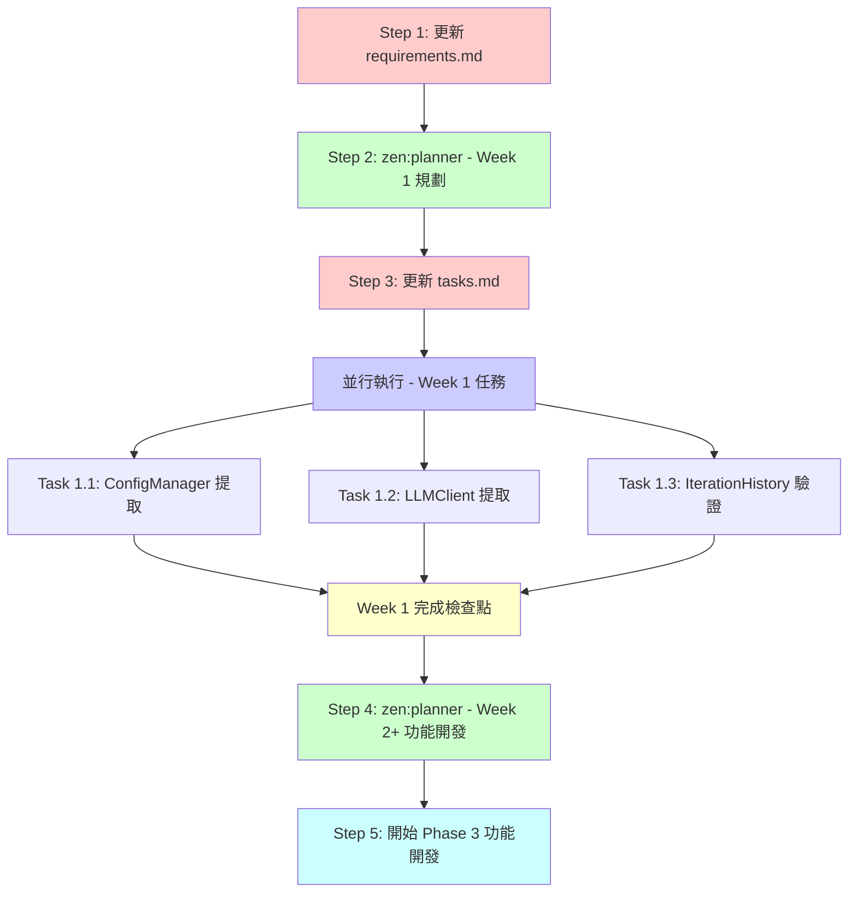

# Phase 3 混合方針 - 工作流程與依賴關係

**日期**: 2025-11-03 08:00 UTC
**方針**: 選項 C (混合方式) - Week 1 重構基礎，Week 2 開始功能開發

---

## 🔄 工作流程依賴關係圖



---

## 📝 推薦執行順序

### ✅ 推薦: **spec workflow → zen:planner → spec workflow**

**理由**:
1. **文檔驅動開發**: 先更新 requirements.md 反映新方針
2. **規劃基於需求**: planner 根據明確的文檔進行規劃
3. **任務同步更新**: 規劃完成後更新 tasks.md

---

## 📋 詳細步驟 (含依賴關係)

### Step 1: 更新 requirements.md (30 分鐘)

**依賴**: 無（獨立任務）

**工具**: spec workflow 或直接編輯

**目標**: 反映混合方針
- 添加 "Phased Implementation Strategy" 章節
- Week 1: 重構基礎模組
- Week 2+: 功能開發

**輸出**:
- `requirements.md` 新增章節
- 明確 Week 1 vs Week 2+ 的界限

**阻塞**: Step 2 (planner 需要明確的需求)

---

### Step 2: zen:planner - Week 1 重構規劃 (45 分鐘)

**依賴**: ✅ Step 1 完成

**工具**: `mcp__zen__planner`

**輸入**:
- 更新後的 requirements.md
- PHASE3_DEEP_ANALYSIS_AND_TEST_STRATEGY_COMPLETE.md
- 當前 design.md (已有重構路線圖)

**目標**: 展開 Week 1 具體任務
```
Week 1 (5 days):
├── Day 1: ConfigManager 提取
├── Day 2-3: LLMClient 提取 + 測試
└── Day 4-5: IterationHistory 驗證 + 文檔
```

**輸出**:
- 詳細的任務分解
- 每個任務的驗收標準
- 測試要求
- 並行執行建議

**阻塞**: Step 3 (tasks.md 更新需要 planner 輸出)

---

### Step 3: 更新 tasks.md (30 分鐘)

**依賴**: ✅ Step 2 完成

**工具**: spec workflow 或直接編輯

**目標**:
- 添加 Week 1 具體任務到 tasks.md
- 標記任務狀態 (pending)
- 添加並行執行標記

**輸出**:
- tasks.md 新增 "Week 1: Foundation Refactoring" 章節
- 每個任務包含測試要求、驗收標準

**阻塞**: Step 4 (並行執行任務)

---

### Step 4: 並行執行 Week 1 任務 (5 天)

**依賴**: ✅ Step 3 完成

**並行度**: 3 個任務可並行（如果有多個 agent）

#### Task 1.1: ConfigManager 提取

**依賴**: 無（獨立）
**並行**: ✅ 可與 Task 1.2, 1.3 並行
**時間**: 1 天

**子任務**:
1. 創建 `src/learning/config_manager.py`
2. 實現單例模式
3. 移除 6 處重複代碼
4. 編寫 8 個單元測試
5. 更新所有引用

**驗收**:
- [ ] 60 行重複代碼消除
- [ ] 8 個測試通過
- [ ] 90% 覆蓋率

---

#### Task 1.2: LLMClient 提取

**依賴**: 建議先完成 ConfigManager (減少重複工作)
**並行**: ⚠️ 半並行（可同時開始，但建議等 ConfigManager）
**時間**: 2 天

**子任務**:
1. 創建 `src/learning/llm_client.py`
2. 提取 lines 637-781 (~145 lines)
3. 使用 ConfigManager 載入配置
4. 編寫 12 個單元測試
5. 更新 autonomous_loop.py 引用

**驗收**:
- [ ] 145 行代碼提取
- [ ] 12 個測試通過
- [ ] 95% 覆蓋率
- [ ] 使用 ConfigManager (無重複)

---

#### Task 1.3: IterationHistory 驗證

**依賴**: 無（已存在）
**並行**: ✅ 可與 Task 1.1, 1.2 並行
**時間**: 2 天

**子任務**:
1. 檢查現有測試覆蓋率
2. 添加缺失的測試場景（並發、錯誤處理）
3. 補充 API 文檔
4. 驗證與其他模組的接口

**驗收**:
- [ ] 6+ 測試通過
- [ ] 90% 覆蓋率
- [ ] API 文檔完整

---

### Step 5: Week 1 完成檢查點 (0.5 天)

**依賴**: ✅ Task 1.1, 1.2, 1.3 全部完成

**檢查項目**:
- [ ] ConfigManager: 60 行重複消除，8 測試通過
- [ ] LLMClient: 145 行提取，12 測試通過
- [ ] IterationHistory: 6+ 測試通過，API 文檔
- [ ] 總測試覆蓋率: >88%
- [ ] autonomous_loop.py: 減少 ~205 行 (60+145)
- [ ] 所有集成測試通過

**產出**:
- Week 1 完成報告
- 測試覆蓋率報告
- 重構前後對比

---

### Step 6: zen:planner - Week 2+ 功能開發規劃 (45 分鐘)

**依賴**: ✅ Step 5 檢查點通過

**目標**: 規劃 Phase 3 功能開發
- 基於已重構的模組
- 使用乾淨的 ConfigManager 和 LLMClient

---

## 🔧 並行執行策略

### 高並行度場景 (有多個 Task agents)

```bash
# Day 1: 同時啟動 3 個 agent
Agent 1: ConfigManager 提取
Agent 2: LLMClient 測試準備 (寫測試)
Agent 3: IterationHistory 驗證

# Day 2:
Agent 1: ConfigManager 測試 + 集成
Agent 2: LLMClient 提取 (使用 ConfigManager)
Agent 3: IterationHistory 文檔

# Day 3:
Agent 2: LLMClient 測試
所有 agents: 集成驗證
```

**優點**:
- 3 天可完成 Week 1 全部工作
- 最大化資源利用

**風險**:
- ConfigManager 延遲會影響 LLMClient
- 需要協調集成點

---

### 低並行度場景 (單個或兩個 agents)

```bash
# Day 1: ConfigManager (阻塞任務優先)
Task 1.1: ConfigManager 提取

# Day 2-3: LLMClient (依賴 ConfigManager)
Task 1.2: LLMClient 提取

# Day 4-5: IterationHistory (獨立任務)
Task 1.3: IterationHistory 驗證

# 或並行:
Agent 1 (Day 2-3): LLMClient
Agent 2 (Day 2-3): IterationHistory
```

**優點**:
- 依賴關係清晰
- 降低集成風險

**缺點**:
- 需要 5 天完成

---

## 📊 依賴矩陣

| 任務 | 依賴於 | 阻塞 | 並行度 |
|------|--------|------|--------|
| **Step 1: requirements.md** | - | Step 2 | 獨立 |
| **Step 2: planner Week 1** | Step 1 | Step 3 | 獨立 |
| **Step 3: tasks.md** | Step 2 | Step 4 | 獨立 |
| **Task 1.1: ConfigManager** | Step 3 | Task 1.2 (建議) | ✅ 高優先 |
| **Task 1.2: LLMClient** | Task 1.1 (建議) | - | ⚠️ 半並行 |
| **Task 1.3: IterationHistory** | Step 3 | - | ✅ 完全並行 |
| **Step 5: 檢查點** | Task 1.1, 1.2, 1.3 | Step 6 | 同步點 |
| **Step 6: planner Week 2+** | Step 5 | Week 2 開發 | 獨立 |

---

## ✅ 推薦執行計劃

### 立即執行 (今天)

1. **Step 1: 更新 requirements.md** (30 分鐘)
   - 手動編輯或用 spec workflow
   - 添加混合方針說明

2. **Step 2: zen:planner Week 1** (45 分鐘)
   - 展開具體任務
   - 生成測試需求

3. **Step 3: 更新 tasks.md** (30 分鐘)
   - 同步 planner 輸出
   - 標記並行任務

**今日產出**: 完整的 Week 1 執行計劃

---

### Week 1 執行 (明天開始)

**Day 1** (並行啟動):
```bash
Agent 1: Task 1.1 ConfigManager
Agent 2: Task 1.3 IterationHistory (或為 LLMClient 寫測試)
```

**Day 2-3** (依賴 ConfigManager):
```bash
Agent 1: Task 1.2 LLMClient 提取
Agent 2: Task 1.3 IterationHistory (如果 Day 1 未完成)
```

**Day 4-5** (集成與驗證):
```bash
All agents: 集成測試、文檔、檢查點
```

---

## 🎯 關鍵決策點

### 決策 1: 立即開始或等待文檔？

**建議**: 先完成 Step 1-3 (文檔 + 規劃)，確保方向正確

**理由**:
- 文檔驅動開發減少返工
- planner 產出可直接指導實施
- 總耗時僅增加 ~2 小時

---

### 決策 2: 並行度選擇

**如果有多個 agents**: 高並行度 (3 天完成)
**如果單個 agent**: 低並行度 (5 天完成)

**建議**: 使用 Task tool 啟動多個並行 agents

---

### 決策 3: ConfigManager 優先還是並行？

**建議**: ConfigManager 優先
- LLMClient 依賴它來消除重複
- 僅延遲 1 天，但代碼更乾淨

---

## 📌 總結

**立即執行順序**:
```
1. 更新 requirements.md (30 min) - 手動或 spec workflow
2. zen:planner Week 1 規劃 (45 min) - 展開任務
3. 更新 tasks.md (30 min) - 同步規劃
4. 並行啟動 Week 1 任務 (3-5 days)
```

**並行機會**:
- Task 1.1 (ConfigManager) 獨立
- Task 1.3 (IterationHistory) 獨立
- Task 1.2 (LLMClient) 建議等 ConfigManager

**檢查點**:
- Step 5: Week 1 完成，驗證重構成果
- Step 6: Week 2+ 規劃，開始功能開發

---

**建議**: 現在開始執行 Step 1-3 (文檔 + 規劃)，今日完成後明天並行執行 Week 1 任務
