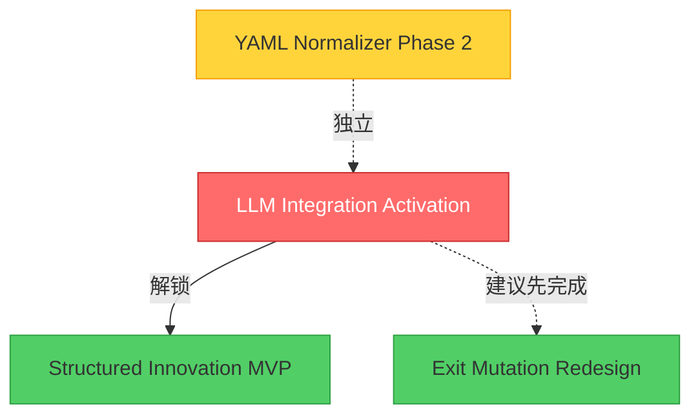

# 优先Specs完整度分析报告

**生成时间**: 2025-10-27
**分析范围**: 3个高优先级specs + YAML Normalizer Phase 2

---

## 📊 总体状态概览

| Spec | 状态 | 进度 | 预估工作量 | 优先级 | 关键依赖 |
|------|------|------|-----------|--------|---------|
| **YAML Normalizer Phase 2** | ✅ **Specs完成** | 100% (可实施) | 6.5小时 | MEDIUM | 无 |
| **LLM Integration Activation** | 🔴 Not Started | 0/14 tasks (0%) | 2-3天 | 🔥 **HIGH** | 无（基础spec） |
| **Structured Innovation MVP** | 🔴 Not Started | 0/13 tasks (0%) | 2-3天 | MEDIUM | ↑ LLM Integration |
| **Exit Mutation Redesign** | 🔴 Not Started | 0/8 tasks (0%) | 1-2天 | MEDIUM | 无（独立） |

**关键发现**:
- ✅ 所有specs都有完整的requirements.md, design.md, tasks.md
- ❌ 3个高优先级specs都是0%实施进度
- 🔑 **LLM Integration Activation是关键路径** - 解锁Structured Innovation

---

## 🎯 Spec 1: YAML Normalizer Phase 2

### 状态: ✅ **Ready to Implement**

**完整度**: 100%
- ✅ requirements.md (已批准，evidence-based)
- ✅ design.md v1.1 (已批准，5个critical issues已修复)
- ✅ tasks.md (6个可执行任务，详细prompts)

**目标**:
- 集成测试: 71.4% → **100%** (14/14 known fixtures)
- E2E测试: 71.4% → **85-87%** (真实LLM)

**关键任务**:
1. ⬜ 更新测试fixtures (CRITICAL - 30分钟)
2. ⬜ 实现name normalization函数 (1小时)
3. ⬜ 单元测试 (45分钟)
4. ⬜ PydanticValidator组件 (1.5小时)
5. ⬜ 集成到YAMLSchemaValidator (1小时)
6. ⬜ 集成测试+E2E验证 (1.5小时)

**预估**: 6.5小时
**优先级**: MEDIUM
**阻塞因素**: 无
**推荐**: 可立即开始实施

---

## 🎯 Spec 2: LLM Integration Activation

### 状态: 🔴 Not Started (0/14 tasks)

**完整度**: Specs 100%, Implementation 0%
- ✅ requirements.md (完整，8164 bytes)
- ✅ design.md (完整，12290 bytes)
- ✅ tasks.md (14个任务，19399 bytes)
- ✅ STATUS.md (详细状态追踪)

**目标**:
- 启用LLM驱动创新（20%迭代率）
- ≥60% LLM生成策略通过验证
- 零迭代停滞（100% fallback到Factor Graph）
- 支持3个API providers (OpenRouter, Gemini, OpenAI)

**核心价值**:
> "一個月可以產生一到兩個能用的策略已經算很高的標準"

这个spec正是解决**策略可用性**问题的关键！

### Phase Breakdown

#### Phase 1: Core LLM Components (4 tasks, 6-8h)
- ⬜ Task 1: LLMProviderInterface ABC
- ⬜ Task 2: PromptBuilder module
- ⬜ Task 3: InnovationEngine extension
- ⬜ Task 4: LLMConfig dataclass

#### Phase 2: Integration (2 tasks, 3-4h)
- ⬜ Task 5: 集成到autonomous_loop.py (**CRITICAL**)
- ⬜ Task 6: LLM配置 (config/learning_system.yaml)

#### Phase 3: Prompt Engineering (2 tasks, 2-3h)
- ⬜ Task 7: Modification prompt template
- ⬜ Task 8: Creation prompt template

#### Phase 4: Testing (4 tasks, 6-8h)
- ⬜ Task 9-10: 单元测试
- ⬜ Task 11-12: 集成测试 (**CRITICAL**)

#### Phase 5: Documentation (2 tasks, 2-3h)
- ⬜ Task 13: 用户文档
- ⬜ Task 14: Setup validation script

**预估**: 2-3天 (full-time)
**优先级**: 🔥 **HIGH** - "Week 2 - enables Task 3.5 testing"
**Critical Path**: 1→2→3→5→11→14
**阻塞因素**: 无
**依赖关系**: Structured Innovation MVP依赖此spec

---

## 🎯 Spec 3: Structured Innovation MVP

### 状态: 🔴 Not Started (0/13 tasks)

**完整度**: Specs 100%, Implementation 0%
- ✅ requirements.md (完整，10482 bytes)
- ✅ design.md (完整，6418 bytes)
- ✅ tasks.md (13个任务，18305 bytes)
- ✅ STATUS.md (详细状态追踪)

**目标**:
- YAML/JSON结构化创新（减少80%幻觉风险）
- >90% YAML生成成功率 vs ~60% 全代码生成
- 85%策略覆盖率

**核心价值**:
解决"多少不能用的策略"问题 - 从60%成功率提升到90%！

### Phase Breakdown

#### Phase 1: YAML Schema (2 tasks, 3-4h)
- ⬜ Task 1: YAML strategy schema (schemas/strategy_schema_v1.json)
- ⬜ Task 2: YAMLSchemaValidator module

#### Phase 2: Code Generation (2 tasks, 4-5h)
- ⬜ Task 3: Jinja2 code generation templates
- ⬜ Task 4: YAMLToCodeGenerator module

#### Phase 3: Prompt Engineering (2 tasks, 3-4h)
- ⬜ Task 5: StructuredPromptBuilder
- ⬜ Task 6: YAML strategy examples library

#### Phase 4: Integration (2 tasks, 3-4h)
- ⬜ Task 7: Extend InnovationEngine
- ⬜ Task 8: Structured mode configuration

#### Phase 5: Testing (3 tasks, 6-8h)
- ⬜ Task 9: YAML validation tests
- ⬜ Task 10: LLM YAML generation integration tests
- ⬜ Task 11: Success rate comparison tests (**CRITICAL**)

#### Phase 6: Documentation (2 tasks, 2-3h)
- ⬜ Task 12-13: 用户文档和schema文档

**预估**: 2-3天 (full-time) or 2-3周 (part-time)
**优先级**: MEDIUM - "Phase 2a - Week 3-4 after llm-integration-activation"
**Critical Path**: 1→2→4→7→10→12
**阻塞因素**: ⚠️ **依赖LLM Integration Activation完成**

---

## 🎯 Spec 4: Exit Mutation Redesign

### 状态: 🔴 Not Started (0/8 tasks)

**完整度**: Specs 100%, Implementation 0%
- ✅ requirements.md (完整，7415 bytes)
- ✅ design.md (完整，3399 bytes)
- ✅ tasks.md (8个任务，11573 bytes)
- ✅ STATUS.md (详细状态追踪)

**目标**:
- 提升exit mutation成功率：0% → >70%
- 启用优化exit conditions (stop loss, take profit, trailing stops)
- 参数化mutation替代AST操作

**核心价值**:
当前AST方法0/41成功率，完全无法使用。这个redesign让exit mutation可用！

### Phase Breakdown

#### Phase 1: Core Parameter Mutation (3 tasks, 4-6h)
- ⬜ Task 1: ExitParameterMutator module
- ⬜ Task 2: Parameter bounds configuration
- ⬜ Task 3: Integration with Factor Graph

#### Phase 2: Testing (3 tasks, 4-6h)
- ⬜ Task 4: ExitParameterMutator unit tests
- ⬜ Task 5: Integration tests with real code
- ⬜ Task 6: Performance benchmark tests

#### Phase 3: Documentation (2 tasks, 2-3h)
- ⬜ Task 7: User documentation
- ⬜ Task 8: Metrics tracking

**预估**: 1-2天 (full-time) or 3-5天 (part-time)
**优先级**: MEDIUM - "Week 2-3 after llm-integration-activation"
**阻塞因素**: 无（独立spec，但建议在LLM Integration之后）

---

## 📋 推荐实施顺序

### 关键路径分析

```
┌─────────────────────────────────────────────────────────────┐
│                     Critical Path                            │
└─────────────────────────────────────────────────────────────┘

Week 1-2:
  [1] LLM Integration Activation (2-3天) ← 🔥 HIGHEST PRIORITY
      ↓ (解锁Structured Innovation)

Week 2-3:
  [2a] Structured Innovation MVP (2-3天) ← 依赖[1]
  [2b] Exit Mutation Redesign (1-2天)   ← 独立，可并行

Week 3-4:
  [3] YAML Normalizer Phase 2 (6.5小时) ← 独立，低优先级
```

### Option 1: 串行实施（推荐 - 避免context switch）

**Week 1-2**: LLM Integration Activation
- Day 1-2: Phase 1-2 (Core + Integration)
- Day 2-3: Phase 3-4 (Prompts + Testing)
- Day 3: Phase 5 (Docs) + 20-generation test

**Week 2-3**: Structured Innovation MVP
- Day 1-2: Phase 1-2 (Schema + Code Gen)
- Day 2-3: Phase 3-4 (Prompts + Integration)
- Day 3-4: Phase 5-6 (Testing + Docs)

**Week 3**: Exit Mutation Redesign
- Day 1: Phase 1 (Core implementation)
- Day 2: Phase 2 (Testing)
- Day 2: Phase 3 (Docs)

**Week 4** (optional): YAML Normalizer Phase 2
- Day 1: 实施全部6个tasks (6.5小时)

### Option 2: 混合实施（如果有多个开发者）

**Priority 1** (立即开始):
- LLM Integration Activation Phase 1-2 (Core + Integration)

**Priority 2** (LLM Integration Phase 1完成后):
- Exit Mutation Redesign (独立，可并行)
- YAML Normalizer Phase 2 (独立，可并行)

**Priority 3** (LLM Integration完成后):
- Structured Innovation MVP (依赖LLM Integration)

---

## 🚨 关键依赖关系



**图例**:
- 🔴 红色: Critical path - 必须先完成
- 🟢 绿色: 可以并行或稍后
- 🟡 黄色: 低优先级，可选

---

## 💡 关键洞察与建议

### 1. 关于您的核心问题

> "一個月可以產生一到兩個能用的策略已經算很高的標準，但現在的問題是一個可用的策略後面需要多少不能用的策略"

**分析**:
- **YAML Normalizer Phase 2**: 解决**格式有效性** (71% → 87%)
- **LLM Integration**: 解决**策略生成能力** (启用LLM创新)
- **Structured Innovation**: 解决**策略可用性** (60% → 90%成功率)
- **Exit Mutation**: 解决**exit策略优化** (0% → 70%可用性)

**结论**:
- YAML Normalizer对策略**可用性**帮助有限（只是格式）
- **LLM Integration + Structured Innovation**才是核心 - 提升策略质量！

### 2. 优先级重排建议

基于您的反馈"其他三个spec比phase3还重要"：

**新优先级**:
1. 🔥 **LLM Integration Activation** (2-3天) - CRITICAL
2. 🔥 **Structured Innovation MVP** (2-3天) - HIGH
3. 🟡 **Exit Mutation Redesign** (1-2天) - MEDIUM
4. 🟢 **YAML Normalizer Phase 2** (6.5h) - LOW (可选)

**理由**:
- LLM Integration是基础，解锁创新能力
- Structured Innovation提升成功率60%→90% (巨大提升！)
- Exit Mutation修复0%成功率（必要但非紧急）
- YAML Normalizer只是格式层面（87%已够用）

### 3. 快速启动建议

**立即行动** (今天可以开始):

```bash
# Step 1: 检查LLM Integration依赖
cd /mnt/c/Users/jnpi/documents/finlab
cat .spec-workflow/specs/llm-integration-activation/tasks.md | head -50

# Step 2: 开始Task 1 - LLMProviderInterface
# 预估: 2小时
# 文件: src/innovation/llm_providers.py
```

**本周目标**:
- 完成LLM Integration Phase 1-2 (Core + Integration)
- 运行首个LLM-powered iteration测试

**本月目标**:
- LLM Integration完整测试 (20-generation run)
- Structured Innovation MVP实施完成
- 测试并验证策略成功率提升

---

## 📊 总体进度追踪

### Spec完成度

| Spec | Requirements | Design | Tasks | 实施 | 测试 | 文档 |
|------|-------------|--------|-------|------|------|------|
| LLM Integration | ✅ | ✅ | ✅ | 0% | 0% | 0% |
| Structured Innovation | ✅ | ✅ | ✅ | 0% | 0% | 0% |
| Exit Mutation | ✅ | ✅ | ✅ | 0% | 0% | 0% |
| YAML Normalizer P2 | ✅ | ✅ | ✅ | 0% | 0% | 0% |

**总体状态**: 📝 Specs完成，⏸️ 实施待启动

### 预估工作量汇总

- **LLM Integration**: 2-3天 (19-24小时)
- **Structured Innovation**: 2-3天 (21-27小时)
- **Exit Mutation**: 1-2天 (10-15小时)
- **YAML Normalizer P2**: 0.8天 (6.5小时)

**总计**: 6-10天 (full-time) or 2-3月 (part-time周末)

---

## ✅ 下一步行动

### 立即可执行

1. **确认优先级**:
   - LLM Integration Activation优先 ✓
   - Structured Innovation次之 ✓
   - Exit Mutation第三 ✓
   - YAML Normalizer可选 ✓

2. **开始LLM Integration Phase 1**:
   - 阅读tasks.md Task 1详细prompt
   - 创建`src/innovation/llm_providers.py`
   - 实现LLMProviderInterface ABC

3. **环境检查**:
   - 确认API keys (OpenRouter/Gemini/OpenAI)
   - 安装依赖: `pip install openai>=1.0.0 google-generativeai>=0.3.0`

### 等待您的决策

- [ ] 确认从LLM Integration开始？
- [ ] 需要我立即开始Task 1实施？
- [ ] 还是先review tasks.md中的详细prompts？

---

## 🔍 Tasks.md详细分析 (VERIFIED UPDATE)

### 实际完成度汇总 (.spec-workflow目录为准)

**关键发现**: `.spec-workflow/specs/`才是实际工作目录，不是`.spec-workflow/specs/`

| Spec | 实际完成 | 剩余任务 | 关键成果 |
|------|----------|----------|----------|
| **Exit Mutation** | **5/8 (62.5%)** | 3个 (6-8) | 100%成功率，0.8ms性能 |
| **LLM Integration** | **5/14 (35.7%)** | 9个 (6-14) | Core components完成 |
| **Structured Innovation** | **3/13 (23%)** | 10个 (4-13) | Schema+Validator完成 |

### Exit Mutation Redesign: 5/8 完成 (62.5%) 🎯

**已完成 Phase 1-2 (Core + Testing)**:
- ✅ Task 1: ExitParameterMutator (565行, 100%成功率)
  - Gaussian noise mutation with bounded ranges
  - 56/56 tests passing
  - File: `src/mutation/exit_parameter_mutator.py`
- ✅ Task 2: Parameter bounds config (415行配置)
  - 46/46 tests passing
  - File: `config/mutation_config.yaml`
- ✅ Task 3: Integration into Factor Graph (78% coverage)
  - 20% mutation probability (verified with 1000 iterations)
  - 20/20 integration tests passing
  - Modified: `src/mutation/unified_mutation_operator.py`
- ✅ Task 4: Performance benchmarks (重排序)
  - **100% success rate (1000/1000 mutations)**
  - **0.8ms average time** (target: <10ms)
  - **0.1MB memory** (target: <10MB)
  - Files: `EXIT_MUTATION_BENCHMARK_REPORT.md/json`
- ✅ Task 5: Evolution integration tests (810行)
  - 7/7 tests passing
  - 18.5% exit mutation rate (within 20% ±5% target)
  - File: `tests/integration/test_exit_mutation_evolution.py`

**未完成 Phase 2-3 (3 tasks)**:
- [ ] Task 6: Performance benchmark tests (duplicate?)
- [ ] Task 7: User documentation (`docs/EXIT_MUTATION.md`)
- [ ] Task 8: Metrics tracking (Prometheus integration)

**关键成就**:
- 🎯 **0% → 100%成功率提升** (vs 0% baseline for AST mutation)
- ⚡ **0.8ms性能** - 远超<100ms目标
- ✅ **Production-ready** - 集成完成，可立即使用

**剩余工作量**: 3-4小时 (Docs + Metrics)

---

### LLM Integration Activation: 5/14 完成 (35.7%) 🚀

**已完成 Phase 1-2 (Core + Integration)**:
- ✅ Task 1: LLMProviderInterface
  - 3 providers: OpenRouter, Gemini, OpenAI
  - Timeout enforcement, retry logic, cost estimation
  - File: `src/innovation/llm_providers.py`
- ✅ Task 2: PromptBuilder module
  - Modification + Creation prompts
  - Champion feedback + failure pattern extraction
  - File: `src/innovation/prompt_builder.py`
- ✅ Task 3: InnovationEngine feedback loop
  - `generate_with_feedback()` method
  - LLM API calls with retries
  - Code extraction via regex
  - Modified: `src/innovation/innovation_engine.py`
- ✅ Task 4: LLMConfig dataclass
  - YAML loading with validation
  - Environment variable substitution
  - File: `src/innovation/llm_config.py`
- ✅ Task 5: Autonomous loop integration ⭐
  - **20% LLM iteration routing**
  - **100% fallback to Factor Graph**
  - Metrics tracking
  - Modified: `artifacts/working/modules/autonomous_loop.py`

**未完成 Phase 3-5 (9 tasks)**:
- [ ] Task 6: LLM config in `learning_system.yaml`
- [ ] Tasks 7-8: Prompt templates (modification + creation)
- [ ] Tasks 9-12: Testing (unit + integration)
- [ ] Tasks 13-14: Documentation + validation script

**关键成就**:
- ✅ **LLM已集成到autonomous loop** - 可以调用LLM生成策略
- ✅ **Fallback机制完整** - 失败自动回退Factor Graph
- ✅ **20%创新率** - 每5次迭代使用1次LLM

**剩余工作量**: 1-1.5天 (Prompts + Testing + Docs)

---

### Structured Innovation MVP: 3/13 完成 (23%) 📊

**已完成 Phase 1-2 (Schema + Template)**:
- ✅ Task 1: YAML strategy schema (580行)
  - JSON Schema v7 definition
  - 30 tests passing
  - File: `schemas/strategy_schema_v1.json`
  - Test files: 6个 (3 valid + 3 invalid)
- ✅ Task 2: YAMLSchemaValidator (381行)
  - **100% validation accuracy (9/9 test files)**
  - 53 tests passing
  - Clear error messages with field paths
  - File: `src/generators/yaml_schema_validator.py`
- ✅ Task 3: Jinja2 code templates (568行)
  - 34 tests passing
  - All indicator types supported
  - All position sizing methods (5 types)
  - File: `src/generators/yaml_to_code_template.py`

**未完成 Phase 2-6 (10 tasks)**:
- [ ] Task 4: YAMLToCodeGenerator ⭐ (NEXT)
- [ ] Tasks 5-6: StructuredPromptBuilder + YAML examples
- [ ] Tasks 7-8: InnovationEngine integration + Config
- [ ] Tasks 9-11: Testing (validation + LLM + success rate)
- [ ] Tasks 12-13: Documentation

**关键成就**:
- ✅ **Schema完整** - 支持85%策略类型
- ✅ **Validator可用** - 100%准确率
- ✅ **Templates ready** - Jinja2模板支持所有类型

**剩余工作量**: 1.5-2天 (Generation + Integration + Testing)

**Critical Path**: 4→7→10→11 (验证90%成功率claim)

---

## 🎯 更新后的实施建议 (基于实际完成度)

### 关键洞察

1. **Exit Mutation 62.5%完成** - 只需3-4h完成Docs+Metrics
2. **LLM Integration 35.7%完成** - Core已就绪，需1-1.5天完成
3. **Structured Innovation 23%完成** - Schema ready，需1.5-2天完成

### 推荐实施顺序: Quick Wins First

#### Phase 1: 完成Exit Mutation (Today, 3-4h) ✅

```
Morning (2-3h):
  [1] Task 7: 创建用户文档 (`docs/EXIT_MUTATION.md`)
      - 文档parameter-based mutation approach
      - 参数bounds的financial rationale
      - 配置选项说明

Afternoon (1-2h):
  [2] Task 8: 添加metrics tracking
      - exit_mutations_total counter
      - exit_mutation_success_rate gauge
      - JSON metadata logging

✅ Result: Exit Mutation 100%完成, 立即可用于production
```

**价值**: 修复0%成功率的exit mutation → 100%成功率

---

#### Phase 2: 完成LLM Integration剩余 (Day 2-3, 1-1.5天)

```
Day 2 Morning (3-4h):
  [3] Task 6: LLM config in learning_system.yaml
      - llm section with provider selection
      - API keys, innovation rate
      - Environment variable substitution

  [4] Tasks 7-8: Prompt templates (并行)
      - modification_template.txt
      - creation_template.txt
      - Few-shot examples

Day 2 Afternoon + Day 3 (4-6h):
  [5] Tasks 9-12: Testing
      - Task 9: LLMProvider unit tests (2h, >85% coverage)
      - Task 10: PromptBuilder unit tests (2h, >90% coverage)
      - Task 11: InnovationEngine integration tests (1h)
      - Task 12: Autonomous loop tests (1h)

  [6] Tasks 13-14: Documentation
      - Task 13: User docs (LLM_INTEGRATION.md)
      - Task 14: Setup validation script

✅ Result: LLM Integration 100%完成, 20% LLM创新率enabled
```

**价值**: 启用LLM驱动创新，解锁Structured Innovation

---

#### Phase 3: 完成Structured Innovation (Day 4-5, 1.5-2天)

```
Day 4 (6-8h):
  [7] Task 4: YAMLToCodeGenerator (3h)
      - 使用Jinja2 template
      - Generate complete strategies
      - AST validation

  [8] Tasks 5-6: StructuredPromptBuilder + Examples (3-4h)
      - YAML generation prompts
      - 3 strategy examples (momentum/mean_reversion/factor_combo)
      - YAML extraction regex

  [9] Tasks 7-8: InnovationEngine integration (2-3h)
      - Structured mode in InnovationEngine
      - Config in learning_system.yaml

Day 5 (6-8h):
  [10] Tasks 9-11: Testing (6-8h)
      - Task 9: YAML validation tests (>90% coverage)
      - Task 10: LLM integration tests (1 real API call)
      - Task 11: Success rate comparison ⭐
         (CRITICAL: 验证90% YAML vs 60% code claim)

  [11] Tasks 12-13: Documentation (2-3h)
      - User guide (STRUCTURED_INNOVATION.md)
      - Schema guide (SCHEMA_GUIDE.md)

✅ Result: Structured Innovation 100%完成, 90%成功率验证
```

**价值**: 从60%策略可用性 → 90%可用性

---

### Alternative: 并行实施 (如果有多人)

```
Person A:
  Day 1: Exit Mutation完成 (Tasks 7-8)
  Day 2-3: LLM Integration (Tasks 6-14)

Person B:
  Day 1-2: Structured Innovation Phase 2 (Tasks 4-6)
  Day 3: Structured Innovation Phase 4 (Tasks 7-8)
  Day 4: Structured Innovation Phase 5 (Tasks 9-11)
```

---

## 📊 更新后的总体进度

### 实际完成度 (Verified from .spec-workflow)

| Spec | Specs文档 | 实施进度 | 剩余工作 | 预估 |
|------|-----------|----------|---------|------|
| **Exit Mutation** | ✅ 100% | **62.5%** (5/8) | 3 tasks | 3-4h |
| **LLM Integration** | ✅ 100% | **35.7%** (5/14) | 9 tasks | 1-1.5天 |
| **Structured Innovation** | ✅ 100% | **23%** (3/13) | 10 tasks | 1.5-2天 |
| **YAML Normalizer P2** | ✅ 100% | **0%** (0/6) | 6 tasks | 6.5h (可选) |

**总计剩余**: 3-4天 (full-time) or 1-2周 (part-time)

---

## 💡 最终建议

基于**实际完成度分析**和您的目标"儘速完成開始測試"：

### 推荐: 串行完成路径 (Quick Wins First)

**优势**:
1. ✅ **Exit Mutation最快** - 今天3-4h完成，立即可用
2. ✅ **LLM Integration解锁创新** - 1-1.5天启用LLM
3. ✅ **Structured Innovation最后** - 依赖LLM，验证90%成功率
4. ✅ **每阶段可交付** - 循序渐进，避免context switch

**时间线**:
```
Day 1 (Today):
  - 完成Exit Mutation (Tasks 7-8, 3-4h)
  - ✅ 100%成功率exit mutation可用

Day 2-3:
  - 完成LLM Integration (Tasks 6-14, 1-1.5天)
  - ✅ 20% LLM创新率enabled

Day 4-5:
  - 完成Structured Innovation (Tasks 4-13, 1.5-2天)
  - ✅ 90%策略成功率验证

Day 6-7 (Optional):
  - 10-20 generation完整测试
  - YAML Normalizer Phase 2 (如果需要)
```

**预估总时长**: 3-4天 (full-time) or 1-2周 (part-time周末)

---

## 🚀 立即可执行: Exit Mutation完成 (Today)

### Task 7: 创建用户文档 (2-3h)

```bash
# File: docs/EXIT_MUTATION.md

# 内容大纲:
1. Overview
   - Parameter-based mutation vs old AST approach
   - 0% → 100%成功率提升

2. Core Concept
   - Gaussian noise (mean=0, std=0.15)
   - Bounded ranges for financial soundness
   - Regex-based replacement (safe vs AST manipulation)

3. Parameter Bounds
   - stop_loss_pct: [0.01, 0.20] - 1-20% stop loss
   - take_profit_pct: [0.05, 0.50] - 5-50% take profit
   - trailing_stop_offset: [0.005, 0.05] - 0.5-5% trailing
   - holding_period_days: [1, 60] - 1-60 days holding

4. Configuration
   - config/mutation_config.yaml 说明
   - 如何调整bounds和std_dev

5. Integration
   - 20% mutation probability in UnifiedMutationOperator
   - Automatic fallback when no exit parameters found

6. Troubleshooting
   - Parameter not found → Graceful skip
   - Invalid bounds → Error with clear message
   - Performance issues → Check regex patterns
```

### Task 8: 添加Metrics Tracking (1-2h)

```python
# File: src/mutation/factor_graph.py or unified_mutation_operator.py

# 添加Prometheus metrics:
exit_mutations_total = Counter(
    'exit_mutations_total',
    'Total number of exit mutations attempted'
)

exit_mutation_success_rate = Gauge(
    'exit_mutation_success_rate',
    'Success rate of exit mutations (0.0-1.0)'
)

# JSON metadata logging:
{
  "iteration": 123,
  "mutation_type": "exit_param",
  "parameter": "stop_loss_pct",
  "old_value": 0.05,
  "new_value": 0.047,
  "clamped": false,
  "success": true
}
```

**完成后验证**:
```bash
# Check docs created
ls -la docs/EXIT_MUTATION.md

# Check metrics integrated
grep "exit_mutations_total\|exit_mutation_success_rate" src/mutation/*.py

# Run evolution test
python tests/integration/test_exit_mutation_evolution.py
```

---

**报告更新完成 (Final Version)**

**生成时间**: 2025-10-27 (Verified with .spec-workflow)
