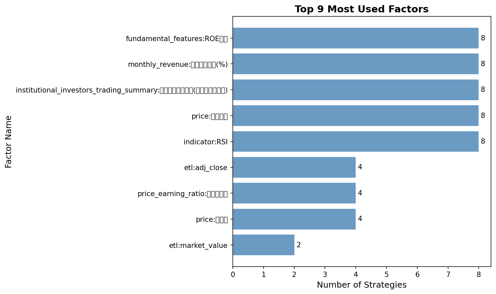

# Strategy Diversity Analysis Report

**Validation Results**: `phase2_validated_results_20251101_060315.json`
**Total Strategies Analyzed**: 8

## Summary

**Diversity Score**: 27.6/100
**Recommendation**: **INSUFFICIENT**

The strategy portfolio lacks sufficient diversity. This may lead to correlated losses and reduced portfolio effectiveness.

## Key Metrics

| Metric | Value | Interpretation |
|--------|-------|----------------|
| Factor Diversity | 0.252 | Low (>0.5 recommended) |
| Average Correlation | 0.500 | Good (<0.8 recommended) |
| Risk Diversity | 0.000 | Low (>0.3 recommended) |

## Factor Analysis

**Total Unique Factors**: 9
**Average Factors per Strategy**: 6.8

### Top 10 Most Used Factors

| Rank | Factor | Usage Count |
|------|--------|-------------|
| 1 | `fundamental_features:ROE稅後` | 8 |
| 2 | `monthly_revenue:去年同月增減(%)` | 8 |
| 3 | `institutional_investors_trading_summary:外陸資買賣超股數(不含外資自營商)` | 8 |
| 4 | `price:成交金額` | 8 |
| 5 | `indicator:RSI` | 8 |
| 6 | `etl:adj_close` | 4 |
| 7 | `price_earning_ratio:股價淨值比` | 4 |
| 8 | `price:收盤價` | 4 |
| 9 | `etl:market_value` | 2 |

## Correlation Analysis

**Average Pairwise Correlation**: 0.500

Moderate correlation between strategies, providing reasonable diversification.

## Risk Analysis

**Risk Diversity (CV of Max Drawdowns)**: 0.000

Low risk diversity suggests strategies have similar risk profiles.
Consider adding strategies with different risk characteristics.

## Warnings

- Low factor diversity detected: 0.252 < 0.5
- Low risk diversity detected: 0.000 < 0.3

## Visualizations

### Correlation Heatmap

### Factor Usage Distribution

## Recommendations

1. **Urgent**: Add more diverse strategies to the portfolio
2. Consider strategies using different factor combinations
3. Explore different trading timeframes or market regimes
4. Review and remove highly correlated strategies

## Next Steps

- [ ] Review individual strategy performance metrics
- [ ] Conduct portfolio-level backtesting
- [ ] Monitor correlation changes over time
- [ ] Update diversity analysis after adding new strategies

---

*Report generated by `scripts/analyze_diversity.py` (Task 3.2)*
